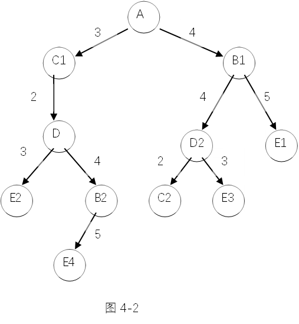

# 人工智能复习提纲

Owner: 柒柒在笔记
课程: 人工智能原理

# 第一部分：提纲及重点内容

## 1、**人工智能简介**

什么是人工智能？发展过程中经历了哪些阶段？（人工智能的定义及发展趋势）

解：人工智能是计算机科学的一个重要分支，也是一门正在发展中的综合性前沿学科，它是由计算机科学、控制论、信息论、神经生理学、哲学、语言学等多种学科相互渗透而发展起来的，目前正处于发展阶段尚未形成完整体系。

发展过程中经历的阶段有：

第一阶段（40年代中～50年代末） 神经元网络时代

第二阶段（50年代中～60年代中） 通用方法时代

第三阶段（60年代中～80年代初） 知识工程时代

第四阶段（80年代中～90年代初） 新的神经元网络时代

第五阶段（90年代初～现在） 海量信息处理与网络时代

## **2、**搜索策略 (Search Strategies)

1. **状态空间搜索策略 (State Space)**
    - **盲目搜索 (Blind Search)**
        - 广度优先搜索 (Breadth-First Search)
        - 深度优先搜索 (Depth-First Search)
        - 有界深度优先搜索 (Bounded Depth-First Search)
        - 代价树的广度优先搜索 (Cost-Tree Breadth-First Search)
        - 代价树的深度优先搜索 (Cost-Tree Depth-First Search)
    - **启发式搜索 (Heuristic Search)**
        - [局部择优搜索 (Local Best Search)](https://www.notion.so/a38913c3bbd1419ea91b0d4c8ee88647?pvs=21)
        - [全局择优搜索 (Global Best Search)](https://www.notion.so/9473fce578244f31b89369b6b7216839?pvs=21)
        - [A**算法 (A* Algorithm)](https://www.notion.so/A-A-Algorithm-386fc824d0cb4733a500eeb312251171?pvs=21)
2. [**与/或树搜索策略（重点）](https://www.notion.so/ac9f590fad2e42b79758b4f5e2bdf77b?pvs=21) (AND/OR Tree Search Strategy - Focus)**
    - **盲目搜索 (Blind Search)**
        - 广度优先搜索 (Breadth-First Search)
        - 深度及有界深度优先搜索 (Depth and Bounded Depth-First Search)
    - **有序搜索 (Ordered Search)**
        - 特殊情况 (Special Cases)：博弈问题 (Game Problems)
            - α-β剪枝技术 (Alpha-Beta Pruning)


**A*算法的可纳性**

在搜索图存在从初始状态节点到目标状态节点解答路径的情况下，若一个搜索法总能找到最短（代价最小）的解答路径，则称算法具有可采纳性。

---

**极大极小分析法**：

计算出端节点的估值，再推算出父节点的得分。

推算的方法是：对“或”节点，选其子节点中一个最大的得分作为父节点的得分，这是为了使自己在可供选择的方案中选一个对自己最有利的方案；对“与”节点，选其子节点中一个最小的得分作为父节点的得分，这是为了立足于最坏的情况。这样计算出的父节点的得分称为倒推值。

---

**α-β剪枝技术**：

对于一个“与”节点来说，它取当前子节点中的最小倒推值作为它倒推值的上界，称此值为β值。对于一个“或”节点来说，它取当前子节点中的最大倒推值作为它倒推值的下界，称此值为α值。

其一般规律为:

- 任何“或”节点x的α值如果不能降低其父节点的β值，则对节点x以下的分枝可停止搜索，并使x的倒推值为α。这种剪枝成为β剪枝。
- 任何“与”节点x的β值如果不能升高其父节点的α值，则对节点x以下的分枝可停止搜索，并使x的倒推值为β。这种剪枝成为α剪枝。

**α－β剪枝的条件：**

- α剪枝：若任一极小值层节点的β值小于或等于它任一先辈极大值节点的α值，即α（先辈层）≥β（后继层），则可中止该极小值层中这个MIN节点以下的搜索过程。这个MIN节点最终的倒推值就确定为这个β值。
- β剪枝：若任一极大值层节点的α值大于或等于它任一先辈极小值层节点的β值，即α（后继层）≥β（先辈层），则可以中止该极大值层中这个MAX节点以下的搜索过程。这个MAX节点的最终倒推值就确定为这个α值。

---

**Eg：**

[https://oi-wiki.org/search/alpha-beta/](https://oi-wiki.org/search/alpha-beta/)

图示博弈树，其中末一行的数字为假设的估值，请利用α-β剪枝技术剪去不必要的分枝。（在节点及边上直接加注释）


解：

**Alpha-Beta剪枝步骤**

1. **初始节点**（根节点，Max节点）：
    - 初始值：alpha = -∞, beta = +∞
    - 评估左子树，更新alpha和beta
2. **评估左子树**（第一个子节点，Min节点）：
    - alpha = -∞, beta = +∞
    - 评估左子树的左子节点（Max节点）：值为5，更新beta = 5
    - 评估左子树的右子节点（Max节点）：值为-3，更新beta = -3
    - 此时，alpha >= beta（5 >= -3），剪去剩余分支
3. **评估第二个子树**（Min节点）：
    - alpha = -∞, beta = +∞
    - 评估子节点的左子树（Max节点）：值为-3，更新beta = -3
    - 评估子节点的右子树（Max节点）：值为-3，更新beta = -3
4. **评估右子树**（Max节点）：
    - alpha = -∞, beta = +∞
    - 评估左子树（Min节点）：值为-3，更新alpha = -3
    - 评估右子树（Min节点）：值为0，更新alpha = 0
    - 评估最后的子树（Min节点）：值为2，更新alpha = 2
5. **整体评估结果**：
    - 由于在一些子树中发生剪枝，我们不需要评估所有的子节点。

```python
        Max
       /   \
      Min   Min
     /  \   /  \
   Max  Max Max Max
   / \  / \  / \ / \
  5  -3-3 -3 -3  0  2  2
      (剪)    (剪)    (剪)

```


**3、知识表示**

- [谓词表示法](https://www.notion.so/639f12625d334a2d9e0b81efb3104139?pvs=21)
- 产生式表示法
- 框架表示法
- 语义网络表示法


产生式系统的组成：

1）产生式规则库：描述相应领域知识的产生式规则集；过程性知识

2）数据库：（事实的集合）存放问题求解过程中当前信息的数据结构（初始事实、外部数据库输入的事实、中间结果事实和最后结果事实）叙述性知识

3）推理机：（控制系统）是一个程序，控制协调规则库与数据库的运行，包含推理方式和控制策略。控制性知识

### eg.产生式系统

7. 给1～9九个数字排一个序列，使得该序列的前n(n=1,...,9) 个数字组成的整数能被n整除。用产生式系统描述该问题。

（1）序列中，偶数在偶数位置，奇数在奇数位置；

（2）第五个数为5。

综合数据库：

用一个1到9的序列表示：N = {x}，其中x为1到9的数字之一。

规则集：

r1: IF len(N)=4 THEN {x}∪{5}

r2: IF len(N)为偶数and n=In(1, 3, 7, 9) THEN {x}∪{n}

r3: IF len(N)为奇数and n=In(2, 4, 6, 8) THEN {x}∪{n}

其中len(N)为求序列的长度，In(a, b, c, d)为取a、b、c、d之一。

初始状态：{}

结束条件：得到的序列N前i个数组成的整数能被i整除

### eg：

将命题：“某个学生读过三国演义”分别用谓词公式和语义网络表示

**x(student(x)∧read(x,三国演义))**

语义网络表示如图：


**经典逻辑推理**


# 典型例题：

**一、大题及问答题**

1.用代价优先算法求解下图的旅行推销员问题，请找一条从北京出发能遍历各城市的最佳路径（旅行费最少），每条弧上的数字表示城市间的旅行费用。并用CLOSED表记录遍历过的结点，OPEN表记录待遍历的结点。画出closed和open表的变化过程，然后根据closed表找出最佳路径。


解： OPEN表

| 扩展节点 | 父节点 |
| --- | --- |
| A（0） | NULL |
| B（31） | A |
| C（28） | A |
| D（43） | B |
| C（54） | B |
| E（38） | D |
| C（59） | D |
| C（27） | E |
| A（51） | E |

> CLOSE表
> 

| 扩展节点 | 父节点 |
| --- | --- |
| A（0） | NULL |
| C（28） | A |
| E（29） | C |
| D（38） | E |
| B（43） | D |
| A（31） | B |

2-设有如下语句，请用相应的谓词公式分别把他们表示出来：

**(1)** 有的人喜欢梅花，有的人喜欢菊花，有的人既喜欢梅花又喜欢菊花 。

**解：**定义谓词

P(x)：x是人

L(x,y)：x喜欢y

其中，y的个体域是{梅花，菊花}。

将知识用谓词表示为：

( ∃x )(P(x)→L(x, 梅花)∨L(x, 菊花)∨L(x, 梅花)∧L(x, 菊花))

**(2)** 有人每天下午都去打篮球。

**解：**定义谓词

P(x)：x是人

B(x)：x打篮球

A(y)：y是下午

将知识用谓词表示为：

(∃x )(∀y) (A(y)→B(x)∧P(x))

**(3)** 新型计算机速度又快，存储容量又大。

**解：**定义谓词

NC(x)：x是新型计算机

F(x)：x速度快

B(x)：x容量大

将知识用谓词表示为：

(∀x) (NC(x)→F(x)∧B(x))

**(4)** 不是每个计算机系的学生都喜欢在计算机上编程序。

**解：**定义谓词

S(x)：x是计算机系学生

L(x, pragramming)：x喜欢编程序

U(x, computer)：x使用计算机

将知识用谓词表示为：

¬ (∀x) (S(x)→L(x, pragramming)∧U(x,computer))

**(5)** 凡是喜欢编程序的人都喜欢计算机。

**解：**定义谓词

P(x)：x是人

L(x, y)：x喜欢y

将知识用谓词表示为：

(∀x) (P(x)∧L(x,pragramming)→L(x, computer))

2 神州大学和东方大学两校篮球队在东方大学进行一场比赛，结局的比分是85：89，用语义网络表示。


3. 张某被盗，公安局派出五个侦察员去调查。研究案情时，侦察员A说“赵与钱中至少有一人作案”；侦察员B说“钱与孙中至少有一人作案”；侦察员C说“孙与李中至少有一人作案”；侦察员D说“赵与孙中至少有一人与此案无关”；侦察员E说“钱与李中至少有一人与此案无关”。如果这五个侦察员的话都是可信的，试用归结演绎推理求出谁是盗窃犯。

解：第一步：将5位侦察员的话表示成谓词公式，为此先定义谓词。

设谓词P(x)表示是作案者，所以根据题意：

A: P(zhao) ∨ P(qian)        B: P(qian) ∨ P(sun)

C: P(sun) ∨ P(li)             D: ﹁P(zhao) ∨ ﹁P(sun)

E: ﹁P(qian) ∨ ﹁P(li)

以上每个侦察员的话都是一个子句。

第二步：将待求解的问题表示成谓词。设y是盗窃犯，则问题的谓词公式为P(y)，将其否定并与ANSWER(y)做析取：

﹁P(y) ∨ ANSWER(y)

第三步：求前提条件及﹁P(y) ∨ ANSWER(y)的子句集，并将各子句列表如下：

1. P(zhao) ∨ P(qian)
2. P(qian) ∨ P(sun)
3. P(sun) ∨ P(li)
4. ﹁P(zhao) ∨ ﹁P(sun)
5. ﹁P(qian) ∨ ﹁P(li)
6. ﹁P(y) ∨ ANSWER(y)

> 第四步：应用归结原理进行推理。
> 
1. P(qian) ∨ ﹁P(sun) (1)与(4)归结
2. P(zhao) ∨ ﹁P(li) (1)与(5)归结
3. P(qian) ∨ ﹁P(zhao) (2)与(4)归结
4. P(sun) ∨﹁P(li) (2)与(5)归结
5. ﹁P(zhao) ∨ P(li) (3)与(4)归结
6. P(sun) ∨﹁P(qian) (3)与(5)归结
7. P(qian) (2)与(7)归结
8. P(sun) (2)与(12)归结
9. ANSWER(qian) (6)与(13)归结，σ={qian/y}
10. ANSWER(sun) (6)与(14)归结, σ={sun/y}
11. 所以，本题的盗窃犯是两个人：钱和孙。

---

4  任何兄弟都有同一个父亲，John和Peter是兄弟，且John的父亲是David，问Peter的父亲是谁？

解：第一步：将已知条件用谓词公式表示出来，并化成子句集。那么，要先定义谓词。

1. 定义谓词：
    
    > 设Father(x,y)表示x是y的父亲。
    > 
    > 
    > 设Brother(x,y)表示x和y是兄弟。
    > 
2. 将已知事实用谓词公式表示出来：
    
    > F1: 任何兄弟都有同一个父亲。
    > 
    > 
    > F2: John和Peter是兄弟。
    > 
    > Brother(John, Peter)
    > 
    > F3: John的父亲是David。
    > 
    > Father(David, John)
    > 
3. 将它们化成子句集，得
    
    > S1={﹁Brother(x,y)∨﹁Father(z,x)∨Father(z,y), Brother(John, Peter), Father(David, John)}
    > 
    > 
    > 第二步：把问题用谓词公式表示出来，并将其否定与谓词ANSWER做析取。
    > 
    > 设Peter的父亲是u，则有：Father(u, Peter)
    > 
    > 将其否定与ANSWER做析取，得
    > 
    > G: ﹁Father(u, Peter) ∨ ANSWER(u)
    > 
    > 第三步：将上述公式G化为子句集S2，并将S1和S2合并到S。
    > 
    > S2={﹁Father(u, Peter) ∨ ANSWER(u)}
    > 
    > S=S1∪S2
    > 
    > 将S中各子句列出如下：
    > 
    > （1）﹁Brother(x,y)∨﹁Father(z,x)∨Father(z,y)
    > 
    > （2）Brother(John, Peter)
    > 
    > （3）Father(David, John)
    > 
    > （4）﹁Father(u, Peter) ∨ ANSWER(u)
    > 
    > 第四步：应用归结原理进行归结。
    > 
    > （5）﹁Brother(John,y) ∨ Father(David,y)
    > 
    > （1）与（3）归结，σ={ David/z, John/x}
    > 
    > （6）﹁Brother(John, Peter) ∨ ANSWER(David)
    > 
    > （4）与（5）归结，σ={ David/u, Peter/y}
    > 
    
    > （7）ANSWER(David) （2）与（6）归结
    > 
    > 
    > 第五步：得到了归结式ANSWER(David)，答案即在其中，所以u=David,即Peter的父亲是David。
    > 

5. 图4-1是五城市间的交通路线图，A城市是出发地，E城市是目的地，两城市间的交通费用（代价）如图中数字所示。求从A到E的最小费用交通路线。


解：先将交通图转换为代价树，如图4-2所示。

> 若用g(x)表示从初始节点s0到节点x的代价，用c(x1,x2)表示从父节点x1到子节点x2的代价，则有：
> 

g(x2)=g(x1)+c(x1,x2)



方法一：代价树的广度优先搜索

（扩展节点ｎ，将其子节点放入open表中，计算各子节点的代价，并按各节点的代价对open表中全部节点按从小到大的顺序进行排序（队列））

步骤如下：


所以，最优路径为A->C->D->E

方法二：代价树的深度优先搜索（不一定是最优解）

（扩展节点ｎ，将其子节点按代价从小到大的顺序放到open表的首部（栈））

步骤如下：

E为目标节点，E2->D1->C1->A

所以路径为A->Ｃ->Ｄ->Ｅ

注：该题代价树的深度优先搜索与代价树的广度优先搜索的结果相同，但这只是巧合。一般情况下，这两种方法得到的结果不一定相同。另外，由于代价树的深度优先搜索有可能进入无穷分支的路径，因此它是不完备的。

6. 设有如图所示的一棵与/或树，请分别用与/或树的广度优先搜索及与/或树的深度优先搜索求出解树。

解：（1）与/或树的广度优先搜索

先扩展节点A,得到节点B和C，再扩展节点B,得节点t1、t2，因为t1、t2为可解节点，故节点B可解，从而可节点A可解。

所以求得解树为：

（2）与/或树的深度优先搜索

先扩展节点A, 得到节点B和C,再扩展节点C, 得节点D和t5,t5为可解节点，再扩展节D，得节点t3、t4，因为t3、t4为可解节点，故节点D可解，因为节点D和t5可解，故节点C可解，从而可节点A可解。

所以求得解树为：

7 设有如图所示的与/或树，请分别按和代价法及最大代价法求解树代价。

1. 按和代价法：h(B)=7,h(C)=3,h(A)=7+3+5+6=21
2. 按最大代价法：h(B)=5,h(C)=2,h(A)=5+5=10算符集合F={U,D,L,R}(2分) U：空格上移 D：空格下移 L：空格左移 R：空格右移

8.用A*算法解决八数码难题：设计八数码游戏的估价函数f(n)，其满足A*算法的要求；设初始棋盘布局为S，目标棋盘布局分别为g，如下图所示：

画出使用该估价函数的搜索图，并标注每个节点的f(n)值。(10分)

答：f(n)=g(n)+h(n)，g(n)=d(n)(即节点n的深度)；(1分)

h(n)=∑每个棋子与目标节点相差的步数(1分)

算符集合F={U,D,L,R}(2分)

U：空格上移 D：空格下移 L：空格左移 R：空格右移

**13.** 有一农夫带一只狼、一只羊和一筐菜欲从河的左岸乘船到右岸,但受下列条件限制： 

(1) 船太小,农夫每次只能带一样东西过河。 (2) 如果没有农夫看管, 则狼要吃羊,羊要吃菜。 请设计一个过河方案, 使得农夫、狼、羊、菜都能不受损失地过河。画出相应的状态空间图。 提示： (1) 用四元组(农夫、狼、羊、菜)表示状态,其中每个元素都可为0或1, 用0表示在左岸, 用1表示在右岸。 (2) 把每次过河的一种安排作为一个算符,每次过河都必须有农夫, 因为只有他可以划船。

解：初始S=(0，0，0，0)，目标G=(1，1，1，1)

定义操作符L(i)表示农夫带东西到右岸： 定义操作符R(i)表示农夫带东西到左岸：

i=0 农夫自己到右岸；      i=0 农夫自己到左岸；

i=1 农夫带狼到右岸； i=1 农夫带狼到左岸；

i=2 农夫带羊到右岸； i=2 农夫带羊到左岸；

i=3 农夫带菜到右岸； i=3 农夫带菜到左岸；


约束状态如下：

(1，0，0，X)狼、羊在左岸；

(1，X，0，0)羊、菜在左岸；

(0，1，1，X)狼、羊在右岸；

(0，X，1，1)羊、菜在右岸；

> 
> 
> 
> 
> 

**14**. OPEN表与CLOSED表的作用是什么？

OPEN表用于存放刚生成的节点，对于不同的搜索策略，节点在OPEN表中的排序是不同的。

CLOSED表用于存放将要扩展或者已扩展的节点。

**15.** 请对下列命题分别写出它们的语义网络：

**(1)** 每个学生都有一台计算机。

**解：**

**(2)** 高老师从3月到7月给计算机系学生讲《计算机网络》课。

**解：**

**(5)** 红队与蓝队进行足球比赛，最后以3：2的比分结束。

**解：**

> 15. 判断下列公式是否为可合一，若可合一，则求出其最一般合一。
> 

(1) P(a, b), P(x, y)

(2) P(f(x), b), P(y, z)

(3) P(f(x), y), P(y, f(b))

(4) P(f(y), y, x), P(x, f(a), f(b))

> (5) P(x, y), P(y, x)
> 
> 
> **解：**(1) 可合一，其最一般和一为：σ={a/x, b/y}。
> 

(2) 可合一，其最一般和一为：σ={y/f(x), b/z}。

(3) 可合一，其最一般和一为：σ={ f(b)/y, b/x}。

(4) 不可合一。

> (5) 可合一，其最一般和一为：σ={ y/x}。
> 

**16.**把下列谓词公式化成子句集：

1. (x)(y)(P(x, y)∧Q(x, y))
2. (x)(y)(P(x, y)→Q(x, y))
3. (x)(y)(P(x, y)∨(Q(x, y)→R(x, y)))
4. (x) (y) (z)(P(x, y)→Q(x, y)∨R(x, z))

**解：**

(1) 由于(

x)(

y)(P(x, y)∧Q(x, y))已经是Skolem标准型，且P(x, y)∧Q(x, y)已经是合取范式，所以可直接消去全称量词、合取词，得

{ P(x, y), Q(x, y)}

再进行变元换名得子句集：

S={ P(x, y), Q(u, v)}

(2) 对谓词公式(

x)(

y)(P(x, y)→Q(x, y))，先消去连接词“→”得：(

x)(

y)(¬P(x, y)∨Q(x, y))

此公式已为Skolem标准型。

再消去全称量词得子句集：

S={¬P(x, y)∨Q(x, y)}

(3) 对谓词公式(

x)(

y)(P(x, y)∨(Q(x, y)→R(x, y)))，先消去连接词“→”得：(

x)(

y)(P(x, y)∨(¬Q(x, y)∨R(x, y)))

此公式已为前束范式。

再消去存在量词，即用Skolem函数f(x)替换y得：

(

x)(P(x, f(x))∨¬Q(x, f(x))∨R(x, f(x)))

此公式已为Skolem标准型。

最后消去全称量词得子句集：

S={P(x, f(x))∨¬Q(x, f(x))∨R(x, f(x))}

(4) 对谓词(

x) (

y) (

z)(P(x, y)→Q(x, y)∨R(x, z))，先消去连接词“→”得：(

x) (

y) (

z)(¬P(x, y)∨Q(x, y)∨R(x, z))

再消去存在量词，即用Skolem函数f(x)替换y得：

(

x) (

y) (¬P(x, y)∨Q(x, y)∨R(x, f(x,y)))

此公式已为Skolem标准型。

最后消去全称量词得子句集：

S={¬P(x, y)∨Q(x, y)∨R(x, f(x,y))}

**17.** 设已知：

1. 如果x是y的父亲，y是z的父亲，则x是z的祖父；
2. 每个人都有一个父亲。

使用归结演绎推理证明：对于某人u，一定存在一个人v，v是u的祖父。

解：先定义谓词

F(x,y)：x是y的父亲

GF(x,z)：x是z的祖父

P(x)：x是一个人

再用谓词把问题描述出来：

已知F1：(

x) (

y) (

z)( F(x,y)∧F(y,z))→GF(x,z))F2：(

y)(P(x)→F(x,y))求证结论G：(

u) (

v)( P(u)→GF(v,u))

然后再将F1，F2和¬G化成子句集：

① ¬F(x,y)∨¬F(y,z)∨GF(x,z)

② ¬P(r)∨F(s,r)

③ P(u)

④ ¬GF(v,u))

对上述扩充的子句集，其归结推理过程如下：

{x/v,z/u}

{x/s,y/r}

{y/s,z/r}

{y/z}

{y/u}

由于导出了空子句，故结论得证。

**18.**设有如下结构的移动将牌游戏：

| B | B | W | W | E |
| --- | --- | --- | --- | --- |

其中，B表示黑色将牌，W表是白色将牌，E表示空格。游戏的规定走法是：

(1) 任意一个将牌可移入相邻的空格，规定其代价为1；

(2) 任何一个将牌可相隔1个其它的将牌跳入空格，其代价为跳过将牌的数目加1。

游戏要达到的目标什是把所有W都移到B的左边。对这个问题，请定义一个启发函数h(n)，并给出用这个启发函数产生的搜索树。你能否判别这个启发函数是否满足下解要求？再求出的搜索树中，对所有节点是否满足单调限制？

**解：**设h(x)=每个W左边的B的个数，f(x)=d(x)+3*h(x)，其搜索树如下：

| B | B | W | W | E |
| --- | --- | --- | --- | --- |

| B | B | E | W | W |
| --- | --- | --- | --- | --- |

| B | B | W | E | W |
| --- | --- | --- | --- | --- |

| B | B | E | W | W |
| --- | --- | --- | --- | --- |

| B | E | W | B | W |
| --- | --- | --- | --- | --- |

| E | B | W | B | W |
| --- | --- | --- | --- | --- |

| W | B | E | B | W |
| --- | --- | --- | --- | --- |

| W | B | W | B | E |
| --- | --- | --- | --- | --- |

| W | B | W | E | B |
| --- | --- | --- | --- | --- |

| W | B | W | E | B |
| --- | --- | --- | --- | --- |

**19.** 设有如图4-34的与/或/树，请分别按和代价法及最大代价法求解树的代价。

**解：**若按和代价法，则该解树的代价为：

h(A)=2+3+2+5+2+1+6=21

若按最大代价法，则该解树的代价为：

h(A)=max{h(B)+5, h(C)+6} = max{(h(E)+2)+5, h(C)+6}

= max{(max(2, 3)+2)+5, max(2, 1)+6}

=max((5+5, 2+6)=10

**20.** 设有如图4-35所示的博弈树，其中最下面的数字是假设的估值，请对该博弈树作如下工作：

(1) 计算各节点的倒推值；

1. 利用α-β剪枝技术剪去不必要的分枝。

**解：**各节点的倒推值和剪枝情况如下图所示：

**21**.设有如下一组推理规则:

r1: IF E1 THEN E2 (0.6)

r2: IF E2 AND E3 THEN E4 (0.7)

r3: IF E4 THEN H (0.8)

r4: IF E5 THEN H (0.9)

且已知CF(E1)=0.5, CF(E3)=0.6, CF(E5)=0.7。求CF(H)=?

**解：**(1) 先由r1求CF(E2)

CF(E2)=0.6 × max{0,CF(E1)}

=0.6 × max{0,0.5}=0.3

(2) 再由r2求CF(E4)

CF(E4)=0.7 × max{0, min{CF(E2 ), CF(E3 )}}

=0.7 × max{0, min{0.3, 0.6}}=0.21

(3) 再由r3求CF1(H)

CF1(H)= 0.8 × max{0,CF(E4)}

=0.8 × max{0, 0.21)}=0.168

(4) 再由r4求CF2(H)

CF2(H)= 0.9 ×max{0,CF(E5)}

=0.9 ×max{0, 0.7)}=0.63

(5) 最后对CF1(H )和CF2(H)进行合成，求出CF(H)

CF(H)= CF1(H)+CF2(H)+ CF1(H) × CF2(H)

=0.692

**22.**  设有如下推理规则

r1: IF E1 THEN (2, 0.00001) H1

r2: IF E2 THEN (100, 0.0001) H1

r3: IF E3 THEN (200, 0.001) H2

r4: IF H1 THEN (50, 0.1) H2

且已知P(E1)= P(E2)= P(H3)=0.6, P(H1)=0.091, P(H2)=0.01, 又由用户告知：

P(E1| S1)=0.84, P(E2|S2)=0.68, P(E3|S3)=0.36

请用主观Bayes方法求P(H2|S1, S2, S3)=?

**解：**(1) 由r1计算O(H1| S1)

先把H1的先验概率更新为在E1下的后验概率P(H1| E1)

P(H1| E1)=(LS1 × P(H1)) / ((LS1-1) × P(H1)+1)

=(2 × 0.091) / ((2 -1) × 0.091 +1)

=0.16682

由于P(E1|S1)=0.84 > P(E1)，使用P(H | S)公式的后半部分，得到在当前观察S1下的后验概率P(H1| S1)和后验几率O(H1| S1)

P(H1| S1) = P(H1) + ((P(H1| E1) – P(H1)) / (1 - P(E1))) × (P(E1| S1) – P(E1))

= 0.091 + (0.16682 –0.091) / (1 – 0.6)) × (0.84 – 0.6)

=0.091 + 0.18955 × 0.24 = 0.136492

O(H1| S1) = P(H1| S1) / (1 - P(H1| S1))

= 0.15807

(2) 由r2计算O(H1| S2)

先把H1的先验概率更新为在E2下的后验概率P(H1| E2)

P(H1| E2)=(LS2 × P(H1)) / ((LS2-1) × P(H1)+1)

=(100 × 0.091) / ((100 -1) × 0.091 +1)

=0.90918

由于P(E2|S2)=0.68 > P(E2)，使用P(H | S)公式的后半部分，得到在当前观察S2下的后验概率P(H1| S2)和后验几率O(H1| S2)

P(H1| S2) = P(H1) + ((P(H1| E2) – P(H1)) / (1 - P(E2))) × (P(E2| S2) – P(E2))

= 0.091 + (0.90918 –0.091) / (1 – 0.6)) × (0.68 – 0.6)

=0.25464

O(H1| S2) = P(H1| S2) / (1 - P(H1| S2))

=0.34163

(3) 计算O(H1| S1,S2)和P(H1| S1,S2)

先将H1的先验概率转换为先验几率

O(H1) = P(H1) / (1 - P(H1)) = 0.091/(1-0.091)=0.10011

再根据合成公式计算H1的后验几率

O(H1| S1,S2)= (O(H1| S1) / O(H1)) × (O(H1| S2) / O(H1)) × O(H1)

= (0.15807 / 0.10011) × (0.34163) / 0.10011) × 0.10011

= 0.53942

再将该后验几率转换为后验概率

P(H1| S1,S2) = O(H1| S1,S2) / (1+ O(H1| S1,S2))

= 0.35040

(4) 由r3计算O(H2| S3)

先把H2的先验概率更新为在E3下的后验概率P(H2| E3)

P(H2| E3)=(LS3 × P(H2)) / ((LS3-1) × P(H2)+1)

=(200 × 0.01) / ((200 -1) × 0.01 +1)

=0.09569

由于P(E3|S3)=0.36 < P(E3)，使用P(H | S)公式的前半部分，得到在当前观察S3下的后验概率P(H2| S3)和后验几率O(H2| S3)

P(H2| S3) = P(H2 | ¬ E3) + (P(H2) – P(H2| ¬E3)) / P(E3)) × P(E3| S3)

由当E3肯定不存在时有

P(H2 | ¬ E3) = LN3 × P(H2) / ((LN3-1) × P(H2) +1)

= 0.001 × 0.01 / ((0.001 - 1) × 0.01 + 1)

= 0.00001

因此有

P(H2| S3) = P(H2 | ¬ E3) + (P(H2) – P(H2| ¬E3)) / P(E3)) × P(E3| S3)

=0.00001+((0.01-0.00001) / 0.6) × 0.36

=0.00600

O(H2| S3) = P(H2| S3) / (1 - P(H2| S3))

=0.00604

(5) 由r4计算O(H2| H1)

先把H2的先验概率更新为在H1下的后验概率P(H2| H1)

P(H2| H1)=(LS4 × P(H2)) / ((LS4-1) × P(H2)+1)

=(50 × 0.01) / ((50 -1) × 0.01 +1)

=0.33557

由于P(H1| S1,S2)=0.35040 > P(H1)，使用P(H | S)公式的后半部分，得到在当前观察S1,S2下H2的后验概率P(H2| S1,S2)和后验几率O(H2| S1,S2)

P(H2| S1,S2) = P(H2) + ((P(H2| H1) – P(H2)) / (1 - P(H1))) × (P(H1| S1,S2) – P(H1))

= 0.01 + (0.33557 –0.01) / (1 – 0.091)) × (0.35040 – 0.091)

=0.10291

O(H2| S1,S2) = P(H2| S1, S2) / (1 - P(H2| S1, S2))

=0.10291/ (1 - 0.10291) = 0.11472

(6) 计算O(H2| S1,S2,S3)和P(H2| S1,S2,S3)

先将H2的先验概率转换为先验几率

O(H2) = P(H2) / (1 - P(H2) )= 0.01 / (1-0.01)=0.01010

再根据合成公式计算H1的后验几率

O(H2| S1,S2,S3)= (O(H2| S1,S2) / O(H2)) × (O(H2| S3) / O(H2)) ×O(H2)

= (0.11472 / 0.01010) × (0.00604) / 0.01010) × 0.01010

=0.06832

再将该后验几率转换为后验概率

P(H2| S1,S2,S3) = O(H1| S1,S2,S3) / (1+ O(H1| S1,S2,S3))

= 0.06832 / (1+ 0.06832) = 0.06395

可见，H2原来的概率是0.01，经过上述推理后得到的后验概率是0.06395，它相当于先验概率的6倍多。

23. 设有如下推理规则

r1: IF E1 THEN (100, 0.1) H1

r2: IF E2 THEN (50, 0.5) H2

r3: IF E3 THEN (5, 0.05) H3

且已知P(H1)=0.02, P(H2)=0.2, P(H3)=0.4，请计算当证据E1，E2，E3存在或不存在时P(Hi | Ei)或P(Hi |﹁Ei)的值各是多少(i=1, 2, 3)？

**解：**(1) 当E1、E2、E3肯定存在时，根据r1、r2、r3有

P(H1 | E1) = (LS1 × P(H1)) / ((LS1-1) × P(H1)+1)

= (100 × 0.02) / ((100 -1) × 0.02 +1)

=0.671

P(H2 | E2) = (LS2 × P(H2)) / ((LS2-1) × P(H2)+1)

= (50 × 0.2) / ((50 -1) × 0.2 +1)

=0.9921

P(H3 | E3) = (LS3 × P(H3)) / ((LS3-1) × P(H3)+1)

= (5 × 0.4) / ((5 -1) × 0.4 +1)

=0.769

(2) 当E1、E2、E3肯定不存在时，根据r1、r2、r3有

P(H1 | ¬E1) = (LN1 × P(H1)) / ((LN1-1) × P(H1)+1)

= (0.1 × 0.02) / ((0.1 -1) × 0.02 +1)

=0.002

P(H2 | ¬E2) = (LN2 × P(H2)) / ((LN2-1) × P(H2)+1)

= (0.5 × 0.2) / ((0.5 -1) × 0.2 +1)

=0.111

P(H3 | ¬E3) = (LN3 × P(H3)) / ((LN3-1) × P(H3)+1)

= (0.05 × 0.4) / ((0.05 -1) × 0.4 +1)

=0.032

**二、填空：**

1.在谓词公式中，紧接于量词之后被量词作用的谓词公式称为该量词的 ，而在一个量词的辖域中与该量词的指导变元相同的变元称为 ，其他变元称为

2、假言推理（A→B）∧A⇒ ，假言三段论（A→B）∧（B→C）⇒

3、几种常用的归结策略： 、支持集策略、线形归结策略、输入归结策略、单元归结策略

4、在诸如走迷宫、下棋、八数码游戏等游戏中，常用到的一种人工智能的核心技术称为

技术，解这类问题时，常把在迷宫的位置、棋的布局、八数码所排成的形势用图来表示，这种图称为

5.在启发式搜索当中，通常用 来表示启发性信息。

6.在二人博弈问题中，最常用的一种分析技术是 ，这种方法的思想是先生成一棵博弈树，然后再计算其倒推值。但它的效率较低，因此人们在此基础上，又提出了

7、不确定性类型按性质分：　　　　　　　　　　　，　　　　　　　　　　　，

，　　　　　　　　　　　　。

8、在删除策略归结的过程中删除以下子句：含有　　　　　　　　　　　的子句;含有　　　　　　　　　的子句;子句集中被别的子句　　　　　　　　　的子句。

9、对证据的可信度CF（A）、CF（A1）、CF（A2）之间，规定如下关系：

CF（~A）=　　　　　　、CF（A1∧A2 ）=　　　　　　　　　　　　　　　、

CF（A1∨A2 ）=　　　　　　　　　　　　　　　　。

10. 合一算法：求非空有限具有相同谓词名的原子公式集的　　　　　　　　　　。

11、开发专家系统所要解决的基本问题有三个，那就是知识的获取、知识的表示和 ，知识表示的方法主要有 ， ， 和语义网络等

12. 方法是一种将复杂问题变换为比较简单的子问题，子问题再转换为更简单的子问题，最终将问题转换为对本原问题的知识表示方法。

13. 宽度优先搜索与深度优先搜索方法的一个致命的缺点是当问题比较复杂是可能会发生

14、不确定性类型按性质分：　　　　　　　　　　　，　　　　　　　　　　　，

，　　　　　　　　　　　　。

15、在删除策略归结的过程中删除以下子句：含有　　　　　　　　　　　的子句;含有　　　　　　　　　的子句;子句集中被别的子句　　　　　　　　　的子句。

16、对证据的可信度CF（A）、CF（A1）、CF（A2）之间，规定如下关系：

CF（~A）=　　　　　　、CF（A1∧A2 ）=　　　　　　　　　　　　　　　、

CF（A1∨A2 ）=　　　　　　　　　　　　　　　　。

17、图：指由　　　　　　　　　　　　组成的网络。按连接同一节点的各边的逻辑关系又可分为　　　　　　　　　　　　和　　　　　　　　　　　　。

**填空答案：**

1、辖域 约束变元 自由变元

2、 B A→C

3、删除策略

4、图搜索 状态空间图（或状态图）

5、启发函数

6、极大极小分析法 α-β剪枝技术

7、随机性 模糊性 不一致性 不确定性

8、纯文字 永真 类含

9、~CF（A） min{CF（A1），CF（A2）} max{CF（A1），CF（A2）}

10、最一般合一

11、知识的运用 逻辑表示法（谓词表示法） 框架 产生式

12、问题规约

13、组合爆炸

14、随机性，模糊性，不完全性，不一致性

15、纯文字，永真式，类含

16、-CF(A)，min{CF(A1),CF(A2)}，max{CF(A1),CF(A2)} )

17、节点和有向边，或图，与或图

**三、选择题**

1、下列不在人工智能系统的知识包含的4个要素中（）

A) 事实　　 B) 规则　　 C) 控制　　 D) 关系

2、或图通常称为

A）框架网络 B)语义图 C)博亦图 D)状态图

3、产生式系统的推理不包括（ ）

A）正向推理 B）逆向推理 C）双向推理

4、C(B|A) 表示在规则A->B中，证据A为真的作用下结论B为真的

A)可信度 B)信度 C)信任增长度 D)概率

5、子句~P∨Q和P经过消解以后，得到（ ）

A. P

B. Q

C. ~P

1. P∨Q

6、如果问题存在最优解，则下面几种搜索算法中，（ ）必然可以得到该最优解。

1. 广度优先搜索
2. 深度优先搜索
3. 有界深度优先搜索

D. 启发式搜索

**选择答案：**

**1-6 DDDBBA**

[局部择优算法](https://www.notion.so/a38913c3bbd1419ea91b0d4c8ee88647?pvs=21)

[全局择优搜索](https://www.notion.so/9473fce578244f31b89369b6b7216839?pvs=21)

[A**算法 (A* Algorithm)](https://www.notion.so/A-A-Algorithm-386fc824d0cb4733a500eeb312251171?pvs=21)

[广度优先](https://www.notion.so/243b8ed4889443bdbac1664343a5e8cc?pvs=21)

[与或树](https://www.notion.so/ac9f590fad2e42b79758b4f5e2bdf77b?pvs=21)

[与或树与博弈问题](https://www.notion.so/f45f6a03249448729997659cd85980c8?pvs=21)

[极大极小分析法](https://www.notion.so/536faa4d3e334cd0841e5f1d071458b8?pvs=21)

[谓词表示法](https://www.notion.so/639f12625d334a2d9e0b81efb3104139?pvs=21)