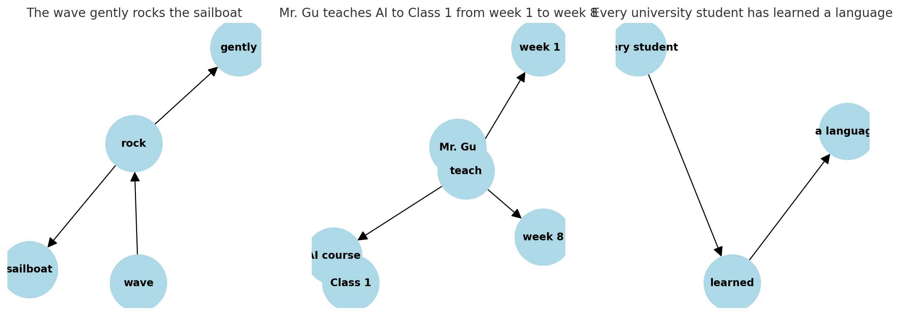

# 人工智能复习

Owner: 柒柒在笔记
课程: 人工智能原理

[https://zhuanlan.zhihu.com/p/444659290](https://zhuanlan.zhihu.com/p/444659290)

[data:image/svg+xml;base64,PHN2ZyB2aWV3Ym94PSIwIDAgNjQgMzAiIGZpbGw9IiMxNzcyRjYiIHdpZHRoPSI2NCIgaGVpZ2h0PSIzMCIgY2xhc3M9ImNzcy0xaGxyY3hrIj48cGF0aCBkPSJNMjkuMDUgNC41ODJIMTYuNzMzVjI1Ljk0aDMuMDE4bC40MDMgMi41NzIgNC4wODEtMi41NzJoNC44MTVWNC41ODJ6bS01LjIwNyAxOC42OWwtMi4zOTYgMS41MDktLjIzNS0xLjUwOGgtMS43MjRWNy4yMzNoNi43OHYxNi4wNGgtMi40MjV6TTE0LjQ2IDE0LjE5MUg5Ljk4MmMwLS40NzEuMDMzLS45NTQuMDM5LTEuNDU4di01LjVoNS4xMDZWNS45MzVhMS4zNTIgMS4zNTIgMCAwIDAtLjQwNC0uOTU3IDEuMzc4IDEuMzc4IDAgMCAwLS45NjgtLjM5Nkg1Ljc4M2MuMDI4LS4wODguMDU2LS4xNzcuMDg0LS4yNTUuMjc0LS44MiAxLjE1My0zLjMyNiAxLjE1My0zLjMyNmE0LjI2MiA0LjI2MiAwIDAgMC0yLjQxMy42OThjLS41Ny40LS45MTIuNjgyLTEuMzcxIDEuOTQ2LS41MzIgMS40NTMtLjk5NyAyLjg1Ni0xLjMxIDMuNjkzQzEuNDQ0IDguNjc0LjI4IDExLjAyNS4yOCAxMS4wMjVhNS44NSA1Ljg1IDAgMCAwIDIuNTItLjYxYzEuMTE5LS41OTMgMS42NzktMS41MDIgMi4wNTQtMi44ODNsLjA5LS4zaDIuMzM0djUuNWMwIC41LS4wNDUuOTgyLS4wNzMgMS40NmgtNC4xMmMtLjcxIDAtMS4zOS4yNzgtMS44OTMuNzc1YTIuNjM4IDIuNjM4IDAgMCAwLS43ODMgMS44NzRoNi41MjdhMTcuNzE3IDE3LjcxNyAwIDAgMS0uNzc4IDMuNjQ5IDE2Ljc5NiAxNi43OTYgMCAwIDEtMy4wMTIgNS4yNzNBMzMuMTA0IDMzLjEwNCAwIDAgMSAwIDI4Ljc0czMuMTMgMS4xNzUgNS40MjUtLjk1NGMxLjM4OC0xLjI5MiAyLjYzMS0zLjgxNCAzLjIzLTUuNzI3YTI4LjA5IDI4LjA5IDAgMCAwIDEuMTItNS4yMjloNS45Njd2LTEuMzdhMS4yNTQgMS4yNTQgMCAwIDAtLjM3My0uODk5IDEuMjc5IDEuMjc5IDAgMCAwLS45MDktLjM3eiIgLz48cGF0aCBkPSJNMTEuMjcgMTkuNjc1bC0yLjMxMiAxLjQ5MSA1LjAzOCA3LjQ1OGE2LjkwNSA2LjkwNSAwIDAgMCAuNjcyLTIuMjE4IDMuMTUgMy4xNSAwIDAgMC0uMjgtMi4xNjhsLTMuMTE4LTQuNTYzek01MS40NDkgMTUuMTk1VjUuODQyYzQuMTgxLS4yMDUgNy45ODgtLjQwNSA5LjQzOC0uNDgzbC44NTEtLjA1Yy4zODctLjM5OS44ODUtMi4zOTUuNjg5LTMuMDIxLS4wNzMtLjI1LS4yMTMtLjY2Ni0uNjM4LS41NTVhMzMuMjc5IDMzLjI3OSAwIDAgMS00LjI3Ny43MjdjLTIuNzY2LjMyMS0zLjk3LjQwNC03LjgwNC42ODItNi43MTguNDg3LTEyLjcwOS43Mi0xMi43MDkuNzJhMi41MTggMi41MTggMCAwIDAgLjc4OCAxLjgzNCAyLjU2NyAyLjU2NyAwIDAgMCAxLjg4My43MDZjMi4yNzgtLjA5NSA1LjU5OC0uMjUgOC45OTYtLjQxdjkuMjAzaC0xMi43OGMwIC43MDMuMjgxIDEuMzc3Ljc4MyAxLjg3NGEyLjY5IDIuNjkgMCAwIDAgMS44OTIuNzc3aDEwLjEwNXY3LjA3NWMwIC44ODctLjQ2NCAxLjE5Mi0xLjIzMSAxLjIxNGgtMy45MmE0LjE1IDQuMTUgMCAwIDAgLjgzNyAxLjU0NCA0LjIgNC4yIDAgMCAwIDEuNDAzIDEuMDY3IDYuMjE1IDYuMjE1IDAgMCAwIDIuNzEuMjc3YzEuMzYtLjA2NiAyLjk2Ny0uODI2IDIuOTY3LTMuNTd2LTcuNjA3aDExLjI4Yy4zNDIgMCAuNjctLjEzNS45MS0uMzc0LjI0Mi0uMjM5LjM3OC0uNTYzLjM3OC0uOTAydi0xLjM3NUg1MS40NDl6IiAvPjxwYXRoIGQ9Ik00Mi42MTQgOC44NzNhMi4zMDQgMi4zMDQgMCAwIDAtMS41MDgtLjkyNiAyLjMzNCAyLjMzNCAwIDAgMC0xLjcyNy40MDVsLS4zNzYuMjcyIDQuMjU1IDUuODUgMi4yNC0xLjYyLTIuODg0LTMuOTh6TTU3LjM1IDguNjhsLTMuMTI1IDQuMDk3IDIuMjQgMS42NjMgNC41MTctNS45MjctLjM3NS0uMjc3YTIuMzIgMi4zMiAwIDAgMC0xLjcyMi0uNDUyIDIuMzI3IDIuMzI3IDAgMCAwLTEuNTM2Ljg5NnoiIC8+PC9zdmc+](data:image/svg+xml;base64,PHN2ZyB2aWV3Ym94PSIwIDAgNjQgMzAiIGZpbGw9IiMxNzcyRjYiIHdpZHRoPSI2NCIgaGVpZ2h0PSIzMCIgY2xhc3M9ImNzcy0xaGxyY3hrIj48cGF0aCBkPSJNMjkuMDUgNC41ODJIMTYuNzMzVjI1Ljk0aDMuMDE4bC40MDMgMi41NzIgNC4wODEtMi41NzJoNC44MTVWNC41ODJ6bS01LjIwNyAxOC42OWwtMi4zOTYgMS41MDktLjIzNS0xLjUwOGgtMS43MjRWNy4yMzNoNi43OHYxNi4wNGgtMi40MjV6TTE0LjQ2IDE0LjE5MUg5Ljk4MmMwLS40NzEuMDMzLS45NTQuMDM5LTEuNDU4di01LjVoNS4xMDZWNS45MzVhMS4zNTIgMS4zNTIgMCAwIDAtLjQwNC0uOTU3IDEuMzc4IDEuMzc4IDAgMCAwLS45NjgtLjM5Nkg1Ljc4M2MuMDI4LS4wODguMDU2LS4xNzcuMDg0LS4yNTUuMjc0LS44MiAxLjE1My0zLjMyNiAxLjE1My0zLjMyNmE0LjI2MiA0LjI2MiAwIDAgMC0yLjQxMy42OThjLS41Ny40LS45MTIuNjgyLTEuMzcxIDEuOTQ2LS41MzIgMS40NTMtLjk5NyAyLjg1Ni0xLjMxIDMuNjkzQzEuNDQ0IDguNjc0LjI4IDExLjAyNS4yOCAxMS4wMjVhNS44NSA1Ljg1IDAgMCAwIDIuNTItLjYxYzEuMTE5LS41OTMgMS42NzktMS41MDIgMi4wNTQtMi44ODNsLjA5LS4zaDIuMzM0djUuNWMwIC41LS4wNDUuOTgyLS4wNzMgMS40NmgtNC4xMmMtLjcxIDAtMS4zOS4yNzgtMS44OTMuNzc1YTIuNjM4IDIuNjM4IDAgMCAwLS43ODMgMS44NzRoNi41MjdhMTcuNzE3IDE3LjcxNyAwIDAgMS0uNzc4IDMuNjQ5IDE2Ljc5NiAxNi43OTYgMCAwIDEtMy4wMTIgNS4yNzNBMzMuMTA0IDMzLjEwNCAwIDAgMSAwIDI4Ljc0czMuMTMgMS4xNzUgNS40MjUtLjk1NGMxLjM4OC0xLjI5MiAyLjYzMS0zLjgxNCAzLjIzLTUuNzI3YTI4LjA5IDI4LjA5IDAgMCAwIDEuMTItNS4yMjloNS45Njd2LTEuMzdhMS4yNTQgMS4yNTQgMCAwIDAtLjM3My0uODk5IDEuMjc5IDEuMjc5IDAgMCAwLS45MDktLjM3eiIgLz48cGF0aCBkPSJNMTEuMjcgMTkuNjc1bC0yLjMxMiAxLjQ5MSA1LjAzOCA3LjQ1OGE2LjkwNSA2LjkwNSAwIDAgMCAuNjcyLTIuMjE4IDMuMTUgMy4xNSAwIDAgMC0uMjgtMi4xNjhsLTMuMTE4LTQuNTYzek01MS40NDkgMTUuMTk1VjUuODQyYzQuMTgxLS4yMDUgNy45ODgtLjQwNSA5LjQzOC0uNDgzbC44NTEtLjA1Yy4zODctLjM5OS44ODUtMi4zOTUuNjg5LTMuMDIxLS4wNzMtLjI1LS4yMTMtLjY2Ni0uNjM4LS41NTVhMzMuMjc5IDMzLjI3OSAwIDAgMS00LjI3Ny43MjdjLTIuNzY2LjMyMS0zLjk3LjQwNC03LjgwNC42ODItNi43MTguNDg3LTEyLjcwOS43Mi0xMi43MDkuNzJhMi41MTggMi41MTggMCAwIDAgLjc4OCAxLjgzNCAyLjU2NyAyLjU2NyAwIDAgMCAxLjg4My43MDZjMi4yNzgtLjA5NSA1LjU5OC0uMjUgOC45OTYtLjQxdjkuMjAzaC0xMi43OGMwIC43MDMuMjgxIDEuMzc3Ljc4MyAxLjg3NGEyLjY5IDIuNjkgMCAwIDAgMS44OTIuNzc3aDEwLjEwNXY3LjA3NWMwIC44ODctLjQ2NCAxLjE5Mi0xLjIzMSAxLjIxNGgtMy45MmE0LjE1IDQuMTUgMCAwIDAgLjgzNyAxLjU0NCA0LjIgNC4yIDAgMCAwIDEuNDAzIDEuMDY3IDYuMjE1IDYuMjE1IDAgMCAwIDIuNzEuMjc3YzEuMzYtLjA2NiAyLjk2Ny0uODI2IDIuOTY3LTMuNTd2LTcuNjA3aDExLjI4Yy4zNDIgMCAuNjctLjEzNS45MS0uMzc0LjI0Mi0uMjM5LjM3OC0uNTYzLjM3OC0uOTAydi0xLjM3NUg1MS40NDl6IiAvPjxwYXRoIGQ9Ik00Mi42MTQgOC44NzNhMi4zMDQgMi4zMDQgMCAwIDAtMS41MDgtLjkyNiAyLjMzNCAyLjMzNCAwIDAgMC0xLjcyNy40MDVsLS4zNzYuMjcyIDQuMjU1IDUuODUgMi4yNC0xLjYyLTIuODg0LTMuOTh6TTU3LjM1IDguNjhsLTMuMTI1IDQuMDk3IDIuMjQgMS42NjMgNC41MTctNS45MjctLjM3NS0uMjc3YTIuMzIgMi4zMiAwIDAgMC0xLjcyMi0uNDUyIDIuMzI3IDIuMzI3IDAgMCAwLTEuNTM2Ljg5NnoiIC8+PC9zdmc+)

[data:image/svg+xml;base64,PHN2ZyB3aWR0aD0iMjQiIGhlaWdodD0iMjQiIHZpZXdib3g9IjAgMCAyNCAyNCIgY2xhc3M9IlppIFppLS1Eb3RzIiBmaWxsPSJjdXJyZW50Q29sb3IiPjxwYXRoIGQ9Ik02IDEwLjVhMS41IDEuNSAwIDEgMCAwIDMgMS41IDEuNSAwIDAgMCAwLTNaTTEwLjUgMTJhMS41IDEuNSAwIDEgMSAzIDAgMS41IDEuNSAwIDAgMS0zIDBaTTE2LjUgMTJhMS41IDEuNSAwIDEgMSAzIDAgMS41IDEuNSAwIDAgMS0zIDBaIiAvPjwvc3ZnPg==](data:image/svg+xml;base64,PHN2ZyB3aWR0aD0iMjQiIGhlaWdodD0iMjQiIHZpZXdib3g9IjAgMCAyNCAyNCIgY2xhc3M9IlppIFppLS1Eb3RzIiBmaWxsPSJjdXJyZW50Q29sb3IiPjxwYXRoIGQ9Ik02IDEwLjVhMS41IDEuNSAwIDEgMCAwIDMgMS41IDEuNSAwIDAgMCAwLTNaTTEwLjUgMTJhMS41IDEuNSAwIDEgMSAzIDAgMS41IDEuNSAwIDAgMS0zIDBaTTE2LjUgMTJhMS41IDEuNSAwIDEgMSAzIDAgMS41IDEuNSAwIDAgMS0zIDBaIiAvPjwvc3ZnPg==)

[data:image/svg+xml;base64,PHN2ZyB3aWR0aD0iMjQiIGhlaWdodD0iMjQiIHZpZXdib3g9IjAgMCAyNCAyNCIgY2xhc3M9IlppIFppLS1FZGl0U3Vycm91bmQiIGZpbGw9ImN1cnJlbnRDb2xvciI+PHBhdGggZD0iTTQuMzUyIDYuODA0QTIuNTU0IDIuNTU0IDAgMCAxIDYuOTA1IDQuMjVoNi4wNzJhLjg3NS44NzUgMCAwIDAgMC0xLjc1SDYuOTA1YTQuMzA0IDQuMzA0IDAgMCAwLTQuMzAzIDQuMzA0djEwLjE0MmE0LjMwNCA0LjMwNCAwIDAgMCA0LjMwMyA0LjMwNGgxMC4xNDNhNC4zMDQgNC4zMDQgMCAwIDAgNC4zMDQtNC4zMDR2LTYuMDcxYS44NzUuODc1IDAgMCAwLTEuNzUgMHY2LjA3MWEyLjU1NCAyLjU1NCAwIDAgMS0yLjU1NCAyLjU1NEg2LjkwNWEyLjU1NCAyLjU1NCAwIDAgMS0yLjU1My0yLjU1NFY2LjgwNFoiIC8+PHBhdGggZD0iTTIwLjU5NSA0LjczMWEuODc1Ljg3NSAwIDEgMC0xLjIzNy0xLjIzN2wtNy43NjMgNy43NjJhLjg3NS44NzUgMCAxIDAgMS4yMzggMS4yMzhsNy43NjItNy43NjNaIiAvPjwvc3ZnPg==](data:image/svg+xml;base64,PHN2ZyB3aWR0aD0iMjQiIGhlaWdodD0iMjQiIHZpZXdib3g9IjAgMCAyNCAyNCIgY2xhc3M9IlppIFppLS1FZGl0U3Vycm91bmQiIGZpbGw9ImN1cnJlbnRDb2xvciI+PHBhdGggZD0iTTQuMzUyIDYuODA0QTIuNTU0IDIuNTU0IDAgMCAxIDYuOTA1IDQuMjVoNi4wNzJhLjg3NS44NzUgMCAwIDAgMC0xLjc1SDYuOTA1YTQuMzA0IDQuMzA0IDAgMCAwLTQuMzAzIDQuMzA0djEwLjE0MmE0LjMwNCA0LjMwNCAwIDAgMCA0LjMwMyA0LjMwNGgxMC4xNDNhNC4zMDQgNC4zMDQgMCAwIDAgNC4zMDQtNC4zMDR2LTYuMDcxYS44NzUuODc1IDAgMCAwLTEuNzUgMHY2LjA3MWEyLjU1NCAyLjU1NCAwIDAgMS0yLjU1NCAyLjU1NEg2LjkwNWEyLjU1NCAyLjU1NCAwIDAgMS0yLjU1My0yLjU1NFY2LjgwNFoiIC8+PHBhdGggZD0iTTIwLjU5NSA0LjczMWEuODc1Ljg3NSAwIDEgMC0xLjIzNy0xLjIzN2wtNy43NjMgNy43NjJhLjg3NS44NzUgMCAxIDAgMS4yMzggMS4yMzhsNy43NjItNy43NjNaIiAvPjwvc3ZnPg==)

---

# 一、绪论

人工智能与空间技术、原子能技术一起被誉为20世纪三大科学技术成就。

## 人工智能的基本概念

人工智能的**目标**是用机器实现人类的部分智能。

人们对智能的几种不同**观点**：

- 思维理论：智能的核心是思维，人类的一切知识都是人类思维的产物，通过对思维规律与方法的研究有望揭示智能的本质。
- 知识阈值理论：智能行为取决于知识的数量及一般化的程度，智能就是在巨大的搜索空间中迅速找到一个满意解的能力。
- 进化理论

综合上述观点，可以认为：**智能是知识和智力的总和。其中，知识是一切智能行为的基础，而智力是获取知识并应用知识求解问题的能力。**

智能的**特征**：

- 具有感知能力
- 具有记忆与思维能力：记忆用于存储由感知器官感知到的外部信息以及由思维所产生的知识；思维用于对记忆的信息进行处理。
- 具有学习能力
- 具有行为能力

**思维**可分为：

- 逻辑思维：是串行的，表现为一个线性过程。
- 形象思维：主要依据直觉，是并行的，表现为一个非线性过程。在缺少信息的情况下仍有可能得到正确结果。
- 顿悟思维：具有不定期的突发性，非线性的独创性及模糊性。

ps:一般用形象思维给出假设，然后用逻辑思维进行论证。

图灵测试仅仅反映了结果，没有涉及思维过程。

**人工智能就是用人工的方法在机器上实现的智能，也称为机器智能。**

**人工智能是一门研究如何构造智能机器或智能系统，使它能模拟、延伸、扩展人类智能的学科。**

## 人工智能的三大流派

### 符号主义

符号主义（symbolicism）=逻辑主义（Logicism）=心理学派（Psychlogism）=计算机学派（Computerism），其原理主要为物理符号系统（即符号操作系统）假设和有限合理性原理。

早期的人工智能研究者绝大多数属于此类。

主要观点：

1. 人类认知和思维的基本单元是符号
2. 计算机也是一个物理符号系统
3. 认知过程就是在符号表示上的一种运算

所以，计算机能够实现和人类相同或相似的认知。

代表成果：1957年纽威尔和西蒙等人研制的成为“逻辑理论家”的数学定理证明程序LT。证明了怀特海德和罗素的《数学原理》中前52个定理中的38个，其他的一些也相继被证明。

### 联结主义

连接主义（connectionism），又称为仿生学派或生理学派，其主要原理为神经网络及神经网络间的连接机制与学习算法。

连接主义是一种利用数学模型来研究人类

认知的方法，被称为连接网络或人工神经网络。通常，它们以高度互联的、类似神经元的处理单元的形式出现。

在连接主义和计算神经科学之间并没有明显的分界线，但连接主义者更倾向于从神经功能的具体细节中抽象出来，专注于高层次的认知过程（例如，识别、记忆、理解、语法能力和推理）。在20世纪后期，连接主义的意识形态全盛时期，它的支持者试图用对神经活动的扩散模式的并行处理来取代对形式推理规则和句子式认知表征的理论诉求。

### 行为主义

行为主义（actionism），又称为进化主义或控制论学派，其原理为控制论及感知-动作型控制系统。

认为人工智能源于控制论。

控制论思想早在20世纪40~50年代就成为时代思潮的重要部分，影响了早期的人工智能工作者。

维纳（Wiener）和麦克洛克（McCulloch）等人提出的控制论和自组织系统以及钱学森等人提出的工程控制论和生物控制论，影响了许多领域。控制论把神经系统的工作原理与信息理论、控制理论、逻辑以及计算机联系起来。

早期的研究工作重点是模拟人在控制过程中的智能行为和作用，如对自寻优、自适应、自镇定、自组织和自学习等控制论系统的研究，并进行“控制论动物”的研制。

到20世纪60~70年代，上述这些控制论系统的研究取得一定进展，播下智能控制和智能机器人的种子，并在20世纪80年代诞生了智能控制和智能机器人系统。

行为主义是20世纪未才以人工智能新学派的面孔出现的，引起许多人的兴趣。这一学派的代表作者首推布鲁克斯（Brooks）的六足行走机器人，它被看作是新一代的“控制论动物”，是一个基于感知-动作模式模拟昆虫行为的控制系统。

# **二、知识表示**

**知识表示方法**可分为如下两大类：

- 符号表示法：用各种包含具体含义的符号，以各种不同的方式和顺序组合起来表示知识的一类方法。主要用来表示逻辑性知识。
- 连接机制表示法：用神经网络表示知识的一种方式。适合于表示各种形象性的知识。

**学习知识表示的原因：知识需要用适当的模式表示出来才能存储到计算机中去并能够被运用。**

## 2.1 相关概念

把有关信息关联在一起所形成的信息结构称为**知识**。

知识反映了客观世界中事物之间的联系。

知识的**特性**：

- 相对正确性：在一定的条件及环境下，知识是正确的。
- 不确定性：知识并不总是有“真”与“假”这两种状态，而是在“真”与“假”之间还存在许多中间状态，及存在“真”的程度问题（置信度）。
- 可表示性和可利用性：可表示性是指知识可以用适当形式表示出来，可利用性是指知识可以被利用。

**知识表示就是将人类知识形式化或模型化。**

知识表示就是在学习之前（机器学习）把知识预处理成数据集的过程。

不存在一个万能的知识表示模式，选择知识表示方法就和选择算法一样。

---

## 2.2 一阶谓词逻辑表示法

一阶谓词逻辑表示法表示的命题**只有真假两个值**。

**命题是一个非真即假的陈述句**，没有真假意义的语句（感叹句、陈述句）不是命题。

一个命题不能同时既为真又为假，但可以在一种条件下为真，在另一种条件下为假。

[data:image/svg+xml;utf8,%3Csvg%20xmlns='http://www.w3.org/2000/svg'%20width='394'%20height='231'%3E%3C/svg%3E](data:image/svg+xml;utf8,%3Csvg%20xmlns='http://www.w3.org/2000/svg'%20width='394'%20height='231'%3E%3C/svg%3E)

其中，命题通常用大写的英文字母表示。

个体数目称为谓词的元数，上图的Works就是一个三元谓词。

个体可以是常量、变元和函数。

- 个体是变元的例子：P：x<5，P=Less(x,5)。
- 个体是函数的例子：P：小李的父亲是教师，P=Teacher(father(li))。

而个体函数和变元可以同时出现在谓词中，这样的话，上图的例子就可以转换成：

[data:image/svg+xml;utf8,%3Csvg%20xmlns='http://www.w3.org/2000/svg'%20width='338'%20height='67'%3E%3C/svg%3E](data:image/svg+xml;utf8,%3Csvg%20xmlns='http://www.w3.org/2000/svg'%20width='338'%20height='67'%3E%3C/svg%3E)

一阶谓词指的是不存在谓词嵌套的情况的谓词。

### **2.2.1 谓词的连接词：**

- ┐：表示非
- ∧：取交集，表示与。
- ∨：取并集，表示或。
- →：蕴含，P→Q表示若P为真则Q为真。
- ↔︎：表示等价，P↔︎Q的含义为“当且仅当P成立时Q成立”。

对于蕴含关系，只有当前项为真，后项为假时，这个蕴含关系才为假（蕴含关系为假可以理解为不可能出现）。

### **2.2.2 谓词的量词**：

- ∀：表示任意。
- ∃：表示存在。

### **2.2.3 谓词公式**：

由谓词符号、常量符号、变量符号、函数符号以及括号、逗号按一定语法规则组成的字符串的表达式。

### 2.2.4 谓词公式的**永真性**、**可满足性**、**不可满足性**和**等价性**：

- 如果谓词公式P对个体域D上的任何一个解释都取得真值T，则称P在D上是永真的；如果P在每个非空个体域上均为永真，则称P永真。
- 如果谓词公式P对个体域D上的任何一个解释都取得真值F，则称P在D上是永假的；如果P在每个非空个体域上均为永假，则称P永假。
- 对于谓词公式P，如果至少存在一个解释使得公式P在此解释下的真值为T，则称公式P是可满足的，否则称公式P是不可满足的。
- 设P和Q是两个谓词公式，D是它们共同的个体域，若对D上的任何一个解释，P和Q都有相同的真值，则称公式P和Q在D上是等价的。如果D是任意个体域，则称P和Q是等价的，记作P⟺Q。

### **2.2.5 永真蕴含**：

对于谓词公式P与Q，如果P→Q为真，则称公式P永真蕴含Q，记作P⇒Q，且称Q为P的逻辑结论，P为Q的前提。

**等价就是双向的永真蕴含。**

一些**永真蕴含式**：

- **假言推理**：( P，P→Q ) ⇒ Q
- 据取式推理：( ┐Q，P→Q ) ⇒ ┐P
- 假言三段论：( P→Q，Q→R )⇒ P→R
- 全称固化：( ∀x )P(x) ⇒ P(y)，其中y是个体域中的任一个体。
- 存在固化：( ∃x )P(x) ⇒ P(y)，其中y是个体域中可使P(x)为真的个体。

全称固化和存在固化的作用是**消去公式中的存在量词**。

### 2.2.6 例：

用一阶谓词逻辑表示“每个储蓄的人都得到利息”，其中save(x)表示储蓄钱，interest(x)表示x获得利息。

解：( ∀x )(save(x)→interest(x))

### **2.2.7 一阶谓词逻辑表示法优点**：

- 自然性：比较容易理解。
- 精确性：真值只有“真”与“假”。
- 严密性：具有严格的形式定义及推理规则。
- 容易实现：比较容易地转换为计算机的内部形式。

### **2.2.8 一阶谓词逻辑表示法局限性**：

- 不能表示不确定的知识。
- 组合爆炸：当事实数目增大及盲目地使用推理规则时（耦合度过高）。
- 效率低。

---

## 2.3 产生式表示法

用于表示事实、规则以及它们的不确定性度量，适合于表示事实性知识和规则性知识。

### **2.3.1 确定性规则知识的产生式表示**

IF P THEN Q 或者

P→Q

含义是：如果前提P被满足，则可得到Q或执行Q所规定的操作。

### **2.3.2 不确定性规则知识的产生式表示**

IP P THEN Q (置信度) 或者

P→Q(置信度)

含义是：如果前提P被满足，则有相当于置信度的概率可得到Q或执行Q所规定的操作。

### **2.3.3 确定性事实性知识的产生式表示**

(对象，属性，值) 或者

(关系，对象1，对象2)

例如：老李年龄是40岁，表示为(Li，Age，40)。

老李和老王是朋友，表示为(Friend，Li，Wang)。

### **2.3.4 不确定性事实性知识的产生式表示**

(对象，属性，值，置信度) 或者

(关系，对象1，对象2，置信度)

例如：老李的年龄有百分之八十是40岁，(Li，Age，40，0.8)。

老李和老王有百分之八十的可能是朋友，(Friend，Li，Wang，80)。

### **2.3.5 产生式和谓词逻辑中的蕴含式**

基本形式相同，但蕴含式是产生式的一种特殊情况。

- 除逻辑蕴含外，产生式还包括各种操作、规则、变换、算子、函数等。
- 蕴含式智能表示确定性知识，其真值或者为真或者为假，而产生式不止可以表示确定性知识，而且还可以表示不确定性知识。

### **2.3.6 产生式系统**：

把一组产生式放在一起，让它们互相配合，协同作用，一个产生式生成的结论可以供另一个产生式作为已知事实使用，以求得问题的解。

一个产生式系统由规则库、控制系统(推理机)、综合数据库三部分组成。

- 规则库：用于描述领域内知识的产生式集合。
- 控制系统(推理机)：由一组程序组成，除了推理算法，还控制整个产生式系统的运行，实现对问题的求解。推理机要负责推理、冲突消解、执行规则、检查推理终止条件。
- 综合数据库：用于存放问题求解过程中各种当前信息的数据结构。

[data:image/svg+xml;utf8,%3Csvg%20xmlns='http://www.w3.org/2000/svg'%20width='612'%20height='301'%3E%3C/svg%3E](data:image/svg+xml;utf8,%3Csvg%20xmlns='http://www.w3.org/2000/svg'%20width='612'%20height='301'%3E%3C/svg%3E)

### 2.3.7 产生式表示法的**优点**：

- 自然性：“如果...则...”的形式是人们常用的一种表达因果关系的知识表示形式。
- 模块性：产生式是规则库中最基本的知识单元，它们同推理机构相对独立，而且每条规则都具有相同的形式。
- 有效性：即可表示确定性知识，又可表示不确定性知识。
- 清晰性

### 2.3.8 产生式表示法的**缺点**：

- 效率不高：产生式系统求解问题的过程是一个反复进行“匹配-冲突消解-执行”的过程。
- 不能表达具有结构性的知识

---

## 2.4 框架表示法

框架是一种描述所论对象(一个事物、事件或概念)属性的数据结构。

一个**框架**由若干个**槽**组成，每一个槽又可划分成若干个**侧面**。一个槽用于描述所论对象某一方面的属性，一个侧面用于描述相应属性的一个方面。槽和侧面的属性值分别被称为**槽值**和**侧面值**。

在一个用框架表示知识的系统中一般都含有多个框架，一个框架一般都含有多个不同槽、不同侧面，分别用不同的框架名、槽名和侧面名表示。

无论是对框架、槽或侧面，都可以为其附加上一些**说明性的信息**，一般是一些约束条件，用于指出什么样的值才能填入到槽和侧面中去。

[data:image/svg+xml;utf8,%3Csvg%20xmlns='http://www.w3.org/2000/svg'%20width='829'%20height='584'%3E%3C/svg%3E](data:image/svg+xml;utf8,%3Csvg%20xmlns='http://www.w3.org/2000/svg'%20width='829'%20height='584'%3E%3C/svg%3E)

### 2.4.1 框架结构示意与实例

[data:image/svg+xml;utf8,%3Csvg%20xmlns='http://www.w3.org/2000/svg'%20width='558'%20height='447'%3E%3C/svg%3E](data:image/svg+xml;utf8,%3Csvg%20xmlns='http://www.w3.org/2000/svg'%20width='558'%20height='447'%3E%3C/svg%3E)

### 2.4.2 框架表示法的**特点**

- 结构性：能够将知识的内部结构关系及知识间的关系表示出来。
- 继承性：通过使槽值为另一个框架的名字实现不同框架间的联系，建立表示复杂知识的框架网络。
- 自然性：框架表示法与人在观察事物时的思维活动是一致的，比较自然。

---

## 2.5 语义网络表示法

语义网络是一种通过**概念及其语义联系**(或语义关系)来表示知识的有向图，**节点**和**弧带**有标注。

语义网络一般由最基本的语义单元组成，这些语义单元称为**语义基元**，可用如下三元组来表示：

(节点1，弧，节点2)

### 2.5.1 语义关系

- **1.类属关系**
    
    类属关系是指具有共同属性的不同事物间的**分类关系、成员关系或实例关系**，它体现的是“具体与抽象”，“个体与集体”的层次分类。
    
    类属关系具有继承性，处在具体层的节点可以继承抽象层节点的所有属性。
    
    - AKO（A-Kind-Of）表示某个事物是另一个事物的一种类型。
    - AMO（A-Member-Of）表示某个事物是另一个事物的成员。
    - ISA（Is-A）表示某个事物是另一个事物的实例。
    
    例：
    
    
    
    [data:image/svg+xml;utf8,%3Csvg%20xmlns='http://www.w3.org/2000/svg'%20width='289'%20height='103'%3E%3C/svg%3E](data:image/svg+xml;utf8,%3Csvg%20xmlns='http://www.w3.org/2000/svg'%20width='289'%20height='103'%3E%3C/svg%3E)
    
    
    
    [data:image/svg+xml;utf8,%3Csvg%20xmlns='http://www.w3.org/2000/svg'%20width='422'%20height='108'%3E%3C/svg%3E](data:image/svg+xml;utf8,%3Csvg%20xmlns='http://www.w3.org/2000/svg'%20width='422'%20height='108'%3E%3C/svg%3E)
    
    
    
    [data:image/svg+xml;utf8,%3Csvg%20xmlns='http://www.w3.org/2000/svg'%20width='416'%20height='113'%3E%3C/svg%3E](data:image/svg+xml;utf8,%3Csvg%20xmlns='http://www.w3.org/2000/svg'%20width='416'%20height='113'%3E%3C/svg%3E)
    
    洪水是一种自然灾害而不是一个类，所以不是AKO，自然灾害是一个抽象类而不是一个实体类，所以不是AMO。
    
- **2.包含关系**
    
    指具有组织或结构特征的“部分与整体”之间的关系
    
    包含关系与类属关系最主要的区别就是**包含关系一般不具有属性的继承性**。
    
    - part-of：表示一个事物是另一个事物的一部分。
    
    例：
    
    
    
    [data:image/svg+xml;utf8,%3Csvg%20xmlns='http://www.w3.org/2000/svg'%20width='368'%20height='86'%3E%3C/svg%3E](data:image/svg+xml;utf8,%3Csvg%20xmlns='http://www.w3.org/2000/svg'%20width='368'%20height='86'%3E%3C/svg%3E)
    
    
    
    [data:image/svg+xml;utf8,%3Csvg%20xmlns='http://www.w3.org/2000/svg'%20width='457'%20height='92'%3E%3C/svg%3E](data:image/svg+xml;utf8,%3Csvg%20xmlns='http://www.w3.org/2000/svg'%20width='457'%20height='92'%3E%3C/svg%3E)
    
- **3.属性关系**
    
    指**事物和其属性**之间的关系。
    
    - Have：表示一个节点具有另一个节点所描述的属性
    - Can：表示一个节点能做另一个节点的事情
    
    例：
    
    
    
    [data:image/svg+xml;utf8,%3Csvg%20xmlns='http://www.w3.org/2000/svg'%20width='448'%20height='115'%3E%3C/svg%3E](data:image/svg+xml;utf8,%3Csvg%20xmlns='http://www.w3.org/2000/svg'%20width='448'%20height='115'%3E%3C/svg%3E)
    
    
    
    [data:image/svg+xml;utf8,%3Csvg%20xmlns='http://www.w3.org/2000/svg'%20width='441'%20height='107'%3E%3C/svg%3E](data:image/svg+xml;utf8,%3Csvg%20xmlns='http://www.w3.org/2000/svg'%20width='441'%20height='107'%3E%3C/svg%3E)
    
    
    
    [data:image/svg+xml;utf8,%3Csvg%20xmlns='http://www.w3.org/2000/svg'%20width='456'%20height='102'%3E%3C/svg%3E](data:image/svg+xml;utf8,%3Csvg%20xmlns='http://www.w3.org/2000/svg'%20width='456'%20height='102'%3E%3C/svg%3E)
    
    
    
    [data:image/svg+xml;utf8,%3Csvg%20xmlns='http://www.w3.org/2000/svg'%20width='442'%20height='114'%3E%3C/svg%3E](data:image/svg+xml;utf8,%3Csvg%20xmlns='http://www.w3.org/2000/svg'%20width='442'%20height='114'%3E%3C/svg%3E)
    
- **4.时间关系**
    
    指不同事件在其发生**时间方面的先后关系**，节点间**不具备属性继承性**。
    
    - Before：表示一个事件在另一个事件之前发生
    - After：表示一个事件在另一个事件之后发生
    
    例：
    
    
    
    [data:image/svg+xml;utf8,%3Csvg%20xmlns='http://www.w3.org/2000/svg'%20width='442'%20height='114'%3E%3C/svg%3E](data:image/svg+xml;utf8,%3Csvg%20xmlns='http://www.w3.org/2000/svg'%20width='442'%20height='114'%3E%3C/svg%3E)
    
    
    
    [data:image/svg+xml;utf8,%3Csvg%20xmlns='http://www.w3.org/2000/svg'%20width='438'%20height='104'%3E%3C/svg%3E](data:image/svg+xml;utf8,%3Csvg%20xmlns='http://www.w3.org/2000/svg'%20width='438'%20height='104'%3E%3C/svg%3E)
    
- **5.位置关系**
    
    指不同事物在位置方面的关系
    
    - Located-on：表示某一事物在另一事物之上
    - Located-at：表示某一事物在某一位置
    - Located-under：表示某一事物在另一事物之下
    - Located-inside：表示某一事物在另一事物之中
    - Located-outside：表示某一事物在另一事物之外
    
    例：
    
    
    
    [data:image/svg+xml;utf8,%3Csvg%20xmlns='http://www.w3.org/2000/svg'%20width='630'%20height='117'%3E%3C/svg%3E](data:image/svg+xml;utf8,%3Csvg%20xmlns='http://www.w3.org/2000/svg'%20width='630'%20height='117'%3E%3C/svg%3E)
    
    
    
    [data:image/svg+xml;utf8,%3Csvg%20xmlns='http://www.w3.org/2000/svg'%20width='462'%20height='110'%3E%3C/svg%3E](data:image/svg+xml;utf8,%3Csvg%20xmlns='http://www.w3.org/2000/svg'%20width='462'%20height='110'%3E%3C/svg%3E)
    
    
    
    [data:image/svg+xml;utf8,%3Csvg%20xmlns='http://www.w3.org/2000/svg'%20width='476'%20height='113'%3E%3C/svg%3E](data:image/svg+xml;utf8,%3Csvg%20xmlns='http://www.w3.org/2000/svg'%20width='476'%20height='113'%3E%3C/svg%3E)
    
- **6.相近关系**
    
    指不同事物在**形状、内容等方面相似或接近**。
    
    - Similar-to：表示某一事物与另一事物相似
    - Near-to：表示某一事物与另一事物接近
    
    例：
    
    
    
    [data:image/svg+xml;utf8,%3Csvg%20xmlns='http://www.w3.org/2000/svg'%20width='385'%20height='101'%3E%3C/svg%3E](data:image/svg+xml;utf8,%3Csvg%20xmlns='http://www.w3.org/2000/svg'%20width='385'%20height='101'%3E%3C/svg%3E)
    
    
    
    [data:image/svg+xml;utf8,%3Csvg%20xmlns='http://www.w3.org/2000/svg'%20width='383'%20height='102'%3E%3C/svg%3E](data:image/svg+xml;utf8,%3Csvg%20xmlns='http://www.w3.org/2000/svg'%20width='383'%20height='102'%3E%3C/svg%3E)
    
    
    
    [data:image/svg+xml;utf8,%3Csvg%20xmlns='http://www.w3.org/2000/svg'%20width='375'%20height='106'%3E%3C/svg%3E](data:image/svg+xml;utf8,%3Csvg%20xmlns='http://www.w3.org/2000/svg'%20width='375'%20height='106'%3E%3C/svg%3E)
    
    
    
    [data:image/svg+xml;utf8,%3Csvg%20xmlns='http://www.w3.org/2000/svg'%20width='346'%20height='97'%3E%3C/svg%3E](data:image/svg+xml;utf8,%3Csvg%20xmlns='http://www.w3.org/2000/svg'%20width='346'%20height='97'%3E%3C/svg%3E)
    
- **7.因果关系**
    
    指由于某一事物的发生而导致另一事物的发生，适合表示规则性知识
    
    If-then：表示两个节点之间的因果关系，含义是"如果...那么..."
    
    例：
    
    
    
    [data:image/svg+xml;utf8,%3Csvg%20xmlns='http://www.w3.org/2000/svg'%20width='652'%20height='113'%3E%3C/svg%3E](data:image/svg+xml;utf8,%3Csvg%20xmlns='http://www.w3.org/2000/svg'%20width='652'%20height='113'%3E%3C/svg%3E)
    
- **8.组成关系**
    - Composed-of：表示某一事物由其他一些事物构成
    
    例：
    
    
    
    [data:image/svg+xml;utf8,%3Csvg%20xmlns='http://www.w3.org/2000/svg'%20width='736'%20height='298'%3E%3C/svg%3E](data:image/svg+xml;utf8,%3Csvg%20xmlns='http://www.w3.org/2000/svg'%20width='736'%20height='298'%3E%3C/svg%3E)
    

### **2.5.2 语义网络表示事实性知识(静态)：**

苹果树是一种果树，果树又是树的一种，树有根、有叶，而且树是一种植物。

[data:image/svg+xml;utf8,%3Csvg%20xmlns='http://www.w3.org/2000/svg'%20width='901'%20height='243'%3E%3C/svg%3E](data:image/svg+xml;utf8,%3Csvg%20xmlns='http://www.w3.org/2000/svg'%20width='901'%20height='243'%3E%3C/svg%3E)

### **2.5.3 语义网络表示情况性知识：**

请在2006年6月前归还图书

[data:image/svg+xml;utf8,%3Csvg%20xmlns='http://www.w3.org/2000/svg'%20width='679'%20height='218'%3E%3C/svg%3E](data:image/svg+xml;utf8,%3Csvg%20xmlns='http://www.w3.org/2000/svg'%20width='679'%20height='218'%3E%3C/svg%3E)

在用语义网络表示那些不及物动词表示的语句或没有间接宾语的及物动词表示的语句时，**如果该语句的动作表示了一些其他情况，则需要增加一个情况节点用于指出各种不同的情况。**

### **2.5.4 语义网络表示动作性知识(动态)：**

校长送给李老师一本书

[data:image/svg+xml;utf8,%3Csvg%20xmlns='http://www.w3.org/2000/svg'%20width='669'%20height='244'%3E%3C/svg%3E](data:image/svg+xml;utf8,%3Csvg%20xmlns='http://www.w3.org/2000/svg'%20width='669'%20height='244'%3E%3C/svg%3E)

有些表示知识的语句，既有发出动作的主体，又有接受动作的客体。增加一个动作节点用于指出动作的主体和客体。

### **2.5.5 语义网络表示事件性知识：**

中国和日本两国的国家足球队在中国进行一场比赛，结局的比分是3：2

[data:image/svg+xml;utf8,%3Csvg%20xmlns='http://www.w3.org/2000/svg'%20width='736'%20height='311'%3E%3C/svg%3E](data:image/svg+xml;utf8,%3Csvg%20xmlns='http://www.w3.org/2000/svg'%20width='736'%20height='311'%3E%3C/svg%3E)

如果要表示的知识可以看成是发生的一个事件，可以增加一个事件节点来描述。

### **2.5.6 语义网络表示连词和量词：**

参观者有男有女，有年老的也有年轻的

[data:image/svg+xml;utf8,%3Csvg%20xmlns='http://www.w3.org/2000/svg'%20width='720'%20height='277'%3E%3C/svg%3E](data:image/svg+xml;utf8,%3Csvg%20xmlns='http://www.w3.org/2000/svg'%20width='720'%20height='277'%3E%3C/svg%3E)

通过增加合取和析取节点来表示。

# 三、确定性推理方法

## 推理的基本概念

推理：从初始证据出发，按某种策略不断运用知识库中的已知知识，逐步推出结论的过程。

在人工智能系统中，推理是由程序实现的，称为推理机。

事实（条件）和知识是构成推理的两个基本要素。

## 推理方式及其分类

### **1.从推出结论的途径来划分：**

- 演绎推理：从全称判断推导出单称判断的过程，即由一般性知识推出适合于某一具体情况的结论。这是一种从一般到个别的推理。

**演绎推理经常用的是三段论的形式：**

大前提：已知的一般性知识或假设。

小前提：关于所研究的具体情况或个别事实的判断。

结论：由大前提推出的适合于小前提所示的情况的新判断。

**例：**

大前题：足球员的身体都是强壮的。

小前提：xx是一名足球运动员。

结论：xx是强壮的。

- 归纳推理：从足够多的事例中归纳出一般性结论的推理过程，是一种从个别到一般的推理。

完全归纳推理是指在进行归纳时考察了相应事物的全部对象。

不完全归纳推理是指考察了相应事物的部分对象。

- 默认推理：又称为缺省推理，是在知识不完全的情况下假设某些条件已经具备，从而进行的推理。

### **2.按推理时所用的知识的确定性划分**

- 确定性推理：是指推理时所用的知识与证据都是确定的，推出的结论也是确定的，其真值或者为真或者为假。
- 不确定性推理是指推理时所用的知识与证据不都是确定的，推出的结论也是不确定的。

### **3.按推理过程中推出的结论是否越来越接近目标划分**

- 单调推理：在推理过程中，随着推理向前推进及新知识的加入，推出的结论越来越接近最终目标。
- 非单调推理：在推理过程中由于新知识的加入，不仅没有加强已推出的结论，反而要否定它，使推理退回到前面的某一步，然后重新开始。

### **4.按推理中是否运用与推理有关的启发性知识来划分**

- 启发式推理：在推理过程中用到了启发性知识。
- 非启发式推理：在推理过程中没有用到启发性知识。

## 推理的方向

问题求解的质量与效率不仅依赖于所采用的求解方法，还依赖于求解问题的策略，即推理的**控制策略**。

推理的**控制策略**主要包括推理方向、搜索策略、冲突消除策略、求解策略及限制策略等。

**推理方向**分为正向推理、逆向推理、混合推理以及双向推理四种。

- 正向推理：以已知事实作为出发点的一种推理。

正向推理的基本思想：从用户提供的初始**已知事实**出发，在知识库中找出当前**可适用的知识**，构成**可适用知识集**，然后按某种**冲突消解策略**从**可适用知识集**中选出一条知识进行推理，并将推理出的新事实加入数据库中作为下一步推理的**已知事实**，此后再在知识库中选取**可适用知识**进行推理，如此重复这一过程，直到求得了**问题的解**或者知识库中再无可适用的知识为止。

- 逆向推理：以某个假设目标作为出发点的一种推理。

逆向推理的基本思想是：首先选定一个假设目标，然后寻找支持该假设的证据，若所需的证据都能找到，则说明原假设是成立的；若无论如何都找不到所需要的证据，则说明原假设是不成立的，为此需要另作新的假设。

- 混合推理：把正向推理和逆向推理结合起来，使其各自发挥自己的优势，取长补短。在混合推理中，正向推理和逆向推理不同时进行。

正向推理具有盲目、效率低的特点，推理过程中可能会推出许多与问题无关的字母表。逆向推理中，若提出的假设目标不符合实际，也会降低系统的效率。

- 双向推理：正向推理和逆向推理同时进行，且在推理过程中的某一步骤上“碰头”的一种推理。

困难在于“碰头”的判断。另外，如何权衡正向推理和逆向推理的比重，即如何确定“碰头”的时机也是一个困难问题。

匹配成功的情况下，如果有多个知识与已知事实匹配，则会发生**冲突**，此时就要进行冲突消解（排序后选择最前面的）。

**冲突消解策略**

- 按规则的针对性排序
- 按已知事实的新鲜性排序
- 按匹配度排序
- 按条件个数排序

## ※应用题1：自然演绎推理（应用题）

首先要掌握一阶谓词逻辑表示法：

[data:image/svg+xml;utf8,%3Csvg%20xmlns='http://www.w3.org/2000/svg'%20width='440'%20height='96'%3E%3C/svg%3E](data:image/svg+xml;utf8,%3Csvg%20xmlns='http://www.w3.org/2000/svg'%20width='440'%20height='96'%3E%3C/svg%3E)

[data:image/svg+xml;utf8,%3Csvg%20xmlns='http://www.w3.org/2000/svg'%20width='641'%20height='239'%3E%3C/svg%3E](data:image/svg+xml;utf8,%3Csvg%20xmlns='http://www.w3.org/2000/svg'%20width='641'%20height='239'%3E%3C/svg%3E)

[data:image/svg+xml;utf8,%3Csvg%20xmlns='http://www.w3.org/2000/svg'%20width='575'%20height='156'%3E%3C/svg%3E](data:image/svg+xml;utf8,%3Csvg%20xmlns='http://www.w3.org/2000/svg'%20width='575'%20height='156'%3E%3C/svg%3E)

[data:image/svg+xml;utf8,%3Csvg%20xmlns='http://www.w3.org/2000/svg'%20width='505'%20height='177'%3E%3C/svg%3E](data:image/svg+xml;utf8,%3Csvg%20xmlns='http://www.w3.org/2000/svg'%20width='505'%20height='177'%3E%3C/svg%3E)

[data:image/svg+xml;utf8,%3Csvg%20xmlns='http://www.w3.org/2000/svg'%20width='566'%20height='237'%3E%3C/svg%3E](data:image/svg+xml;utf8,%3Csvg%20xmlns='http://www.w3.org/2000/svg'%20width='566'%20height='237'%3E%3C/svg%3E)

- **P规则**：直接引用前提。
- **T规则**：由某一个或几个前面推出的命题公式可以通过等价、蕴含得到其他命题公式。
例：

[data:image/svg+xml;utf8,%3Csvg%20xmlns='http://www.w3.org/2000/svg'%20width='736'%20height='313'%3E%3C/svg%3E](data:image/svg+xml;utf8,%3Csvg%20xmlns='http://www.w3.org/2000/svg'%20width='736'%20height='313'%3E%3C/svg%3E)

[data:image/svg+xml;utf8,%3Csvg%20xmlns='http://www.w3.org/2000/svg'%20width='706'%20height='556'%3E%3C/svg%3E](data:image/svg+xml;utf8,%3Csvg%20xmlns='http://www.w3.org/2000/svg'%20width='706'%20height='556'%3E%3C/svg%3E)

[data:image/svg+xml;utf8,%3Csvg%20xmlns='http://www.w3.org/2000/svg'%20width='803'%20height='554'%3E%3C/svg%3E](data:image/svg+xml;utf8,%3Csvg%20xmlns='http://www.w3.org/2000/svg'%20width='803'%20height='554'%3E%3C/svg%3E)

注意的点：

- 在定义谓词之后，要将事实和**待求证的问题**用谓词公式表示出来。
- 在应用推理规则进行推理时，每一次推理都要说明用什么规则进行的推理（P规则、T规则、假言推理、据取式推理、假言三段论、全称固化、存在固化）（在知识表示方法1中的永真蕴含式中）。
- 全称固化时，变量的名字要变。

**假言推理**：假言判断反映了事物情况之间的条件关系，应用假言推理使我们能由某个事物情况是否存在，推出另一事物情况是否存在。

例：

[data:image/svg+xml;utf8,%3Csvg%20xmlns='http://www.w3.org/2000/svg'%20width='879'%20height='382'%3E%3C/svg%3E](data:image/svg+xml;utf8,%3Csvg%20xmlns='http://www.w3.org/2000/svg'%20width='879'%20height='382'%3E%3C/svg%3E)

[data:image/svg+xml;utf8,%3Csvg%20xmlns='http://www.w3.org/2000/svg'%20width='696'%20height='440'%3E%3C/svg%3E](data:image/svg+xml;utf8,%3Csvg%20xmlns='http://www.w3.org/2000/svg'%20width='696'%20height='440'%3E%3C/svg%3E)

[data:image/svg+xml;utf8,%3Csvg%20xmlns='http://www.w3.org/2000/svg'%20width='841'%20height='433'%3E%3C/svg%3E](data:image/svg+xml;utf8,%3Csvg%20xmlns='http://www.w3.org/2000/svg'%20width='841'%20height='433'%3E%3C/svg%3E)

不确定性推理是从不确定性的初始证据出发，通过运用不确定性的知识，最终推出具有一定程度的不确定性但却是合理或者近乎合理的结论的思维过程。

## ※计算题1：可信度方法（有手就行）

C-F模型：

IF E THEN H (CF(H,E))

它指出当前提条件E所对应的证据为真时，它**对结论H为真的支持程度**。

CF(H,E)在[-1,1]上取值，若由于相应的证据出现增加结论H为真的可信度，则取CF(H,E)>0，反之CF(H,E)<0，若证据的出现与否与H无关，则CF(H,E)=0。

在C-F模型中，**证据的不确定性**也是用可信度因子表示的。

若对一个证据的所有观察能肯定它为真，那么CF（E）=1，若能肯定它为假，则CF（E）=-1，若更趋近于真，则CF（E）>0，若更趋近于假，则CF（E）<0。

- 初始证据由提供证据的用户给出，如，CF(E)=0.6就表示CF的可信度为0.6。
- 对于**用先前推理推出的结论作为当前推理的证据**，其可信度的值在推出该结论时通过不确定性传递算法得到。

CF（H）=CF（H，E）X max{0，CF(E)} （当证据为假或者更趋近于假的时候，当前结论的可信度为0）

**组合证据不确定性的算法**

若E=E1 AND E2 AND E3，则CF(E)=min（E1，E2，E3），and是取交集越and集合越小。

若E=E1 OR E2 OR E3，则CF(E)=max（E1，E2，E3），or是取并集，越or集合越大。

**结论不确定性的合成算法**

若由多条不同知识推出了相同的结论，但可信度不高，则可用合成算法求出综合可信度。

设有如下知识：

IF E1 THEN H (CF(H,E1))

IF E2 THEN H (CF(H,E2))

则两条知识的结论H的可信度分别为：

CF1(H)=CF(H,E1) X CF(E1)

CF2(H)=CF(H,E2) X CF(E2)

接下来用下述公式求E1和E2对H的综合影响所形成的可信度：

- 当CF1(H)和CF2(H)都大于0时

CF1,2(H)=CF1(H)+CF2(H)-CF1(H)CF2(H)

[data:image/svg+xml;utf8,%3Csvg%20xmlns='http://www.w3.org/2000/svg'%20width='307'%20height='174'%3E%3C/svg%3E](data:image/svg+xml;utf8,%3Csvg%20xmlns='http://www.w3.org/2000/svg'%20width='307'%20height='174'%3E%3C/svg%3E)

- 当CF1(H)和CF2(H)都小于0时

CF1,2(H)=CF1(H)+CF2(H)+CF1(H)CF2(H)

- 当CF1(H)和CF2(H)一个大于0一个小于0时

CF1,2(H)=CF1(H)+CF2(H) / 1-min{|CF1(H)|,|CF2(H)|}

例：

[data:image/svg+xml;utf8,%3Csvg%20xmlns='http://www.w3.org/2000/svg'%20width='2882'%20height='1044'%3E%3C/svg%3E](data:image/svg+xml;utf8,%3Csvg%20xmlns='http://www.w3.org/2000/svg'%20width='2882'%20height='1044'%3E%3C/svg%3E)

## ※计算题2：证据理论

需要了解四个内容：概率分配函数、信任函数、似然函数和概率分配函数的正交和。

- 概率分配函数：一个集合的所有子集的概率和为1。

作用是把D的任意一个子集A都映射为[0,1]上的一个数M(A)，概率分配函数实际上是对D的各个子集进行信任分配。

当**A=D**时，M(A)是对D的各子集进行信任分配后剩下的部分，它表示**不知道对这部分如何进行分配**。

例：M(D)=M({红,黄,蓝})=0.1

- 信任函数：Bel(A)代表对命题A为真的总的信任程度。

Bel({红,黄})=M({红})+M({黄})+M({红,黄})

- 似然函数：Pl(A)=1-Bel(┐A),∀A⊆D。

Pl(a)表示对A为非假的信任程度

例：Pl(红)=1-Pl(┐红)=1-Pl(黄,蓝)=1-[M(黄)+M(蓝)+M(黄,蓝)]

- 概率分配函数的正交和：使用同样证据得到两个不同的概率分配函数时，可以用求正交和的方法进行组合。

先计算K：

[data:image/svg+xml;utf8,%3Csvg%20xmlns='http://www.w3.org/2000/svg'%20width='2231'%20height='272'%3E%3C/svg%3E](data:image/svg+xml;utf8,%3Csvg%20xmlns='http://www.w3.org/2000/svg'%20width='2231'%20height='272'%3E%3C/svg%3E)

此公式的含义就是，对两个概率分配函数中的无相同项的组合情况求正交和(乘积求和)。

再计算获得新的概率分配函数：

[data:image/svg+xml;utf8,%3Csvg%20xmlns='http://www.w3.org/2000/svg'%20width='2675'%20height='597'%3E%3C/svg%3E](data:image/svg+xml;utf8,%3Csvg%20xmlns='http://www.w3.org/2000/svg'%20width='2675'%20height='597'%3E%3C/svg%3E)

例：

[data:image/svg+xml;utf8,%3Csvg%20xmlns='http://www.w3.org/2000/svg'%20width='3024'%20height='2183'%3E%3C/svg%3E](data:image/svg+xml;utf8,%3Csvg%20xmlns='http://www.w3.org/2000/svg'%20width='3024'%20height='2183'%3E%3C/svg%3E)

例：

[data:image/svg+xml;utf8,%3Csvg%20xmlns='http://www.w3.org/2000/svg'%20width='3024'%20height='2464'%3E%3C/svg%3E](data:image/svg+xml;utf8,%3Csvg%20xmlns='http://www.w3.org/2000/svg'%20width='3024'%20height='2464'%3E%3C/svg%3E)

[data:image/svg+xml;utf8,%3Csvg%20xmlns='http://www.w3.org/2000/svg'%20width='3024'%20height='1648'%3E%3C/svg%3E](data:image/svg+xml;utf8,%3Csvg%20xmlns='http://www.w3.org/2000/svg'%20width='3024'%20height='1648'%3E%3C/svg%3E)

[data:image/svg+xml;utf8,%3Csvg%20xmlns='http://www.w3.org/2000/svg'%20width='3024'%20height='3077'%3E%3C/svg%3E](data:image/svg+xml;utf8,%3Csvg%20xmlns='http://www.w3.org/2000/svg'%20width='3024'%20height='3077'%3E%3C/svg%3E)

ps：最终需要算的是**Bel**和**Pl**，而不是M，这道题是特例，Bel=M。

## ※计算题3：模糊推理

**论域**：所讨论的全体对象，用 *U* 等表示。

**元素**：论域中的每个对象，常用*a*,*b*,*c*,*x*,*y*,*z*表示。

**集合**：论域中具有某种相同属性的确定的、可以彼此区别的元素的全体，常用*A*，*B*等表示。

模糊逻辑给集合中每一个元素赋予一个介于0和1之间的实数，描述其属于一个集合的强度，该实数称为元素属于一个集合的**隶属度**。集合中所有元素的隶属度全体构成集合的**隶属函数**。

当**论域是离散的**时候模糊集合的**表示方法**：

用集合X={x1, x2, x3, x4}表示某学生宿舍中的四位男同学, “帅哥”是一个模糊的概念。经某种方法对这四位学生属于帅哥的程度(”帅度“)做的评价依次为: 0.55, 0.78, 0.91, 0.56，用A代表模糊集合。

- zedeh表示法：A=(0.55/x1，0.78/x2，0.91/x3，0.56/x4)
- 序偶表示法：A={(0.55，x1), (0.78，x2), (0.91，x3), (0.56，x4)}
- 向量表示法：A=(0.55, 0.78, 0.91, 0.56)

当**论域是连续**的时候，zedeh表示法为：

[data:image/svg+xml;utf8,%3Csvg%20xmlns='http://www.w3.org/2000/svg'%20width='184'%20height='74'%3E%3C/svg%3E](data:image/svg+xml;utf8,%3Csvg%20xmlns='http://www.w3.org/2000/svg'%20width='184'%20height='74'%3E%3C/svg%3E)

例：

[data:image/svg+xml;utf8,%3Csvg%20xmlns='http://www.w3.org/2000/svg'%20width='954'%20height='428'%3E%3C/svg%3E](data:image/svg+xml;utf8,%3Csvg%20xmlns='http://www.w3.org/2000/svg'%20width='954'%20height='428'%3E%3C/svg%3E)

模糊集合的**关系运算**：

[data:image/svg+xml;utf8,%3Csvg%20xmlns='http://www.w3.org/2000/svg'%20width='489'%20height='139'%3E%3C/svg%3E](data:image/svg+xml;utf8,%3Csvg%20xmlns='http://www.w3.org/2000/svg'%20width='489'%20height='139'%3E%3C/svg%3E)

[data:image/svg+xml;utf8,%3Csvg%20xmlns='http://www.w3.org/2000/svg'%20width='465'%20height='135'%3E%3C/svg%3E](data:image/svg+xml;utf8,%3Csvg%20xmlns='http://www.w3.org/2000/svg'%20width='465'%20height='135'%3E%3C/svg%3E)

[data:image/svg+xml;utf8,%3Csvg%20xmlns='http://www.w3.org/2000/svg'%20width='756'%20height='171'%3E%3C/svg%3E](data:image/svg+xml;utf8,%3Csvg%20xmlns='http://www.w3.org/2000/svg'%20width='756'%20height='171'%3E%3C/svg%3E)

[data:image/svg+xml;utf8,%3Csvg%20xmlns='http://www.w3.org/2000/svg'%20width='760'%20height='253'%3E%3C/svg%3E](data:image/svg+xml;utf8,%3Csvg%20xmlns='http://www.w3.org/2000/svg'%20width='760'%20height='253'%3E%3C/svg%3E)

模糊集合的**代数运算**：

[data:image/svg+xml;utf8,%3Csvg%20xmlns='http://www.w3.org/2000/svg'%20width='893'%20height='457'%3E%3C/svg%3E](data:image/svg+xml;utf8,%3Csvg%20xmlns='http://www.w3.org/2000/svg'%20width='893'%20height='457'%3E%3C/svg%3E)

[data:image/svg+xml;utf8,%3Csvg%20xmlns='http://www.w3.org/2000/svg'%20width='896'%20height='563'%3E%3C/svg%3E](data:image/svg+xml;utf8,%3Csvg%20xmlns='http://www.w3.org/2000/svg'%20width='896'%20height='563'%3E%3C/svg%3E)

**模糊关系：**

[data:image/svg+xml;utf8,%3Csvg%20xmlns='http://www.w3.org/2000/svg'%20width='934'%20height='297'%3E%3C/svg%3E](data:image/svg+xml;utf8,%3Csvg%20xmlns='http://www.w3.org/2000/svg'%20width='934'%20height='297'%3E%3C/svg%3E)

例：

[data:image/svg+xml;utf8,%3Csvg%20xmlns='http://www.w3.org/2000/svg'%20width='859'%20height='486'%3E%3C/svg%3E](data:image/svg+xml;utf8,%3Csvg%20xmlns='http://www.w3.org/2000/svg'%20width='859'%20height='486'%3E%3C/svg%3E)

[data:image/svg+xml;utf8,%3Csvg%20xmlns='http://www.w3.org/2000/svg'%20width='845'%20height='286'%3E%3C/svg%3E](data:image/svg+xml;utf8,%3Csvg%20xmlns='http://www.w3.org/2000/svg'%20width='845'%20height='286'%3E%3C/svg%3E)

模糊关系的**合成**：

[data:image/svg+xml;utf8,%3Csvg%20xmlns='http://www.w3.org/2000/svg'%20width='957'%20height='345'%3E%3C/svg%3E](data:image/svg+xml;utf8,%3Csvg%20xmlns='http://www.w3.org/2000/svg'%20width='957'%20height='345'%3E%3C/svg%3E)

[data:image/svg+xml;utf8,%3Csvg%20xmlns='http://www.w3.org/2000/svg'%20width='942'%20height='536'%3E%3C/svg%3E](data:image/svg+xml;utf8,%3Csvg%20xmlns='http://www.w3.org/2000/svg'%20width='942'%20height='536'%3E%3C/svg%3E)

**模糊决策：**

- 最大隶属度法：哪个元素的隶属度最大，就选哪个元素。
- 加权平均判决法：

[data:image/svg+xml;utf8,%3Csvg%20xmlns='http://www.w3.org/2000/svg'%20width='952'%20height='181'%3E%3C/svg%3E](data:image/svg+xml;utf8,%3Csvg%20xmlns='http://www.w3.org/2000/svg'%20width='952'%20height='181'%3E%3C/svg%3E)

- 中位数法：使得前面的所有数加上这个数的和与后面的所有数的和的差最小的数是中位数。

[data:image/svg+xml;utf8,%3Csvg%20xmlns='http://www.w3.org/2000/svg'%20width='943'%20height='250'%3E%3C/svg%3E](data:image/svg+xml;utf8,%3Csvg%20xmlns='http://www.w3.org/2000/svg'%20width='943'%20height='250'%3E%3C/svg%3E)

考试例题：

[data:image/svg+xml;utf8,%3Csvg%20xmlns='http://www.w3.org/2000/svg'%20width='967'%20height='580'%3E%3C/svg%3E](data:image/svg+xml;utf8,%3Csvg%20xmlns='http://www.w3.org/2000/svg'%20width='967'%20height='580'%3E%3C/svg%3E)

[data:image/svg+xml;utf8,%3Csvg%20xmlns='http://www.w3.org/2000/svg'%20width='768'%20height='640'%3E%3C/svg%3E](data:image/svg+xml;utf8,%3Csvg%20xmlns='http://www.w3.org/2000/svg'%20width='768'%20height='640'%3E%3C/svg%3E)

[data:image/svg+xml;utf8,%3Csvg%20xmlns='http://www.w3.org/2000/svg'%20width='892'%20height='645'%3E%3C/svg%3E](data:image/svg+xml;utf8,%3Csvg%20xmlns='http://www.w3.org/2000/svg'%20width='892'%20height='645'%3E%3C/svg%3E)

例：

[data:image/svg+xml;utf8,%3Csvg%20xmlns='http://www.w3.org/2000/svg'%20width='957'%20height='499'%3E%3C/svg%3E](data:image/svg+xml;utf8,%3Csvg%20xmlns='http://www.w3.org/2000/svg'%20width='957'%20height='499'%3E%3C/svg%3E)

[data:image/svg+xml;utf8,%3Csvg%20xmlns='http://www.w3.org/2000/svg'%20width='812'%20height='683'%3E%3C/svg%3E](data:image/svg+xml;utf8,%3Csvg%20xmlns='http://www.w3.org/2000/svg'%20width='812'%20height='683'%3E%3C/svg%3E)

## **※计算题4：主观贝叶斯(总写成朴素贝叶斯)**

主观Bayes方法，就是研究利用证据E，将结论的先验概率P(H)，更新为后验概率P(H|E)。

- **条件概率**：在B事件已经发生的条件下，A事件发生的概率。

[data:image/svg+xml;utf8,%3Csvg%20xmlns='http://www.w3.org/2000/svg'%20width='352'%20height='130'%3E%3C/svg%3E](data:image/svg+xml;utf8,%3Csvg%20xmlns='http://www.w3.org/2000/svg'%20width='352'%20height='130'%3E%3C/svg%3E)

- **全概率公式**：把所有条件概率集合。

[data:image/svg+xml;utf8,%3Csvg%20xmlns='http://www.w3.org/2000/svg'%20width='476'%20height='119'%3E%3C/svg%3E](data:image/svg+xml;utf8,%3Csvg%20xmlns='http://www.w3.org/2000/svg'%20width='476'%20height='119'%3E%3C/svg%3E)

- **贝叶斯公式**：事件发生时条件存在的概率。

[data:image/svg+xml;utf8,%3Csvg%20xmlns='http://www.w3.org/2000/svg'%20width='1021'%20height='170'%3E%3C/svg%3E](data:image/svg+xml;utf8,%3Csvg%20xmlns='http://www.w3.org/2000/svg'%20width='1021'%20height='170'%3E%3C/svg%3E)

- **贝叶斯公式的另一种形式**：把全概率公式代入贝叶斯公式。

[data:image/svg+xml;utf8,%3Csvg%20xmlns='http://www.w3.org/2000/svg'%20width='517'%20height='189'%3E%3C/svg%3E](data:image/svg+xml;utf8,%3Csvg%20xmlns='http://www.w3.org/2000/svg'%20width='517'%20height='189'%3E%3C/svg%3E)

例：

[data:image/svg+xml;utf8,%3Csvg%20xmlns='http://www.w3.org/2000/svg'%20width='1214'%20height='382'%3E%3C/svg%3E](data:image/svg+xml;utf8,%3Csvg%20xmlns='http://www.w3.org/2000/svg'%20width='1214'%20height='382'%3E%3C/svg%3E)

- 若有产生式规则**IF E THEN Hi**，用产生式中的前提条件E代替Bayes公式中的B，用Hi 代替公式中的Ai，就可以得到公式：

[data:image/svg+xml;utf8,%3Csvg%20xmlns='http://www.w3.org/2000/svg'%20width='792'%20height='200'%3E%3C/svg%3E](data:image/svg+xml;utf8,%3Csvg%20xmlns='http://www.w3.org/2000/svg'%20width='792'%20height='200'%3E%3C/svg%3E)

主观贝叶斯的知识表示方法：IF E THEN (**LS**,**LN**) H (P(H))

- 数值对(LS,LN)是为度量产生式规则的不确定性而引入的一组数值，用来表示该知识的强度。
- LS是规则成立的**充分性量度**。
- LN是规则成立的**必要性量度**。

**充分性度量LS定义为：**

[data:image/svg+xml;utf8,%3Csvg%20xmlns='http://www.w3.org/2000/svg'%20width='360'%20height='145'%3E%3C/svg%3E](data:image/svg+xml;utf8,%3Csvg%20xmlns='http://www.w3.org/2000/svg'%20width='360'%20height='145'%3E%3C/svg%3E)

**必要性度量LN定义为：**

[data:image/svg+xml;utf8,%3Csvg%20xmlns='http://www.w3.org/2000/svg'%20width='656'%20height='127'%3E%3C/svg%3E](data:image/svg+xml;utf8,%3Csvg%20xmlns='http://www.w3.org/2000/svg'%20width='656'%20height='127'%3E%3C/svg%3E)

**结合Bayes公式：**

[data:image/svg+xml;utf8,%3Csvg%20xmlns='http://www.w3.org/2000/svg'%20width='768'%20height='196'%3E%3C/svg%3E](data:image/svg+xml;utf8,%3Csvg%20xmlns='http://www.w3.org/2000/svg'%20width='768'%20height='196'%3E%3C/svg%3E)

[data:image/svg+xml;utf8,%3Csvg%20xmlns='http://www.w3.org/2000/svg'%20width='575'%20height='125'%3E%3C/svg%3E](data:image/svg+xml;utf8,%3Csvg%20xmlns='http://www.w3.org/2000/svg'%20width='575'%20height='125'%3E%3C/svg%3E)

**两式相除得：**

[data:image/svg+xml;utf8,%3Csvg%20xmlns='http://www.w3.org/2000/svg'%20width='607'%20height='123'%3E%3C/svg%3E](data:image/svg+xml;utf8,%3Csvg%20xmlns='http://www.w3.org/2000/svg'%20width='607'%20height='123'%3E%3C/svg%3E)

**为了讨论方便，引入几率函数：**

[data:image/svg+xml;utf8,%3Csvg%20xmlns='http://www.w3.org/2000/svg'%20width='394'%20height='104'%3E%3C/svg%3E](data:image/svg+xml;utf8,%3Csvg%20xmlns='http://www.w3.org/2000/svg'%20width='394'%20height='104'%3E%3C/svg%3E)

[data:image/svg+xml;utf8,%3Csvg%20xmlns='http://www.w3.org/2000/svg'%20width='232'%20height='98'%3E%3C/svg%3E](data:image/svg+xml;utf8,%3Csvg%20xmlns='http://www.w3.org/2000/svg'%20width='232'%20height='98'%3E%3C/svg%3E)

[data:image/svg+xml;utf8,%3Csvg%20xmlns='http://www.w3.org/2000/svg'%20width='380'%20height='112'%3E%3C/svg%3E](data:image/svg+xml;utf8,%3Csvg%20xmlns='http://www.w3.org/2000/svg'%20width='380'%20height='112'%3E%3C/svg%3E)

**P(x)与O(x)变化一致，且有**

[data:image/svg+xml;utf8,%3Csvg%20xmlns='http://www.w3.org/2000/svg'%20width='380'%20height='112'%3E%3C/svg%3E](data:image/svg+xml;utf8,%3Csvg%20xmlns='http://www.w3.org/2000/svg'%20width='380'%20height='112'%3E%3C/svg%3E)

引入几率函数后，将取值范围为[0,1]的P(x)放大到取值范围为[0,+∞)的O(x)，有利于分析讨论。

**Bayes公式的几率似然性形式：**LS称为充分似然性，如果LS->+∞，则证据E对于推出H为真是逻辑充分的。

[data:image/svg+xml;utf8,%3Csvg%20xmlns='http://www.w3.org/2000/svg'%20width='645'%20height='94'%3E%3C/svg%3E](data:image/svg+xml;utf8,%3Csvg%20xmlns='http://www.w3.org/2000/svg'%20width='645'%20height='94'%3E%3C/svg%3E)

**Bayes公式的必率似然性形式：**LN称为必然似然性，如果LN=0，则有O(H|┐E)=0。这说明当┐E为真时，H必为假，即E对H来说是必然的。

[data:image/svg+xml;utf8,%3Csvg%20xmlns='http://www.w3.org/2000/svg'%20width='768'%20height='101'%3E%3C/svg%3E](data:image/svg+xml;utf8,%3Csvg%20xmlns='http://www.w3.org/2000/svg'%20width='768'%20height='101'%3E%3C/svg%3E)

**E和**┐**E不会同时支持或者同时排斥H，**因此只有以下三种情况：

[data:image/svg+xml;utf8,%3Csvg%20xmlns='http://www.w3.org/2000/svg'%20width='270'%20height='203'%3E%3C/svg%3E](data:image/svg+xml;utf8,%3Csvg%20xmlns='http://www.w3.org/2000/svg'%20width='270'%20height='203'%3E%3C/svg%3E)

证据通常可以分为**全证据**和**部分证据**。

全证据就是所有的证据，即所有可能的证据和假设，他们组成证据E。

部分证据S就是E的一部分，这部分证据也可以称之为**观察**。

在主观Bayes方法中，证据的不确定性是用概率表示的。全证据的可行度依赖于部分证据，表示为P(E|S)，为后验概率。

**若证据E由多个单一证据合取而成，即：**

[data:image/svg+xml;utf8,%3Csvg%20xmlns='http://www.w3.org/2000/svg'%20width='421'%20height='56'%3E%3C/svg%3E](data:image/svg+xml;utf8,%3Csvg%20xmlns='http://www.w3.org/2000/svg'%20width='421'%20height='56'%3E%3C/svg%3E)

如果已知P(E1|S), P(E2|S),…,P(En|S)，则：**P(E|S)=min{P(E1|S),P(E2|S),…,P(En|S)}**

**若证据E由多个单一证据析取而成，即：**

[data:image/svg+xml;utf8,%3Csvg%20xmlns='http://www.w3.org/2000/svg'%20width='419'%20height='56'%3E%3C/svg%3E](data:image/svg+xml;utf8,%3Csvg%20xmlns='http://www.w3.org/2000/svg'%20width='419'%20height='56'%3E%3C/svg%3E)

如果已知P(E1|S), P(E2|S),…,P(En|S)，则：**P(E|S)=max{P(E1|S),P(E2|S),…,P(En|S)}**

**对于非运算：P(**┐**E|S)=1-P(E|S)**

**确定性证据：**E一定存在，考虑**E和H之间的关系**。

- **证据确定出现时：**证据E肯定出现的情况下，把结论H的先验概率P(H)更新为后验概率P(H|E)的计算公式为：

[data:image/svg+xml;utf8,%3Csvg%20xmlns='http://www.w3.org/2000/svg'%20width='496'%20height='111'%3E%3C/svg%3E](data:image/svg+xml;utf8,%3Csvg%20xmlns='http://www.w3.org/2000/svg'%20width='496'%20height='111'%3E%3C/svg%3E)

- **证据确定不出现时：**证据E肯定不出现的情况下，把结论H的先验概率P(H)更新为后验概率P(H|﹁E)的计算公式为：

[data:image/svg+xml;utf8,%3Csvg%20xmlns='http://www.w3.org/2000/svg'%20width='484'%20height='99'%3E%3C/svg%3E](data:image/svg+xml;utf8,%3Csvg%20xmlns='http://www.w3.org/2000/svg'%20width='484'%20height='99'%3E%3C/svg%3E)

**不确定性证据：**假设S是对E的观察，则P(E|S)表示在观察S下， E为真的概率，值的区间为[0,1]，E不一定存在额，要考虑S，**H、S和E之间的关系**。

- E肯定存在时，即P(E|S)=1, P(┐E|S)=0。

[data:image/svg+xml;utf8,%3Csvg%20xmlns='http://www.w3.org/2000/svg'%20width='605'%20height='104'%3E%3C/svg%3E](data:image/svg+xml;utf8,%3Csvg%20xmlns='http://www.w3.org/2000/svg'%20width='605'%20height='104'%3E%3C/svg%3E)

- E肯定不存在，即P(E|S)=0,P(┐E|S)=1。

[data:image/svg+xml;utf8,%3Csvg%20xmlns='http://www.w3.org/2000/svg'%20width='627'%20height='98'%3E%3C/svg%3E](data:image/svg+xml;utf8,%3Csvg%20xmlns='http://www.w3.org/2000/svg'%20width='627'%20height='98'%3E%3C/svg%3E)

- P(E|S)=P(E)，即E和S无关。

[data:image/svg+xml;utf8,%3Csvg%20xmlns='http://www.w3.org/2000/svg'%20width='1296'%20height='88'%3E%3C/svg%3E](data:image/svg+xml;utf8,%3Csvg%20xmlns='http://www.w3.org/2000/svg'%20width='1296'%20height='88'%3E%3C/svg%3E)

- 当P(E|S)为其它值（非0，非1，非P(E)）时，则需要通过分段线形插值计算：

[data:image/svg+xml;utf8,%3Csvg%20xmlns='http://www.w3.org/2000/svg'%20width='940'%20height='165'%3E%3C/svg%3E](data:image/svg+xml;utf8,%3Csvg%20xmlns='http://www.w3.org/2000/svg'%20width='940'%20height='165'%3E%3C/svg%3E)

[data:image/svg+xml;utf8,%3Csvg%20xmlns='http://www.w3.org/2000/svg'%20width='720'%20height='412'%3E%3C/svg%3E](data:image/svg+xml;utf8,%3Csvg%20xmlns='http://www.w3.org/2000/svg'%20width='720'%20height='412'%3E%3C/svg%3E)

例：

[data:image/svg+xml;utf8,%3Csvg%20xmlns='http://www.w3.org/2000/svg'%20width='2794'%20height='3682'%3E%3C/svg%3E](data:image/svg+xml;utf8,%3Csvg%20xmlns='http://www.w3.org/2000/svg'%20width='2794'%20height='3682'%3E%3C/svg%3E)

[data:image/svg+xml;utf8,%3Csvg%20xmlns='http://www.w3.org/2000/svg'%20width='3024'%20height='1254'%3E%3C/svg%3E](data:image/svg+xml;utf8,%3Csvg%20xmlns='http://www.w3.org/2000/svg'%20width='3024'%20height='1254'%3E%3C/svg%3E)

例：

[data:image/svg+xml;utf8,%3Csvg%20xmlns='http://www.w3.org/2000/svg'%20width='916'%20height='470'%3E%3C/svg%3E](data:image/svg+xml;utf8,%3Csvg%20xmlns='http://www.w3.org/2000/svg'%20width='916'%20height='470'%3E%3C/svg%3E)

[data:image/svg+xml;utf8,%3Csvg%20xmlns='http://www.w3.org/2000/svg'%20width='2286'%20height='3830'%3E%3C/svg%3E](data:image/svg+xml;utf8,%3Csvg%20xmlns='http://www.w3.org/2000/svg'%20width='2286'%20height='3830'%3E%3C/svg%3E)

[data:image/svg+xml;utf8,%3Csvg%20xmlns='http://www.w3.org/2000/svg'%20width='3024'%20height='2516'%3E%3C/svg%3E](data:image/svg+xml;utf8,%3Csvg%20xmlns='http://www.w3.org/2000/svg'%20width='3024'%20height='2516'%3E%3C/svg%3E)

理论上做题需要记的公式有：

O(x)和P(x)的转化：

[data:image/svg+xml;utf8,%3Csvg%20xmlns='http://www.w3.org/2000/svg'%20width='394'%20height='104'%3E%3C/svg%3E](data:image/svg+xml;utf8,%3Csvg%20xmlns='http://www.w3.org/2000/svg'%20width='394'%20height='104'%3E%3C/svg%3E)

[data:image/svg+xml;utf8,%3Csvg%20xmlns='http://www.w3.org/2000/svg'%20width='232'%20height='98'%3E%3C/svg%3E](data:image/svg+xml;utf8,%3Csvg%20xmlns='http://www.w3.org/2000/svg'%20width='232'%20height='98'%3E%3C/svg%3E)

算E和H之间的关系(无S时)

[data:image/svg+xml;utf8,%3Csvg%20xmlns='http://www.w3.org/2000/svg'%20width='496'%20height='111'%3E%3C/svg%3E](data:image/svg+xml;utf8,%3Csvg%20xmlns='http://www.w3.org/2000/svg'%20width='496'%20height='111'%3E%3C/svg%3E)

[data:image/svg+xml;utf8,%3Csvg%20xmlns='http://www.w3.org/2000/svg'%20width='484'%20height='99'%3E%3C/svg%3E](data:image/svg+xml;utf8,%3Csvg%20xmlns='http://www.w3.org/2000/svg'%20width='484'%20height='99'%3E%3C/svg%3E)

E肯定存在时，即P(E|S)=1, P(┐E|S)=0。

[data:image/svg+xml;utf8,%3Csvg%20xmlns='http://www.w3.org/2000/svg'%20width='605'%20height='104'%3E%3C/svg%3E](data:image/svg+xml;utf8,%3Csvg%20xmlns='http://www.w3.org/2000/svg'%20width='605'%20height='104'%3E%3C/svg%3E)

E肯定不存在，即P(E|S)=0,P(┐E|S)=1。

[data:image/svg+xml;utf8,%3Csvg%20xmlns='http://www.w3.org/2000/svg'%20width='627'%20height='98'%3E%3C/svg%3E](data:image/svg+xml;utf8,%3Csvg%20xmlns='http://www.w3.org/2000/svg'%20width='627'%20height='98'%3E%3C/svg%3E)

P(E|S)=P(E)，即E和S无关时：

[data:image/svg+xml;utf8,%3Csvg%20xmlns='http://www.w3.org/2000/svg'%20width='1296'%20height='88'%3E%3C/svg%3E](data:image/svg+xml;utf8,%3Csvg%20xmlns='http://www.w3.org/2000/svg'%20width='1296'%20height='88'%3E%3C/svg%3E)

其他情况：

[data:image/svg+xml;utf8,%3Csvg%20xmlns='http://www.w3.org/2000/svg'%20width='940'%20height='165'%3E%3C/svg%3E](data:image/svg+xml;utf8,%3Csvg%20xmlns='http://www.w3.org/2000/svg'%20width='940'%20height='165'%3E%3C/svg%3E)

合并：

[data:image/svg+xml;utf8,%3Csvg%20xmlns='http://www.w3.org/2000/svg'%20width='881'%20height='87'%3E%3C/svg%3E](data:image/svg+xml;utf8,%3Csvg%20xmlns='http://www.w3.org/2000/svg'%20width='881'%20height='87'%3E%3C/svg%3E)

[data:image/svg+xml;utf8,%3Csvg%20xmlns='http://www.w3.org/2000/svg'%20width='327'%20height='201'%3E%3C/svg%3E](data:image/svg+xml;utf8,%3Csvg%20xmlns='http://www.w3.org/2000/svg'%20width='327'%20height='201'%3E%3C/svg%3E)

[data:image/svg+xml;utf8,%3Csvg%20xmlns='http://www.w3.org/2000/svg'%20width='2376'%20height='3492'%3E%3C/svg%3E](data:image/svg+xml;utf8,%3Csvg%20xmlns='http://www.w3.org/2000/svg'%20width='2376'%20height='3492'%3E%3C/svg%3E)

# 四、搜索求解策略

求解一个问题时，涉及两个方面：一是该问题的表示，如果一个问题找不到一个合适的表示方法，就谈不上对它求解；二是选择一种相对合适的求解方法。

**搜索**就是一种求解问题的一般方法，盲目的搜索也可以理解为**遍历**。

## 搜索策略

按出发点分类：

- 正向搜索：从初始状态出发，搜索的过程为应用操作算子从给定的条件中产生新条件，再用操作算子从新条件产生更多的新条件，这个过程一直持续到有一条满足目的要求的路径产生为止。
- 逆向搜索：从目的状态出发，通过反向的连续的子目的不断进行，直至找到问题给定的条件为止。

根据搜索过程种是否运用**与问题有关的信息**进行分类：

- 盲目搜索：不具有任何有关信息的条件下，按固定的步骤进行的搜索，它能快速地调用一个操作算子。
- 启发式搜索：考虑特定问题领域可应用的知识，动态地确定调用操作算子的步骤，优先选择较适合的操作算子，尽量减少不必要的搜索，以求尽快地到达结束状态，提高搜索效率。

## 状态空间表示法

状态空间表示法是知识表示的一种基本方法。

状态空间是利用状态变量和操作符号，表示系统或问题的有关知识的符号体系。

状态空间可以用一个四元组表示：

[data:image/svg+xml;utf8,%3Csvg%20xmlns='http://www.w3.org/2000/svg'%20width='273'%20height='65'%3E%3C/svg%3E](data:image/svg+xml;utf8,%3Csvg%20xmlns='http://www.w3.org/2000/svg'%20width='273'%20height='65'%3E%3C/svg%3E)

[data:image/svg+xml;utf8,%3Csvg%20xmlns='http://www.w3.org/2000/svg'%20width='793'%20height='212'%3E%3C/svg%3E](data:image/svg+xml;utf8,%3Csvg%20xmlns='http://www.w3.org/2000/svg'%20width='793'%20height='212'%3E%3C/svg%3E)

**状态**是用来表示系统状态、事实等叙述型知识的一组变量或数组：

[data:image/svg+xml;utf8,%3Csvg%20xmlns='http://www.w3.org/2000/svg'%20width='416'%20height='72'%3E%3C/svg%3E](data:image/svg+xml;utf8,%3Csvg%20xmlns='http://www.w3.org/2000/svg'%20width='416'%20height='72'%3E%3C/svg%3E)

**操作**是用来引起状态变化的过程型知识的一组关系或函数：

[data:image/svg+xml;utf8,%3Csvg%20xmlns='http://www.w3.org/2000/svg'%20width='396'%20height='70'%3E%3C/svg%3E](data:image/svg+xml;utf8,%3Csvg%20xmlns='http://www.w3.org/2000/svg'%20width='396'%20height='70'%3E%3C/svg%3E)

从S0节点到G节点的路径称为求解路径。求解路径上的操作算子序列(使用过的所有操作)为状态空间的一组解。

任何类型的数据结构都可以用来描述状态，所选用的数据结构形式要与状态所蕴含的某些特性具有相似性。

例：

[data:image/svg+xml;utf8,%3Csvg%20xmlns='http://www.w3.org/2000/svg'%20width='880'%20height='597'%3E%3C/svg%3E](data:image/svg+xml;utf8,%3Csvg%20xmlns='http://www.w3.org/2000/svg'%20width='880'%20height='597'%3E%3C/svg%3E)

[data:image/svg+xml;utf8,%3Csvg%20xmlns='http://www.w3.org/2000/svg'%20width='892'%20height='475'%3E%3C/svg%3E](data:image/svg+xml;utf8,%3Csvg%20xmlns='http://www.w3.org/2000/svg'%20width='892'%20height='475'%3E%3C/svg%3E)

**回溯策略**

当遇到不可解节点时就回溯到路径中最近的父节点上，查看该节点是否还有其他的子节点未被扩展。若有，则沿这些子节点继续搜索；如果找到目标，就成功推出搜索，返回解题路径。

回溯搜索的算法用三张表来保存状态空间种的不同性质节点：

- 路径状态表(PS)：保存当前搜索路径上的状态，如果找到了目的，PS中的路径就是解路径。
- 新的路径状态表(NPS)：包含了等待搜索的状态，其子状态还未被搜索到。
- 不可解状态表(NSS)：某一节点的所有子节点都走过了，且不可解，则把这个节点加入NSS。

例：

[data:image/svg+xml;utf8,%3Csvg%20xmlns='http://www.w3.org/2000/svg'%20width='3024'%20height='1412'%3E%3C/svg%3E](data:image/svg+xml;utf8,%3Csvg%20xmlns='http://www.w3.org/2000/svg'%20width='3024'%20height='1412'%3E%3C/svg%3E)

[data:image/svg+xml;utf8,%3Csvg%20xmlns='http://www.w3.org/2000/svg'%20width='3024'%20height='1456'%3E%3C/svg%3E](data:image/svg+xml;utf8,%3Csvg%20xmlns='http://www.w3.org/2000/svg'%20width='3024'%20height='1456'%3E%3C/svg%3E)

## **广度优先搜索策略(书上写的是宽度优先)**

在实际宽度优先搜索时，为了保存状态空间搜索的轨迹，用到了两个表：

- open表：包含了已经生成出来但其子状态未被搜索的状态，open表中的状态的排列次序就是搜索的次序。
- closed表：记录了已被生成扩展过的状态。

例：

[data:image/svg+xml;utf8,%3Csvg%20xmlns='http://www.w3.org/2000/svg'%20width='1988'%20height='938'%3E%3C/svg%3E](data:image/svg+xml;utf8,%3Csvg%20xmlns='http://www.w3.org/2000/svg'%20width='1988'%20height='938'%3E%3C/svg%3E)

[data:image/svg+xml;utf8,%3Csvg%20xmlns='http://www.w3.org/2000/svg'%20width='3024'%20height='1745'%3E%3C/svg%3E](data:image/svg+xml;utf8,%3Csvg%20xmlns='http://www.w3.org/2000/svg'%20width='3024'%20height='1745'%3E%3C/svg%3E)

在S0状态，open表中有S1，S2，S3；closed表中有S0。

在S1状态，open表中有S2，S3，S4，S5，S6，S7；closed表中有S0，S1。

在S2状态，open表中有S3，S4，S5，S6，S7；closed表中有S0，S1，S2。

## 深度优先搜索策略

在深度优先搜索策略中，仍然使用open和closed表，而且含义相同，只不过open采用栈结构，即先进先出。

例：

[data:image/svg+xml;utf8,%3Csvg%20xmlns='http://www.w3.org/2000/svg'%20width='719'%20height='317'%3E%3C/svg%3E](data:image/svg+xml;utf8,%3Csvg%20xmlns='http://www.w3.org/2000/svg'%20width='719'%20height='317'%3E%3C/svg%3E)

书上的答案有问题，正确的答案大概是这样的：

[data:image/svg+xml;utf8,%3Csvg%20xmlns='http://www.w3.org/2000/svg'%20width='3024'%20height='1605'%3E%3C/svg%3E](data:image/svg+xml;utf8,%3Csvg%20xmlns='http://www.w3.org/2000/svg'%20width='3024'%20height='1605'%3E%3C/svg%3E)

随手写的答案，可能也有点小问题

## 启发式图搜索策略

启发式搜索：对具体问题做具体分析，利用与问题有关的信息，从中得到启发来引导搜索，以达到减少搜索量的目的。

在以下两种基本情况下运用启发式策略：

- 在问题陈述和数据获取方面存在模糊性，可能会使一个问题没有一个确定的解，这就可以运用启发式策略做出最有可能的解释。
- 状态空间特别大时，启发式规则通过引导搜索向最有希望得到方向进行来降低搜索复杂度。

启发式规则通常由**启发方法**和**使用该方法搜索状态空间的算法**组成。

在具体求解中，启发式搜索能利用与该问题有关的信息来简化搜索过程，称此类信息为**启发信息**，但在求解问题中能利用的大多不是具有完备性的启发信息，而是非完备性的启发信息。

启发信息按运用的方法不同可分为三种：

- 陈述性启发信息：用于更精确、更精炼地描述状态，使问题的状态空间缩小。例如：待求问题的特定状况。
- 过程性启发信息：用于构造操作算子，使操作算子少而精。例如：一些规律性知识。
- ※控制性启发信息：表示控制策略方面的知识，包括协调整个问题求解过程中所使用的各种处理方法、搜索策略、控制结构等有关的知识。

**估价函数**：估计待搜索的节点的”有希望“程度。

可以根据估价函数排定节点顺序，估计一个节点的价值。

估计一个节点的价值，必须综合考虑两方面的因素：已经付出的代价和将要付出的代价。

估价函数的一般形式为：

[data:image/svg+xml;utf8,%3Csvg%20xmlns='http://www.w3.org/2000/svg'%20width='344'%20height='55'%3E%3C/svg%3E](data:image/svg+xml;utf8,%3Csvg%20xmlns='http://www.w3.org/2000/svg'%20width='344'%20height='55'%3E%3C/svg%3E)

其中，g(n)是从初始节点到n节点的实际代价（已实际计算出来），而h(n)是从n节点到目的节点的最佳路径的估计代价（需要进行估计）。

主要是h(n)体现了搜索的启发信息。

g(n)的比重越大，越倾向于宽度优先搜索方式。这有利于搜索的完备性，但会影响搜索的效率。

h(n)的比重越大，表示启发性越强。

如果只希望找到达目的节点的路径而不关系会付出什么代价，则可以不考虑g(n)。

当h(n)>>g(n)时，也可忽略g(n)，这时有f(n)=h(n)，有利于提高搜索的效率，但影响搜索的完备性。

## ※应用题2：A搜索算法

启发式图搜索算法与广度优先遍历和深度优先遍历一样，使用open表存储所有已生成而未扩展的状态，closed表存储已扩展过的状态。

open表中的节点是按状态的启发估价函数值的大小排列的，进入open表的状态不是简单地排在队尾(或队首)，而是根据其估值的大小插入到表中合适的位置，每次从表中优先取出启发估价函数值最小的状态加以扩展。

例：

[data:image/svg+xml;utf8,%3Csvg%20xmlns='http://www.w3.org/2000/svg'%20width='2744'%20height='4032'%3E%3C/svg%3E](data:image/svg+xml;utf8,%3Csvg%20xmlns='http://www.w3.org/2000/svg'%20width='2744'%20height='4032'%3E%3C/svg%3E)

需要注意的点：

- 估价相同的节点在open表中的先后顺序无所谓。
- 答题的时候open、closed表的绘制最好和画图同步。

### A*搜索算法

定义h*(n)为状态n到目标状态的最佳路径的代价，满足h(n)<= h*(n) 条件的A搜索，称为A* (A-star)搜索。

h(n)就是A搜索算法中八数码问题的估价函数f(n)=d(n)+w(n)中的w(n)。

A搜索算法的一切围绕着h(n)来进行。

- A搜索算法不一定能得到最优解。
- A*算法一定能找到最优解。

A* 搜索中，h(n)越接近h*(n) ，搜索效率越高。

A*搜索算法的特性：

- **可采纳性**：当一个搜索算法在最短路径存在时能保证找到它，就称它是可采纳的。
- **单调性**：在整个搜索空间都是局部可采纳的。一个状态和任一个子状态之间的差由该状态与其子状态之间的实际代价所限定。
- **信息性**：在两个*A*启发策略h1和h2中，如果对搜索空间中的任一状态n都有h1(n)<=h2(n)，就称策略h1比h2具有更多的信息性(信息性越多，代价越小)。

A*算法的信息性越多，它所搜索的状态数就越少。

更多的信息性需要更多的计算时间，从而有可能抵消减少搜索空间所带来的益处。

## ※应用题3：与或图

终节点：不用脑子想的知识（基本知识）。

解图：解图就是与图，解图之中没有或关系，下面的例题里画的都是解图。

K连接：圆弧关联起来的所有元素，包括一个父节点，n个子节点，一个圆弧和父节点和子节点之间的箭头。可以通俗理解成一个K连接就是一个与关系。

解图代价：**C(n) = K + C(n1) + C(n2) + … + C(nk)**

能解节点：终节点是能解节点，非终节点的叶节点是不能解节点。

AO*算法例：

[data:image/svg+xml;utf8,%3Csvg%20xmlns='http://www.w3.org/2000/svg'%20width='919'%20height='591'%3E%3C/svg%3E](data:image/svg+xml;utf8,%3Csvg%20xmlns='http://www.w3.org/2000/svg'%20width='919'%20height='591'%3E%3C/svg%3E)

[data:image/svg+xml;utf8,%3Csvg%20xmlns='http://www.w3.org/2000/svg'%20width='3024'%20height='4032'%3E%3C/svg%3E](data:image/svg+xml;utf8,%3Csvg%20xmlns='http://www.w3.org/2000/svg'%20width='3024'%20height='4032'%3E%3C/svg%3E)

AO*算法例：

[data:image/svg+xml;utf8,%3Csvg%20xmlns='http://www.w3.org/2000/svg'%20width='595'%20height='589'%3E%3C/svg%3E](data:image/svg+xml;utf8,%3Csvg%20xmlns='http://www.w3.org/2000/svg'%20width='595'%20height='589'%3E%3C/svg%3E)

[data:image/svg+xml;utf8,%3Csvg%20xmlns='http://www.w3.org/2000/svg'%20width='3024'%20height='4032'%3E%3C/svg%3E](data:image/svg+xml;utf8,%3Csvg%20xmlns='http://www.w3.org/2000/svg'%20width='3024'%20height='4032'%3E%3C/svg%3E)

PS：

- 每次循环之后，要写LGS，LGS按照代价从小到大排列。
- 每次循环开始时要写扩展哪个节点。

AO*算法和A算法的区别：

- A算法有OPEN表和CLOSED表，而AO*算法只用一个与或图结构，它代表到目前为止已显式生成的部分搜索图，图中每一个结点的h(n)值是估计最佳解图，而不是估计解路径。
- AO*只适用于无环图。
- AO*算法不能像A算法那样，单纯靠评价某一个结点来评价局部图。

# 五、进化算法

**进化算法是基于自然选择和自然遗传等生物进化机制的一种搜索算法。**

进化算法主要通过选择、重组和变异这三种操作实现优化问题得到求解。

进化算法的基本框架是**遗传算法**所描述的。

普通搜索算法是从某个单一的初始点开始搜索，而进化算法是从原问题的一组解出发改进到另一组更好的解，再从这组改进的解进一步改进。

适应程度高的个体只是进入种群的可能性比较大，并不一定进入种群。而适应程度低的个体只是进入种群的可能性比较小，但并不一定被淘汰。

综合变异(各个维度的变异)的作用使子群成长为新的群体而取代旧群体，在新的一个循环过程中，新的群体取代旧的群体而成为循环的开始。

### 基本遗传算法

基本遗传算法只使用选择算子、交叉算子和变异算子三种基本遗传算子。

在遗传算法中染色体才是主体：

- 编码：将搜索空间中的参数或解转换成遗传空间中的染色体或个体。
- 解码：将个体转化成搜索空间中的参数（从基因型到表现型的转换）。

### 遗传算法的要素

**1.编码**

由于遗传算法不能直接处理问题空间的参数，因此，必须通过编码将要求解的问题表示称遗传空间的染色体或个体。

**2.群体设定**

群体设定主要包括两个方面：初始种群的产生和种群规模的确定。

种群规模影响遗传优化的结果和效率。当种群规模太小时，遗传算法的优化性能一般不会太好，容易陷入局部最优解。当种群规模太大时，计算复杂。

**3.适应度函数**

在进化搜索中基本上不用外部信息，而是用适应度值来表示个体的优劣，作为遗传操作的依据。

适应度是评价个体优劣的标准。个体的适应度高，则被选择的概率就高，反之就低。

适应度函数是用来区分群体中的个体好坏的标准，是算法演化的驱动力，是进行自然选择的唯一依据。

一般适应度函数由目标函数变换得来。

**欺骗问题**：泛指妨碍适应值高的个体产生的问题。

比如，在学习的前中期出现了一个适应度极高的个体，这就会其他优秀的个体被淘汰，从而使算法较早地收敛到一个局部最优解。

**4.选择**

**选择就是从当前群体中按照一定概率选出优良的个体，使它们有机会作为父代繁殖下一代子孙。**

如果总挑选最好的个体，遗传算法就变成了确定性优化算法，使种群过快地收敛到局部最优解。如果只作随机选择，遗传算法就变成了完全随即方法，需要很长时间才能收敛，甚至不收敛。因此，选择方法的关键是找一个策略，即要使得种群较快地收敛，也要维持种群的多样性。

选择个体的方法：

- 轮盘赌选择策略：先按个体的选择概率产生一个轮盘（归一化），轮盘每个区的角度与个体的选择概率成比例，然后产生一个随机数，它落入轮盘的哪个区域就选择相应的个体进行交叉。
- 锦标赛选择策略：从群体中随机选择K个个体，将其中适应度最高的个体保存到下一代。这一过程反复执行，直到保存到下一代的个体数达到预先设定的数量为止。参数K称为竞赛规模。
- 最佳个体保存策略：把群体中适应度最高的一个或者多个个体不进行交叉而直接复制到下一代中，保证遗传算法终止时得到的最后结果一定是历代出现过的最高适应度的个体。

**5.交叉**

当两个生机体配对或者复制时，它们的染色体相互混合，产生一对由双方基因组成的新的染色体。这一过程称为交叉或者重组。

交叉方法：

- 一点交叉：在染色体基因串中随机设定一个交叉点，实行交叉时，该点前后的两个个体的部分结构进行互换，并生成两个新的个体。

[data:image/svg+xml;utf8,%3Csvg%20xmlns='http://www.w3.org/2000/svg'%20width='601'%20height='356'%3E%3C/svg%3E](data:image/svg+xml;utf8,%3Csvg%20xmlns='http://www.w3.org/2000/svg'%20width='601'%20height='356'%3E%3C/svg%3E)

- 两点交叉：随机设置两个交叉点，将两个交叉点之间的码串相互交换。

[data:image/svg+xml;utf8,%3Csvg%20xmlns='http://www.w3.org/2000/svg'%20width='581'%20height='320'%3E%3C/svg%3E](data:image/svg+xml;utf8,%3Csvg%20xmlns='http://www.w3.org/2000/svg'%20width='581'%20height='320'%3E%3C/svg%3E)

**6.变异**

在遗传算法中，变异是指将个体编码中的一些位进行随机变化。

- 位点变异：群体中的个体码串，随机挑选一个或多个基因座，并对这些基因座的基因值以变异概率作变动。
- 逆转变异：在个体码串中随机选择两点（逆转点），然后将两点之间的基因值以逆向排序插入到原位置中。
- 插入变异：在个体码串中随机选择一个码，然后将此码插入随机选择的两个插入点中间。
- 互换变异：随机选取染色体的两个基因进行简单互换
- 移动变异：随机选取一个基因，向左或者向右移动一个随机位数。

# 六、专家系统与机器学习

专家系统是基于知识的系统，它在某种特定的领域中运用领域专家多年积累的经验和专业知识，求解只有专家才能解决的困难问题。（我觉得用决策树实现简单一点）

**专家系统是一种智能的计算机程序，它运用知识和推理来解决只有专家才能解决的复杂问题。**

专家系统的**特点**：

- 具有专家水平的专业知识
- 能进行有效的推理
- 具有启发性
- 具有灵活性：知识库和推理机既相互联系又相互独立。
- 具有透明性：系统自身及其行为能被用户理解。
- 具有交互性

专家系统与传统程序的**区别**：

- 传统程序=数据结构+算法；专家系统=知识+推理。
- 传统程序把关于问题求解的知识隐含于程序中，而专家系统则将知识与运用知识的过程(推理机)分离。这种分离使专家系统具有更大的灵活性，便于修改。
- 传统程序主要是面向数值计算和数据处理，而专家系统是面向符号处理的。
- 传统程序一般不具有解释功能，而专家系统一般具有解释机构解释自己的行为。
- 传统程序每次都能产生正确答案，而专家系统产生的答案不一定正确。

专家系统的**结构**：

[data:image/svg+xml;utf8,%3Csvg%20xmlns='http://www.w3.org/2000/svg'%20width='3024'%20height='1631'%3E%3C/svg%3E](data:image/svg+xml;utf8,%3Csvg%20xmlns='http://www.w3.org/2000/svg'%20width='3024'%20height='1631'%3E%3C/svg%3E)

专家系统的核心是知识库和推理机，其工作过程是根据知识库中的知识和用户提供的事实进行推理，不断地由已知的事实推出未知的理论(中间结果)，并将中间结果放到数据库中，作为已知的新事实进行推理，从而把求解的问题由未知状态转换为已知状态。

- 知识库：用来存放领域专家提供的有关问题求解的专门知识。
- 推理机：模拟领域专家的思维过程，控制并执行对问题的求解。
- 综合数据库：用于存放初始事实、问题描述及系统运行过程中得到的中间结果、最终结果等信息。
- 知识获取机构：把知识转换为计算机可存储的内部形式，然后把它们存入知识库。
- 人机接口：是专家系统与领域专家、知识工程师、一般用户之间进行交互的界面，由一组程序及相应的硬件组成，用于完成输入输出工作。
- 解释机构：回答用户提出的问题，解释系统的推理过程。

**机器学习**使计算机能模拟人的学习行为，自动地通过学习来获取知识和技能，不断改善性能，实现自我完善。

一个学习系统一般应该由环境、学习、知识库、执行与评价四个基本部分组成，在评价之后根据评价结果决定是否再次学习。

# 七、神经网络

当满足兴奋条件时，神经网络中的神经元就会改编为兴奋状态，当不满足兴奋条件时，它就会改变为抑制状态，如果神经网络中各个神经元同时改变状态，则成为**同步**工作方式，如果神经网络中神经元是一个一个地改变状态，则称为**异步**工作方式。

神经网络知识表示是一种隐式的表示方法，在这里，将某一问题的若干知识通过学习表示在同一网络中。

神经网络的学习是指调整神经网络的连接权值或者结构，使输入输出具有需要的特性。

目前人工神经网络主要有前馈型和反馈型两大类。

- **前馈型(BP神经网络)**

[data:image/svg+xml;utf8,%3Csvg%20xmlns='http://www.w3.org/2000/svg'%20width='2358'%20height='1377'%3E%3C/svg%3E](data:image/svg+xml;utf8,%3Csvg%20xmlns='http://www.w3.org/2000/svg'%20width='2358'%20height='1377'%3E%3C/svg%3E)

其中输入层起缓冲存储器的作用，把数据源加到网络上，因此，输入层神经元的输入和输出的关系一般是线性函数。

隐层中各个神经元的输入与输出关系一般为非线性函数。

- 反馈型(Hopfield神经网络)

[data:image/svg+xml;utf8,%3Csvg%20xmlns='http://www.w3.org/2000/svg'%20width='702'%20height='351'%3E%3C/svg%3E](data:image/svg+xml;utf8,%3Csvg%20xmlns='http://www.w3.org/2000/svg'%20width='702'%20height='351'%3E%3C/svg%3E)

[data:image/svg+xml;utf8,%3Csvg%20xmlns='http://www.w3.org/2000/svg'%20width='3024'%20height='2157'%3E%3C/svg%3E](data:image/svg+xml;utf8,%3Csvg%20xmlns='http://www.w3.org/2000/svg'%20width='3024'%20height='2157'%3E%3C/svg%3E)

Hopfield神经网络的每一个神经元都和其他神经元相连接，但没有自反馈。

Hopfield神经网络中的神经元相互作用，不断演化。如果神经网络在演化过程中，从某一时刻开始，神经网络中的所有神经元的状态不再改变，则称该神经网络是稳定的。

Hopfield神经网络分为离散型和连续型。

离散型的节点的值只能取0/1，而连续型的节点的值可以取0-1之间任何实数。

# 八、智能体

在人工智能领域中，智能体可以看作一个程序或者一个实体，它侵入在环境中，通过传感器感知环境，通过效应器自治地作用于环境并满足设计要求。

智能体的特性：

- 自主性：在没有人和其他智能体的直接干预和指导的情况下持续运行，以特定的方式响应环境的要求和变化，并能够根据其内部状态和感知到的环境信息自主决定和控制自身的状态和行为。
- 反应性：智能体能感知、影响环境。不只是简单被动地对环境的变化做出反应，而是可以表现出受目标驱动的自发行为。智能体的行为是为了实现自身内在的目标，在某些情况下智能体能够采取主动的行为，改变周围的环境，以实现自身的目标。
- 社会性：经常有很多智能体同时存在，形成多智能体系统，模拟社会性的群体。
- 进化型：智能体在交互过程中逐步适应环境，自主学习，自主进化。能够随着环境的变化不断扩充自身的知识和能力，提高整个系统的智能性和可靠性。

# 九、简答题

1.专家系统的组成

- 知识库：用来存放领域专家提供的有关问题求解的专门知识。
- 推理机：模拟领域专家的思维过程，控制并执行对问题的求解。
- 综合数据库：用于存放初始事实、问题描述及系统运行过程中得到的中间结果、最终结果等信息。
- 知识获取机构：把知识转换为计算机可存储的内部形式，然后把它们存入知识库。
- 人机接口：是专家系统与领域专家、知识工程师、一般用户之间进行交互的界面，由一组程序及相应的硬件组成，用于完成输入输出工作。
- 解释机构：回答用户提出的问题，解释系统的推理过程。

2.专家系统的特点

- 具有专家水平的专业知识
- 能进行有效的推理
- 具有启发性
- 具有灵活性：知识库和推理机既相互联系又相互独立。
- 具有透明性：系统自身及其行为能被用户理解。
- 具有交互性

3.专家系统和传统程序的区别

- 传统程序=数据结构+算法；专家系统=知识+推理。
- 传统程序把关于问题求解的知识隐含于程序中，而专家系统则将知识与运用知识的过程(推理机)分离。这种分离使专家系统具有更大的灵活性，便于修改。
- 传统程序主要是面向数值计算和数据处理，而专家系统是面向符号处理的。
- 传统程序一般不具有解释功能，而专家系统一般具有解释机构解释自己的行为。
- 传统程序每次都能产生正确答案，而专家系统产生的答案不一定正确。

4.遗传算法的过程

将数据输入算法后，每条数据都会按预定的编码方式和群体设定被编码成个体，通过一定的适应性函数计算每个个体的适应性，再通过一定的选择算法结合适应性对个体进行选择，被选出的优良个体进行交叉正常新个体，接着随机选择个体进行随机变异。再持续循环进行选择、交叉和变异的过程，在算法运行持续一段时间后或达到结束条件时，将具有最大适应度的个体作为最终结果输出。

5.简述前馈型神经网络和反馈型神经网络并进行对比。

前馈型神经网络分为输入层、隐层和输出层，输入层起缓冲存储器的作用，输入层的输入数据和输出数据之间是线性关系，隐层和输出层的每个节点的输入数据都是前一层所有节点的输出以及外部输入，数据达到要求后被输出到输出层，作为前馈型神经网络的输出。

反馈型神经网络中每个节点的输入都是其他所有节点的输入和外部输入数据，每个节点在输出时都要输入到其他所有节点中。

前馈型神经网络分为输入层隐层和输出层，而反馈型神经网络的所有节点类型并无区分。

反馈型神经网络中的每个节点都会连接神经网络中的所有其他节点，而前馈型神经网络只需要连接下一层的全部节点。

6.什么是智能，智能的特征有哪些?

智能是知识和智力的总和。其中，知识是一切智能行为的基础，而智力是获取知识并应用知识求解问题的能力。

智能的特征：

- 具有感知能力
- 具有记忆与思维能力：记忆用于存储由感知器官感知到的外部信息以及由思维所产生的知识；思维用于对记忆的信息进行处理。
- 具有学习能力
- 具有行为能力

7.智能体的特征

- 自主性：在没有人和其他智能体的直接干预和指导的情况下持续运行，以特定的方式响应环境的要求和变化，并能够根据其内部状态和感知到的环境信息自主决定和控制自身的状态和行为。
- 反应性：智能体能感知、影响环境。不只是简单被动地对环境的变化做出反应，而是可以表现出受目标驱动的自发行为。智能体的行为是为了实现自身内在的目标，在某些情况下智能体能够采取主动的行为，改变周围的环境，以实现自身的目标。
- 社会性：经常有很多智能体同时存在，形成多智能体系统，模拟社会性的群体。
- 进化型：智能体在交互过程中逐步适应环境，自主学习，自主进化。能够随着环境的变化不断扩充自身的知识和能力，提高整个系统的智能型和可靠性。

[data:image/svg+xml;base64,PHN2ZyB3aWR0aD0iMjQiIGhlaWdodD0iMjQiIHZpZXdib3g9IjAgMCAyNCAyNCIgZmlsbD0iI2FmYmRjZiIgY2xhc3M9IlppIFppLS1TZWxlY3QiPjxwYXRoIGZpbGwtcnVsZT0iZXZlbm9kZCIgZD0iTTEyLjUzIDMuNDdhLjc1Ljc1IDAgMCAwLTEuMDYgMGwtNSA1YS43NS43NSAwIDAgMCAxLjA2IDEuMDZMMTIgNS4wNmw0LjQ3IDQuNDdhLjc1Ljc1IDAgMSAwIDEuMDYtMS4wNmwtNS01Wm0tNSAxMWEuNzUuNzUgMCAwIDAtMS4wNiAxLjA2bDUgNWEuNzUuNzUgMCAwIDAgMS4wNiAwbDUtNWEuNzUuNzUgMCAxIDAtMS4wNi0xLjA2TDEyIDE4Ljk0bC00LjQ3LTQuNDdaIiBjbGlwLXJ1bGU9ImV2ZW5vZGQiIC8+PC9zdmc+](data:image/svg+xml;base64,PHN2ZyB3aWR0aD0iMjQiIGhlaWdodD0iMjQiIHZpZXdib3g9IjAgMCAyNCAyNCIgZmlsbD0iI2FmYmRjZiIgY2xhc3M9IlppIFppLS1TZWxlY3QiPjxwYXRoIGZpbGwtcnVsZT0iZXZlbm9kZCIgZD0iTTEyLjUzIDMuNDdhLjc1Ljc1IDAgMCAwLTEuMDYgMGwtNSA1YS43NS43NSAwIDAgMCAxLjA2IDEuMDZMMTIgNS4wNmw0LjQ3IDQuNDdhLjc1Ljc1IDAgMSAwIDEuMDYtMS4wNmwtNS01Wm0tNSAxMWEuNzUuNzUgMCAwIDAtMS4wNiAxLjA2bDUgNWEuNzUuNzUgMCAwIDAgMS4wNiAwbDUtNWEuNzUuNzUgMCAxIDAtMS4wNi0xLjA2TDEyIDE4Ljk0bC00LjQ3LTQuNDdaIiBjbGlwLXJ1bGU9ImV2ZW5vZGQiIC8+PC9zdmc+)

# 十、章末习题

## 第一章

1. 什么是人工智能，它的研究目标是什么
2. 人工智能的其他定义
3. 三大流派与其特点
4. 人工智能的发展经过了哪些阶段
5. 研究的基本内容
6. 强/弱人工智能的区别
7. 主要的研究领域
8. 知识与概念的关系
9. 什么是图灵测验，其标准有什么不足
10. 人工智能与传统程序有什么不同
11. 可能的突破
12. 如何实现
13. 逆图灵测试的应用
14. 个人图灵测试相关

## 第二章

1. **什么是知识？它有哪些属性？有哪几种分类方法？**
    1. 知识是事物某些方面的属性及事物之间的联系
    2. 具有真伪性、相对性、不完整性、不确定性、可表示性、可存储性、相容性这七大属性
    3. 可以按照性质，确定程度，含义，作用，应用范围，作用，层次性，等级性这八方面进行分类。
2. **何谓知识表示？说明性知识表示与过程性知识表示的区别是什么？**
    1. 知识的符号化与形式化的过程
    2. 陈述性知识表示：将知识表示与知识的运用分开处理，在知识表示时，并不涉及如何运用知识的问题，是一种静态的描述方法。
    3. 过程性知识表示：将知识表示与知识的运用相结合，知识寓于程序中，是一种动态的描述方法。
3. **在选择知识的表示方法时，应该考虑哪些主要因素？**
    1. 完备性
    2. 一致性
    3. 正确性
    4. 灵活性
    5. 可拓展性
    6. 可理解性
    7. 可利用性
    8. 可维护性
4. **一阶谓词逻辑表示法适合于表示哪种类型的知识？它有哪些特点？**
    1. 适合涉及描述，个体与关系，属性，量词的知识
    2. 具有严密性、自然性、通用性、易于表达欲实现的特点
5. **用谓词逻辑公式表示如下自然数公理。**
    1. 每个数都存在一个且仅存在一个直接后继数。
        
        $$
        \forall x \, (\exists! y \, S(x, y))
        $$
        
    2. 每个数都不以0为直接后继数。
        
        $$
        \forall  x (\neg S(x, 0)) 
        $$
        
    3. 每个不同于0的数都存在一个且仅存在一个直接前趋数。
        
        $$
        \forall x \, (x \neq 0 \rightarrow \exists! y \,( S(y, x)))
        $$
        
6. **设有下列语句，请用相应的谓词公式把它们表示出来**
    1. 有的人喜欢桃花，有的人喜欢菊花，有的人既喜欢桃花又喜欢菊花
        
        $$
        \exists x \, (L(x, \text{PeachBlossom})) \land \exists y \, (L(y, \text{Chrysanthemum})) \land \exists z \, (L(z, \text{PeachBlossom}) \land L(z, \text{Chrysanthemum}))
        $$
        
    2. 小明每天下午都去踢足球
        
        $$
        \forall d \, (Afternoon(d) \rightarrow GoTo(d, \text{Xiaoming}, \text{PlayFootball}))
        $$
        
    3. 秋天的橘子又酸又甜
        
        $$
        \forall x \, (Orange(x) \land InSeason(x, \text{Autumn}) \rightarrow (Sour(x) \land Sweet(x)))
        $$
        
    4. 所有人都有米饭吃
        
        $$
        \forall x \, (Person(x) \rightarrow \exists y \, (Rice(y) \land Have(x, y)))
        $$
        
    5. 喜欢打篮球的人必喜欢踢足球
        
        $$
        \forall x \, (Likes(x, \text{Basketball}) \rightarrow Likes(x, \text{Football}))
        $$
        
    6. 要想出国留学，必须通过外语等级考试
        
        $$
        \forall x \, (WantsToStudyAbroad(x) \rightarrow PassesLanguageExam(x))
        $$
        
7. **产生式的基本形式是什么？它与谓词逻辑中的蕴涵式有什么共同处及不同处？**
    1. P→Q 或 IF P THEN Q
    2. 蕴含式总是要求精确匹配，产生式可以是不精确匹配，且产生式没有真值
8. **对下述猴子摘香蕉问题，给出产生式系统描述：一个房间里，天花板上挂有一串香蕉，有一只猴子可在房间里任意活动（到处走动、推移箱子、攀登箱子等）。设房间里还有一只可被猴子移动的箱子，且猴子登上箱子时才能摘到香蕉，问猴子在某一状态下（设猴子位置为a，箱子位置为b，香蕉位置为c）如何行动可摘取到香蕉。**
    1. 规定元素：
        - 猴子位置 A
        - 箱子位置 B
        - 香蕉位置 C
        - 猴子是否在箱子上 onBox
        - 猴子是否拿到了香蕉 hasBanana
    2. 猴子移动到箱子位置上
        
        $$
         M = a \rightarrow B = b 
        $$
        
    3. 猴子推箱子到香蕉位置
        
        $$
        B = b \rightarrow C = c
        $$
        
    4. 猴子爬上箱子
        
        $$
        OnBox = \text{false} \rightarrow OnBox = \text{true}
        $$
        
    5. 猴子摘香蕉 
        
        $$
        HasBanana = \text{false} \rightarrow HasBanana = \text{true}
        $$
        
9. **说明怎样才能用一个产生式系统把一个十进制数转换为二进制数，以十进制数141.125 为例来阐明其运行过程**
    1. 可以将十进制整数和小数部分分别转换成二进制，再将它们组合起来
    2. 转换整数部分
        1. 初始化
            
            $$
            \text{If } D \text{ is an integer}, \text{ then initialize integer conversion}
            $$
            
        2. 取余
            
            $$
            \text{If } D > 0, \text{ then } R = D \mod 2 \text{ and } D = \left\lfloor \frac{D}{2} \right\rfloor
            $$
            
        3. 结束
            
            $$
            \text{If } D = 0, \text{ then stop integer conversion}
            $$
            
    3. 转换小数部分
        1. 初始化
            
            $$
            \text{If } F \text{ is a fraction}, \text{ then initialize fraction conversion}
            $$
            
        2. 乘2
            
            $$
            \text{If } F > 0, \text{ then } I = \left\lfloor 2F \right\rfloor \text{ and } F = 2F - I 
            $$
            
        3. 结束
            
            $$
            \text{If } F = 0 \text{ or reached desired precision}, \text{ then stop conversion}
            $$
            
    4. 具体转换
10. **设有如下知识：如果×与y是姐妹，且x是z的母亲，则y是z的姨。用过程规则表述该知识**
11. **何谓语义网络？语义网络表示法的特点是什么？**
    1. 语义网络是由节点与有向弧组成的有向图，其由一些最基本的语义单元组成
    2. 不仅可以表现事物的属性、状态，更适合表示事物之间的关系与联系
    3. 具有结构性、联想性、自索引性、自然性
12. **语义网络表示法与产生式表示法、谓词逻辑表示法之间的关系如何？**
    1. **表示的粒度和细节**
        1. **语义网络**：适合表示概念和简单关系，图形化表示直观，适合知识的可视化和结构化表示
        2. **产生式规则**：适合表示过程和操作规则，强调条件-动作的动态过程，适合用于推理和问题求解
        3. **谓词逻辑**：适合精确表示对象和复杂关系，具有严格的逻辑基础，适合进行形式化推理和验证
    2. **应用场景**
        1. **语义网络**：适用于知识管理、语义搜索、知识图谱等，需要直观表示概念及其关系的场景
        2. **产生式规则**：适用于专家系统、自动化推理、问题求解等，需要描述动态过程和推理步骤的场景
        3. **谓词逻辑**：适用于需要精确逻辑推理和验证的场景，如形式化验证、自动定理证明等
    3. **互补关系**
        1. **语义网络** 可以与 **谓词逻辑** 结合，使用谓词逻辑来表示和推理语义网络中的复杂关系
        2. **产生式规则** 可以从 **语义网络** 中提取规则，用于知识推理和问题求解
        3. **谓词逻辑** 可以用于形式化描述 **产生式规则** 的前提和结论，增强规则的逻辑严密性
13. **把下列语句用语义网络表示出来。**
    1. 海浪把帆船轻轻地摇
    2. 顾老师从第1 周到第8周给计算机一班上人工智能课
    3. 每一个大学生都学过一门语言
        
        
        
14. **用语义网络表示下列知识：猎狗是一种狗，而狗是一种动物。狗除了具有动物的有生命、能吃食物、有繁殖能力、能运动的特点外，还有以下特点：身上有毛、有尾巴、四条腿。猎狗的特点是吃肉、个头大、奔跑速度快、能狩猎。狮子狗也是一种狗，它的特点是吃饲料、身体小、奔跑速度慢、不咬人、可供观赏。**
15. **作为一个电影观众，请编写一个去电影院看电影的脚本**
16. **试构造一个描述你的寝室或办公室的框架系统**
    
    
    
17. **用框架系统描述旅馆房间，包括房间结构和基本设施两方面。房间结构包括墻壁、门的数量、地面的材料和颜色；基本设施包括椅子、电话、与床有关的信息，对于床还需特别说明床垫的有关内容**

## 第三章

1. **理解一般图搜索算法，OPEN表与CLOSE表的作用是什么**
    1. open表用于存放待扩展的节点
    2. close表用于存放已经拓展到节点，当前节点放入close的最后
2. **对比深度优先与广度优先，为什么都是盲目搜索**
    1. 没有采用领域专门知识指导排序
    2. 单纯按照预先设定的顺序将节点加入open表
3. **启发式知识对搜索的指导作用体现在哪里**
    1. 对评估函数
        
        $$
        f(x)=g(x)+h(x)
        $$
        
    2. h(x)为从节点x到目标节点的最优路径评估代价，体现了启发式知识
4. **说明启发式函数h(n)的强弱对搜索效率的影响。如何使得图搜索更有效**
    1. 使用h(x)接近h*(x)的程度衡量启发式函数的强弱
    2. h(x)<h*(x)时，h(x)过强，失去可采纳性
    3. h(x)>h*(x)时，h(x)太弱，容易产生太大的搜索图，效率低
    4. 使得h(x)尽可能接近h*(x)，保证产生最小的搜索图与最短的搜索路径
5. **举例说明与或图搜索的基本概念：k链接，根节点，叶节点，终节点，解图，解图代价，能解节点与不能解节点**
    1. K连接：表示从父节点到子节点到连接，也成为父节点到外向连接，以圆弧表示同父子节点之间的与关系，K为这些子节点个数
    2. 根节点：无父节点，指示问题的初始状态
    3. 叶节点：无子节点的节点
    4. 终节点：联合表示目标状态的叶节点
    5. 解图：满足根节点条件的子图
    6. 解图代价：以c(n)指示节点n到终节点集合解图的代价，k链接的代价为k
    7. (不)能解节点：
        1. 终节点是能解节点
        2. 若节点n有一外向K链接，且这些子节点都能解，则n是能解节点
6. **阐述什么是基于与/或图的AO算法，AO的可采纳才条件是什么，为什么拓展局部解图的时候，不必选择h(n)最小的节点进行拓展**
    1. 基于与或树结构，构建搜索树
    2. 如下
        
        $$
        h(n) \leq K+h(n_1)+h(n_2)+\dots+h(n_k)\leq h^*(n)
        $$
        
    3. 因为与或图搜索的是解图而非解路径，应选使得解图代价发生较大变化的路径
7. **比较AO与A，说明二者的差异**
    1. AO使用与或图，搜索解图，A使用一般图，搜索一般图
    2. AO选择代价最小的局部解图，A使用全局最小路径扩展
    3. AO不需要计算g(n),A需要同时考虑g(n)与h(n)
    4. AO的LGS放候选的待扩展解图，按照fi(n0)进行排序
8. **一农夫带一只狐狸、一只小羊和一篮菜过河（从左岸到右岸）。假设船太小，农夫每次只能带一样东西过河。考虑到安全问题，无农夫看管时，狐狸和小羊不能在一起，小羊和那篮菜也不能在一起。请该问题的解决设计状态空间，并绘制状态空间图。**
    1. 使用四位二进制表示，0表示左岸，1表示右岸，初始为0000
    2. 每次只能移动第一位与后三位中的一位
    3. 具体图如下
        
        
        
9. **八数码问题S。和S。如图3.30所示。试按宽度优先搜索和深度优先搜索方法绘制状态空间搜索树**
10. **圆盘问题。设有大小不等的3个圆盘A、B、C套在一根轴上，每个圆盘上都标有数字1、2、3、4，并且每个圆盘都可以独立地绕轴做逆时针转动，每次转动90°。其初始状态 S。和目标状态S。如图3.31所示，请用宽度优先搜索和深度优先搜索，求出从S0到Sg的路径**
11. **应用启发式搜索A算法解决图3.32所示的八数码问题。设评价函数f(x)=d(x)+p(x)，绘制搜索图，并给出各搜索循环结束时 OPEN表和CLOSE表的内容。**
12. 设有如下结构的移动将牌游戏，其中，B表示黑色，W为白色，E为空格，游戏规则规定如下：游戏的目标是把W都移到B左侧，要求定义一个启发式函数，并绘制搜索树，能否判断该启发式函数是否满足下界要求，在求出的搜索树中，是否所有节点都满足单调限制
    1. 将任意一个牌移动到相邻空格代价为1
    2. 将任意一牌间隔一张牌跳到空格中，代价为2
13. **图3.33所示为5个城市的交通图，城市之国的连线旁边的数守是城市之间路程的卖用。要求从A城出发，经过其他备城市一次具仅一资，政后回到A城，请找出一条最优线路**
14. **设有图3.34所示的与/或树，请分别按和代价法、最大代价法求解树的代价。**
15. **设有图3.35所示的博弈树，其中最下面的数字是假沒的估值，请对该博弈树做如工作**
    1. 计算各节点的倒推值
    2. 进行减枝

## 第四章

1. 什么是推理，推理的基本要素是什么，简单介绍推理和人工智能应用之间的关系
2. 简述演绎推理和归纳推理的概念与区别
3. 推理有哪几种分类，又包含什么方法
4. 简述正向推理、逆向推理和混合推理的概念和区别
5. 简述几种冲突消解方法
6. 什么是专家系统，专家系统的核心和特点，列举几个专家系统的例子
7. 什么是Agent系统，简述其分类与结构特点
8. 利用归结原理求解问题答案的步骤
9. 略