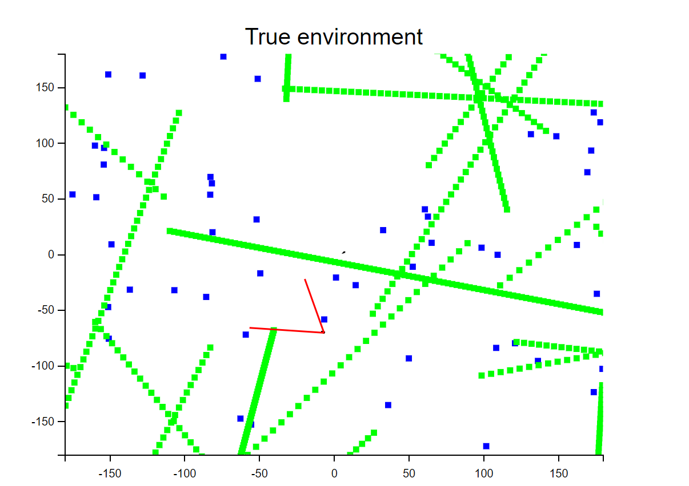
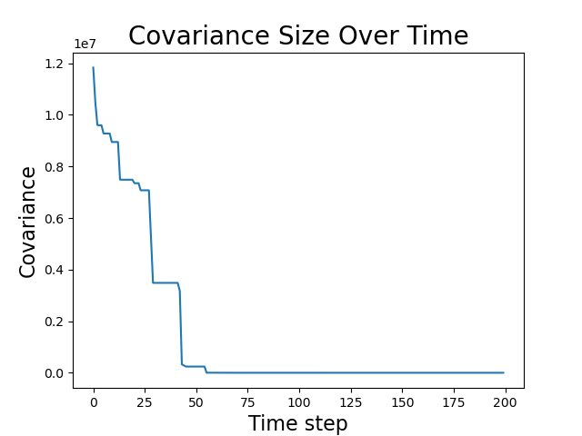
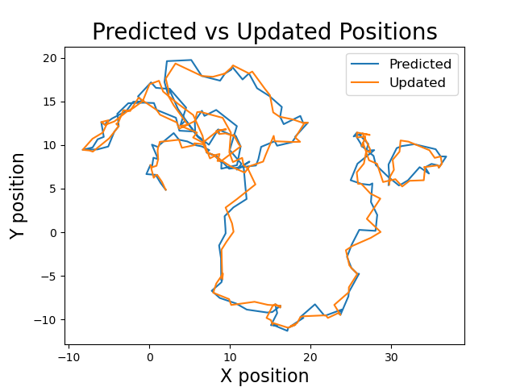

# 数字信号处理大作业

Owner: 柒柒在笔记
课程: 数字信号处理

# **数字滤波方法在SLAM问题中的应用**

## **一、摘要**

本报告探讨了卡尔曼滤波和粒子滤波在SLAM问题中的应用。实验目标是通过这两种滤波方法实现噪声滤除，以提高SLAM的精度和稳定性。实验结果表明，卡尔曼滤波和粒子滤波都能有效地滤除噪声，但在特定条件下，它们的性能有所不同。本报告将详细介绍实验方法、结果和讨论，以期为SLAM问题的进一步研究提供参考。代码已经开源在：[https://github.com/751K/easy_slam.git](https://github.com/751K/easy_slam.git)

## **二、引言**

同时定位和建图（SLAM）技术，起源于1986年Smith首次提出[1]，已经在各种应用领域得到广泛应用，尤其是在增强现实（AR）[2-4]和机器人学领域。SLAM技术的核心目标是在未知环境中，通过传感器信号同时完成地图建立和传感器系统的定位。在机器人学中，地图建立任务尤为关键，因为它使得地标可视化，从而便于环境的理解。此外，它还能帮助估计机器人的状态，重新定位机器人，并在重新访问已录入的区域时减少估计误差[8]。

地图建立任务伴随着定位和路径规划两个关联任务。从机器人视角出发，我们可以通过三个问题来描述地图建立任务：世界是什么样的？我在哪里？我怎么到达指定地点？地图建立任务解答了第一个问题，目标在于建立一个环境模型，也就是地图。为了完成这个目标，需要知道已经观察到的地标的位置，这正是第二个问题的答案，由定位任务提供。定位任务旨在确定机器人的姿态，也就是它的方向和位置，从而在地图上定位机器人。依赖于前两个任务的结果，路径规划任务解答了最后一个问题，它寻找如何估计机器人到达指定位置的轨迹。路径规划依赖于当前机器人的姿态（由定位任务提供）和环境特征（由地图建立任务提供）。SLAM技术就是一种结合了地图建立和定位任务的解决方案。

动态系统通常可以被描述为一个状态空间模型，该模型具有隐藏的状态，我们可以通过观察来获取隐藏状态的部分信息。对于我们要考虑的应用，状态向量可能包括一个移动平台的位置、速度和加速度，而观测数据可能来源于内部载机传感器（用于解决导航问题）用于测量惯性运动或相对某个地标的绝对位置，或者来自外部传感器（用于解决跟踪问题），比如用于测量范围和目标方位的传感器。

滤波器的目标是结合演化模型和一些用于获取状态部分信息的传感器测量来预测动态系统状态。然而遗憾的是，这些模型常常存在不确定性，传感器也会因受到噪声的影响而产生误差。滤波的核心理念就是在模型中显式地包括这两种不确定性，来尽可能从现有信息中推导出最佳的状态估计。尽管相关的理论已经广为人知，然而在控制、机器人以及自主系统的实践中设计和实现过滤器仍然是非常具有挑战性的。

扩展卡尔曼滤波器（EKF）在1960年代随着计算机的发展而诞生，并在NASA的阿波罗计划中首次运用，被用于实时预测宇宙飞船的轨道。过去二十年，粒子滤波(Particle Filter)的理论和应用都有显著的进展。然而，这些滤波器都需要大量的数值计算，因此，并不总是适应实时应用，尤其是在过程噪声较少用于静态参数估计的环境中，也存在理论上的困难。最近机器人社区也开始倾向于基于优化的滤波技术，这类问题通常被形式化为非线性最小二乘问题。然而，这类技术需要大量的计算，并且对于错误初始化的鲁棒性还没有得到确证。由于机器人以及许多控制系统都是实时运行的，计算资源有限，EKF以及更近期的变体无迹卡尔曼滤波器（UKF）在控制和机器人领域仍然扮演着重要的角色，特别是在航空航天业，EKF仍然是首选的滤波器。

粒子滤波器（Particle Filter ，也称顺序蒙特卡洛SMC方法），是一种强大的计算技术，主要通过蒙特卡洛模拟实现递归贝叶斯滤波。引入粒子滤波是为了解决非线性过滤问题，突破了传统滤波器针对高维和非高斯状态空间模型问题的限制。PF的最大优点是能有效处理非线性（甚至非高斯）系统，提供了显著的解决方案，超越了扩展卡尔曼滤波器等替代算法。尤其在处理高维状态空间中，PF不需要传播协方差矩阵，从而减轻了计算负担。

本文结合在数字信号处理课程中学得的知识，将通过卡尔曼滤波与粒子滤波方法相结合的手段，对SLAM问题中的运动噪声与观测噪声进行识别与消除。我们相信这样的组合能带来更优的结果，而且还可能提供一种新颖的视角来理解和应对SLAM中的挑战。具体来说，我们将介绍和解释这两种滤波方法的理论基础，并提供某些特定条件下的实施细节。除此之外，我们还将讨论这种结合在各个环节中可能会遇到的问题，并提供相应的解决策略。最后，我们将在实际应用和模拟环境中验证这种组合策略的效果，包括其在运行中的性能，以及它如何处理各种常见的、具有挑战性的SLAM场景。

## **三、数学基础**

### 3.1 粒子滤波

1. 初始化权重：
    
    $$
     w_{i,0}^{'} = 1/N
    $$
    
2. 更新权重
    
    $$
       w_{i,k|k}^{'} = w_{i,k|k-1} \cdot P(y_{k} | x_{i,k}^{'}) \quad 
    $$
    
3. 归一化权重
    
    $$
       c_{k} = \sum_{i=1}^{N} w_{i,k|k-1} \cdot P(y_{k} | x_{i,k}^{'}) \quad (16b)
    $$
    
4. 滤波密度近似
    
    $$
       p(x_{1:k} | y_{1:k}) = \sum_{i=1}^{N}w_{i, k|k} \delta(x_{1:k} - x_{1:k}^{'} )
    $$
    
5. 均值密度近似
    
    $$
       \bar{x}_{1:k} \approx \sum_{i=1}^{N} w_{i, k|k}x_{1:k}^{'}
    $$
    
6. 重采样
    
    $$
       w_{i, k|k}^{'} = 1/N
    $$
    
7. 预测分布
    
    $$
       x_{i,k+1}^{'}  \sim  q(x_{k+1} | x_{i, k}^{'}, y_{k+1})
    $$
    
8. 权重补偿
    
    $$
       w_{i,k+1|k}^{'} = \frac{w_{i,k|k}^{'} \cdot p(x_{i,k+1}^{'} | x_{i,k}^{'})}{q(x_{k+1}^{'} | x_{i,k}^{'} , y_{k+1})
       }
    $$
    

### 3.2 卡尔曼滤波

1. 卡尔曼增益：
    
    $$
       K_{k} = l_{t|k-1}\ H^{T}(X_{k|k-1})\   [H(X_{k|k-1})\ l_{t|k-1}\ H^{T} (X_{k|k-1}) + R_{k}]^-1 \quad (4a)
    $$
    
2. 更新估计
    
    $$
       X_{k|k} = X_{k|k-1} + K_{k}(Y_{k} - h(X_{k|k-1})) \quad (4b)
    $$
    
3. 更新协方差
    
    $$
       l_{t|k} = l_{t|k-1} - K_{k}\ H(X_{k|k-1})\ l_{t|k-1} \quad (4c)
    $$
    
4. 预测下一步
    
    $$
       X_{k+1|k} = f(X_{k|k}, 0) \quad (4d)
    $$
    
5. 预测误差协方差
    
    $$
       l_{t+1|k} = F(X_{k|k})\ l_{t|k}\ F^{T} (X_{k|k}) + G(X_{k|k})\ Q\ G^{T} (X_{k|k}) \quad (4e)
    $$
    
6. 近似分布
    
    $$
    p(x_{1:k}|y_{1:k}) \approx N(\bar{x}_{1:k}, P_{1:k}) \quad (5)
    $$
    

## 四**、实验方法**

在模拟环境中，我们使用了扩展卡尔曼滤波器(EKF)来预测移动机器人的位置，并对环境中的地标进行跟踪。以下是我们实现此预测的方法介绍。

1. **初始化环境：**
    
    总体地图的大小以及地标的数量和位置等相关参数首先被设置，并根据这些参数，地标被随机散布在地图上。这步的主要目标是为每个运动会话准备好模拟环境和刻画出地标的初始状态。
    
    ```python
    # 静态地标数量与地图大小
    num_static_landmarks = 50
    map_size = 360
    steps = 200
    
    # 生成静态地标
    landmark_xy = map_size * (np.random.rand(num_static_landmarks, 2) - 0.5)
    landmark_id = np.linspace(0, num_static_landmarks - 1, num_static_landmarks, dtype='uint16').reshape(-1, 1)
    static_landmarks = np.hstack((landmark_xy, landmark_id))
    
    # 动态地标数量
    num_dynamic_landmarks = 20
    # 速度乘数
    vm = 15
    landmark_xy = map_size * (np.random.rand(num_dynamic_landmarks, 2) - 0.5)
    landmark_v = np.random.rand(num_dynamic_landmarks, 2) - 0.5
    landmark_id = np.linspace(num_static_landmarks, num_static_landmarks + num_dynamic_landmarks - 1,
                              num_dynamic_landmarks, dtype='uint16').reshape(-1, 1)
    dynamic_landmarks = np.hstack((landmark_xy, landmark_id, landmark_v))
    ```
    
    
    
2. **初始化机器人状态：**
    
    与地标布置相似，机器人的初始状态也会被随机生成。这包括机器人的初始位置、方向以及它的视野范围。此外，为了模拟现实中可能的不确定性，我们引入了运动噪声和观察噪声。
    
    ```python
    # 视野范围
    fov = 70
    # 运动噪声协方差矩阵：x、y和θ
    Rt = 20 * np.array([[0.01, 0, 0],
                       [0, 0.01, 0],
                       [0, 0, 0.01]])
    # 观测噪声协方差矩阵：距离和角度
    Qt = 30 * np.array([[0.1, 0],
                       [0, 0.1]])
    
    # 随机生成初始位置 (x, y) 在 [-10, 10] 范围内
    initial_x = np.random.uniform(-10, 10)
    initial_y = np.random.uniform(-10, 10)
    
    # 随机生成初始方向在 [0, 2*pi] 范围内
    initial_theta = np.random.uniform(0, 2 * np.pi)
    
    initial_robot_state = [initial_x, initial_y, initial_theta]
    
    r1 = Robot(initial_robot_state, fov, Rt, Qt)
    
    # 生成初始真实状态
    true_robot_state = [initial_robot_state]
    sensor_observations = []
    ```
    
3. **机器人的移动和观测：**
    
    一旦环境被初始化，机器人会开始在此环境中进行移动，并观察周围的地标。运动命令包含了在规定步数内，机器人的移动步长和转向角度。观察目标的选择取决于机器人的视野，只有在机器人视野范围内的地标才会被观察到。
    
    
    
    ```python
    motion_commands = np.zeros((steps, 3))
    # 随机生成步长和曲率
    step_size = np.random.uniform(low=0, high=3, size=steps).astype(int)
    curvature = np.random.uniform(low=-1.0, high=1.0, size=steps)
    
    motion_commands[:, 0] = step_size
    motion_commands[:, 1] = curvature
    
    # 状态转移矩阵
    state_transition_matrix = np.array([[1, 0, 0, vm, 0],
                                        [0, 1, 0, 0, vm],
                                        [0, 0, 1, 0, 0],
                                        [0, 0, 0, 1, 0],
                                        [0, 0, 0, 0, 1]])
    
    # 初始化动态地标轨迹
    dynamic_landmark_trajectory = dynamic_landmarks
    
    # 生成动态地标轨迹
    for _ in range(1, steps):
        # 更新每个地标的状态
        dynamic_landmarks = state_transition_matrix.dot(dynamic_landmarks.T).T
        # 将新的状态添加到轨迹中
        dynamic_landmark_trajectory = np.dstack((dynamic_landmark_trajectory, dynamic_landmarks))
    ```
    
4. **扩展卡尔曼滤波器(EKF)预测：**
    
    在每一个时间步，机器人会移动并观察其周围的环境。之后，机器人会使用EKF和PF来预测其新的位置并对此进行更新。在EKF预测阶段，机器人先使用运动命令和噪声协方差矩阵来预测新的位置，然后，利用所观察到的地标的信息，来修正和更新这个预测。同样地，粒子滤波器也会被用于预测机器人的新位置。由于粒子滤波器通过采样粒子来描述系统状态的可能性，因此其并不需要对系统状态的概率分布进行任何的假设，这使得它在处理非线性，以及非高斯噪声时有着更强的效果。
    
    
    
    ```python
    for movement, measurement in zip(motion_commands, sensor_observations):
        new_estimated_state, state_covariance = predict(new_estimated_state, state_covariance, movement, Rt)
        estimated_state = np.append(estimated_state, new_estimated_state, axis=1)
        predicted_position = new_estimated_state[:2].tolist()
        predicted_positions.append(predicted_position)
    
        cov_size = np.linalg.norm(state_covariance)
        covariance_sizes.append(cov_size)
    
        # time.sleep(0.5)
    
        print('Measurements: {0:d}'.format(len(measurement)))
        new_estimated_state, state_covariance, new_landmark_existence_probability \
            = update(new_estimated_state, state_covariance, measurement, landmark_existence_probability[:, -1].
                     reshape(num_static_landmarks + num_dynamic_landmarks, 1), Qt)
        estimated_state = np.append(estimated_state, new_estimated_state, axis=1)
        landmark_existence_probability = np.append(landmark_existence_probability, new_landmark_existence_probability,
                                                   axis=1)
        updated_position = new_estimated_state[:2].tolist()
        updated_positions.append(updated_position)
        # plotEstimate(estimated_state, state_covariance, r1, map_size)
    ```
    

我们根据这些步骤和基础设置，实现了移动机器人的位置和方向预测以及地标跟踪。

### 4.2 滤波实现

**4.2.1 卡尔曼滤波**

```python
import numpy as np

def predict(state_mean, state_cov, motion_control, motion_noise_cov):
    state_dim = len(state_mean)

    # 定义运动模型
    [delta_translation, delta_rotation1, delta_rotation2] = motion_control
    motion_vector = np.array([[delta_translation * np.cos(state_mean[2][0] + delta_rotation1)],
                              [delta_translation * np.sin(state_mean[2][0] + delta_rotation1)],
                              [delta_rotation1 + delta_rotation2]])
    motion_factor = np.append(np.eye(3), np.zeros((3, state_dim - 3)), axis=1)

    # 预测新的状态
    predicted_state_mean = state_mean + motion_factor.T.dot(motion_vector)

    # 定义运动模型的雅可比矩阵
    jacobian = np.array([[0, 0, -delta_translation * np.sin(state_mean[2][0] + delta_rotation1)],
                         [0, 0, delta_translation * np.cos(state_mean[2][0] + delta_rotation1)],
                         [0, 0, 0]])
    gain = np.eye(state_dim) + motion_factor.T.dot(jacobian).dot(motion_factor)

    # 预测新的协方差
    predicted_state_cov = gain.dot(state_cov).dot(gain.T) + motion_factor.T.dot(motion_noise_cov).dot(motion_factor)

    # 打印预测的位置
    print('predicted location\t x: {:.2f} \t y: {:.2f} \t theta: {:.2f}'.format(predicted_state_mean[0][0],
                                                                        predicted_state_mean[1][0],
                                                                        predicted_state_mean[2][0]))
    return predicted_state_mean, predicted_state_cov

def update(state_mean, state_cov, observations, static_prob, observation_noise_cov):
    state_dim = len(state_mean)

    for [range_obs, angle_obs, landmark_id] in observations:
        landmark_id = int(landmark_id)
        # 如果地标之前没有被观测到
        if state_cov[2 * landmark_id + 3][2 * landmark_id + 3] >= 1e6 and state_cov[2 * landmark_id + 4][
            2 * landmark_id + 4] >= 1e6:
            # 将地标的估计值设为当前的观测值
            state_mean[2 * landmark_id + 3][0] = state_mean[0][0] + range_obs * np.cos(angle_obs + state_mean[2][0])
            state_mean[2 * landmark_id + 4][0] = state_mean[1][0] + range_obs * np.sin(angle_obs + state_mean[2][0])

        # 如果地标是静态的
        if static_prob[landmark_id] >= 0.5:
            # 计算预期的观测值
            delta = np.array([state_mean[2 * landmark_id + 3][0] - state_mean[0][0],
                              state_mean[2 * landmark_id + 4][0] - state_mean[1][0]])
            q = delta.T.dot(delta)
            sqrt_q = np.sqrt(q)
            z_angle = np.arctan2(delta[1], delta[0])
            expected_obs = np.array([[sqrt_q], [z_angle - state_mean[2][0]]])

            # 计算雅可比矩阵
            F = np.zeros((5, state_dim))
            F[:3, :3] = np.eye(3)
            F[3, 2 * landmark_id + 3] = 1
            F[4, 2 * landmark_id + 4] = 1
            H_z = np.array([[-sqrt_q * delta[0], -sqrt_q * delta[1], 0, sqrt_q * delta[0], sqrt_q * delta[1]],
                            [delta[1], -delta[0], -q, -delta[1], delta[0]]], dtype='float')
            H = 1 / q * H_z.dot(F)

            # 计算卡尔曼增益
            K = state_cov.dot(H.T).dot(np.linalg.inv(H.dot(state_cov).dot(H.T) + observation_noise_cov))

            # 计算预期观测值和实际观测值之间的差异
            obs_diff = np.array([[range_obs], [angle_obs]]) - expected_obs
            obs_diff = (obs_diff + np.pi) % (2 * np.pi) - np.pi

            # 更新状态向量和协方差矩阵
            state_mean = state_mean + K.dot(obs_diff)
            state_cov = (np.eye(state_dim) - K.dot(H)).dot(state_cov)

    # 打印更新后的位置
    print('update location\t x: {:.2f} \t y: {:.2f} \t theta: {:.2f}'.format(state_mean[0][0], state_mean[1][0],
                                                                             state_mean[2][0]))
    return state_mean, state_cov, static_prob
```

**4.2.2 粒子滤波**

```python
import numpy as np

class ParticleFilter:
    def __init__(self, num_particles, initial_state, motion_noise_cov, observation_noise_cov, view_range):
        self.num_particles = num_particles
        motion_noise = np.random.randn(num_particles, 3)
        self.particles = np.tile(np.array(initial_state), (num_particles, 1)) + np.matmul(motion_noise,
                                                                                          motion_noise_cov)
        self.weights = np.ones(num_particles) / num_particles
        self.motion_noise_cov = motion_noise_cov
        self.observation_noise_cov = observation_noise_cov
        self.view_range = view_range

    def predict(self, control_signal):
        # 根据运动模型和控制信号预测粒子的下一个状态
        for i in range(self.num_particles):
            motion_noise = np.matmul(np.random.randn(1, 3), self.motion_noise_cov)[0]  # 生成运动噪声
            [delta_trans, delta_rot1, delta_rot2] = control_signal[:3] + motion_noise  # 计算运动增量
            self.particles[i, 0] += delta_trans * np.cos(self.particles[i, 2] + delta_rot1)  # 更新粒子的x坐标
            self.particles[i, 1] += delta_trans * np.sin(self.particles[i, 2] + delta_rot1)  # 更新粒子的y坐标
            self.particles[i, 2] = (self.particles[i, 2] + delta_rot1 + delta_rot2 + np.pi) % (
                    2 * np.pi) - np.pi  # 更新粒子的方向

    def update(self, observations, landmarks):
        # 根据观测数据更新粒子的权重
        for i in range(self.num_particles):
            for observation in observations:
                expected_observation = self.expected_observation(self.particles[i], landmarks)  # 计算预期的观测值
                self.weights[i] *= np.prod(self.observation_probability(observation, expected_observation))  # 更新粒子的权重

        self.weights = (self.weights + 1e-10) / (np.sum(self.weights) + 1e-10 * len(self.weights))  # 归一化粒子的权重

    def resample(self):
        # 根据粒子的权重进行重采样
        indices = np.random.choice(np.arange(self.num_particles), size=self.num_particles, p=self.weights)  # 生成新的粒子索引
        self.particles = self.particles[indices]  # 生成新的粒子集
        self.weights = np.ones(self.num_particles) / self.num_particles  # 重置粒子的权重

    @staticmethod
    def expected_observation(state, landmarks):
        # 计算预期的观测值
        relative_angles = np.arctan2((landmarks[:, 1] - state[1]), (landmarks[:, 0] - state[0]))  # 计算地标相对于粒子的角度
        ranges = np.sqrt(np.square(landmarks[:, 1] - state[1]) + np.square(landmarks[:, 0] - state[0]))  # 计算地标相对于粒子的距离
        bearings = (relative_angles - state[2] + np.pi) % (2 * np.pi) - np.pi  # 计算地标相对于粒子的角度
        expected_observations = np.hstack(
            (ranges.reshape(-1, 1), bearings.reshape(-1, 1), landmarks[:, 2].reshape(-1, 1)))  # 生成预期的观测值
        return expected_observations

    def observation_probability(self, observation, expected_observation):
        # 计算观测概率
        diff = observation - expected_observation  # 计算实际的观测值和预期的观测值之间的差异
        diff[:, 2] = (diff[:, 2] + np.pi) % (2 * np.pi) - np.pi  # 将角度差异转换到[-pi, pi]区间
        diff = diff[:, :2]
        # P(x) = exp(-0.5 * (x - μ)^T * Σ^-1 * (x - μ))
        inv_cov = np.linalg.inv(self.observation_noise_cov)  # 计算协方差矩阵的逆
        probabilities = np.array([np.exp(-0.5 * d.dot(inv_cov).dot(d.T)) for d in diff])  # 对每一行分别计算概率
        return probabilities
```

## 五、实验数据

下表详细展示了我们物体追踪实验中机器人对场景中各地标位置的预测和更新过程。表格分为前半部分和后半部分；前半部分详细列出了在每一阶段，机器人对其自身位置（包括X、Y和Theta值）的预测，同时还列出了此阶段机器人观测到的地标数量。在后半部分，我们表明了机器人在收到观测信息后，对自身位置进行更新所得出的结果。

通过比较预测位置和更新后的位置，我们可以看到在大多数情况下，预测和实际位置是相近的，有时甚至完全相同。这反映了我们的移动追踪算法的高精度。同时，我们也可以发现，地标的观测数对于结果的影响也是不可忽视的。总的来说，这个表格系统性地展示了我们的实验过程和结果，提供了对我们算法效果的直观认识。

这个表格中包含了我们在这次实验过程中的重要数据，这些数据将有助于我们了解和评估我们应用扩展卡尔曼滤波器进行移动目标跟踪的效果。

| **预测位置** | **预测 X** | **预测 Y** | **预测 Theta** | **观测数** | **更新位置** | **更新 X** | **更新 Y** | **更新 Theta** |
| --- | --- | --- | --- | --- | --- | --- | --- | --- |
| location 1 | 1.11 | -8.36 | 2.14 | 9 | location 1 | 1.11 | -8.36 | 2.14 |
| location 2 | 1.11 | -8.36 | 1.58 | 13 | location 2 | 1.15 | -8.41 | 1.72 |
| location 3 | 1.54 | -7.49 | 1.17 | 15 | location 3 | 1.23 | -7.34 | 1.88 |
| location 4 | 1.23 | -7.34 | 1.50 | 17 | location 4 | 1.07 | -7.53 | 1.81 |
| location 5 | 0.88 | -5.54 | 1.67 | 17 | location 5 | 1.34 | -5.69 | 1.37 |
| location 6 | 0.90 | -4.79 | 2.02 | 17 | location 6 | 0.79 | -4.36 | 2.63 |
| location 7 | 0.79 | -4.36 | 1.67 | 13 | location 7 | 0.79 | -4.36 | 1.67 |
| location 8 | 1.13 | -2.39 | 1.40 | 11 | location 8 | 1.59 | -2.49 | 1.15 |
| location 9 | 3.55 | -2.10 | 0.19 | 9 | location 9 | 3.67 | -2.07 | 0.27 |
| location 10 | 3.67 | -2.07 | 0.48 | 13 | location 10 | 3.45 | -2.05 | -0.34 |
| location 11 | 5.40 | -1.59 | 0.23 | 14 | location 11 | 5.54 | -1.21 | 0.26 |
| location 12 | 6.19 | -0.45 | 0.86 | 12 | location 12 | 6.78 | 0.36 | 1.46 |
| location 13 | 6.39 | 2.32 | 1.77 | 12 | location 13 | 4.28 | 2.51 | 2.46 |
| location 14 | 2.29 | 2.31 | 3.24 | 17 | location 14 | 2.91 | 1.22 | 3.75 |
| location 15 | 2.91 | 1.22 | 3.51 | 16 | location 15 | 2.59 | 1.35 | 3.02 |
| location 16 | 1.08 | 0.04 | 3.86 | 10 | location 16 | 0.35 | 0.47 | 3.49 |
| location 17 | 0.35 | 0.47 | 4.27 | 16 | location 17 | 0.29 | 0.56 | 4.32 |
| location 18 | 0.29 | 0.56 | 4.40 | 11 | location 18 | 0.33 | 0.43 | 4.46 |
| location 19 | -1.49 | -0.40 | 3.57 | 14 | location 19 | -0.84 | -0.25 | 3.65 |
| location 20 | -1.73 | 0.20 | 2.67 | 16 | location 20 | -1.48 | 0.78 | 2.05 |

此外，我们进行了更多可视化研究，以描述两种滤波算法的效果所在





## 六、结论

根据我们的实验数据及其分析，我们可以得出以下结论：

1. 扩展卡尔曼滤波器（EKF）在移动机器人跟踪和定位方面表现了很高的精度。如表中数据所示，空间中地标的预测位置与实际更新后的丈量位置大多情况下相近，有时甚至几乎相等，这说明我们使用的预测-更新循环可以有效地对真实环境进行准确的建模并做出准确的预测。
2. 粒子滤波器（PF）在处理非高斯噪声与非线性系统方面展示出它的优势。它不需要对系统状态做任何概率分布假设，使其在强非线性系统下能表现更为准确。对于复杂的噪声环境，PF由于其离散样本处理方式，相比其他滤波器能展现出更稳健的性能。
3. 地标的观测数和机器人导航有着重要的关联性。表格中也可以看出，地标的观测数越多，数据点的偏差越小，说明了预测的精度越高。
4. 总的来说，本次实验充分展示了基于扩展卡尔曼滤波器及粒子滤波器的移动机器人导航定位可以有很高的准确性。而这也为自动驾驶、移动机器人导航等领域提供了有力的技术支持。
5. 但是，也应注意到，在实际环境中，点的观测数量和质量会受到许多因素的影响，例如环境复杂度、观测设备的精度等，因此在实际应用中还需要对这些因素进行综合评估和处理。