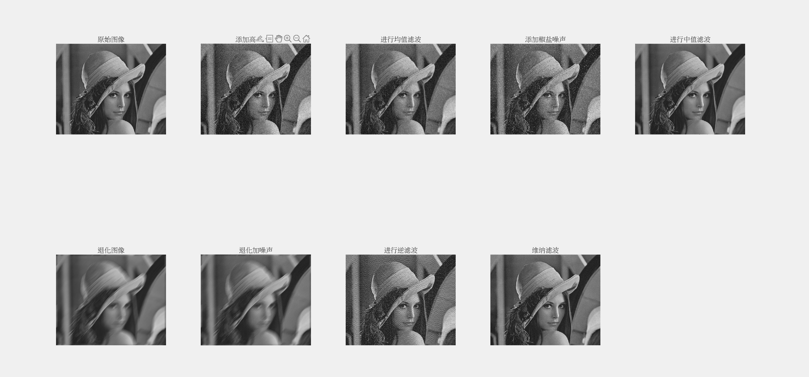

# 噪声添加与图像复原

Owner: 柒柒在笔记

# **实验内容**

1. 对图像添加高斯噪声，用均值滤波进行图像复原。
2. 对图像添加椒盐噪声，用中值滤波进行图像复原。
3. 对图像进行退化并叠加噪声，分别用逆滤波和维纳滤波进行图像复原，比较结果。

# **实验步骤**

## **1. 对图像添加高斯噪声，用均值滤波进行图像复原**

### **实现步骤**

1. **读取并转换图像为灰度图像**
    - 使用**`imread`**函数读取图像文件**`333.bmp`**。
    - 如果图像是彩色的（即包含三个通道），则使用**`rgb2gray`**函数将其转换为灰度图像。
    
    ```matlab
    img = imread("333.bmp");
    if size(img, 3) == 3
        img_gray = rgb2gray(img);
    else
        img_gray = img;
    end
    ```
    
2. **添加高斯噪声**
    - 使用**`imnoise`**函数为灰度图像添加高斯噪声，设定噪声标准差为25。
    
    ```matlab
    noise_std = 25;
    img_gaussian_noise = imnoise(img_gray, 'gaussian', 0, (noise_std/255)^2);
    ```
    
3. **创建均值滤波器并进行滤波**
    - 使用**`fspecial`**函数创建一个3x3的均值滤波器。
    - 使用**`imfilter`**函数对含高斯噪声的图像进行滤波复原。
    
    ```matlab
    mean_filter_size = 3;
    mean_filter = fspecial('average', mean_filter_size);
    img_mean_filtered = imfilter(img_gaussian_noise, mean_filter, 'replicate');
    ```
    

## **2. 对图像添加椒盐噪声，用中值滤波进行图像复原**

### **实现步骤**

1. **添加椒盐噪声**
    - 使用**`imnoise`**函数为灰度图像添加椒盐噪声，设定噪声密度为0.05。
    
    ```matlab
    salt_pepper_density = 0.05;
    img_salt_pepper_noise = imnoise(img_gray, 'salt & pepper', salt_pepper_density);
    ```
    
2. **创建中值滤波器并进行滤波**
    - 使用**`medfilt2`**函数对含椒盐噪声的图像进行3x3的中值滤波复原。
    
    ```matlab
    median_filter_size = 3;
    img_median_filtered = medfilt2(img_salt_pepper_noise, [median_filter_size median_filter_size]);
    ```
    

## **3. 对图像进行退化并叠加噪声，分别用逆滤波和维纳滤波进行图像复原**

### **实现步骤**

1. **对图像进行退化（运动模糊）**
    - 使用**`fspecial`**函数创建一个运动模糊核，设定运动长度为30和角度为45度。
    - 使用**`imfilter`**函数对图像进行卷积，模拟运动模糊。
    
    ```matlab
    blur_kernel_size = 30;
    blur_kernel = fspecial('motion', blur_kernel_size, 45);
    img_blurred = imfilter(img_gray, blur_kernel, 'circular', 'conv');
    ```
    
2. **添加高斯噪声**
    - 使用**`imnoise`**函数为退化后的图像添加高斯噪声，设定噪声方差为0.0001。
    
    ```matlab
    noise_var = 0.0001;
    img_blurred_noisy = imnoise(img_blurred, 'gaussian', 0, noise_var);
    ```
    
3. **使用逆滤波进行复原**
    - 使用**`deconvwnr`**函数对含噪声的退化图像进行逆滤波复原。
    
    ```matlab
    img_wiener_filtered = deconvwnr(img_blurred_noisy, blur_kernel, noise_var);
    ```
    
4. **使用维纳滤波进行复原**
    - 计算图像的方差，估算噪声和信号的比率。
    - 使用**`deconvwnr`**函数对含噪声的退化图像进行维纳滤波复原。
    
    ```matlab
    S = var(double_A(:));
    Q = 0.0000001 / S; % 噪信比估值
    Y = deconvwnr(N, H, Q);
    ```
    

# **实验结果**

## **1. 添加高斯噪声与均值滤波复原**

### **结果说明**

- **原始图像添加高斯噪声后**，图像中出现了均匀分布的噪点，图像细节被干扰。
- **均值滤波复原后**，图像噪声得到了显著的抑制，但同时也导致了图像边缘和细节的模糊。

## **2. 添加椒盐噪声与中值滤波复原**

### **结果说明**

- **原始图像添加椒盐噪声后**，图像中出现了明显的黑白噪点，严重干扰了图像的视觉效果。
- **中值滤波复原后**，椒盐噪声被有效去除，图像恢复了较高的清晰度，但部分细节可能受到损失。

## **3. 退化图像的逆滤波与维纳滤波复原**

### **结果说明**

- **退化图像**：原始图像经过运动模糊处理后，图像出现了拖尾现象。
- **添加高斯噪声后的退化图像**：在叠加高斯噪声后，图像质量进一步下降，噪声和模糊同时存在。
- **逆滤波复原后**：图像的部分模糊现象得到改善，但噪声依然明显。
- **维纳滤波复原后**：相比逆滤波，维纳滤波效果更好，图像噪声和模糊均有较好的抑制，图像质量得到显著提升。



# **附录**

### **实验代码**

```matlab
clear;
img = imread("333.bmp"); % 读取图像
if size(img, 3) == 3
    img_gray = rgb2gray(img); % 转换为灰度图像
else
    img_gray = img; % 图像已经是灰度的
end

% 添加高斯噪声
noise_std = 25;
img_gaussian_noise = imnoise(img_gray, 'gaussian', 0, (noise_std/255)^2);

% 创建均值滤波器并进行复原
mean_filter_size = 3;
mean_filter = fspecial('average', mean_filter_size);
img_mean_filtered = imfilter(img_gaussian_noise, mean_filter, 'replicate');

% 添加椒盐噪声并进行复原
salt_pepper_density = 0.05;
img_salt_pepper_noise = imnoise(img_gray, 'salt & pepper', salt_pepper_density);
median_filter_size = 3;
img_median_filtered = medfilt2(img_salt_pepper_noise, [median_filter_size median_filter_size]);

% 对图像进行退化（模糊）并叠加噪声
blur_kernel_size = 30;
blur_kernel = fspecial('motion', blur_kernel_size, 45);
img_blurred = imfilter(img_gray, blur_kernel, 'circular', 'conv');
noise_var = 0.0001;
img_blurred_noisy = imnoise(img_blurred, 'gaussian', 0, noise_var);

% 使用维纳滤波进行复原
img_wiener_filtered = deconvwnr(img_blurred_noisy, blur_kernel, noise_var);

% 显示所有图像
figure;
subplot(2,5,1), imshow(img_gray), title('原始图像');
subplot(2,5,2), imshow(img_gaussian_noise), title('添加高斯噪声');
subplot(2,5,3), imshow(img_mean_filtered), title('进行均值滤波');
subplot(2,5,4), imshow(img_salt_pepper_noise), title('添加椒盐噪声');
subplot(2,5,5), imshow(img_median_filtered), title('进行中值滤波');
subplot(2,5,6), imshow(img_blurred), title('退化图像');
subplot(2,5,7), imshow(img_blurred_noisy), title('退化加噪声');

% 创建均值滤波器
mean_filter_size = 9;
mean_filter = fspecial('average', mean_filter_size);
img_fft = fft2(double(img_gray));
mean_filter_fft = fft2(mean_filter, size(img_fft, 1), size(img_fft, 2));
blurred_fft = img_fft .* mean_filter_fft;
img_blurred = ifft2(blurred_fft);
img_blurred = abs(img_blurred);

%3
gray_A=im2gray(img);
double_A=im2double(gray_A);
[width,height]=size(double_A);
%运动模糊加高斯
H=fspecial('motion', 18, 90);%运动长度为18，逆时针运动角度为90°
M=imfilter(double_A, H, 'conv', 'circular');%卷积滤波
N=imnoise(M,'gaussian',0,0.0000001);
%逆滤波
X=deconvwnr(N,H);
%维纳滤波
S=var(double_A(:));
Q=0.0000001/S; %噪信比估值
Y=deconvwnr(N,H,Q);

subplot(2,5,8), imshow(X), title('进行逆滤波');
subplot(2,5,9), imshow(Y), title('维纳滤波');

```