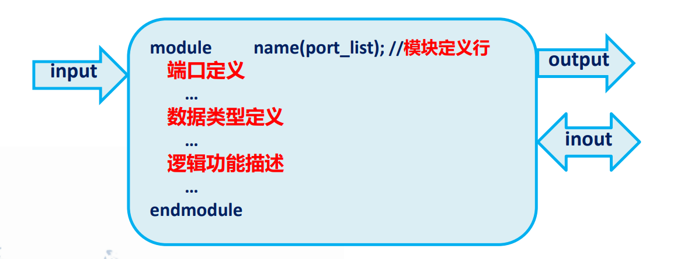

# Verilog学习

Owner: 柒柒在笔记
课程: 数字电子电路设计

# 第一章 在学习之前：初学数字电路设计

### 一．数字集成电路的发展和设计方法的演变

<aside>
😥 **发展历史：**

1. 1970s：IC产业发展的初级阶段，简单微处理器、存储器及标准通用逻辑。设计以人工为主。
2. 1980s:IC产业发展的初级阶段，简单微处理器、存储器及标准通用逻辑。设
计以人工为主。
3. 1990s:IC产业分离（设计业、制造业、封装业、测试业）通用型中央处理器
和信号处理器出现，IC产业向高度专业化发展，可编程器件的集成度
大大提高
4. 2000s:高密度存储器和SoC设计成为主流，这些器件的开发依靠可编程技术
</aside>

<aside>
😥 **FPFA特点：**

器件的功能不是固定不变的，而是可根据用户的需要而进行改变，即由编程的方法来确定器件的逻辑功能。具有三高特性：高集成度、高速度、高可靠度

</aside>

<aside>
😥 **FPFA优势：**

1. 用软件的方式设计硬件；
2. 用软件方式设计的系统到硬件系统的转换是由有关的
开发软件自动完成的；
3. 整个系统可集成在一个芯片上，体积小、功耗低、可
靠性高；
4. 设计过程中可用有关软件进行各种仿真；
5. 系统可现场编程，在线升级。
</aside>

### 二．Verilog HDL和VHDL语言简介

<aside>
😥 **VHDL：**

（Very High Speed Hardware Description Language）

美国国防部高级研究计划局于1983 年开始研发,后由IEEE进一步发展，1987年作
为“IEEE标准1076”发布，之后多次修订完善。

</aside>

<aside>
😥 **Verilog HDL：**

Gateway design automation 1983年开始研发，历经多年发展，1995年IEEE正式
将其作为数字集成电路设计语言标准

</aside>

<aside>
😥 **Verilog与VHDL的优点**

- 能形式化的抽象表达电路的行为和结构
- 支持逻辑设计中层次与范围的描述
- 借用高级语言的描述简化电路行为的描述
- 具有仿真与验证机制
- 支持电路描述由高层到底层的综合
- 描述与实现与工艺无关
- 便于文档管理
- 易于理解与设计重用

**不同点：**

- Verilog描述效率高，拓展性更强，语法规则少，代码管理与设计难度较大
</aside>

### 三．Verilog HDL语言的抽象能力

<aside>
😥 **语言抽象级别：**

- 系统级：用高级语言结构实现设计模块外部性能
- 算法级：用高级语言结构描述设计算法
- RTL级：描述数据再寄存器之间的流动
- 门级：描述逻辑门与逻辑门之间的连接
- 开关级：描述器件中三极管和存储节点之间的模型
</aside>

<aside>
😥 **模块仿真过程中的抽象：**

- 系统级：用文字或算法描述的Verilog模块
- RTL级：用可综合的Verilog模块表示的电路
- 门级：实例引用门电路的Verilog模块
- 版图布局级：用二极管、三极管等器件表述的电路
</aside>

<aside>
😥 **仿真流程：**

1. 行为仿真
2. 综合前仿真
3. 逻辑综合
4. 综合后仿真
5. 布局仿真
</aside>

### 四．功能模块和可重用性

1. HDL的标准化使得Verilog和VHDL通用性大大提高，在使用过程中，整个行
业积累了大量的功能模块，这些模块都是可重用的。
2. 可重用模块的使用大大提高了硬件电路开发的效率。

### 五．IP核、软核、硬核、固核

<aside>
😥 **概念介绍：**

- 软核：经过功能验证，5000门以上的Verilog模型
- 固核：在FPGA上经过综合验证，大于5000门的电路网表结构
- 固核：在ASIC上，经过验真的大于5000门的电路结构版图掩膜
- IP核：具有知识产权的集成电路芯核的总称，具有可移植特性
</aside>

### 六．一些英文缩写的含义

CAD： Computer Aided Design 计算机辅助设计

IC：Integrated circuit 集成电路

SSI：Small scale integrated 小规模集成

SoC：System on chip 片上系统

IP：Intelligent property 知识产权

HDL：Hardware Description language 硬件描述语言

EDA：Electronic design automation 电子设计自动化

ASIC：Application specific integeated circuit 专用集成电路

FPGA：Field programmable gate array 现场可编程门阵列

CPLD：Complex Programmable Logic Device 复杂可编程逻辑器件

# 第二章 Verilog HDL 基础语法概念

## Verilog HDL 基本组成

<aside>
😥 **Blcok 模块：**是Verilog HDL的基本单元，代表一个基本的功能块，用于描述某个设计的功能或者结构，以及与其他模块通信的外部端口。一个电路设计不仅仅局限于一个模块的设计，通常是由多个模块组合而成

</aside>



## 综合的概念

<aside>
😥 **综合的概念：自上而下的综合**

指在电路设计中把设计抽象层次中的一种表述转化成另一种更为具体的表述的
过程。主要包括：

- 自然语言综合：从自然语言到行为描述的Verilog语言
- 行为综合：从行为域到结构域
- 逻辑综合：从RTL级到逻辑门
- 结构综合：从逻辑门表述到版图表述
</aside>

## 间隔符、标识符和关键字

- 间隔符：不在字符串中的空白符、tab、换行、换页在编译的时候都会被忽略
- 标识符：用来命名信号、模块、参数等，不能以数字开头，区分大小写，除非包含转义标识符‘\’否则不能包含（*，+，-，@）
- 关键词：保留字，全部为小写，不可用于充当标识符

## 数据的表示

### **常量**

**整数：见下表**

| 表 达 方 式 | 说 明 | 举 例 |
| --- | --- | --- |
| `<位宽>`’`<进制>` `<数字>` | 完整的表达方式 | 8’b11000101或8 ’hc 5 |
| `<进制>` `<数字>` | 缺省位宽，则位宽由机器系统决定，至少32位 | hc5 |
| `<数字>` | 缺省进制，则为十进制，位宽默认为32位 | 197 |

**实数：**使用十进制表述或科学计数法

**字符串：**使用双引号

**parameter常量：**parameter 参数名1 = 常数表达式

### **物理型变量**

1. **wire**
    - 模块中的输入/输出信号类型缺省为wire型
    - 最常用的nets型变量，常用来表示以assign语句赋值的组合逻辑信号
    - 可做任何方式的输入
    - 可做“assign”语句和实例元件的输出
    
    ```verilog
    //使用示例：
    wire a，b;
    wire [7:0] buf;
    
    assign a =1;
    ```
    
2. **reg**
    
    对应具有状态保持作用的电路元件
    
    ```verilog
    //使用示例：
    reg full_signal;
    reg [7:0] paddle_num;
    
    always@(*)
    	full_signal<=1;
    ```
    
3. **memory**
    
    ```verilog
    //使用示例：
    // Depth=8，With=256
    reg[7:0] mem[255:0]
    ```
    

### **抽象型变量**

1. **integer：**用于循环的控制
2. **time：**与$time一起使用
3. **real：**用于延迟时间

## 运算符与表达式

1. **算数运算符：**
    1. 加+
    2.  减 - 
    3.  乘* 
    4.  实数除法 /  
    5. 取余 %
2. **关系运算符:** 
    1.  大于>
    2. 小于<
    3.  大于等于≤
    4.   小于等于≥
3. **相等运算符:**
    1. 等于 ==
    2.  不等于 !=
    3.  全等于 === 
    4.  非全等于 !==
    
    ```verilog
    data='b11x0;
    addr='b11x0;
    data == addr; //0
    data === addr; //1
    ```
    
4. **逻辑运算符:** 
    1.  逻辑与 &&
    2.  逻辑或 ||
    3.  逻辑非 ?
    
    ```verilog
    a=4'b1110;
    b=4'b0000;
    //则有：
    !a==0
    !b==1
    a||b =1;
    a&&b=0;
    ```
    
5. **按位运算符:**
    1. 一元非 ~
    2.  二元与 &
    3.  二元或 |
    4.  二元异或 ^
    5.  二元异或非 ~^ 
    
    ```verilog
    a=4'b0110;
    b=4'b0100;
    c=4'bx010;
    d=4'bzzzz;
    3=3'b011;
    a|b = 4'b0110;
    a&b = 4'b0100;
    a&c = 4'bx010;
    a&d = 4'bxxxx;
    a&e = 4'b0010;
    ```
    
6. **缩减运算符**
    1. 归约与 &
    2. 归于与非 ~&
    3. 归约或 |
    4. 归约异或 ^
    5. 归约异或非 ~^
    
    ```verilog
    module reduction_with_unknown_and_highz();
    
      reg [3:0] a;
      reg result_and, result_or, result_xor;
    
      initial begin
        a = 4'b1x0z; // 假设a中包含不定态和高阻态
    
        // 缩减与运算
        result_and = &a; // 结果将是x，因为不定态导致无法确定所有位都是1
        $display("&(1x0z) = %b", result_and);
    
        // 缩减或运算
        result_or = |a; // 结果将是1，因为至少有一个已知的1
        $display("|(1x0z) = %b", result_or);
    
        // 缩减异或运算
        result_xor = ^a; // 结果将是x，因为x参与异或运算结果未知
        $display("^(1x0z) = %b", result_xor);
      end
    
    endmodule
    ```
    
    ```verilog
    module reduction_operators_example();
    
      reg [3:0] a = 4'b1101;
      reg result; 
    
      initial begin
        // AND 
        result = &a; // 结果将是 0，因为并非所有位都是1
        // OR 
        result = |a; // 结果将是 1，因为至少有一个位是1
        // XOR 
        result = ^a; // 结果将是 1，因为a中1的个数是奇数
        // XNOR 
        result = ~^a; // 结果将是 0，因为a中1的个数是奇数
        // NAND 
        result = ~&a; // 结果将是 1，因为并非所有位都是1，NAND是AND的反逻辑
        ****// NOR 
        result = ~|a; // 结果将是 0，因为至少有一个位是1，NOR是OR的反逻辑
      end
    
    endmodule
    ```
    
7. **移位运算符**
    1. 左移 <<
    2. 右移 >>
    
    ```verilog
    module shift_operators_example();
      reg [7:0] a; 
      reg [7:0] left_shifted; 
      reg [7:0] right_shifted; 
    
      initial begin
        a = 8'b1101_0011;
    
        // 执行左移操作
        left_shifted = a << 2; 
        $display("a << 2 = %b", left_shifted); // 期望输出: a << 2 = 01001100
    
        // 执行右移操作
        right_shifted = a >> 2; 
        $display("a >> 2 = %b", right_shifted); // 期望输出: a >> 2 = 00110100
    
        // 如果a被视为有符号数，进行算术右移操作
        right_shifted = $signed(a) >>> 2; 
        $display("a >>> 2 = %b", right_shifted); // 期望输出: a >>> 2 = 11110100
      end
    
    endmodule
    ```
    
8. **条件运算符**
    
    ```verilog
    //condition ? value_if_true : value_if_false;
    
    module conditional_operator_example(
      input wire a,
      input wire b,
      output wire max
    );
    
      // 如果a大于b，将max设置为a，否则设置为b
      assign max = (a > b) ? a : b;
    
    endmodule
    ```
    
9. **连接运算符**
    
    ```verilog
    module concatenation_example(
      input wire [3:0] nibble1, // 4位输入
      input wire [3:0] nibble2, // 另一个4位输入
      output wire [7:0] byte_out // 8位输出
    );
    
      // 将两个4位输入连接成一个8位输出
      assign byte_out = {nibble1, nibble2};
    
    endmodule
    ```
    
10. **复制运算符**
    
    ```verilog
    module replication_example(
      input wire [3:0] nibble, // 4位输入
      output wire [15:0] quad_nibble // 16位输出
    );
    
      // 将4位输入复制4次，以创建一个16位的输出
      assign quad_nibble = {4{nibble}};
    
    endmodule
    ```
    

| 优先级 | 运算符 | 描述 |
| --- | --- | --- |
| 1 | `! ~ ++ --` | 逻辑非，按位取反，自增，自减 |
| 2 | `* / %` | 乘法，除法，取模 |
| 3 | `+ -` | 加法，减法 |
| 4 | `<< >>` | 算术左移，算术右移 |
| 5 | `< <= > >=` | 小于，小于等于，大于，大于等于 |
| 6 | `== != === !==` | 等于，不等于（两种形式） |
| 7 | `&` | 按位与 |
| 8 | `^ ~^` | 按位异或，按位同或 |
| 9 | `|` | 按位或 |
| 10 | `&&` | 逻辑与 |
| 11 | `||` | 逻辑或 |
| 12 | `?:` | 条件表达式（三元运算符） |
| 13 | `=` `+=` `-=` `*=` `/=` `%=` `&=` `^=` `|=` `<<=` `>>=` | 赋值运算符及其变体 |
| 14 | `{}` `{,}` | 连接运算符和复制运算符 |

## 语句

1. **连续赋值语句：`assign`**
    - 只能对`wire`进行赋值
    
    ```verilog
    // 用于对wire进行赋值
    module logic_gate(
        input wire a,
        input wire b,
        output wire and_output,
        output wire or_output,
        output wire xor_output
    );
    
        // 使用assign语句进行连续赋值
        assign and_output = a & b;  // 逻辑与
        assign or_output = a | b;   // 逻辑或
        assign xor_output = a ^ b;  // 逻辑异或
    
    endmodule
    ```
    
2. **过程性连续赋值语句：`always initial`**
    - 只能对`reg`进行赋值操作
    
    ```verilog
    module testbench;
      reg clk;
      reg rst_n;
    
      //initial用于在仿真中对变量进行赋初值操作
      initial begin
        clk = 0;        // 初始化时钟信号
        rst_n = 0;      // 初始化复位信号
        #10 rst_n = 1;  // 10个时间单位后释放复位
      end
      ···
    endmodule
    
    module counter(
      input wire clk,
      input wire rst_n,
      output reg [3:0] count
    );
    
      // always块内部对reg进行赋值
      always @(posedge clk or negedge rst_n) begin
        if (!rst_n) begin
          count <= 4'b0000; 
        end else begin
          count <= count + 1'b1; 
        end
      end
    
    endmodule
    ```
    
3. **块语句：`fork-join begin-end`**
    - `fork`...`join`块用来创建并发执行的语句。在`fork`...`join`块中的所有语句都是同时开始执行的
    - `begin`...`end`块用来将多个语句分组为一个单一的语句块，这些语句将按顺序执行
    
    ```verilog
    module fork_join_begin_end_example;
      reg [3:0] counter;
      reg clk;
    
      initial begin
        fork
          // 开始第一个并发任务：产生时钟信号
          begin
    			//begin块内部为顺序执行
            clk = 0;
            forever #5 clk = ~clk;
          end
          // 开始第二个并发任务：计数器
          begin
            counter = 4'b0000;
            forever #10 counter = counter + 1;
          end
        join
      end
    endmodule
    ```
    
    |  | 串行语句块(`begin`-`end`) | 并行语句块(`fork`-`join`) |
    | --- | --- | --- |
    | 执行顺序 | 按照语句顺序执行 | 所有语句均在同一时刻执行 |
    | 语句前面延迟时间的意义 | 相对于前一条语句执行结束的相对时间 | 相对于并行语句块启动的时间 |
    | 起始时间 | 首句开始执行的时间 | 转入并行语句块的时间 |
    | 结束时间 | 最后一条语句执行结束的时间 | 执行时间最长的那条语句执行结束的时间 |
    | 行为描述的意义 | 电路中的数据在时钟及控制信号的作用下，沿数据通道中各级寄存器之间的传送过程 | 电路上电后，各电路模块同时开始工作的过程 |
4. **阻塞与非阻塞赋值语句：`= <=`**
    - 阻塞赋值语句在执行时会立即更新左边的变量，并且在赋值完成之前，不会执行后续的语句。在同一个时间点，阻塞赋值按照它们在代码中的顺序执行。
        
        ```verilog
        module blocking_assignment_example;
          reg [3:0] a, b, c;
        
          always @(posedge clk) begin
            a = b;  // 第1步：b的当前值赋给a
            c = a;  // 第2步：上一步中a的新值立即赋给c
          end
        endmodule
        ```
        
    - 非阻塞赋值语句在执行时不会立即更新左边的变量，而是会在当前的仿真时间步结束时统一更新。因此，即使几个非阻塞赋值语句在代码中是连续的，它们的结果也会在同一个时间更新。
        
        ```verilog
        module non_blocking_assignment_example;
          reg [3:0] a, b, c;
        
          always @(posedge clk) begin
            a <= b; // 第1步：计划在时钟周期结束时将b的值赋给a
            c <= a; // 第2步：计划在时钟周期结束时将a的值（之前的值）赋给c
          end
        endmodule
        ```
        
5. **条件语句：`if-else`**
    - 只能在initial或者always引导的语句块(begin-end)中使用
    
    ```verilog
    module if_else_example (
        input wire a,
        input wire b,
        input wire sel,
        output reg y
    );
    
    always @(*) begin
        if (sel) begin
            y = a; 
        end else begin
            y = b;
        end
    end
    
    endmodule
    ```
    
6. **多路分支语句：`case/casex`**
    - 多用于多条件译码电路设计，描述译码器、数据选择器、状态机、微处理器的指令译码等
    - **唯一性**：`case`语句中的每个值（值1到值n）必须是唯一的。Verilog会根据`case`表达式的值逐一匹配各个`case`项，当匹配到相应的值时，执行该值对应的语句块，并结束`case`语句的执行
    - **位宽一致性**：`case`语句中所有表达式的值的位宽必须相等。这是因为，Verilog中的`case`语句是通过比较控制表达式和各个分支表达式的位值来确定执行哪个分支。如果位宽不一致，将不能正确地进行比较。
    - **`default`选项**：`default`选项在`case`语句中的作用类似于`if-else`语句中的`else`。它用于处理所有未明确列出的情况。如果所有可能的值都已经在`case`项中列出，那么可以省略`default`选项。但在实际设计中，为了逻辑的完整性和安全性，通常建议保留`default`选项
    - **连续值的合并处理**：如果连续的几个值需要执行相同的操作，可以在`case`语句中用逗号将这些值分隔开，并将对应的操作语句放置在这些连续值的最后一个值后面。
    - 与`if-else`不同，`case`语句中的每个分支都是平行的，没有优先级之分。`case`语句会根据控制表达式的值来选择执行哪一个分支，每个分支都有相同的机会被执行，且只有一个分支会被执行。
    
    ```verilog
    module case_example (
        input wire [1:0] sel,
        input wire [3:0] in0,
        input wire [3:0] in1,
        input wire [3:0] in2,
        input wire [3:0] in3,
        output reg [3:0] out
    );
    
    always @(*) begin
        case (sel)
            2'b00: out = in0; // 当sel为00时，选择in0
            2'b01: out = in1; // 当sel为01时，选择in1
            2'b10: out = in2; // 当sel为10时，选择in2
            2'b11: out = in3; // 当sel为11时，选择in3
            default: out = 4'bxxxx; // 默认情况，输出不确定值
        endcase
    end
    endmodule
    ```
    
7. **循环语句：forever repeat for while**
    - `forever`:只用于测试程序
        
        ```verilog
        //需要退出，则使用disable语句，一般用在initial引导的过程块中
        module clock_generator(
            output reg clk
        );
        
        initial begin
            clk = 0;
            forever #5 clk = ~clk; 
        end
        
        endmodule
        ```
        
    - `repeat`:用于测试程序
        
        ```verilog
        module repeat_example(
            output reg signal
        );
        
        initial begin
            signal = 0;
            repeat (10) begin
                #10 signal = 1;
                #10 signal = 0;
            end
        end
        
        endmodule
        ```
        
    - `for`:只有在指定的条件表达式成立时进行循环
        
        ```verilog
        module dff_array(
            input wire clk,
            input wire [7:0] d, // 8位输入
            output reg [7:0] q  // 8位输出
        );
        
        integer i;
        
        always @(posedge clk) begin
            for (i = 0; i < 8; i = i + 1) begin
                q[i] <= d[i]; // 对于每一位，创建一个D触发器
            end
        end
        
        endmodule
        ```
        
    - `while`:根据条件表达式的真假来确定循环体的执行
        
        ```verilog
        module while_example(
            output reg [7:0] reg_array [0:15] 
        );
        
        integer i;
        
        initial begin
            i = 0;
            while (i < 16) begin
                reg_array[i] = 8'd0; 
                i = i + 1;
            end
        end
        
        endmodule
        ```
        
8. **编译预处理语句：**
    - ``define WIDTH 32`：标志符字符串
    - ``include "else.v"`：连接文件
    - ``timescale 1ns/1ps`：说明仿真时间单位与时间精度
9. **仿真语句**
    - `$stop`;在仿真期间，停止执行，但未退出仿真环境；
    - `$finish`;仿真完成，退出仿真环境；
    - `$random`:这个系统函数提供一个产生随机数的手段，常用于测试文件中；
    - `$display`:用于将被指定信息显示到标准输出设备上；
    - 另有多个其他`$readmemb`,;`$time`;`$monitor`等系统任务可以调用

## 测试程序

为检查设计的正确性，在数字电路系统设计的每一步综合的环节中都需要仿真，完成模块程序编写后，需要编写一个测试程序（模块），给已经编写好的模块提供测试数据，检查其输出是否符合预期。

# 第三章 在实践中学习：Verilog程序实例讲解

## 三种功能描述方法：以二选一开关为例子

### 系统内嵌门电路描述


```verilog
module mux2-1(out,a,b,sl);
	input a,b,sl;
	output out;
	wire nsl,selb,sela;
 
	assign nsl=~sl;
	assign #1 sela=a&nsl;
	assign #1 selb=b&sl;
	assign #2out-selaselb;
endmodule
```

### 使用assign连续赋值语句描述

```verilog
module mux2to1(out,a,b,sl);
	input a,b,sl;
	output out;
	assign out=a&s|b&sl;
endmodule
```

### 使用alwyas语句描述


```verilog
module mux2to1(out,a,b,sl);
	input a,b,sl;
	output out;
	reg out,
	always @(a,b,sl)
		begin
			if(!sl)
				out=a;
			else
				out=b;
		end
endmodule
```

## 逻辑描述or结构风格：以八选一数据选择器为例

### 结构描述：以二选一为基础

```verilog
module mux8to1(d_out, d_in, sel);
    output d_out;
    input [7:0] d_in;
    input [2:0] sel;
    wire [3:0] w1;
    wire [1:0] w2;

    assign w1 = sel[0] ? {d_in[7], d_in[5], d_in[3], d_in[1]} : {d_in[6], d_in[4], d_in[2], d_in[0]};
    assign w2 = sel[1] ? {w1[3], w1[1]} : {w1[2], w1[0]};
    assign d_out = sel[2] ? w2[1] : w2[0];

endmodule
```

### 逻辑描述：以case为例

```verilog
module mux8to1(out, sel, data_in);
    output out;
    input [7:0] data_in;
    input [2:0] sel; 
    reg out;

    always @(data_in or sel) begin
        case (sel)
            3'b000: out <= data_in[0];
            3'b001: out <= data_in[1];
            3'b010: out <= data_in[2];
            3'b011: out <= data_in[3];
            3'b100: out <= data_in[4];
            3'b101: out <= data_in[5];
            3'b110: out <= data_in[6];
            3'b111: out <= data_in[7];
            default: out <= 1'b0; 
        endcase
    end
endmodule
```

## `if-else`初学：以八位幅值加法器为例

```verilog
module sign_mag_add(sum, a, b);
    input wire [7:0] a, b; // 输入a和b，都是8位宽
    output reg [7:0] sum;  // 输出sum，8位宽
    reg [6:0] mag_a, mag_b, mag_sum, max, min; // 定义寄存器来存储绝对值和中间结果
    reg sign_a, sign_b, sign_sum; // 定义寄存器来存储符号位

    always @* begin
        // 提取绝对值和符号位
        mag_a = a[6:0]; // a的绝对值
        mag_b = b[6:0]; // b的绝对值
        sign_a = a[7];  // a的符号位
        sign_b = b[7];  // b的符号位

        // 确定最大和最小绝对值以及结果的符号位
        if (mag_a > mag_b) begin
            max = mag_a;   // 如果a的绝对值大于b的，那么a就是最大值
            min = mag_b;   // b就是最小值
            sign_sum = sign_a; // 结果的符号位和a相同
        end else begin
            max = mag_b;   // 如果b的绝对值大于a的，那么b就是最大值
            min = mag_a;   // a就是最小值
            sign_sum = sign_b; // 结果的符号位和b相同
        end

        // 根据符号位来决定是加法还是减法
        if (sign_a == sign_b) begin
            mag_sum = max + min; // 如果符号相同，进行加法
        end else begin
            mag_sum = max - min; // 如果符号不同，进行减法
        end

        // 将结果的符号位和绝对值组合起来
        sum = {sign_sum, mag_sum}; // sum的最高位是符号位，其余是绝对值
    end
endmodule
```

## 为什么选择`case`：以译码器与编码器为例

### 二进制8-3编码器

```verilog
module code_8to3(F, I);
    output [2:0] F;
    input [7:0] I;
    reg [2:0] F;

    always @ (I)
    case (I)
        8'b00000001: F = 3'b000;
        8'b00000010: F = 3'b001;
        8'b00000100: F = 3'b010;
        8'b00001000: F = 3'b011;
        8'b00010000: F = 3'b100;
        8'b00100000: F = 3'b101;
        8'b01000000: F = 3'b110;
        8'b10000000: F = 3'b111;
        default: F = 3'bx;
    endcase
endmodule
```


### 二进制2-4线译码器


```verilog
module decode_2to4(Y, E, A);
    output [3:0] Y;
    input [1:0] A;
    input E;
    reg [3:0] Y;

    always @(E or A)
        case ({E, A})
            3'b1?? : Y = 4'b0000; // 当E为1时，不管A是什么，Y都为0
            3'b000 : Y = 4'b0001;
            3'b001 : Y = 4'b0010;
            3'b010 : Y = 4'b0100;
            3'b011 : Y = 4'b1000;
            default : Y = 4'b0000; // 其他情况下，Y也为0
        endcase
endmodule
```

## 初见时序电路：以D锁存器为例


```verilog
module Dlatch_1(Q, Q_, EN, D);
    input EN, D;
    output Q, Q_;
    reg Q;

    assign Q_ = ~Q;

    always @(EN, D) begin
        if (EN) begin
            Q <= D; // 非阻塞赋值
        end
        // 无需else语句，因为当EN为0时，Q保持当前状态
    end
endmodule
```

## 与`clk`见面：以D触发器为例


```verilog
module trigger(Q, Q_,clk, D);
	input clk,D;
	output Q,Q_;
	reg Q;

	assign Q_=~Q; 
	always @(posedge clk)
		Q<=D;
endmodule
```

## 清零的艺术：以D触发器为例

- 异步复位可以快速将电路置于已知状态，但可能会引入时序问题。
- 同步复位则与系统时钟同步，但响应速度可能较慢。

### 同步清零

```verilog
module trigger (Q, Q_, clk, D, reset);
    input clk, D, reset;
    output Q, Q_;
    reg Q;

    assign Q_ = ~Q;

    always @(posedge clk or negedge reset) begin
        if (!reset) begin
            Q <= 0;
        end else begin
            Q <= D;
        end
    end
endmodule
```

### 异步清零

```verilog
module trigger (Q, Q_, clk, D, reset);
    input clk, D, reset;
    output Q, Q_;
    reg Q;

    assign Q_ = ~Q;

    always @(posedge clk) begin
        if (!reset) begin
            Q <= 0;
        end else begin
            Q <= D;
        end
    end
endmodule
```

## `Testbench`的编写：以D触发器为例

```verilog
`timescale 1ns/1ns  // 定义时间单位为纳秒和时间精度为纳秒

module trigger_tb;
    // 声明D为reg类型，因为它将在initial块中被赋值
    reg D, clk, reset;
    // Q不应该声明为reg，因为它是trigger模块的输出，应该是wire类型
    wire Q, Q_;

    // 实例化trigger模块
    trigger t1(Q, Q_, clk, D, reset);

    // initial块定义测试刺激
    initial begin
        clk = 0;     // 初始时钟为0
        reset = 0;   // 初始复位为0
        D = 1;       // 初始D为1
        #200 reset = 1;  // 200ns后将复位设为1
        #200 reset = 0;  // 再过200ns将复位设为0
        #200 D = 0;      // 再过200ns将D设为0
        #200 D = 1;      // 再过200ns将D设为1
        #2000 $stop;     // 再过2000ns停止仿真
    end

    // 时钟信号生成，每50ns翻转一次
    always #50 clk = ~clk;

    // 注释掉的代码行是不正确的或者多余的，因此被省略
endmodule
```

## 进制的转换：以二进制计数器为例


```verilog
module trigger(Q,clk, reset);
	input clk,reset;
	output Q;
	reg Q;

	always @(posedge clk)
		if(!reset)
			Q<=0;
		else 
			Q<=~Q;
endmodule
```

## 阻塞与非阻塞赋值：以移位寄存器为例

```verilog
module shiftregist_4 (D,clk,reset);
	output [3:0] D;
	input clk,reset;
	reg [3:0] D;

	always @(posedge clk)
		if (!reset)
			D<=4‘b0000;
		else
			D<={D[2:0],D[3]};
endmodule
```


由于使用了非阻塞赋值，即使`D`的值在`else`分支中依赖于`D`自身的旧值，所有的寄存器更新也会在时钟周期结束时**`同时发生`**，保证了正确的时序行为。

使用赋值语句6原则

1. 建立时序逻辑模型时，采用非阻塞赋值语句。
2.  建立latch锁存模型时，采用非阻塞赋值语句。
3. 在always块中建立组合逻辑模型时，采用阻塞赋值语句。
4. 在一个always块中同时有组合和时序逻辑时，采用非阻塞赋值语句。
5. 不要在一个always块中同时采用阻塞和非阻塞赋值语句。
6. 同一个变量不要在多个always块中赋值

## `always`块的强大：以ALU为例

```verilog
`define plus    3'd0
`define minus   3'd1
`define band    3'd2
`define bor     3'd3
`define unegate 3'd4

module alu(out, opcode, a, b);
    output [7:0] out;
    input [2:0] opcode;
    input [7:0] a, b; // 操作数
    reg [7:0] out;

    always @(opcode or a or b) begin
        case (opcode)
            `plus: out = a + b; 
            `minus: out = a - b; 
            `band: out = a & b; 
            `bor: out = a | b; 
            `unegate: out = ~a; 
            default: out = 8'hx; 
        endcase
    end
endmodule
```

```verilog
`timescale 1ns / 1ps

module alu_tb;

    // Inputs
    reg [2:0] opcode;
    reg [7:0] a;
    reg [7:0] b;

    // Outputs
    wire [7:0] out;

    // 实例化被测试的模块
    alu uut (
        .out(out), 
        .opcode(opcode), 
        .a(a), 
        .b(b)
    );

    initial begin
        // 初始化输入
        a = 0;
        b = 0;
        opcode = 0;

        // 等待仿真稳定
        #100;

        // 测试加法
        a = 8'd15; b = 8'd10; opcode = `plus;
        #10;
        // 测试减法
        a = 8'd15; b = 8'd10; opcode = `minus;
        #10;
        // 测试位与
        a = 8'b10101010; b = 8'b11001100; opcode = `band;
        #10;
        // 测试位或
        a = 8'b10101010; b = 8'b11001100; opcode = `bor;
        #10;
        // 测试位非
        a = 8'b10101010; b = 8'b11001100; opcode = `unegate;
        #10;
        // 测试未定义的opcode
        a = 8'd15; b = 8'd10; opcode = 3'd5;
        #10;

        // 结束仿真
        $finish;
    end
      
    // 监视变化并打印结果
    initial begin
        $monitor("At time %t, opcode = %d, a = %d, b = %d, out = %d",
                  $time, opcode, a, b, out);
    end

endmodule
```

## 模块的嵌套：以全加器为例


```verilog
// 一位全加器模块
module adder(sum, cout, a, b, cin);
    input a, b, cin;     // 输入：a, b为加数，cin为进位输入
    output sum, cout;    // 输出：sum为和，cout为进位输出
    wire t4, t1, t2, t3; // 内部连接线

    // 异或门用于计算和
    xor U5(t4, a, b);
    // 与门用于计算进位
    and U1(t1, a, b);
    and U2(t2, a, cin);
    and U3(t3, b, cin);
    // 或门用于合并进位项
    or U4(cout, t1, t2, t3);
    // 异或门用于最终的和输出
    xor U6(sum, t4, cin);
endmodule

// 四位先行进位全加器模块
module adder_fourbit(sum, cout, a, b, cin);
    input [4:1] a, b;       // 输入：a, b为四位加数
    input cin;              // 输入：cin为最低位的进位输入
    output [4:1] sum;       // 输出：sum为四位和
    output cout;            // 输出：cout为最高位的进位输出
    wire cout1, cout2, cout3; // 内部连接线，用于连接各级进位

    // 实例化四个一位全加器，构成四位全加器
    adder add1(sum[1], cout1, a[1], b[1], cin),
          add2(sum[2], cout2, a[2], b[2], cout1),
          add3(sum[3], cout3, a[3], b[3], cout2),
          add4(sum[4], cout, a[4], b[4], cout3);
endmodule
```

## 使用`task`：以冒泡排序为例

```verilog
module sort4(ra, rb, rc, rd, a, b, c, d);
    output [3:0] ra, rb, rc, rd;
    input [3:0] a, b, c, d;
    reg [3:0] ra, rb, rc, rd;
    reg [3:0] va, vb, vc, vd;

    // always块，当输入改变时触发
    always @(a, b, c, d) begin
        // 将输入复制到内部变量
        {va, vb, vc, vd} = {a, b, c, d};

        // 使用sort2任务进行排序
        sort2(va, vb);
        sort2(vb, vc);
        sort2(vc, vd);
        sort2(va, vc);
        sort2(vb, vd);

        // 将排序后的值赋给输出
        {ra, rb, rc, rd} = {va, vb, vc, vd};
    end

    // 定义task用于比较和交换两个数
    task sort2;
        input [3:0] x, y;
        reg [3:0] tmp;

        // 如果x大于y，则交换x和y
        if (x > y) begin
            tmp = x;
            x = y;
            y = tmp;
        end
    endtask

endmodule
```

- 任务的定义与调用必须在一个module模块内，但不能出现在过程块内
- 任务可以没有或可以有一个或多个输入、输出或者双向端口
- 任务可以没有返回值，也可以通过输出端口或者双向端口返回一个或者多个值；
- 任务被调用时，需列出端口名列表，且必须与任务定义中的I/0变量一一对应！任务定义task行不能列写端口名；
- 一个任务可以调用其他任务和函数，也可以调用该任务本身；
- 任务可包含定时控制语句，但这时的任务是不可综合的！
- 任务定义结构内不可出现过程语句；

## 使用`function`：以阶乘电路为例

- 函数module模块中定义，但不能出现在过程块内，而函数和任务中也不可出现过程块；
- 函数的定义不能包含任何时间控制语句——用延迟#、事件控制@或等待wait标识的语句，
- 函数不能调用任务，但可以调用函数
- 定义函数时至少要有一个输入参量 且不能有任何输出或输入/输出双向变量，function定义语句的第一行不可出现端口名列表。
- 在函数的定义中必须有一条赋值语句，给函数中的一个内部寄存器赋以函数的结果值，该内部寄存器与函数同名。

| 特性 | 任务（task） | 函数（function） |
| --- | --- | --- |
| 目的或用途 | 可计算多个结果值 | 通过返回一个值，来响应输入信号 |
| 输入与输出 | 可为各种类型（包括inout型） | 至少有一个输入变量，但不能有任何output或inout型变量 |
| 被调用 | 只可在过程赋值语句中调用，不能在连续赋值语句中调用 | 可作为表达式中的一个操作数来调用，在过程赋值和连续赋值语句中均可调用 |
| 调用其他任务和函数 | 任务可调用其他任务和函数 | 函数可调用其他函数，但不可调用其他任务 |
| 返回值 | 不向表达式返回值 | 向调用它的表达式返回一个值 |

```verilog
module factorial(
    input [3:0] n, // 4位输入，最大阶乘为4'b1111（即15的阶乘）
    output reg [31:0] result // 输出足够大，以容纳15的阶乘
);

    // 计算阶乘的function
    function [31:0] calculate_factorial;
        input [3:0] value; // 输入值
        reg [31:0] temp_result; // 临时结果
        integer i; // 循环变量
        begin
            temp_result = 32'd1; // 初始化为1
            for (i = value; i > 0; i = i - 1) begin
                temp_result = temp_result * i;
            end
            calculate_factorial = temp_result; // 将计算结果赋值给function的返回值
        end
    endfunction

    // 当输入n变化时，调用calculate_factorial function更新result
    always @(n) begin
        result = calculate_factorial(n);
    end

endmodule
```

## 有限状态机的设计：以序列检测器为例

- 任何数字系统都可以分为相互作用的控制单元（control unit）和数据通道（data path）两部分。数据通道通常由时序逻辑构成，而控制单元通常由组合逻辑构成，任何数字时序电路都可以表示为有限状态机（Finite State Machine，FSM）
- 有限状态机是由寄存器组和组合逻辑构成的硬件时序逻辑电路，其状态在时钟跳变沿由一个状态转移到下一个状态

### 设计流程：

1. 逻辑抽象
    
    
    
2. 列出状态转移表
    
    
    
3. 状态简化
    
    
    
4. 根据状态转移图，写出行为级Verilog代码
    
    ```verilog
    always @(posedge clk) begin
        case (state) // 状态转移
            S0: 
                if (x == 1) 
                    state <= S1;
                else 
                    state <= S0;
                
            S1: 
                if (x == 1) 
                    state <= S2;
                else 
                    state <= S0;
                
            S2: 
                if (x == 1) 
                    state <= S2;
                else 
                    state <= S0;
        endcase
    end
    
    assign z = (state == S2 && x == 1) ? 1 : 0; // 输出逻辑
    ```
    
5. 使用第三方综合工具进行综合

### Moore状态机

状态机的输出仅取决于当前的状态，与输入无关，则为Moore状态机


```verilog

```

### Mealy状态机

状态机的输出不仅取决于状态还取决于输入，则为Mealy状态机


### 序列检测器的设计实现：两段式与三段式写法

```verilog
module sequence_detector (
    input clk,       // Clock signal
    input reset,     // Asynchronous reset signal
    input x,         // Input sequence signal
    output reg z     // Output signal, high when sequence is detected
);

    // State declaration using parameters for better synthesis
    parameter IDLE   = 3'b000,
              S1     = 3'b001,
              S10    = 3'b010,
              S100   = 3'b011,
              S1001  = 3'b100,
              S10010 = 3'b101;

    // State register
    reg [2:0] state, next_state;

    // State register block (Sequential)
    always @(posedge clk or posedge reset) begin
        if (reset)
            state <= IDLE;
        else
            state <= next_state;
    end

    // Next state logic block (Combinatorial)
    always @(*) begin
        // Default next state is the current state
        next_state = state;

        case (state)
            IDLE: 
                if (x) next_state = S1;
            S1: 
                next_state = x ? S1 : S10;
            S10: 
                next_state = x ? S100 : IDLE;
            S100: 
                next_state = x ? S1001 : IDLE;
            S1001: 
                next_state = x ? S1 : S10010;
            S10010: 
                next_state = x ? S1 : IDLE;
            default: 
                next_state = IDLE;
        endcase
    end

    // Output logic block (Combinatorial)
    always @(*) begin
        // By default, output is 0
        z = 1'b0;

        // Output is high when the final state is reached and input is 1
        if (state == S10010 && x == 1)
            z = 1'b1;
    end

endmodule
```

```verilog
module sequence_detector (
    input clk,       // 时钟信号
    input reset,     // 异步复位信号
    input x,         // 输入序列信号
    output reg z     // 输出信号，当检测到序列时为高
);

    // 定义状态
    typedef enum reg [2:0] {
        IDLE,   // 空闲状态
        S1,     // 检测到1
        S10,    // 检测到10
        S100,   // 检测到100
        S1001,  // 检测到1001
        S10010  // 检测到10010
    } state_t;

    // 状态寄存器
    reg [2:0] current_state, next_state;

    // 状态转移逻辑
    always @(posedge clk or posedge reset) begin
        if (reset) 
            current_state <= IDLE;
        else 
            current_state <= next_state;
    end

    // 下一个状态和输出逻辑
    always @(*) begin
        // 默认输出为0
        z = 1'b0;
        // 默认下一个状态为当前状态
        next_state = current_state;
        
        case (current_state)
            IDLE: 
                if (x) next_state = S1;
            S1: 
                next_state = x ? S1 : S10;
            S10: 
                next_state = x ? S100 : IDLE;
            S100: 
                next_state = x ? S1001 : IDLE;
            S1001: 
                next_state = x ? S1 : S10010;
            S10010: begin
                if (x) begin
                    next_state = S1;
                    z = 1'b1; // 当检测到序列10010时，输出为高
                end else begin
                    next_state = IDLE;
                end
            end
            default: 
                next_state = IDLE;
        endcase
    end

endmodule
```

## 伪随机数的生成：以移位寄存器为例


```verilog
module lfsr (
    input clk,       
    input reset,   
    output reg [3:0] lfsr_out // 4-bit LFSR output
);

    // 初始值，非零值，因为全零状态将导致LFSR卡在零状态
    initial lfsr_out = 4'b0001;

    wire feedback;

    // 确定反馈位，这里使用了4位LFSR的典型反馈多项式 x^4 + x^1 + 1
    // 也就是说，反馈位是第4位和第1位的异或
    assign feedback = lfsr_out[3] ^ lfsr_out[0];

    // 移位寄存器和反馈逻辑
    always @(posedge clk or posedge reset) begin
        if (reset) begin
            // 异步复位信号，将LFSR重置为初始状态
            lfsr_out <= 4'b0001;
        end else begin
            // 移位操作，将反馈位放置在最左边
            lfsr_out <= {lfsr_out[2:0], feedback};
        end
    end

endmodule
```

## `ROM`的设计：以正弦波存储电路为例

```verilog
module sinewave(
    output reg [7:0] sindata, 
    input clk,               
    input [4:0] addm,         
    input cs                 
);

    reg [7:0] sinrom[19:0];

    initial begin
        sinrom[0] = 8'd128;
        sinrom[1] = 8'd167;
        sinrom[2] = 8'd203;
        sinrom[3] = 8'd231;
        sinrom[4] = 8'd250;
        sinrom[5] = 8'd255;
        sinrom[6] = 8'd250;
        sinrom[7] = 8'd231;
        sinrom[8] = 8'd203;
        sinrom[9] = 8'd167;
        sinrom[10] = 8'd128;
        sinrom[11] = 8'd88;
        sinrom[12] = 8'd53;
        sinrom[13] = 8'd24;
        sinrom[14] = 8'd6;
        sinrom[15] = 8'd0;
        sinrom[16] = 8'd6;
        sinrom[17] = 8'd24;
        sinrom[18] = 8'd53;
        sinrom[19] = 8'd88;
    end

   
    always @(posedge clk) begin
        if (cs) begin
            sindata <= 8'hZZ; 
        end else begin
            sindata <= sinrom[addm]; 
        end
    end

endmodule
```

## 总线的学习：以设计单双端口`RAM`为例

```verilog
module ram_single(
    input clk,                 // Clock input
    input [2:0] addm,          // 3-bit address input
    input cs,                  // Chip select, active high
    input we,                  // Write enable, active high
    input [7:0] din,           // 8-bit data input
    output reg [7:0] dout      // 8-bit data output
);

    reg [7:0] raml [7:0];      // 8x8-bit RAM

    always @(posedge clk) begin
        if (cs) begin
            dout <= 8'bzzzz_zzzz; // High impedance state when chip select is inactive
        end else begin
            if (we) begin
                raml[addm] <= din; // Write operation
            end else begin
                dout <= raml[addm]; // Read operation
            end
        end
    end

endmodule

module ram_dual(
    output reg [7:0] q,        // 8-bit data output
    input [7:0] d,             // 8-bit data input
    input [2:0] addr_in,       // 3-bit write address input
    input [2:0] addr_out,      // 3-bit read address input
    input we,                  // Write enable, active high
    input rd,                  // Read enable, active high
    input clk1,                // Write clock input
    input clk2                 // Read clock input
);

    reg [7:0] mem[7:0];        // 8x8-bit memory

    // Write operation on positive edge of clk1
    always @(posedge clk1) begin
        if (we) begin
            mem[addr_in] <= d; // Write data to memory
        end
    end

    // Read operation on positive edge of clk2
    always @(posedge clk2) begin
        if (rd) begin
            q <= mem[addr_out]; // Read data from memory
        end
    end

endmodule
```

## 无需地址线RAM：以FIFO设计为例

```verilog
module FIFO_buffer(
    input clk, rst,
    input write_to_stack, read_from_stack,
    input [7:0] Data_in,
    output [7:0] Data_out
);

    wire [7:0] Data_out;
    wire stack_full, stack_empty;
    wire [2:0] addr_in, addr_out;

    // FIFO 控制单元实例化
    FIFO_control U1(
        .stack_full(stack_full),
        .stack_empty(stack_empty),
        .write_to_stack(write_to_stack),
        .write_ptr(addr_in),
        .read_ptr(addr_out),
        .read_from_stack(read_from_stack),
        .clk(clk),
        .rst(rst)
    );

    // 双端口 RAM 实例化
    ram_dual U2(
        .q(Data_out),
        .addr_in(addr_in),
        .addr_out(addr_out),
        .d(Data_in),
        .we(write_to_stack),
        .rd(read_from_stack),
        .clk1(clk),
        .clk2(clk)
    );

endmodule

module FIFO_control(
    output stack_full, // 堆栈满标志
    output stack_empty, // 堆栈空标志
    output [stack_ptr_width-1:0] read_ptr, // 读数据地址
    output [stack_ptr_width-1:0] write_ptr, // 写数据地址
    input write_to_stack, // 将数据写入堆栈
    input read_from_stack, // 从堆栈读出数据
    input clk, rst
);

    parameter stack_width = 8;
    parameter stack_height = 8;
    parameter stack_ptr_width = 3;

    reg [stack_ptr_width-1:0] read_ptr; 
    reg [stack_ptr_width-1:0] write_ptr; 
    reg [stack_ptr_width:0] ptr_gap; // 用于追踪读写指针的差距

    // 堆栈满和空的标志位赋值
    assign stack_full = (ptr_gap == stack_height);
    assign stack_empty = (ptr_gap == 0);

    // 在时钟上升沿或复位信号上升沿时同步更新指针和状态
    always @(posedge clk or posedge rst) begin
        if (rst) begin
            // 复位时清零所有指针和间隔
            read_ptr <= 0;
            write_ptr <= 0;
            ptr_gap <= 0;
        end else if (write_to_stack && !stack_full && !read_from_stack) begin // 1
            // 写入数据且堆栈未满，且当前不读取数据
            write_ptr <= write_ptr + 1;
            ptr_gap <= ptr_gap + 1;
        end else if (!write_to_stack && !stack_empty && read_from_stack) begin // 2
            // 读取数据且堆栈不为空，且当前不写入数据
            read_ptr <= read_ptr + 1;
            ptr_gap <= ptr_gap - 1;
        end else if (write_to_stack && stack_empty && read_from_stack) begin // 3
            // 同时读写操作，且堆栈为空
            write_ptr <= write_ptr + 1;
            ptr_gap <= ptr_gap + 1;
        end else if (write_to_stack && stack_full && read_from_stack) begin // 4
            // 同时读写操作，且堆栈已满
            read_ptr <= read_ptr + 1;
            ptr_gap <= ptr_gap - 1;
        end else if (write_to_stack && read_from_stack && !stack_full && !stack_empty) begin // 5
            // 同时读写操作，且堆栈既不满也不空
            read_ptr <= read_ptr + 1;
            write_ptr <= write_ptr + 1;
        end
    end

endmodule
```

## 接口电路的设计：并转串电路的实现

```verilog
module parallel_to_serial (
    input clk,          // 输入时钟
    input rst,          // 异步复位信号
    input we,           // 写使能信号
    input [7:0] data_in,// 8位并行数据输入
    output reg tx       // 串行数据输出
);

    // 状态定义
    localparam [1:0] IDLE = 2'b00, // 等待状态
                     LOAD = 2'b01, // 装载状态
                     SEND = 2'b10; // 发送状态

    reg [1:0] state = IDLE; // 当前状态
    reg [2:0] bit_cnt = 0;  // 发送位计数器
    reg [7:0] shift_reg;    // 移位寄存器
    reg [9:0] clk_divider;  // 时钟分频计数器
    wire baud_tick;         // 波特率时钟标记

    // 设置波特率时钟分频器
    always @(posedge clk or posedge rst) begin
        if (rst) begin
            clk_divider <= 0;
        end else begin
            // 假设需要分频的计数值
            clk_divider <= clk_divider + 1;
        end
    end

    // 生成波特率时钟标记
		// BAUD_DIVIDER_VALUE需要根据输入时钟和目标波特率计算得出
    assign baud_tick = (clk_divider == BAUD_DIVIDER_VALUE); 
	

    // 状态机
    always @(posedge clk or posedge rst) begin
        if (rst) begin
            state <= IDLE;
            bit_cnt <= 0;
            tx <= 1'b1; // 串行通信空闲状态通常为高电平
        end else begin
            case (state)
                IDLE: begin
                    if (we) begin
                        state <= LOAD;
                    end
                end
                LOAD: begin
                    shift_reg <= data_in; // 装载并行数据到移位寄存器
                    bit_cnt <= 0;
                    state <= SEND;
                end
                SEND: begin
                    if (baud_tick) begin // 在波特率时钟标记处发送数据
                        tx <= shift_reg[7]; // 发送最高位
                        shift_reg <= shift_reg << 1; // 左移移位寄存器
                        bit_cnt <= bit_cnt + 1;
                        if (bit_cnt == 7) begin // 发送完毕
                            state <= IDLE;
                        end
                    end
                end
                default: state <= IDLE;
            endcase
        end
    end

endmodule

module SerialToParallel (
    input wire clk,          // 输入时钟
    input wire reset,        // 异步复位信号
    input wire rx,           // 串行数据输入
    output reg [7:0] data_out, // 8位并行数据输出
    output reg data_ready     // 数据就绪信号
);

    // 内部信号和参数
    reg [2:0] bit_count; // 用于计数接收到的位数
    reg [7:0] shift_reg; // 移位寄存器，用于暂存数据

    // 时钟上升沿触发逻辑
    always @(posedge clk or posedge reset) begin
        if (reset) begin
            bit_count <= 0;
            shift_reg <= 0;
            data_out <= 0;
            data_ready <= 0;
        end else begin
            // 每个时钟周期接收一个位
            shift_reg <= (shift_reg << 1) | rx;
            bit_count <= bit_count + 1;

            // 检查是否接收完一个字节
            if (bit_count == 7) begin
                data_out <= (shift_reg << 1) | rx; // 最后一位进入移位寄存器
                data_ready <= 1; // 设置数据就绪信号
                bit_count <= 0; // 重置位计数器
            end else begin
                data_ready <= 0; // 清除数据就绪信号
            end
        end
    end

endmodule
```

## 抖动的按键：按键消抖电路

```verilog
module Debounce (
    input wire clk,          // 输入时钟
    input wire reset,        // 异步复位信号
    input wire noisy_signal, // 需要消抖的信号（按键输入）
    output reg stable_signal // 消抖后的稳定信号
);

    // 参数定义
    parameter DEBOUNCE_TIME = 100000; // 假设时钟频率为100MHz，消抖时间设置为10ms

    // 内部信号定义
    reg [19:0] counter; // 20位计数器，足以覆盖消抖时间

    // 消抖逻辑
    always @(posedge clk or posedge reset) begin
        if (reset) begin
            counter <= 0;
            stable_signal <= 0;
        end else begin
            // 如果输入信号与稳定信号不同，重置计数器
            if (noisy_signal != stable_signal) begin
                counter <= 0;
            end else if (counter < DEBOUNCE_TIME) begin
                // 如果输入信号稳定，开始计数
                counter <= counter + 1;
                // 如果计数器达到设定的消抖时间，更新稳定信号
                if (counter == DEBOUNCE_TIME - 1) begin
                    stable_signal <= noisy_signal;
                end
            end
        end
    end

endmodule
```

# 第四章 练习

## 练习一：简单的组合逻辑设计

### compare.v：可综合的数据比较器

**实现方法一：**

```verilog
module compare(equal,a,b);
	input a,b;
	output equal;
	assign equal = (a==b)?1:0;
endmoudle
```

**实现方法二：**

```verilog
moudle compare(equal,a,b);
	input a,b;
	output equal;
	reg equal;

	always@(a or b)
		if (a==b)
		equal = 1;
		else
		equal = 0;
endmoudle
```

**Testbench：**

```verilog
`timescale 1ns/1ns
`inclue "./compare.v"

module testbench;
	reg a,b;dd
	wire equal;
	initial 
		begin
		a =0;
		b=0;
	
		#100 a = 0;b = 1;
		#100 a = 1,b = 1;
	  //省略部分
		end

	compare m(.equal(equal),.a(a),.b(b));
endmodule
```

编译的过程中：

生成`.vm`文件：verilog netlist，表示自动生成的门级逻辑结构网表，仍使用verilog描述

**Testbench2:**

```verilog
module t;
	reg a,b;
	wire equal;
	reg clock;
	initial 
		begin
			a=0;
			b=0;
			clock=0;
		end
	always #50 clock=~clock;
	always@(posedge clock)
		begin
		a={$random}%2;
		b={$random}%2;
		end

	initial
		begin
			#100000 $stop;
		end
	compare m(.equal(equal),.a(a),.b(b));
endmodule
```

**练习题：设计一个字节（8位）比较器**

```verilog
//input与output都是wire，在程序内部不可以改变值
//wire类型不能在always内赋值
module compare_8_bit(a,b,gt);
	input [7:0]a,b;
	output gt;
	assign gt =(a>b)?1'b1:1'b0;
endmodule
```

```verilog
module testbench;
	reg[7:0]a,b;
	wire gt;
	compare_8_bit comp(.a(a),.b(b),.gt(gt));
	initial
		begin
			a=8'b0;
			b=8'b0;
			#10 a = 8'b10000000; b = 8'b01111111; // 测试a>b
			#10 a = 8'b01111111; b = 8'b10000000; // 测试a<b
			#10 a = 8'b10000000; b = 8'b10000000; // 测试a=b
			#100 $stop;
		end
endmodule
```

## 练习二：简单分频时序逻辑电路设计

```verilog
module half_clk(reset,clk_in,out);
	input clk_in,reset;
	output clk_out;
	reg clk_out;
	
	always@(posedge clk_in)
	begin
		if(!reset) 
			clk_out=0;
		else
			clk_out=~clk_out;
	end
endmodule
```

<aside>
😥 在always块内部，被赋值的信号都必须是`reg`类型，如果没有被赋初值，仿真工具会输出不定态，所以需要加一个reset

</aside>

```verilog
`timescale 1ns/100ps
`define clk_cycle 50
module testbench;
reg clk,reset;
wire clk_out;
always #`clk_cycle clk=~clk;
initial
begin
clk=0;
reset=1;
#10 reset = 0;
#110 reset = 1;
#1000000 $stop;
end

half_clk m(.reset(reset),.clk_in(clk_in),.clk_out(clk_out));
```

<aside>
😥 task只能改变reg的值而不能改变wire的值，wire类型只能用于连续赋值与做模块之间的链接，task里面可以写组合逻辑

</aside>

**练习：**

```verilog
module inv_half_clk(reset, clk_in, out);
    input clk_in, reset;
    output inv_clk_out;
    wire clk_out;
    
    half_clk half_clk_inst(
        .clk_in(clk_in),
        .reset(reset),
        .clk_out(clk_out)
    );
    
    assign inv_clk_out = ~clk_out;
endmodule
```

```verilog
`timescale 1ns/100ps
`define clk_cycle 50
module testbench;
reg clk,reset;
wire clk_out;
always #`clk_cycle clk=~clk;
initial
begin
clk=0;
reset=1;
#10 reset = 0;
#110 reset = 1;
#1000000 $stop;
end

half_clk m(.reset(reset),.clk_in(clk_in),.clk_out(clk_out));
```

## 练习三：利用条件语句实现计数分频时序电路

```verilog
module divider(clk_in,reset,clk_out);
	input clk_in;
	input reset;
	output reg clk_out;
	parameter DIV = 8;
	reg [31:0] counter =0;
	
	always@(posedge clk_in or posedge reset)
	begin
		if(reset)
			begin
			clk_out<=0;
			counter<=0;
			end
		else
			if(counter == DIV-1)
				begin
				clk_out<=~clk_out;
				counter<=0;
				end
			else
				begin
				counter<=counter+1;
				end
	end
endmodule
```

```verilog
`timescale 1ns/1ps

module tb_divider();
    reg clk_in;
    reg reset;
    wire clk_out;

    parameter DIV_FACTOR = 8;

    divider #(DIV_FACTOR) UUT (
        .clk_in(clk_in),
        .reset(reset),
        .clk_out(clk_out)
    );

    task gen_clk;
        begin
            clk_in = 0;
            forever #5 clk_in = ~clk_in; 
        end
    endtask

    initial begin
        gen_clk;
        reset = 1;
        #10 reset = 0;
        #1000 $stop;
    end
endmodule
```

**练习题：**

```verilog
module gen_signal(clk, reset, out);
    input wire clk, reset;
    output reg out;

    reg [23:0] counter; 
    parameter PERIOD_1 = 200;
    parameter PERIOD_2 = 300; 
		parameter PERIOD_3 = 500; 

    always @(posedge clk or posedge reset) begin
        if (reset)
					begin
            counter <= 0;
            out <= 0;
	        end 
				else
					 begin
            if (counter < PERIOD_1) 
								begin
                out <= 0;
                counter <= counter + 1;
		            end
					  else if (counter < PERIOD_2) 
								begin
                out <= 1;
                counter <= counter + 1;
		            end 
						else if (counter < PERIOD_3) 
							begin
                out <= 0;
                counter <= counter + 1;
		          end
						else
							counter<=0;
        end
    end
endmodule
```

```verilog
`timescale 1ns/1ps

module gen_signal_tb();
    reg clk, reset;
    wire out;
    gen_signal uut(
        .clk(clk), 
        .reset(reset), 
        .out(out)
    );

    always begin
        #50 clk = ~clk; 
    end

    initial begin
        clk = 0;
        reset = 1;
        #100 reset = 0;
        #10000 $stop;
    end
endmodule
```

## 练习四：阻塞赋值与非阻塞赋值的区别

```verilog
module blocking(clk,a,b,c);
	input [3:0] a;
	input clk;
	output [3:0] b,c;
	reg [3:0] b,c;
	
	always@(posedge clk)
		begin 
			b=a;
			c=b;
		end
endmodule
```

```verilog
module non_blocking(clk,a,b,c);
	input [3:0] a;
	input clk;
	output [3:0] b,c;
	reg [3:0] b,c;

	always@(posedge clk)
		begin
			b<=a;
			c<=b;
		end
endmodule
```

note:在时序中应该用非阻塞

```verilog
`timescale 1ns/1ps

module compareTop();
	wire [3:0]b1,b2,c1,c2;
	reg clk;

	initial
		begin
			clk=0;
			forever #50 clk=~clk;
		end

	initial
		begin
			a=4'h3;
			display("_________");
			#100a=4'h7;
			display("_________");
			#100a=4'hf;
			display("_________");
			#100a=4'ha;
			display("_________");
			#100a=4'h2;
			display("_________");
			#100
			display("_________");
			$stop;
		end
	
	non_blocking nonI(clk,a,b2,c2);
	blocking I(clk,a,b1,c1);
endmodule
```

note:非阻塞赋值允许在一个always内的赋值同时进行

## 练习五：用always块实现较复杂的组合逻辑电路

```verilog
`define plus 3'd0
`define minus 3'd1
`define band 3'd2
`define bord 3'd3
`define unegate 3'd4

module alu(out,opcode,a,b);
	input[7:0] a,b;
	input [2:0] opcode;
	output[7:0] out;
	reg [7:0] out;
	
	always@(opcode or a or b)
		begin
			case(opcode)
				`plus: out=a+b;
				`minus:out=a-b;
				`band: out=a&b;
				`bord: out=a|b;
				`unegate:out=~a;
				 default:out = 8'hx;
			endcase
		end
endmodule
```

<aside>
😥 case语句通常可以被综合为纯组合语句，out类型需要被定义reg，如果不写default容易产生锁存器

</aside>

```verilog
`timescale 1ns/1ns
`include "./alu.v"
module testbench;
	wire[7:0] out;
	reg[7:0] a,b;
	reg[2:0] opcpde;
	parameter times = 5;

	alu UUT(.out(out),.a(a),.b(b),.opcode(opcode))

	initial
		begin
		a = {$random}%256;
		b = {%random}%256;
		opcode=3'h0;
		repeat(times)
		begin
			#100
			a = {$random}%256;
			b = {$random}%256;
			opcode = opcode+1;
			end
			#100
			$stop;
		end

endmodule
```

**练习：设计一个八路数据选择器，每一路都是四位二进制数**

```verilog
module mux8to1(
    input wire [2:0] sel,
    input wire [3:0] in[7:0],
    output reg [3:0] out
);
    always @(*) begin
        case (sel)
            3'b000: out = in[0];
            3'b001: out = in[1];
            3'b010: out = in[2];
            3'b011: out = in[3];
            3'b100: out = in[4];
            3'b101: out = in[5];
            3'b110: out = in[6];
            3'b111: out = in[7];
            default: out = 4'bxxxx; 
        endcase
    end
endmodule
```

```verilog
`timescale 1ns/1ps

module mux8to1_tb();
    reg [2:0] sel;
    reg [3:0] in[7:0];
    wire [3:0] out;

    mux8to1 uut(
        .sel(sel), 
        .in(in), 
        .out(out)
    );

    initial begin
        // 初始化
        sel = 0;
        in = {4'b0001, 4'b0010, 4'b0011, 4'b0100, 4'b0101, 4'b0110, 4'b0111, 4'b1000};

        // 测试各种选择开关值
        #10 sel = 3'b001; 
        #10 sel = 3'b010; 
        #10 sel = 3'b011; 
        #10 sel = 3'b100; 
        #10 sel = 3'b101; 
        #10 sel = 3'b110; 
        #10 sel = 3'b111; 
        #10 sel = 3'b000; 

        #10 $stop;
    end

endmodule
```

## 练习六：在Verilog HDL中使用函数

```verilog
module tryfunct(clk,n,result,reset);
	input[3:0]n;
	input reset,clk;
	output[31:0] result;
	reg[31:0] result;
	always@(posedge clk)
		begin
			if(!reset)
				result<=0;
			else
				begin
				result<=n*factorial(n)/((n*2)+1);
				end
		end
	
	function[31:0]factorial;
		input[3:0] operand;
		reg[3:0]index;
		begin
			factorial =operand?1:0;
			for(index=2;index<=operand;index = index+1)
				factorial = index*factorail;
		end
	endfunction
endmodule
```

```verilog
`timescale 1ns/100ps
`define clk_cycle 50

module testbench;
	reg[3:0]n,i;
	reg reset,clk;
	wire[31:0] result;
	
	initial
		begin
		clk=0;
		n=0;
		reset=1;
		#100 reset=0;
		#100 reset=1;
		for(i=0;i<=15;i=i+1)
			begin
			#200 n=i;
			end
		#100 %stop
		end
	
	always #`cycle_clk clk=~clk;
	tryfunct UUT(.clk(clk),.reset(reset),.result(result));
endmodule
```

练习：

<aside>
😥 在Verilog中，`tri`类型是一种三态（tristate）数据类型，它允许一个信号线在高（1）、低（0）和高阻抗（Z）三种状态中切换。

</aside>

```verilog
module calc_unit (
    input [2:0] ctrl,
    input [3:0] a,
    output tri [7:0] y
);
	   always @(*) 
				begin
	        case (ctrl)
	            3'b000: y = a * a;             
	            3'b001: y = a * a * a;        
	            3'b010: y = 5*4*3*2*1;        
	            default: y = 8'bzzzz_zzzz;  
	        endcase
		    end
endmodule
```

```verilog
`timescale 1ns/1ps

module testbench();
    reg [2:0] ctrl;
    reg [3:0] a;
    wire [7:0] y;

    calc_unit uut(
        .ctrl(ctrl), 
        .a(a), 
        .y(y)
    );

    initial begin
        ctrl = 3'b000;
        a = 4'b0001;

        #10 ctrl = 3'b000; a = 4'b0010;   
        #10 ctrl = 3'b001; a = 4'b0011;    
        #10 ctrl = 3'b010; a = 4'b0100;    

        #10 $stop;
    end

endmodule
```

## 练习七：在Verilog HDL中使用task

```verilog
module sort4(ra,rb,rc,rd,a,b,c,d);
	input[3:0] a,b,c,d;
	output reg [3:0] ra,rb,rc,rd;
	reg[3:0] va,vb,vc,vd;
	
	always@(a or b or c or d)
	begin
		{va,vb,vc,vd}={a,b,c,d};
		sort2(va,vc);
		sort2(vb,vd);
		sort2(va,vb);
		sort2(vc,vd);
		sort2(vb,vc);
		{ra,rb,rc,ed}={va,vb,vc,vd};
	end
	
	task sort2;
		inout[3:0]x,y;
		reg[3:0]tmp;
		if(x>y)
			begin
				tmp=x;
				x=y;
				y=tmp;
			end
	endtask
endmodule
```

<aside>
😥 task中的`inout`变量实际对应于always中的`reg`，inout

</aside>

<aside>
😥 **Verilog数据类型简介**

1. **`reg` 类型**：这是一种基本数据类型，用于表示一个可变的二进制值。`reg` 类型的变量可以在 `always`、`initial`、`task`、`function` 等过程中被赋值。
2. **`wire` 类型**：这是另一种基本数据类型，用于表示一个连续的二进制值。`wire` 类型的变量通常用于模块间的连接，或者是作为 `assign` 语句的左值。
3. **`integer` 类型**：这是一种四字节的有符号整数类型。在 Verilog 中，`integer` 类型的变量可以用于表示计数器、循环变量等。
4. **`real` 类型**：这是一种用于表示实数的数据类型。`real` 类型的变量用于表示需要浮点精度的值，例如时间、电压等。
5. **`time` 类型**：这是一种用于表示模拟时间的数据类型。`time` 类型的变量常用于 `delay` 语句中。
6. **`event` 类型**：这是一种用于表示一个事件的数据类型。`event` 类型的变量常用于进程同步。
7. **`tri` 类型**：这是一种用于表示三态逻辑的数据类型。`tri` 类型的变量可以在高（1）、低（0）和高阻抗（Z）三种状态中切换。
8. **`triand` 和 `trior` 类型**：这些类型用于表示多驱动的三态逻辑线，它们使用 AND 和 OR 操作进行解析。
9. **`trireg` 类型**：这是一种用于表示可容纳电荷的三态逻辑线，通常用于模拟 RC 网络。
10. **`wand` 和 `wor` 类型**：这些类型用于表示有多个驱动源的线，它们使用 AND 和 OR 操作进行解析。
11. **`supply0` 和 `supply1` 类型**：这些类型用于表示恒为 0 或 1 的线。
</aside>

<aside>
😥 `input`、`output` 和 `inout` 端口默认都是 `wire` 类型的，这意味着它们可以被连续赋值

</aside>

```verilog
module testbench;
	reg[3:0] a,b,c,d;
	wire[3:0] ra,rb,rc,rd;
	initial
		begin
			a=0;
			b=0;
			c=0;
			d=0;
			repeat(50)
				begin
					#100
					a={$random}%15
					b={$random}%15
					c={$random}%15
					d={$random}%15
				end
			#100
			$stop;
		end

	sort4 UUT(.a(a),.b(b),.c(c),.d(d),.ra(ra),.rb(rb),.rc(rc),.rd(rd));
endmodule
```

**练习：**

```verilog
module bubble_sort_comb (
    input [7:0] a, b, c, d,
    output [7:0] ra, rb, rc, rd
);

  wire [7:0] min_ab, max_ab, min_cd, max_cd;
  wire [7:0] min_abcd, mid1_abcd, mid2_abcd, max_abcd;

  assign min_ab = (a<b) ? a : b;
  assign max_ab = (a<b) ? b : a;
  assign min_cd = (c<d) ? c : d;
  assign max_cd = (c<d) ? d : c;

  assign min_abcd = (min_ab<min_cd) ? min_ab : min_cd;
  assign max_abcd = (max_ab>max_cd) ? max_ab : max_cd;

  assign mid1_abcd = (min_ab<min_cd) ? ((min_cd<max_ab) ? min_cd : max_ab) : ((min_ab<max_cd) ? min_ab : max_cd);
  assign mid2_abcd = (min_ab<min_cd) ? ((max_ab<max_cd) ? max_ab : max_cd) : ((min_ab<max_cd) ? max_cd : min_ab);

  assign ra = min_abcd;
  assign rb = mid1_abcd;
  assign rc = mid2_abcd;
  assign rd = max_abcd;

endmodule
```

```verilog
module bubble_sort (
    input wire clk,
    input wire reset,
    input wire [7:0] in_data,
    input wire load_data,
    output reg [7:0] sorted_data[3:0]
);

    reg [7:0] data[3:0];
    reg [1:0] i = 0;
    reg [1:0] num_swaps = 0;
    reg [7:0] temp;

    always @(posedge clk or posedge reset) begin
        if (reset) begin
            i <= 0;
            num_swaps <= 0;
        end
        else if (load_data) begin
            data[i] <= in_data;
            if (i == 3) begin
						//清零用于下次排序
                i <= 0;
            end
            else begin
                i <= i + 1;
            end
        end
        else begin
            if (data[i] > data[i+1]) begin
                temp <= data[i];
                data[i] <= data[i+1];
                data[i+1] <= temp;
                num_swaps <= num_swaps + 1;
            end
            if (i == 3) begin
                if (num_swaps == 0) begin
                    sorted_data <= data;
                end
                else begin
                    i <= 0;
                    num_swaps <= 0;
                end
            end
            else begin
                i <= i + 1;
            end
        end
    end
endmodule
```

```verilog
module testbench;
    reg clk;
    reg reset;
    reg [7:0] in_data;
    reg load_data;
    wire [7:0] sorted_data[3:0];

    bubble_sort UUT (
        .clk(clk),
        .reset(reset),
        .in_data(in_data),
        .load_data(load_data),
        .sorted_data(sorted_data)
    );

    initial
			begin
	        clk = 0;
	        reset = 0;
	        in_data = 0;
	        load_data = 0;
	
	        #10 reset = 1;
	        #10 reset = 0;
	
	        #10 in_data = 8'hC; load_data = 1; #10 load_data = 0; 
	        #10 in_data = 8'hF; load_data = 1; #10 load_data = 0;
	        #10 in_data = 8'h3; load_data = 1; #10 load_data = 0; 
	        #10 in_data = 8'hA; load_data = 1; #10 load_data = 0; 
	
	        #100;
	        $stop;
	    end

    always #5 clk = ~clk;
endmodule
```

## 练习八：利用有限状态机进行时序逻辑的设计

```verilog
module seqdet(x,z,clk.rst,state);
	input x,clk,rst;
	output z;
	output reg [2:0] state;
	wire z;
	
	parameter IDLE='0,A='d1,B='d2,C='d3,D='d4,E='d5,F='d6,G='d7;
	assign z = (state ==E &&x==0)?1:0;
	
	always@(posedge clk)
		if(!rst)
			begin
				state<=IDLE;
			end
		else
			casex(state)
		    IDLE: state <= (x == 1) ? A : IDLE;
		    A: state <= (x == 0) ? B : A;
		    B: state <= (x == 0) ? C : F;
		    C: state <= (x == 1) ? D : G;
		    D: state <= (x == 0) ? E : A;
		    E: state <= (x == 0) ? C : A;
		    F: state <= (x == 1) ? A : B;
		    G: state <= (x == 1) ? F : G;
		    default: state <= IDLE;
			endcase
endmodule
```

<aside>
😥 **Case与Casex**

- **case 语句**：在 `case` 语句中，比较是严格的。只有当所有比特都匹配时，才认为两个值相等。如果有不确定的比特（例如，高阻态 'Z' 或者未知态 'X'），则 `case` 语句将不能正确地匹配。
- **casex 语句**：在 `casex` 语句中，不确定的比特（'X' 或 'Z'）是可以被忽略的。也就是说，如果比较的一方的比特是 'X' 或 'Z'，那么无论另一方的比特是什么，都认为这个比特是匹配的
</aside>

```verilog
module seqdet_Top;
	reg clk,rst;
	reg[23:0]data;
	wire[2:0]state;
	wire z,x;
	assign x=data[23];
	always #10 clk =~clk;
	always @(posedge clk)
		data={data[22:0],data[23]};

	initial
		begin
			clk=0;
			rst=1;
			#2rst=0;
			#30rst=1;
			data='b1100_1001_0000_1001_0100;
			#500 $stop;
		end
	seqdet m(x,z,clk,rst,state);
endmodule
```

练习：

```verilog
module SerialDetector (
    input wire clk,
    input wire rst,
    input wire x,
    output wire z
);

    parameter IDLE = 3'b000, S1 = 3'b001, S2 = 3'b010, S3 = 3'b011, S4 = 3'b100;

    reg [2:0] state;
    
    assign z = (state == S4) ? 1'b1 : 1'b0;

    always @(posedge clk or posedge rst) begin
        if (rst) begin
            state <= IDLE;
        end else begin
						case (state)
                IDLE: state <= (x == 1'b1) ? S1 : IDLE;
                S1: state <= (x == 1'b1) ? S2 : IDLE;
                S2: state <= (x == 1'b1) ? S3 : IDLE;
                S3: state <= (x == 1'b1) ? S4 : IDLE;
                S4: state <= (x == 1'b1) ? S4 : IDLE;
            endcase
        end
    end
endmodule
```

```verilog
`timescale 1ns/1ps

module Testbench;

    reg clk;
    reg rst;
    reg x;
    wire z;

    SerialDetector uut (
        .clk(clk), 
        .rst(rst), 
        .x(x), 
        .z(z)
    );

    always begin
        #5 clk = ~clk;
    end

    initial begin
        clk = 0;
        rst = 1;
        x = 0;
        #10 rst = 0;

        #10 x = 0;
        #10 x = 0;
        #10 x = 0;
        #10 x = 0;
        #10 x = 0;

        #10 x = 1;
        #10 x = 1;
        #10 x = 1;
        #10 x = 1;
        #10 x = 0;

        #10 x = 1;
        #10 x = 1;
        #10 x = 1;
        #10 x = 1;
        #10 x = 1;

        #10 x = 1;
        #10 x = 0;
        #10 x = 1;
        #10 x = 0;
        #10 x = 1;

        #10 $stop;
    end
endmodule
```

## 练习九：利用状态机实现比较复杂的接口设计

```verilog
// 对一个指定的地址执行写操作
// 先发送地址，然后发送数据，最后等待设备的应答信号
module I2C_Write(reset,clk,address,data,serial_data,ack);
    input reset,clk;
    input[7:0] data,address;
    inout serial_data;
    output ack;
    reg write_enable;
    reg [3:0] state;
    reg [4:0] shift_state;
    reg [4:0] shift_buffer;
    reg finish_flag;
    reg ack;
    parameter idle=0,addr_write=1,data_write=2,stop_ack=3;
    parameter bit0=1,bit1=2,bit2=3,bit3=4,bit4=5,bit5=6,bit6=7,bit7=8;

		// 输出移位寄存器最高位
    assign serial_data = write_enable ? shift_buffer[7] : 1'bz;
    
    always@(posedge clk)
        begin
            if(!reset)
                begin
                    write_enable <= 0;
                    state <= idle;
                    finish_flag <= 0;
                    shift_state <= 0;
                    shift_buffer <= 0;
                    ack <= 0;
                end
            else
                case(state)
                    idle:
	                    begin 
	                        write_enable <= 0;
	                        finish_flag <= 0;
	                        shift_state <= idle;
	                        ack <= 0;
	                        shift_buffer <= address;
	                        state <= addr_write;
	                    end
                    
                    addr_write:
                        begin
                            if(finish_flag == 0)
                                shift8_out();
                            else
                                begin
                                    shift_state <= idle;
                                    shift_buffer <= data;
                                    state <= data_write;
                                    finish_flag <= 0;
                                end
                        end
                    
                    data_write:
                        begin
                            if(finish_flag == 0)
                                shift8_out();
                            else
                                begin
                                    write_enable <= 0;
                                    state <= stop_ack;
                                    finish_flag <= 0;
                                    ack <= 1;
                                end
                        end

                    stop_ack:
                        begin
                            ack <= 0;
                            state <= idle;
                        end
                
                endcase
        end
		// 从状态机，负责实现八位数据或地址的位输出
    task shift8_out;
        begin
            case(shift_state)
                
                idle:
                    begin
                        write_enable <= 1;
                        shift_state <= bit7;
                    end
                
                bit7:
                    begin
                        write_enable <= 1;
                        shift_state <= bit6;
												// 所有位左移一位
                        shift_buffer <= shift_buffer << 1;
                    end
                
                bit6:
                    begin
                        shift_state <= bit5;
                        shift_buffer <= shift_buffer << 1;
                    end
                
                bit5:
                    begin
                        shift_state <= bit4;
                        shift_buffer <= shift_buffer << 1;
                    end
                
                bit4:
                    begin
                        shift_state <= bit3;
                        shift_buffer <= shift_buffer << 1;
                    end
                
                bit3:
                    begin
                        shift_state <= bit2;
                        shift_buffer <= shift_buffer << 1;
                    end
                
                bit2:
                    begin
                        shift_state <= bit1;
                        shift_buffer <= shift_buffer << 1;
                    end
                
                bit1:
                    begin
                        shift_state <= bit0;
                        shift_buffer <= shift_buffer << 1;
                    end
    
                bit0:
                    begin
                        write_enable <= 0;
                        finish_flag <= 1;
                    end
            endcase
        end
    endtask
endmodule
```

<aside>
😥 Task没有显式输出，而函数（function）只能有一个输出

</aside>

```verilog
module I2C_Write(reset, scl, address, data, serial_data, ack);
    input reset, scl;
    input [7:0] data, address;
    inout serial_data;
    output reg ack;

    reg write_enable;
    
    reg [3:0] state;
    parameter IDLE=0, ADDR_WRITE=1, DATA_WRITE=2, STOP_ACK=3;

    reg [7:0] shift_buffer;

    assign serial_data = write_enable ? shift_buffer[7] : 1'bz;
    
    always @(posedge scl or posedge reset)
    begin
        if (reset)
        begin
            state <= IDLE;
            write_enable <= 0;
            ack <= 0;
        end
        else
        begin
            case(state)
                IDLE:
                begin 
                    write_enable <= 0;
                    ack <= 0;
                    shift_buffer <= address;
                    state <= ADDR_WRITE;
                end
                
                ADDR_WRITE, DATA_WRITE:
                begin
                    if (shift_buffer[7]) shift_buffer <= shift_buffer << 1;
                    else
                    begin
                        state <= (state == ADDR_WRITE) ? DATA_WRITE : STOP_ACK;
                        shift_buffer <= (state == ADDR_WRITE) ? data : 0;
                    end
                    write_enable <= 1;
                end

                STOP_ACK:
                begin
                    ack <= 0;
                    state <= IDLE;
                end
            endcase
        end
    end
endmodule
```

```verilog
`timescale 1ns / 1ps

module testbench;
    reg reset, clk;
    reg [7:0] data, address;
    wire serial_data;
    wire ack;

    I2C_Write u1 (
        .reset(reset), 
        .clk(clk), 
        .address(address), 
        .data(data), 
        .serial_data(serial_data),
        .ack(ack)
    );

    initial begin
        reset = 1'b1; 
        clk = 1'b0;
        address = 8'hA5; 
        data = 8'h5A; 

        #10 reset = 1'b0;

        #10 reset = 1'b1;

        #100;
        $stop;
    end

    always #5 clk = ~clk;

endmodule
```

**练习：**

```verilog
module I2C_Receiver(
    input wire scl,
    input wire sda,
    output reg [7:0] address,
    output reg [7:0] data,
    output reg valid
);
    reg [7:0] shift_buffer;
    reg [3:0] bit_counter;
    reg [1:0] state;
    parameter IDLE = 0, ADDR_READ = 1, DATA_READ = 2;

    always @(negedge scl) begin
        if (state == ADDR_READ || state == DATA_READ) begin
            shift_buffer <= {sda, shift_buffer[7:1]};
            bit_counter <= bit_counter - 1;
        end
    end

    always @(posedge scl) begin
        if (bit_counter == 0) begin
            if (state == ADDR_READ) begin
                address <= shift_buffer;
                state <= DATA_READ;
                bit_counter <= 8;
            end
            else if (state == DATA_READ) begin
                data <= shift_buffer;
                valid <= 1;
                state <= IDLE;
            end
        end
    end

    always @(negedge sda and scl) begin
        state <= ADDR_READ;
        bit_counter <= 8;
    end

    always @(posedge sda and scl) begin
        state <= IDLE;
        valid <= 0;
    end
endmodule
```

## 练习十：通过模块实例调用实现大型系统的设计

```verilog
`define ACTIVE 1
`define INACTIVE 0
module Parallel_to_Serial(serial_bit_out, valid_output_flag, parallel_input, fetch_data_signal, finish_flag, clk);
input clk;
input fetch_data_signal;
input [7:0] parallel_input;
output serial_bit_out;
output valid_output_flag;
output finish_flag;
reg[3:0] state;
reg[7:0] parallel_data_buffer;
reg valid_output_flag;
reg buffered_bit;
reg finish_flag;

assign serial_bit_out = (valid_output_flag) ? buffered_bit : 0;
always@(posedge clk or negedge fetch_data_signal)
if(!fetch_data_signal)
begin
    finish_flag <= 0;
    state <= 9;
    valid_output_flag <= `INACTIVE;
    buffered_bit <= 0;
    parallel_data_buffer <= 0;
end

else
case(state)
    9:begin
        parallel_data_buffer <= parallel_input;
        state <= 10;
        valid_output_flag <= `INACTIVE;
    end
		//确保在开始并行到串行的转换之前，输入的并行数据已经稳定并且准备好了
    10:begin
        parallel_data_buffer <= parallel_input;
        state <= 0;
        valid_output_flag <= `INACTIVE;
    end

    0:begin
        valid_output_flag <= `ACTIVE;
        buffered_bit <= parallel_data_buffer[7];
        state <= 1;
    end

    1:begin
        valid_output_flag <= `ACTIVE;
        buffered_bit <= parallel_data_buffer[6];
        state <= 2;
    end

    2:begin
        valid_output_flag <= `ACTIVE;
        buffered_bit <= parallel_data_buffer[5];
        state <= 3;
    end

    3:begin
        valid_output_flag <= `ACTIVE;
        buffered_bit <= parallel_data_buffer[4];
        state <= 4;
    end

    4:begin
        valid_output_flag <= `ACTIVE;
        buffered_bit <= parallel_data_buffer[3];
        state <= 5;
    end

    5:begin
        valid_output_flag <= `ACTIVE;
        buffered_bit <= parallel_data_buffer[2];
        state <= 6;
    end

    6:begin
        valid_output_flag <= `ACTIVE;
        buffered_bit <= parallel_data_buffer[1];
        state <= 7;
    end

    7:begin
        valid_output_flag <= `ACTIVE;
        buffered_bit <= parallel_data_buffer[0];
        state <= 8;
    end

    8:begin
        valid_output_flag <= `INACTIVE;
        state <= 4'b1111;
        finish_flag <= 1;
    end

    default:begin
        valid_output_flag <= `INACTIVE;
        state <= 4'b1111;
    end
endcase
endmodule
```

```verilog
//模块功能：把在位流有效信号控制下的字节位流读入模块
//在时钟节拍控制下转换为并行的字节数据，输出到并行数据口
`define YES 1
`define NO 0
module Serial_to_Parallel(parallel_data, bit_in, bit_enable, clk);
    input bit_in, clk;
    input bit_enable;
    output [7:0] parallel_data;
    reg [7:0] data_buf;
    reg [7:0] bit_read_state;
    reg parallel_output_enable;

    assign parallel_data = (parallel_output_enable == `YES) ? data_buf : 8'bz;

    always @(negedge clk)
        if(bit_enable)
            case(bit_read_state)
                0:begin
                    parallel_output_enable <= `NO;
                    data_buf[7] <= bit_in;
                    bit_read_state <= 1;
                end

                1:begin
                    data_buf[6] <= bit_in;
                    bit_read_state <= 2;
                end

                2:begin
                    data_buf[5] <= bit_in;
                    bit_read_state <= 3;
                end

                3:begin
                    data_buf[4] <= bit_in;
                    bit_read_state <= 4;
                end

                4:begin
                    data_buf[3] <= bit_in;
                    bit_read_state <= 5;
                end

                5:begin
                    data_buf[2] <= bit_in;
                    bit_read_state <= 6;
                end

                6:begin
                    data_buf[1] <= bit_in;
                    bit_read_state <= 7;
                end

                7:begin
                    data_buf[0] <= bit_in;
                    bit_read_state <= 8;
                end

                8:begin
                    parallel_output_enable <= `YES;
                    bit_read_state <= 4'b1111;
                end

                default: bit_read_state <= 0;
            endcase

        else begin
            parallel_output_enable = `YES;
            bit_read_state <= 0;
        end
endmodule
```

```verilog
`define ACTIVE 1
`define INACTIVE 0

//模块的功能：把两个独立的逻辑模块(PS和SP)合并到一个可综合的模块中，
//共用一条并行总线，配合有关信号，分时进行输入输出
module system_bus(databus, use_parallel_in_bus, serial_bit_out, serial_bit_enable, fetch_data_signal, clk);
    input fetch_data_signal; //取并行数据的控制信号
    input use_parallel_in_bus; //并行总线用于输入数据的控制信号
    input clk;
    inout [7:0] databus; //双向并行数据总线
    output serial_bit_out; //字节位流输出
    output serial_bit_enable; //字节位流输出使能

    wire clk;
    wire fetch_data_signal;
    wire serial_bit_out;
    wire serial_bit_enable;
    wire [7:0] data;

    assign databus = (use_parallel_in_bus) ? data : 8'bzzzz_zzzz;

    Parallel_to_Serial p_s_module(
        .serial_bit_out(serial_bit_out), 
        .valid_output_flag(serial_bit_enable), 
        .parallel_input(databus),
        .fetch_data_signal(fetch_data_signal), 
        .clk(clk)
    );

    Serial_to_Parallel s_p_module(
        .parallel_data(data), 
        .bit_in(serial_bit_out), 
        .bit_enable(serial_bit_enable), 
        .clk(clk)
    );
endmodule
```

**练习：实现一个中断系统：**

```verilog
module IRQHandler (
    input clk,            
    input reset,          
    inout [7:0] databus,  
    input irq,            
    output irq_ack,       // CPU中断确认
    output irq_done       // 中断处理完成
);
    reg [7:0] data_in;       
    reg [7:0] data_out;    
    reg irq_pending;         // 中断等待标记
    reg [3:0] state;        
    reg irq_ack;             // 中断确认缓冲
    reg irq_done;            // 中断完成缓冲

    parameter IDLE = 4'b0000, 
              WAIT = 4'b0001, 
              READ = 4'b0010, 
              PROCESS = 4'b0011, 
              WRITE = 4'b0100;

    assign databus = (state == READ) ? 8'bzzzz_zzzz : data_out;

    always @(posedge clk or posedge reset) begin
        if (reset) begin
            state <= IDLE;
            irq_ack <= 0;
            irq_done <= 0;
            irq_pending <= 0;
		        end 
				else begin
            case (state)
                IDLE: begin
                    irq_ack <= 0;
                    irq_done <= 0;
                    if (irq) begin
                        irq_pending <= 1;
                        state <= WAIT;
                    end
                end
                WAIT: begin
                    irq_ack <= 1;
                    if (!irq) begin
                        state <= READ;
                    end
                end
                READ: begin
                    irq_ack <= 0;
                    data_in <= databus;
                    state <= PROCESS;
                end
                PROCESS: begin
                    // 数据处理逻辑的占位符
                    data_out = data_in; 
                    state <= WRITE;
                end
                WRITE: begin
                    irq_done <= 1;
                    if (!irq_done) begin
                        state <= IDLE;
                    end
                end
            endcase
        end
    end
endmodule
```

## 练习十一：简单卷积器的设计

```verilog
module Convolution(
    address,
    inputData,
    outputData,
    writeEnable,
    nconvStart,
    nBusy,
    enableOutput1,
    enableOutput2,
    clk, 
    reset, 
    start
)

input clk, reset, start, nBusy;
output writeEnable, enableOutput1, enableOutput2, nconvStart, address;
input [7:0] inputData;
output [7:0] outputData;
wire nBusy;
reg nconvStart, enableOutput1, enableOutput2;
reg [7:0] outputData;
reg [10:0] address;
reg [8:0] state;
reg[15:0] result;
reg[23:0] lineBuffer;
reg[11:0] counter;
reg highByteFlag;
reg[4:0] j;
reg EOC;//End of Conversion

parameter h1 = 1, h2 = 2, h3 = 3;
parameter IDLE = 9'b000000001, START = 9'b000000010, NCONVST = 9'b000000100,
          READ = 9'b000001000, CALCULATE = 9'b000010000,
          WRREADY = 9'b000100000,
          WRITE = 9'b001000000, WRITE_END = 9'b010000000, WAIT_FOR = 9'b100000000;
parameter FMAX = 20;

always@(posedge clk)
    if(!reset)
        begin
            state <= IDLE;
            nconvStart <= 1'b1;
            enableOutput1 <= 1;
            enableOutput2 <= 1;
            counter <= 12'b0;
            highByteFlag <= 0;
            writeEnable <= 1;
            lineBuffer <= 24'b0;
            address <= 11'b0;
        end
    else
        case(state)
            IDLE:
                if(start == 1)
                    begin
                        counter <= 0;
                        lineBuffer <= 24'b0;
                        state <= START;
                    end
                else 
                    state <= IDLE;
            
            START:
                if(EOC)
                    begin
                        nconvStart <= 0;
                        highByteFlag <= 0;
                        state <= NCONVST;
                    end
                else 
                    state <= START;
            
            NCONVST:
                begin
                    nconvStart <= 1;
                    state <= READ;
                end
            
            READ:
                begin
                    if(EOC)
                        begin
                            lineBuffer <= {lineBuffer[15:0], inputData};
                            state <= CALCULATE;
                        end
                    else
                        state <= READ;
                end
            
            CALCULATE: 
                begin
                    result <= lineBuffer[7:0]*h1 + lineBuffer[15:8]*h2 + lineBuffer[23:16]*h3;
                    state <= WRREADY;
                end
            
            WRREADY:
                begin
                    address <= counter;
                    if(!highByteFlag)
                        outputData <= result[7:0];
                    else
                        outputData <= result[15:8];
                    state <= WRITE;
                end
            
            WRITE:
                begin
                    if(!highByteFlag)
                        enableOutput1 <= 0;
                    else
                        enableOutput2 <= 0;
                    writeEnable <= 0;
                    state <= WRITE_END;
                end
            
            WRITE_END:
                begin
                    writeEnable <= 1;
                    enableOutput1 <= 1;
                    enableOutput2 <= 1;
                    if(!highByteFlag)
                        begin
                            highByteFlag <= 1;
                            state <= WRREADY;
                        end
                    else
                        state <= WAIT_FOR;
                end
            
            WAIT_FOR:
                begin
                    if(j == FMAX-1)
                        begin
                            counter <= counter + 1;
                            if(!counter[11])
                                state <= START;
                            else
                                begin
                                    state <= IDLE;
                                    display($time,"The ram is used up.");
                                    $stop;
                                end
                        end
                    else
                        state <= WAIT_FOR;
                end
            
            default: state <= IDLE;
        endcase

always@(negedge clk)
    begin
        EOC <= nBusy;
        if(!reset || start == START)
            j <= 1;
        else
            j <= j + 1;
    end

endmodule
```

<aside>
😥 **仿真的种类**

**前仿真**，也称为行为级仿真或RTL仿真，是在详细布局和电路级设计之前进行的仿真。在这个阶段，设计人员主要关注的是功能是否正确，即按照设计规格是否得到预期的输出。此时的设计通常采用硬件描述语言（HDL）来描述，其中包含了设计的逻辑和行为，但并没有具体的电路实现细节。前仿真是验证设计功能的主要方法。

**后仿真**，也称为门级仿真或后布局仿真，是在详细布局和电路级设计之后进行的仿真。在这个阶段，设计已经被转换为特定工艺的门级或转导级描述。后仿真主要用于检查在考虑了电路实现、时序、电源和工艺变化等因素后，设计是否仍然能按照预期工作。这一步骤通常需要使用更复杂的仿真工具，因为需要模拟实际电路的更多细节。

</aside>

```verilog
//改进版的卷积器
`timescale 1ns/100 ps

module con3ad(
    indata, outdata, address, CLK, reset, start, nconvst1,
    nconvst2, nconvst3, nbusyl, nbusy2, nbusy3, wr, enout1, enout2
);

input indata, CLK, reset, start, nbusyl, nbusy2, nbusy3;
output outdata, address, nconvst1, nconvst2, nconvst3, wr, enout1, enout2;
wire[7:0] indata;
wire CLK, reset, start, nbusyl, nbusy2, nbusy3;
reg[7:0] outdata;
reg[10:0] address;
reg nconvst1, nconvst2, nconvst3, wr, enout1, enout2;
reg[6:0] state;
reg[5:0] i;
reg[1:0] j;
reg[11:0] counter;
reg[23:0] line;
reg[15:0] result;
reg high;
reg k;
reg EOC1, EOC2, EOC3;
parameter h1=1, h2=2, h3=3;
parameter IDLE=7'b0000001, READ_PRE=7'b0000010, READ=7'b0000100, 
           CALCU=7'b0001000, WRREADY=7'b0010000, WR=7'b0100000, WREND=7'b1000000;

always @(posedge CLK)
begin
    if(!reset)
    begin
        state <= IDLE;
        counter <= 12'b0;
        wr <= 1;
        enout1 <= 1;
        enout2 <= 1;
        outdata <= 8'bz;
        address <= 11'bz;
        line <= 24'b0;
        result <= 16'b0;
        high <= 0;
    end
    else
    begin
        case(state)
            IDLE: 
            begin
                if(start)
                begin
                    counter <= 0;
                    state <= READ_PRE;
                end
                else
                    state <= IDLE;
            end
            READ_PRE: 
            begin
                if(EOC1 EOC2 EOC3)
                    state <= READ;
                else
                    state <= READ_PRE;
            end
            READ: 
            begin
                high <= 0;
                enout2 <= 1;
                wr <= 1;
                if(G==1)
                begin
                    if(EOC1)
                    begin
                        line <= (line[15:0], indata);
                        state <= CALCU;
                    end
                    else
                        state <= READ_PRE;
                end
                else if(j == 2 && counter != 0)
                begin
                    if(eoc2)
                    begin
                        line <= (line[15:0], indata);
                        state <= CALCU;
                    end
                    else
                        state <= READ_PRE;
                end
                else if(j == 3 && counter != 0)
                begin
                    if(EOC3)
                    begin
                        line <= (line[15:0], indata);
                        state <= CALCU;
                    end
                    else
                        state <= READ_PRE;
                end
                else 
                    state <= READ;
            end
            CALCU: 
            begin
                result <= line[7:0]*h1 + line[15:8]*h2 + line[23:16]*h3;
                state <= WRREADY;
            end
            WRREADY: 
            begin
                wr <= 1;
                address <= counter;
                if(k == 1)
                    state <= WR;
                else
                    state <= WRREADY;
            end
            WR: 
            begin
                if(!high)
                    enout1 <= 0;
                else
                    enout2 <= 0;
                wr <= 0;
                if(!high)
                    outdata <= result[7:0];
                else
                    outdata <= result[15:8];
                if(k == 1)
                    state <= WREND;
                else
                    state <= WR;
            end
            WREND: 
            begin
                wr <= 1;
                enout1 <= 1;
                enout2 <= 1;
                if(k == 1)
                begin
                    if(!high)
                    begin
                        high <= 1;
                        state <= WRREADY;
                    end
                    else
                    begin
                        counter <= counter + 1;
                        if(counter[11] && counter[0])
                            state <= IDLE;
                        else
                            state <= READ_PRE;
                    end
                end
                else 
                    state <= WREND;
            end
            default: 
                state <= IDLE;
        endcase 
    end
end

always @(posedge CLK)
begin
    if(!reset)
        i <= 0;
    else
    begin
        if(i == 44)
            i <= 0;
        else
            i <= i + 1;
    end
end

always @(posedge CLK)
begin
    if(i == 4)
        j <= 2;
    else if(i == 10)
        j <= 0;
    else if(i == 19)
        j <= 3;
    else if(i == 25)
        j <= 0;
    else if(i == 34)
        j <= 1;
    else if(i == 40)
        j <= 0;
end

always @(posedge CLK)
begin
    if(state == WRREADY || state == WR || state == WREND)
    begin
        if(k == 1)
            k <= 0;
        else
            k <= 1;
    end
    else 
        k <= 0;
end

always @(posedge CLK)
begin
    if(!reset)
        nconvst1 <= 1;
    else if(i == 0)
        nconvst1 <= 0;
    else if(i == 3)
        nconvst1 <= 1;
end

always @(posedge CLK)
begin
    if(!reset)
        nconvst2 <= 1;
    else if(i == 15)
        nconvst2 <= 0;
    else if(i == 18)
        nconvst2 <= 1;
end

always @(posedge CLK)
begin
    if(!reset)
        nconvst3 <= 1;
    else if(i == 30)
        nconvst3 <= 0;
    else if(i == 33)
        nconvst3 <= 1;
end

always @(negedge CLK)
begin
    EOC1 <= nbusyl;
    EOC2 <= nbusy2;
    EOC3 <= nbusy3;
end

endmodule
```

```verilog
`timescale 1 ns/100 ps
module testcon3ad;
wirewr,enin,enoutl,enout2
wire[10:0]address;
regclk,reset,start;rd;
wire nbusyl,nbusy2,nbusy3;
wire nconvstl,nconvst2,nconvst3;
wire[7:0]indata;
parameter HALF_PERIOD=l5;

initial
begin
clk=1;

forever #HALF_PERIOD clk=~clk;
end

initial
begin
reset=1;
#110 reset=0;
#140 reset=1;
end

initial
begin
start=0;
rd=1;
#420 start=1;
#120 start=0;
#107600 start=1;
#150
start=0;
end

assign enin=1;

con3ad con3ad(.indata(indata),.outdata(outdata),.address(address),CLK(clk),.reset(reset),.start(start),
nconvstl(nconvst1),.nconvst2(nconvst2),.nconvst3(nconvst3),.nbusy1(nbusy1),.nbusy2(nbusy2),.nbusy3(nbusy3),
wr(wr),.enoutl(enout1),.enout2(enout2));
sram ramlow(.Address(address),.Data(outdata),.SRW(wr),.SRG(rd),.SRE(enout1));
adc ad_1(.nconvst(nconvst1),.nbusy(nbusyl),.data(indata));
adc ad_2(.nconvst(nconvst2),.nbusy(nbusy2),.data(indata));
adc ad_3(.nconvst(nconvst3),.nbusy(nbusy3),.data(indata));
endmodule
```

**练习：**

```verilog
module ADC(
    input wire clk, // Clock signal
    input wire reset, // Reset signal
    input wire start, // Start conversion signal
    input wire [7:0] analog_input, // Analog input
    output reg [7:0] digital_output, // Digital output
    output reg busy // Signal to indicate ADC is busy
);

    reg [7:0] sample; // Sampled value
    reg [3:0] state; // State register for the control logic
    parameter IDLE = 4'b0001, SAMPLE = 4'b0010, CONVERT = 4'b0100, DONE = 4'b1000;

    always @(posedge clk or posedge reset) begin
        if (reset) begin
            state <= IDLE;
            busy <= 0;
        end else begin
            case (state)
                IDLE: begin
                    if (start) begin
                        state <= SAMPLE;
                        busy <= 1;
                    end
                end
                SAMPLE: begin
                    sample <= analog_input; // Sample the analog input
                    state <= CONVERT;
                end
                CONVERT: begin
                    digital_output <= sample; // Convert the sample to digital
                    state <= DONE;
                end
                DONE: begin
                    busy <= 0;
                    state <= IDLE;
                end
            endcase
        end
    end

endmodule
```

```verilog
module SRAM(
    input wire clk, // Clock signal
    input wire we, // Write enable signal
    input wire [15:0] addr, // Address bus
    input wire [7:0] data_in, // Data input bus
    output reg [7:0] data_out // Data output bus
);

    reg [7:0] memory [0:65535]; // 64K x 8bit SRAM

    always @(posedge clk) begin
        if (we) memory[addr] <= data_in;
    end

    // Read operation
    always @(negedge clk) begin
        data_out <= memory[addr];
    end

endmodule
```

## 练习十二：利用SRAM设计一个FIFO

# 第五章 更多练习

## 4bit加法器

```verilog
module adder_4bit (a, b, sum, carry);
input [3:0] a, b;
output [3:0] sum;
output carry;

assign {carry, sum} = a + b;
endmodule
```

## 接受8bit输入，每次上升沿存储在寄存器中

```verilog
module strogetoreg (input_data, clk, reset, output_data);
input [7:0] input_data;
input clk, reset;
output reg [7:0] output_data;

always @(posedge clk or posedge reset)
if (reset)
begin
    output_data <= 8'b0;
end
else
begin
    output_data <= input_data;
end

endmodule
```

```verilog
module strogetoreg (
    input_data, 
    clk, 
    reset, 
    write_enable, 
    output_data
);
input input_data, clk, reset, write_enable;
output reg [7:0] output_data = 8'b0; 
reg [2:0] counter = 0; 

always @(posedge clk or posedge reset)
if (reset)
begin
    output_data <= 8'b0;
    counter <= 0;
end
else if (write_enable)
begin
    output_data[counter] <= input_data;
    if (counter == 7)
        counter <= 0;
    else
        counter <= counter + 1;
end

endmodule
```

## 8位数据反转模块

```verilog
module reverse_data(
    input [7:0] input_data,
    input write_enable,
    input write_control,
    input clk,
    input reset,
    output reg [7:0] output_data
);
reg [7:0] tempstore;

always @(posedge clk or posedge reset)
if (reset)
begin
    output_data <= 0;
    tempstore <= 0;
end
else if (write_enable)
begin
    if (write_control)
    begin
        output_data <= input_data;
    end
    else
    begin
        for (integer i = 0; i < 8; i = i + 1)
            tempstore[i] <= input_data[7 - i];
        
        output_data <= tempstore;
    end
end

endmodule
```

## 计数器模块

```verilog
module counter(
    input enable,
    input clk,
    input reset,
    output reg [7:0] out_num
);
always @(posedge clk or posedge reset)
begin
    if (reset)
        out_num <= 8'b00000000;
    else if (enable)
        out_num <= out_num + 1;
end

endmodule
```

## Fibonacci序列生成器

```verilog
module Fibonacci(
    input clk,
    input [7:0] n,
    input reset,
    input start,
    output reg [31:0] number
);
reg [7:0] counter;
reg [31:0] last_one, last_two;

always @(posedge clk or posedge reset)
begin
    if (reset)
    begin
        counter <= 0;
        last_two <= 1;
        last_one <= 1;
        number <= 0;
    end
    else if (start && counter < n)
    begin
        number <= last_one + last_two;
        last_two <= last_one;
        last_one <= number;
        counter <= counter + 1;
    end
end

endmodule
```

## 奇偶效验位生成器

```verilog
module checkcode_generator(
    input [7:0] input_data,
    input input_enable,
    output reg parity_bit,
    input clk,
    input reset
);
reg [7:0] num1;

always @(posedge clk or posedge reset)
begin
    if (reset)
        num1 <= 0;
    else if (input_enable)
        for (integer i = 0; i < 8; i = i + 1)
//这个思路真的很巧
            num1 <= num1 ^ input_data[i];
end

always @(posedge clk)
    parity_bit <= num1[0];

endmodule
```

## 序列检测器

```verilog
module sequence_detector(clk, reset, in_bit, detected);
    input clk, reset, in_bit;
    output reg detected;
    reg [2:0] state;

    parameter IDLE = 3'b000, S1 = 3'b001, S2 = 3'b010,
              S3 = 3'b011, S4 = 3'b100;

    // 在always块中，状态转换应使用非阻塞赋值(<=)而不是阻塞赋值(=)
    always @(posedge clk or posedge reset) begin
        if (reset) begin
            state <= IDLE; // 非阻塞赋值
            detected <= 0;
        end else begin
            detected <= 0; // 确保detected只在检测到序列时才置1
            case (state)
                IDLE: if (in_bit) state <= S1;
                S1: if (in_bit) state <= S2; else state <= IDLE;
                S2: if (!in_bit) state <= S3; else state <= S2;
                S3: if (in_bit) state <= S4; else state <= IDLE;
                S4: if (!in_bit) begin
                        detected <= 1; 
                        state <= IDLE; 
                    end else state <= S2; 
                default: state <= IDLE;
            endcase
        end
    end
endmodule
```

## 温度转换器：

```verilog
// 核心在处理小数运算
module temp_converter(
    input signed [7:0] C,
    output signed [7:0] F
);

    // 中间变量，扩展位宽以避免溢出
    wire signed [15:0] mult_result;
    wire signed [15:0] add_result;

    // 首先乘以9
    assign mult_result = C * 9;

    // 然后除以5，通过右移实现，实际上除以4，这样可以近似除以5
    // 因为我们是将乘以9的结果右移2位，所以实际上近似除以4
		// 除以4加上除以16的结果，得到一个更接近除以5的近似值
    assign add_result = (mult_result >> 2) + (mult_result >> 4); 

    // 最后加上32
    assign F = add_result[15:8] + 32; // 我们只需要中间结果的高8位，因为低位是小数

endmodule
```

## 信号边沿序列检测器

```verilog
module edge_detector(
    input clk,
    input rst_n, // 注意：低电平有效的复位
    input signal,
    output reg rising_edge,
    output reg falling_edge
);

    reg last_signal;

    // 注意：异步复位信号要在敏感列表中检查负边沿（因为它是低电平有效）
    always @(posedge clk or negedge rst_n) begin
        if (!rst_n) begin // 异步复位逻辑
            last_signal <= 0;
            rising_edge <= 0;
            falling_edge <= 0;
        end else begin
            rising_edge <= (signal == 1'b1 && last_signal == 1'b0);
            falling_edge <= (signal == 1'b0 && last_signal == 1'b1);
            last_signal <= signal;
        end
    end

endmodule
```

## **加减法器**

```verilog
module adder_subtractor(
  input [15:0] a,
  input [15:0] b,
  input operation,
  output reg [15:0] result
);

always @(*) begin
  if (operation) 
    result = a + b;
  else 
    result = a - b;
end

endmodule
```

## 先进先出队列（FIFO）

```verilog
module fifo(
  input clk, rst_n, push, pop,
  input [7:0] data_in,
  output reg [7:0] data_out,
  output reg empty, full
);
  reg [511:0] stack; // 64 * 8
  reg [5:0] n, m;  

  always @(posedge clk or negedge rst_n) begin
    if (!rst_n) begin
      empty <= 1;
      full <= 0;
      data_out <= 0;
      n <= 0;
      m <= 0;
      stack <= 0;
    end else begin
      if (push && !full) begin
        stack[n*8 +: 8] <= data_in; 
        n <= n + 1;
      end
      if (pop && !empty) begin
        data_out <= stack[m*8 +: 8];
        m <= m + 1;
      end
      empty <= (n == m);
      full <= ((n + 1) % 64) == m;
    end
  end
endmodule
```

## 矩阵乘法器

```verilog
module matrix_multiplier(
  input clk,
  input [8:0][2:0] matrix1,
  input [8:0][2:0] matrix2,
  input start,
  output reg [17:0][2:0] result,
  output reg done
);

  reg [1:0] state; 
  reg [1:0] i, j, k;  
  reg [17:0] sum; 

  parameter IDLE = 2'b00, COMPUTE = 2'b01;

  always @(posedge clk) begin
    if (start) begin
      state <= COMPUTE;
      i <= 0;
      j <= 0;
      k <= 0;
      sum <= 0;
      done <= 0;
    end else if (state == COMPUTE) begin
      sum <= sum + matrix1[i][j]*matrix2[k][j];
      if (k == 2) begin
        result[i][j] <= sum;
        sum <= 0;
        if (j == 2) begin
          if (i == 2) begin
            state <= IDLE;
            done <= 1;
          end else
            i <= i + 1;
        end else
          j <= j + 1;
      end else
        k <= k + 1;
    end
  end
endmodule
```

```verilog
module matrix(
    input clk,
    input [2:0] matrix1_0, matrix1_1, matrix1_2, // One input for each element of the first matrix
    input [2:0] matrix2_0, matrix2_1, matrix2_2, // One input for each element of the second matrix
    input start,
    output reg [2:0] result_0, result_1, result_2, // One output for each element of the result matrix
    output reg done
);

    reg [2:0] product [0:2][0:2]; // Two-dimensional array for the product
    reg [2:0] i, j;

    reg [1:0] state;
    parameter INIT=2'b00, MULT=2'b01, ADD=2'b10, DONE=2'b11;

    initial begin
        state = INIT;
    end

    always @(posedge clk) begin
        case(state)
            INIT: begin
                if (start) state <= MULT;
            end

            MULT: begin
                state <= ADD;
            end

            ADD: begin
                state <= DONE;
                done <= 1;
            end

            DONE: begin
                if (!start) state <= INIT;
                done <= 0;
            end

            default: state <= INIT;
        endcase
    end

    always @(posedge clk) begin
        if (state == MULT) begin
            for (i = 0; i < 3; i = i + 1) begin
                for (j = 0; j < 3; j = j + 1) begin
                    case(i)
                        0: product[i][j] <= matrix1_0 * matrix2_0;
                        1: product[i][j] <= matrix1_1 * matrix2_1;
                        2: product[i][j] <= matrix1_2 * matrix2_2;
                    endcase
                end
            end
        end
    end

    always @(posedge clk) begin
        if (state == ADD) begin
            for (i = 0; i < 3; i = i + 1) begin
                case(i)
                    0: result_0 <= product[i][0] + product[i][1] + product[i][2];
                    1: result_1 <= product[i][0] + product[i][1] + product[i][2];
                    2: result_2 <= product[i][0] + product[i][1] + product[i][2];
                endcase
            end
        end
    end
endmodule
```

```verilog
`timescale 1ns / 1ps

module testbench;
    reg clk;
    reg start;
    reg [8:0][2:0] matrix1, matrix2;
    wire [17:0][2:0] result;
    wire done;

    // Instantiate the module
    matrix_multiplier uut (
        .clk(clk), 
        .start(start), 
        .matrix1(matrix1), 
        .matrix2(matrix2), 
        .result(result), 
        .done(done)
    );

    initial begin
        // Initialize inputs
        clk = 0;
        start = 0;
        matrix1 = 0;
        matrix2 = 0;

        #100; // Wait for some time

        // Test Case 1: Multiply two matrices
        start = 1;
        matrix1 = {{3'd1, 3'd2, 3'd3}, {3'd4, 3'd5, 3'd6}, {3'd7, 3'd8, 3'd9}};
        matrix2 = {{3'd1, 3'd2, 3'd3}, {3'd4, 3'd5, 3'd6}, {3'd7, 3'd8, 3'd9}};
        
        #100; // Wait for the result

        // Check the result
        if (done) begin
            $display(result);
        end else begin
            $display("Test Case 1 failed");
        end

        #100; // Wait for some time

        start = 1;
        matrix1 = {{3'd1, 3'd2, 3'd3}, {3'd4, 3'd5, 3'd6}, {3'd7, 3'd8, 3'd9}};
        matrix2 = {{3'd9, 3'd8, 3'd7}, {3'd6, 3'd5, 3'd4}, {3'd3, 3'd2, 3'd1}};
        
        #100; 

        if (done) begin
            $display(result);
        end else begin
            $display("Test Case 2 failed");
        end

    end

    always #10 clk = ~clk;

endmodule
```

## 同步序列发生器

```verilog
module sequence_generator(
    input clk, 
    input rst_n, 
    output reg sequence_out
);
    parameter SEQ = 4'b1011;
    reg [1:0] n;

    always @(posedge clk or negedge rst_n) begin
        if (!rst_n) begin
            sequence_out <= SEQ[3];  // Set to the first bit of the sequence
            n <= 0;
        end else begin
            sequence_out <= SEQ[n];
            if (n == 3) begin
                n <= 0;
            end else begin
                n <= n + 1;
            end
        end
    end
endmodule
```

## 简易双口RAM

```verilog
`define WIDTH 8
`define DEPTH 32

module dual_ram(
    input clk,
    input rst_n,
    input [`WIDTH-1:0] data_in,
    input [4:0] addr_in,
    input we,
    input [4:0] addr_out,
    input re,
    output reg [`WIDTH-1:0] data_out
);

reg [`WIDTH-1:0] memory [0:`DEPTH-1];
integer i;
always @(posedge clk or negedge rst_n) begin
    if (!rst_n) begin
        for (i = 0; i < `DEPTH; i = i + 1) 
            memory[i] <= 0;
				
        data_out <= 0;
    end else begin
        if (we && (addr_in != addr_out)) begin
            memory[addr_in] <= data_in;
        end
        if (re) begin
            data_out <= memory[addr_out];
        end
    end
end

endmodule
```

## 十六位乘法器

```verilog
//遍历乘数的每一位（在这个例子中，乘数是 y，有16位）。
//对于乘数的每一位，如果这一位是1，那么就将被乘数
//向左移动相应的位数，然后加到一个累加器
//重复上述步骤，直到遍历完乘数的所有位。

module multiplier (
    input clk,
    input rst_n,
    input [15:0] a,
    input [15:0] b,
    output reg [31:0] product
);
    reg [31:0] temp;
    reg [15:0] x, y;
    integer i;

    always @(posedge clk or negedge rst_n) begin
        if (~rst_n)
            product <= 32'b0;
        else
            product <= temp;
    end

    always @(posedge clk) begin
        x <= a;
        y <= b;
        temp <= 32'b0;
        for (i = 0; i < 16; i = i + 1) begin 
            if (y[i])
                temp <= temp + (x << i);
        end
    end
endmodule
```

## **4位二进制计数器**

```verilog
module counter(
    input clk,
    input rst_n,
    output reg [3:0] count
);

always @(posedge clk or negedge rst_n) begin
    if (!rst_n)
        count <= 4'b0000;
    else begin
        if (count == 4'b1111)
            count <= 4'b0000;
        else
            count <= count + 4'b0001;
    end
end

endmodule
```

## **有限状态机（FSM）**

```verilog
module simple_fsm(
    input clk,
    input rst_n,
    input x,
    output reg [1:0] state
);
    parameter S0 = 2'b00, S1 = 2'b01, S2 = 2'b10;

    always @(posedge clk or negedge rst_n) begin
        if (!rst_n)
            state <= S0;
        else begin
            case (state)
                S0: if (x) state <= S1; else state <= S0;
                S1: if (x) state <= S2; else state <= S0;
                S2: state <= S0;
                default: state <= S0;
            endcase
        end
    end
endmodule
```

## 简易**数字时钟**

```verilog
//clk=1Hz
module digital_clock(
    input clk,
    input rst_n,
    output reg [5:0] seconds,
    output reg [5:0] minutes,
    output reg [4:0] hours
);

always @(posedge clk or negedge rst_n) begin
    if (!rst_n) begin
        seconds <= 6'b000000;
        minutes <= 6'b000000;
        hours <= 5'b00000;
    end else begin
        if (seconds == 6'b111011) begin
            seconds <= 6'b000000;
            if (minutes == 6'b111011) begin
                minutes <= 6'b000000;
                if (hours == 5'b10111)
                    hours <= 5'b00000;
                else
                    hours <= hours + 5'b00001;
            end else
                minutes <= minutes + 6'b000001;
        end else
            seconds <= seconds + 6'b000001;
    end
end

endmodule
```

## 简易停车计时器

```verilog
module parking_timer (
    input wire clk,
    input wire parking,
    output reg [31:0] timing = 0,
    output reg [31:0] fee = 0
);
    reg [31:0] start_time = 0;
    reg parking_prev = 0;

    always @(posedge clk) begin
        if (parking && !parking_prev) begin
            start_time <= timing;
        end if (parking_prev && !parking) begin
            timing <= timing - start_time;
            fee <= ((timing + 3599) / 3600) * 5; 
        end if (!parking) begin
            timing <= timing + 1;  
        end
        parking_prev <= parking;
    end
endmodule
```

## **交通灯控制器**

```verilog
module traffic_light_controller(
    input clk,
    input reset,
    output reg [1:0] north_south_light,
    output reg [1:0] east_west_light
);
    reg [2:0] state;
    reg [4:0] counter;
    parameter S0=3'b000, S1=3'b001, S2=3'b010, S3=3'b011, S4=3'b100;

    always @(posedge clk or negedge reset) begin
        if(!reset) begin
            north_south_light <= 2'b00;
            east_west_light <= 2'b00;
            state <= S0;
        end else begin
            case(state)
                S0: begin
                    state <= S1;
                    counter <= 0;
                end

                S1: if(counter == 4) begin
                    counter <= 0;
                    state <= S2;
                end else begin
                    counter <= counter + 1;
                end

                S2: if(counter == 19) begin
                    counter <= 0;
                    state <= S3;
                end else begin
                    counter <= counter + 1;
                end

                S3: if(counter == 4) begin
                    counter <= 0;
                    state <= S4;
                end else begin
                    counter <= counter + 1;
                end

                S4: if(counter == 19) begin
                    counter <= 0;
                    state <= S1;
                end else begin
                    counter <= counter + 1;
                end
            endcase
        end
    end

    always @(*) begin
        case(state)
            S0: begin
                north_south_light = 2'b00;
                east_west_light = 2'b00;
            end
            S1: begin
                north_south_light = 2'b10;
                east_west_light = 2'b00;
            end
            S2: begin
                north_south_light = 2'b01;
                east_west_light = 2'b00;
            end
            S3: begin
                north_south_light = 2'b00;
                east_west_light = 2'b10;
            end
            S4: begin
                north_south_light = 2'b00;
                east_west_light = 2'b01;
            end
            default: begin
                north_south_light = 2'b00;
                east_west_light = 2'b00;
            end
        endcase
    end

endmodule
```

## **滑动平均滤波器**

```verilog
module moving_average_filter(
    input clk,
    input reset,
    input data_in_valid,
    input [15:0] data_in,
    output reg data_out_valid,
    output reg [31:0] data_out
);
    reg [31:0] window [7:0];
    reg [31:0] sum;
    reg [2:0] count;
    integer i;

    always @(posedge clk or negedge reset) begin
        if(!reset) begin
            sum <= 0;
            count <= 0;
            data_out_valid <= 0;
            for(i=0; i<8; i=i+1) window[i] <= 0;
        end else begin
            if(data_in_valid) begin
                if(count == 8) begin
                    sum <= sum - window[0];
                    for(i=0; i<7; i=i+1) window[i] <= window[i+1];
                    window[7] <= {16'b0, data_in};
                    sum <= sum + window[7];
                end else begin
                    window[count] <= {16'b0, data_in};
                    sum <= sum + window[count];
                    count <= count + 1;
                end
                data_out_valid <= 1;
                data_out <= sum >> 3;
            end else begin
                data_out_valid <= 0;
            end
        end
    end

endmodule
```

## N位可配置加法器

```verilog
module NBitAdder #(
  parameter N = 8,
  parameter M = 2*N
) (
  input [N-1:0] A,
  input [N-1:0] B,
  output [M-1:0] Sum
);

  assign Sum = {A, {N{1'b0}}} + {B, {N{1'b0}}};

endmodule
```

## 电梯控制器设计

功能介绍：设计一个Verilog模块，实现一个简单的电梯控制器。电梯控制器应该能够模拟电梯的运行和控制，包括上行、下行、停止和开关门等功能。电梯控制器应该能够根据当前楼层和乘客请求，按照电梯控制规则准确地控制电梯的运行和门的开关。

逻辑规则：

- 初始状态：电梯停止在第一层，门关闭。
- 状态转移规则：
    - 电梯在停止状态下，如果有上行请求，则开门并等待一段时间后关闭门，然后上行至相应楼层。
    - 电梯在停止状态下，如果有下行请求，则开门并等待一段时间后关闭门，然后下行至相应楼层。
    - 电梯在运行状态下，如果有更高层的上行请求，保持向上运行；如果有更低层的下行请求，保持向下运行。
    - 电梯在运行状态下，如果没有请求或者到达请求楼层，则停止运行并开门，等待一段时间后关闭门。
- 输入：时钟信号**`input clk`**，复位信号**`input rst`**，上行请求信号**`input up_request`**，下行请求信号**`input down_request`**，当前楼层信号**`input [3:0] current_floor`**
- 输出：电梯状态指示信号**`output reg moving_up, moving_down, door_open, door_close, stop`**

设计要求：

1. 使用有限状态机（FSM）来实现电梯的控制逻辑，并考虑电梯的运行、停止和门的开关。
2. 考虑电梯控制规则，包括上行、下行、停止和开关门等功能。
3. 考虑使用同步重置来初始化状态机的状态，并确保状态机的状态转换符合电梯控制规则。

```verilog
module ElevatorController (
  input clk,
  input rst,
  input up_request,
  input down_request,
  input [3:0] current_floor,
  output reg moving_up,
  output reg moving_down,
  output reg door_open,
  output reg door_close,
  output reg stop
);

  // 定义状态
  typedef enum logic [2:0] {
    STOPPED,
    MOVING_UP,
    MOVING_DOWN,
    OPENING_DOOR,
    CLOSING_DOOR
  } State;

  // 定义状态寄存器和下一个状态
  State current_state, next_state;
  reg [1:0] opentime;

  always @(posedge clk or posedge rst) begin
    if (rst) begin
      current_state <= STOPPED;
      opentime <= 2'b00;
    end else begin
      current_state <= next_state;
    end
  end

  always @* begin
    case (current_state)
      STOPPED: begin
        if (up_request) begin
          next_state = OPENING_DOOR;
          moving_up = 1'b1;
          moving_down = 1'b0;
          door_open = 1'b1;
          door_close = 1'b0;
          stop = 1'b0;
        end else if (down_request) begin
          next_state = OPENING_DOOR;
          moving_up = 1'b0;
          moving_down = 1'b1;
          door_open = 1'b1;
          door_close = 1'b0;
          stop = 1'b0;
        end else begin
          next_state = STOPPED;
          moving_up = 1'b0;
          moving_down = 1'b0;
          door_open = 1'b0;
          door_close = 1'b1;
          stop = 1'b1;
        end
      end
      OPENING_DOOR: begin
        if (opentime == 2'b11) begin
          next_state = STOPPED;
          door_open = 1'b0;
          door_close = 1'b1;
          stop = 1'b1;
          opentime <= 2'b00;
        end else begin
          opentime <= opentime + 1;
        end
      end
      CLOSING_DOOR: begin
        if (opentime == 2'b11) begin
          next_state = STOPPED;
          door_open = 1'b0;
          door_close = 1'b1;
          stop = 1'b1;
          opentime <= 2'b00;
        end else begin
          opentime <= opentime + 1;
        end
      end
    endcase
  end

endmodule
```