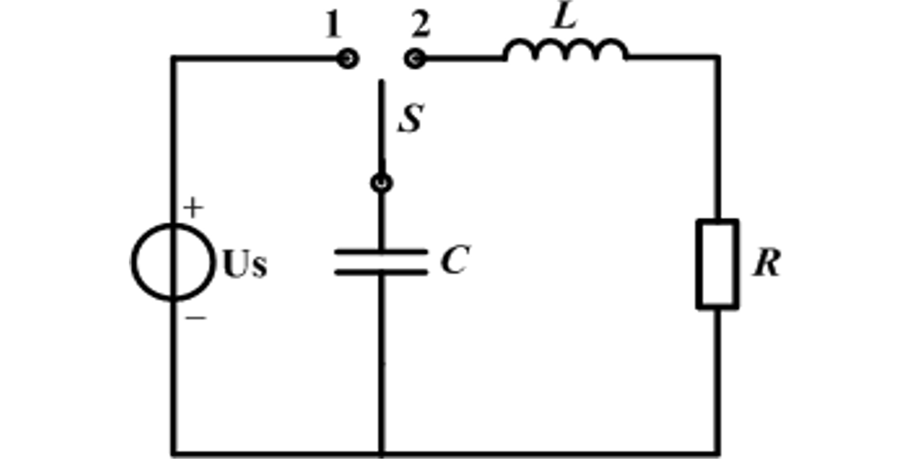

# Matlab在电路分析中的应用

Owner: 柒柒在笔记
课程: Matlab

## **一、实验名称**

### Matlab在电路分析中的应用

## **二、实验内容**

1. **求解二阶动态电路的零输入相应**
    1. 如右图所示二阶动态电路，Us=1V，*R*=20Ω，*C*=0.02F，*L*=0.5H，开关*S*处于1。*t*=0时，*S*闭合到2，求电容电压*u*c(*t*)和电感电流*i*L(*t*) (*t*≥0)，画出它们的曲线
    
    
    
2. **利用网孔电流法求解电路**
    1. 如下图所示电路，
    
    
    
3. **低通滤波器的分析**
    1. 如下图所示二阶低通电路，*R*=3Ω，*C*=0.1F，*L*=2H，*U*1为输入，*U*2为输出，画出其幅频和相频特性曲线，从图中确定截止频率
    
    
    

## **三、实验步骤**

1. **求解二阶动态电路的零输入相应**
    1. 定义常量和初始条件：电感L=0.5H, 电阻R=20Ω, 电容C=0.02F, 初始电压uc0=1V, 初始电流iL0=0A。
    2. 计算阻尼系数alpha和自然频率wn，使用电阻、电感、电容的值。
    3. 计算电路的两个根pl和p2。这两个根表示电路的阻尼和震荡特性。
    4. 定义时间间隔dt=0.01s，并产生在0至1秒内的时间向量t。
    5. 设置传递函数的分子和分母。用于将电路的传递函数转化为时域表达式。
    6. 使用residue函数，得到部分分数表达式的残数r和极点p。
    7. 计算在不同时刻的电容电压ucn和电感电流iLn。计算电流时，使用差分方法得到电流的近似值。
    8. 画出电容电压和电感电流图像。要使用不同的子图表示电容电压和电感电流。
2. **利用网孔电流法求解电路**
    1. 定义复数电流源I1和I2。使用复数表示法表达它们的幅度和相位。
    2. 定义三个阻抗元素，每个元素由一个电阻和一个电抗组成。首先单独定义各自的电阻和电抗，然后利用并联公式计算总阻抗。
    3. 建立两个复数电压符号U1和U2，这是待求解的电压。
    4. 根据基尔霍夫电流定律建立两个电流方程。这是包含了U1和U2的两个电流平衡方程。
    5. 使用解方程函数求解电压U1和U2的值。这样就得到了我们需要的电压值。
    6. 绘制复数平面图，展示电压U1和U2的实部和虚部。两个子图分别表示两个电压的情况。
3. **低通滤波器的分析**
    1. 定义频率范围w，从10^0到10^2共100个点，形成对数空间。
    2. 定义电阻r，电容阻抗c以及电感阻抗l的值。
    3. 电阻和电容阻抗并联得到z12，再与电感阻抗z3形成分压网络，从而得到频率响应函数h。
    4. 计算频率响应函数的增益(gain)，采用对数尺度换算为分贝单位。
    5. 在增益曲线中寻找最接近-3dB的点，并标出该频率点（f_3dB）。
    6. 利用子图(subplot)功能，分别画出幅频响应和相频响应。在幅频曲线图中，添加了-3dB点的标注。
    7. 为两个子图添加了标签，标题以及网格。子图一是增益/频率的函数图，展示了系统的增益随频率变化情况；子图二是相位/频率的函数图，展示了系统的相位随频率变化情况。

## **四、实验结果**

1. **求解二阶动态电路的零输入相应**
    
    
    
2. **利用网孔电流法求解电路**
    
    
    
3. **低通滤波器的分析**
    
    
    

## **五、附录**

1. **求解二阶动态电路的零输入相应**
    
    ```matlab
    L=0.5; R=20; C=0.02;uc0=1;
    iL0=0;
    alpha=R/2/L;
    wn=sqrt (1/(L*C));
    pl =-alpha+sqrt (alpha^2-wn^2);
    p2 =-alpha-sqrt (alpha^2-wn^2);
    dt=0.01;
    t=0:dt:1;
    
    num=[uc0,R/L*uc0+iL0/C];
    den=[1,R/L,1/(L*C)];
    [r,p,k]=residue(num,den);
    ucn=r(1)*exp(p(1)*t)+r(2)*exp(p(2)*t);
    iLn=C*diff(ucn)/dt;
    figure
    
    subplot(2,1,1),
    plot(t,ucn),grid
    title('电容电压随时间变化图')
    xlabel('时间 (s)')
    ylabel('电容电压 (V)')
    
    subplot(2,1,2)
    plot(t(1:end-1), iLn), grid
    title('电感电流随时间变化图')
    xlabel('时间 (s)')
    ylabel('电感电流 (A)')
    ```
    
2. **利用网孔电流法求解电路**
    
    ```matlab
    I1 = 1 * exp(1j * 0); 
    I2 = 0.5 * exp(1j * (-pi/2)); 
    
    Z1_R = 5; 
    Z1_C = -1j * 10;
    Z1_total = 1 / ((1/Z1_R) + (1/Z1_C));
    
    Z2_R = 10; 
    Z2_L = 1j * 5;
    Z2_total = 1 / ((1/Z2_R) + (1/Z2_L));
    
    Z3_C=-1j * 5;
    Z3_L = 1j * 10;
    Z3_total = 1 / ((1/Z3_C) + (1/Z3_L));
    
    syms U1 U2
    
    eq1 = U1/Z1_total + (U1-U2)/Z3_total == I1;
    eq2 = (U2-U1)/Z3_total + (U2)/Z2_total == I2;
    
    [U1, U2] = solve(eq1, eq2);
    
    figure;
    subplot(2,1,1);
    plot([0, real(U1)], [0, imag(U1)], '-o');
    axis equal;
    xlabel('Real');
    ylabel('Imaginary');
    title('V1');
    
    subplot(2,1,2);
    plot([0, real(U2)], [0, imag(U2)], '-o');
    axis equal;
    xlabel('Real');
    ylabel('Imaginary');
    title('V2');
    ```
    
3. **低通滤波器的分析**
    
    ```matlab
    clear;
    format compact;
    w = logspace(0, 2, 100); 
    r = 3;
    c = -10j ./ w;
    l = 2j .* w;
    z12 = r * c ./ (r + c);
    z3 = 2j .* w;
    h = z12 ./ (z12 + z3);
    gain = 20 * log10(abs(h));
    
    % 寻找最接近-3dB的点
    [~, indx] = min(abs(gain + 3));
    f_3dB = w(indx);
    
    figure;
    subplot(2, 1, 1);
    semilogx(w, gain);
    hold on;
    semilogx(f_3dB, -3, 'ro'); % 在图上标出-3dB点
    hold off;
    xlabel('频率 (rad/s)');
    ylabel('增益 (dB)');
    title('幅频响应');
    grid on;
    
    subplot(2, 1, 2);
    semilogx(w, angle(h) * 180/pi); 
    xlabel('频率 (rad/s)');
    ylabel('相位 (度)');
    title('相频响应');
    grid on;
    ```