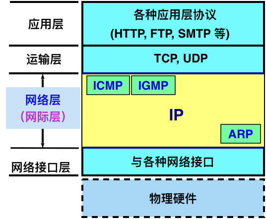
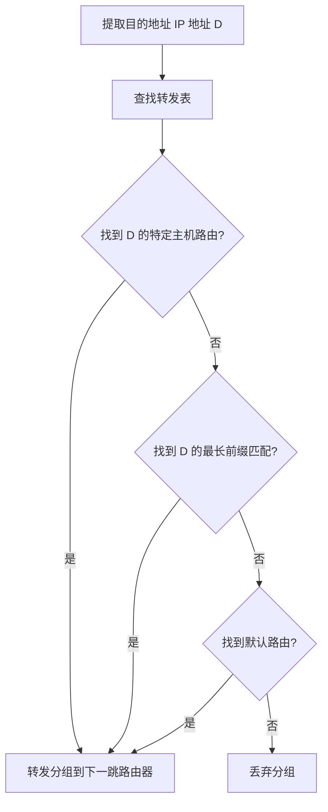

# 计网复习

Owner: 柒柒在笔记
课程: 计算机网络

# 第二章 物理层

## 2.1 物理层的基本概念

### 物理层功能

- 在连接各种计算机的传输媒体上传输数据比特流。
- 屏蔽不同传输媒体和通信手段的差异，为数据链路层提供统一的数据传输服务。
- 物理层协议包括数据终端设备（DTE）和数据电路终结设备（DCE）之间的约定。

### 物理层特性

- **机械特性**：定义接口使用的连接器的形状、尺寸、引线数目和排列、固定和锁定装置等。
- **电气特性**：定义接口电缆各条线上的电压范围。
- **功能特性**：定义线缆上不同电平的电压意义。
- **过程特性**：定义不同功能事件的出现顺序。

## 2.2 数据通信的基础知识

### 数据通信系统的模型

源系统、传输系统和目的系统三部分。

### 数字通信与模拟通信

- 模拟通信：以模拟信号传送消息。
- 数字通信：以数字信号传送消息，信号在传输过程中可以相互转换（A/D和D/A）。

### 传输方式

- **串行传输**：数据按位依次传输，线路利用率高，适用于远距离传输。
- **并行传输**：数据在多个信道上同时传输，适用于短距离高传输速率。

### 信道的基本概念

- **单向通信**：只能有一个方向的通信，没有反方向的交互。
- **双向交替通信**：双向交替发送信息，不能同时发送。
- **双向同时通信**：双向可以同时发送和接收信息。

## 2.3 物理层下面的传输媒体

### 导引型传输媒体

- **双绞线**：由两根互相绝缘的铜导线并排放置然后绞合。分为无屏蔽双绞线（UTP）和屏蔽双绞线（STP）。
- **同轴电缆**：由内导体、绝缘层、外导体屏蔽层和保护塑料外层组成，抗干扰特性好。
- **光纤**：通过传递光脉冲进行通信，传输带宽大，适用于长距离传输。

### 非导引型传输媒体

- **无线电波**：在自由空间中传播。
- **微波通信**：在空间主要是直线传播，传播距离受到限制，常用于基站和手机之间的通信。
- **卫星通信**：利用人造地球卫星作为中继站，传播时延大，覆盖范围广。

## 2.4 信道复用技术

- **频分复用（FDM）**：将带宽分为多份，用户在固定频带内进行通信。
- **时分复用（TDM）**：将时间划分为段，每个用户在每个时间段内占用固定的时隙。
- **统计时分复用（STDM）**：动态分配时隙，提高线路利用率。
- **波分复用（WDM）**：在光纤中传输多个光载波信号。
- **码分复用（CDM）**：所有用户在同一时间使用同一频带，通过不同的编码区分信号。

## 2.5 数字传输系统

### 基带传输和频带传输

- **基带传输**：信号未经载波调制，直接传输。
- **频带传输**：通过调制将信号频谱搬移到较高频段，适应信道特性。

## 2.6 宽带接入技术

- **ADSL、FTTH**等宽带接入技术，通过不同的方式为用户提供高速的互联网连接。

# 第三章 数据链路层

## 3.1 使用点对点信道的数据链路层

### 3.1.1 数据链路和帧

- **链路**：无源的点到点的物理线路段，中间没有其他交换节点。
- **数据链路**：在链路上加上控制数据传输的协议的硬件和软件。

### 3.1.2 三个基本问题

1. **封装成帧**：在一段数据的前后分别添加首部和尾部，构成一个帧。
2. **透明传输**：无论发送什么样的比特组合的数据，这些数据都能够按照原样没有差错地通过数据链路层。
3. **差错控制**：检测和纠正传输错误，常用循环冗余检验（CRC）。

## 3.2 点对点协议 PPP

### 3.2.1 PPP 协议的特点

- 简单
- 封装成帧
- 透明性
- 支持多种网络层协议
- 支持多种类型链路
- 差错检测

### 3.2.2 PPP 协议的帧格式

- **首部**：标志字段、地址字段、控制字段、协议字段。
- **信息字段**：IP 数据报或其他数据。
- **尾部**：帧校验序列（FCS）。

### 3.2.3 PPP 协议的工作状态

- 链路初始化
- 链路配置
- 鉴别
- 网络层协议配置
- 链路释放

## 3.3 使用广播信道的数据链路层

### 3.3.1 局域网的数据链路层

- 局域网特点：一个单位拥有，地理范围和站点数目有限。
- 优点：广播功能、便于扩展、提高可靠性。

### 3.3.2 CSMA/CD 协议

- **载波监听多点接入/碰撞检测（CSMA/CD）**：减少碰撞发生概率。
- **基本工作流程**：
    - 侦听信道是否空闲
    - 开始发送并检测碰撞
    - 碰撞检测后停止发送，等待随机时间重发。

### 3.3.3 使用集线器的星形拓扑

- **传统以太网**：同轴电缆，总线拓扑。
- **现代以太网**：双绞线，星形拓扑，集线器。

### 3.3.4 以太网的信道利用率

- 信道利用率受碰撞影响，需要减少τ与T0之比。

### 3.3.5 以太网的 MAC 层

- **MAC 地址**：48位全球地址，固化在适配器ROM中。
- **MAC 帧格式**：以太网 V2 和 IEEE 802.3 标准。

## 3.4 扩展的以太网

### 3.4.1 在物理层扩展以太网

- 使用光纤和光纤调制解调器扩展以太网。
- 使用集线器扩展以太网。

### 3.4.2 在数据链路层扩展以太网

- 使用网桥和以太网交换机。

### 3.4.3 虚拟局域网（VLAN）

- 通过逻辑分割网络，提高管理和安全性。

## 3.5 高速以太网

- 介绍千兆以太网和万兆以太网的标准和实现方式。

# 第四章 网络层

## 4.1 基本概念

### 4.1.1 网络层提供的两种服务

- 虚电路服务
- 数据报服务

| **对比的方面** | **虚电路服务** | **数据报服务** |
| --- | --- | --- |
| **思路** | 可靠通信应当由网络来保证 | 可靠通信应当由用户主机来保证 |
| **连接的建立** | 必须有 | 不需要 |
| **终点地址** | 仅在连接建立阶段使用，每个分组使用短的虚电路号 | 每个分组都有终点的完整地址 |
| **分组的转发** | 属于同一条虚电路的分组均按照同一路由进行转发 | 每个分组独立选择路由进行转发 |
| **当结点出故障时** | 所有通过出故障的结点的虚电路均不能工作 | 出故障的结点可能会丢失分组，一些路由可能会发生变化 |
| **分组的顺序** | 总是按发送顺序到达终点 | 到达终点时不一定按发送顺序 |
| **端到端的差错处理和流量控制** | 可以由网络负责，也可以由用户主机负责 | 由用户主机负责 |

### 4.1.2 网络层的两个层面

- 控制层面
    - 根据路由选择协议所用的路由算法计算路由，创建出本路由器的路由表。
    - 许多路由器协同动作。
    - 采用软件计算，慢。
- 数据层面
    - **路**由器根据本路由器生成的转发表，把收到的分组从查找到的对应接口转发出去。
    - 独立工作。
    - 采用硬件进行转发，快。



## 4.2 **网际协议IP**

### 4.2.1 虚拟互联网络


### 4.2.2 IP地址

**本部分重点：**

1. **IP 地址及其表示方法**
    1. 使用点分十进制表示（32位）
    2. 采用二级结构模式：IP地址：{<网络号>,<主机位>}
2. **分类的 IP 地址**
    1. A类：8+24（0开头<128）
    2. B类：16+16（10.  128<X<191）
    3. C类：24+8（110开头 192<x<223）
    4. D类：1110+多播地址
    5. E类：1111+保留
    
    | 网络号 | 主机号 | 源地址使用 | 目的地址使用 | 代表的意思 |
    | --- | --- | --- | --- | --- |
    | 0 | 0 | 可以 | 不可 | 在本网络上主机号为0的主机 |
    | 0 | X | 可以 | 不可 | 在本网络上主机号为X的主机 |
    | Y | 全1 | 不可 | 可以 | 对网络号为Y的网络上的所有主机进行广播 |
    | 127 | 非全0或全1的任何数 | 可以 | 可以 | 用于本地软件环回测试 |
3. **无分类编址 CIDR**
    1. 网络前缀：任意位数
    2. 地址块：网络前缀相同的所有连续地址块
    3. 地址编码（子网掩码） : 一连串 1 和接着的一连串 0 组成，而 1 的个数就是网络前缀的长度。
        
        
        | IP 地址 | 说明 |
        | --- | --- |
        | 128.14.35.7/20 | 是 IP 地址，同时指明了网络前缀为 20 位。该地址是 128.14.32.0/20 地址块中的一个地址。 |
        | 128.14.32.0/20 | 是包含有多个 IP 地址的地址块，同时也是这个地址块中主机号为全 0 的 IP 地址。 |
        | 128.14.35.7 | 是 IP 地址，但未指明网络前缀长度，不知道其网络地址。 |
        | 128.14.32.0 | 不能指明一个网络地址，因为无法知道网络前缀是多少。 |
    4. CIDR记法：a.b.c.d/n
        
        
        | 网络前缀长度 | 点分十进制 | 说明 |
        | --- | --- | --- |
        | /32 | 255.255.255.255 | 就是一个 IP 地址。这个特殊地址用于主机路由 |
        | /31 | 255.255.255.254 | 只有两个 IP 地址，其主机号分别为 0 和 1。这个地址块用于点对点链路 |
        | /0 | 0.0.0.0 | 同时 IP 地址也是全 0，即 0.0.0.0/0。用于默认路由 |
    5. 网络地址 = (二进制的 IP 地址) AND (地址掩码)
    6. 路由聚合
4. **IP 地址的特点**
    1. 每个IP都由网络前缀和主机号两个部分组成
    2. IP地址是标志一台主机（路由器）和一条链路的接口
    3. 转发器或交换机连接起来的若干个局域网依然是一个网络
    4. 在IP地址中，所有分配到网络前缀的网络都是平等的

### 4.2.3 IP地址和MAC地址

| IP地址 | MAC地址 |
| --- | --- |
| 虚拟地址，软件地址，逻辑地址 | 固化在网卡的ROM中，硬件地址，无力地址 |
| 网络层和以上各层使用 | 数据链路层使用 |
| 放在IP数据报的首部 | 放在MAC帧的首部 |

### 4.2.4 地址解析协议ARP

作用：由IP地址找到MAC地址

1. ARP高速缓存
    1. 存放IP地址到MAC地址到映射表
    2. 映射表动态更新
2. ARP工作
    
    ```mermaid
    graph TD
        A[本局域网上]
        B[在其 ARP 高速缓存查找主机 B 的 IP 地址]
        C{找到?}
        D[取出 MAC 地址]
        E[将该 MAC 地址写入 MAC 帧的目的地址]
        F[发送该 MAC 帧]
        G[自动运行 ARP，找出主机 B 的 MAC 地址，更新 ARP 高速缓存]
    
        A --> B --> C
        C -->|是| D --> E --> F
        C -->|否| G --> B
    
    ```
    
3. 查找IP对应的MAC
4. 使用情况
    1. 主机发出，局域网内出使用
    2. 主机发出，跨网络使用
    3. 路由器发出，发到所属局域网内
    4. 路由器发出，发到其他网络上

### 4.2.5 IP数据报的格式

- **固定部分**
    1. **版本（4位）**：指明IP协议的版本（例如IPv4或IPv6）。
    2. **首部长度（4位）**：表示首部的长度，以32位字为单位。
    3. **区分服务（8位）**：用于区分不同类型的服务，现通常用于表示服务质量（QoS）。
    4. **总长度（16位）**：指整个IP数据报的长度，包括首部和数据部分，单位是字节。最多65536字节
    5. **标识（16位）：**用于标识数据报，通常在分片时使用，每个分片的数据报都有相同的标识。
    6. **标志（3位）：**用于控制和标记数据报的分片：
        1. 第1位保留位，必须为0。
        2. 第2位为“不分片”标志（DF），设置为1时，表示不允许分片。
        3. 第3位为“更多分片”标志（MF），除了最后一个分片，其余分片都设置为1。
    7. **片偏移（13位）**
        1. 指明分片在原始数据报中的相对位置，以8字节为单位
    8. **生存时间（8位）**
        1. TTL（Time to Live）字段，表示数据报在网络中的生存时间，每经过一个路由器时，TTL减1，减到0时，数据报被丢弃。
    9. **协议（8位）**
        1. 指明数据报携带的数据使用的协议，例如TCP（6）或UDP（17）
    10. **首部校验和（16位）**
        1. 用于检验IP数据报首部的完整性。
        2. **初始化校验和字段**：
            - 在计算校验和时，将IP首部的校验和字段（Header Checksum）初始化为0。
        3. **将IP首部按16位分组**：
            - 将IP首部数据（以字节为单位）按照16位（2字节）为一个单元进行分组。IP首部的长度总是偶数个字节，所以每次正好分成16位的多个单元。
        4. **进行16位的二进制反码求和**：
            - 将所有16位单元的值进行累加求和。如果在求和过程中产生了进位（即超过16位的值），需要将高位的进位加到结果的低16位上。此过程可能需要重复进行多次，直到没有进位为止。
        5. **取反码**：
            - 将求和结果的每一位进行反码操作，即将0变为1，1变为0。得到的结果即为校验和。
        6. **填入校验和字段**：
            - 将计算出的校验和填入IP首部的校验和字段。
    11. **源地址（32位）**
    12. **目的地址（32位）**
    13. **可选字段（长度可变）**
        
        可以包含各种选项，例如安全性、时间戳、记录路径等。长度不固定，以32位字为单位，并在需要时填充。
        


## 4.3 IP转发分组

### 4.3.1 基于终点的转发

转发表中存储的是（目的网络地址，下一跳地址）而不是（目的地址，下一跳地址）

可以节省存储子网掩码的空间

### 4.3.2 最长前缀匹配

当路由器转发表中同时存在多个符合要求的条目的时候（即目标ip & 子网掩码 = 目的网络地址），选择前缀最长的进行转发（即子网掩码最长的），**可以把前缀最长的排在转发表的第 1 行，以加快查表**

转发表中特殊路由：

- 主机路由：a:b:c:d/32
    
    放在路由表最前面
    
- 默认路由: 0.0.0.0/0
    
    表示不管分组的最终目的网络在哪里，都交给指定路由器处理
    



### 4.3.3 使用二叉线索查找转发

以每一层对应IP地址中的一位，最高32层，可以使用唯一前缀构造二叉树

## 4.4 ICMP协议

**ICMP (Internet Control Message Protocol) 允许主机或路由器报告差错情况和提供有关异常情况的报告**


### 4.4.1 ICMP报文的种类

| 类型 | 说明 |
| --- | --- |
| 3 | 终点不可达 |
| 11 | 时间超过 |
| 12 | 参数问题 |
| 5 | 改变路由 (Redirect) |
| 8/0 | 回送 (Echo) 请求或回答 |
| 13/14 | 时间戳 (Timestamp) 请求或回答 |
1. 差错报告报文
    1. 当路由器或主机在处理IP数据报时检测到错误（例如，目的地不可达、时间超时等），会生成一个ICMP差错报告报文。
    2. 这个报文包含原始IP数据报的首部和前8字节的数据部分，并将其作为新的IP数据报的有效负载发送回原始数据报的源地址
        
        
        
2. 询问报文
    1. 回送请求与回答
        1. 用于测试目的站是否可达
    2. 时间戳请求和回答
        1. 用于时钟同步与测量

### 4.4.2 ICMP的应用举例

- ping
- Traceroute/tracert

## 4.5 IPV6

主要变化：

1. 更大的地址空间：128位
2. 拓展的地址层次结构
3. 灵活的首部结构
4. 改进的选项
5. 允许协议继续扩充
6. 支持即插即用
7. 支持资源预分配
8. 首部改为8字节对齐

**由两大部分组成：**

1. **基本首部 (base header)**
2. **有效载荷 (payload)。有效载荷也称为净负荷。有效载荷允许有零个或多个扩展首部 (extension header)，再后面是数据部分。**


### 4.5.1 IPv6的基本首部

固定40字节，称为基本首部，仅有八个字段

1. **版本 (4位)**：
    - 表示IP协议的版本号。对于IPv6，这个值为6。
2. **通信量类 (8位)**：
    1. 用于区分不同类型的流量，提供流量优先级和服务质量（QoS）。
3. 流标号（20位）：
    1. 没太看懂干啥用的
    2. **“流”是互联网络上从特定源点到特定终点的一系列数据报， “流”所经过的路径上的路由器都保证指明的服务质量。所有属于同一个流的数据报都具有同样的流标号。** 
4. **有效载荷长度 (16位)**：
    - 表示IPv6数据包中数据部分的长度（不包括基本首部）。单位是字节，最大值为65535字节。
5. **下一个首部 (8位)**：
    - 指示紧随基本首部的扩展首部类型或上层协议类型。例如，值为6表示TCP协议，值为17表示UDP协议。
6. **跳数限制 (8位)**：
    - 类似于IPv4中的TTL字段，用于限制数据包在网络中的最大跳数。每经过一个路由器，该值减1，减到0时，数据包被丢弃。
7. **源地址 (128位)**：
    - 表示发送方的IPv6地址。
8. **目的地址 (128位)**：
    - 表示接收方的IPv6地址。


六种拓展首部：

- **逐跳选项**
- **路由选择**
- **分片**
- **鉴别**
- **封装安全有效载荷**
- **目的站选项**

### 4.5.2 IPv6的地址

| 地址类型 | 二进制前缀 | IPv6记法 |
| --- | --- | --- |
| 未指明地址 | 00…0（128位），仅此一个 | ::/128 |
| 环回地址 | 00…1（128位），仅此一个 | ::1/128 |
| 多播地址 | 11111111（8位），功能和IPv4的一样 | FF00::/8 |
| 本地链路单播地址 | 1111111010（10位），未连接到互联网 | FE80::/10 |
| 全球单播地址 | 除上述四种外，所有其他的二进制前缀 |  |

可以划分为三种类型：

1. 单播
    1. 传统点对点
    
    
    
2. 多播
    1. 一点对多点
3. 任播
    1. 只交付给距离最近的一个

使用冒号十六进制记法

- **在 IPv6 中，每个地址占 128 位，地址空间大于 3.4** × **1038 。**
- **使用冒号十六进制记法(colon hexadecimal notation, 简写为 colon hex)：16 位的值用十六进制值表示，各值之间用冒号分隔。**
    - 零压缩：把一连串的0用一对冒号替代
    - 点分十进制记法的后缀
        - IPv4地址可以嵌入到IPv6地址中，通过::符号来简化表示。例如，0:0:0:0:0:0:128.10.2.1可以简化为::128.10.2.1。
        - 这种转换通常用于在IPv6环境中处理IPv4地址
    
    CIDR记法依然有效
    

### 4.5.3 从v4到v6

**两种过渡策略：**

1. **使用双协议栈**
2. **使用隧道技术**

### 4.5.4 ICMPv6

1. 差错报文
2. 信息报文
3. 邻站发现报文
4. 组成员关系报文

## 4.6 互联网的路由选择协议

### 4.6.1 基本概念

属于网络层控制层面，把整个互联网划分为许多较小的自治系统 AS，采用分层次的路由选择协议

自治系统 AS ：是在单一技术管理下的许多网络、IP地址以及路由器，而这些路由器使用一种自治系统内部的路由选择协议和共同的度量。每一个 AS 对其他 AS 表现出的是一个单一的和一致的路由选择策略。

分为 2 个层次：

- 自治系统之间的路由选择 或 域间路由选择 (interdomain routing)；
    - BGP-4
- 自治系统内部的路由选择 或 域内路由选择 (intradomain routing)；
    - RIP OSPF

### 4.6.2 内部网关协议RIP

- 基本概念
    
    路由信息协议 RIP (Routing Information Protocol) 是一种分布式的、基于距离向量的路由选择协议，要求网络中的每个路由器都要维护从它自己到其他每一个目的网络的距离记录
    
    **RIP对距离的相关定义**
    
    - 路由器到直接连接的网络的距离 = 1。
    - 路由器到非直接连接的网络的距离 = 所经过的路由器数 + 1。
    - RIP 协议中的“距离”也称为“跳数”(hop count)，每经过一个路由器，跳数就加 1。
    - 好路由 = “距离短”的路由。最佳路由 = “距离最短”的路由。
    - 一条路径最多只能包含 15 个路由器。
    - “距离”的最大值为 16 时即相当于不可达。
    - RIP 不能在两个网络之间同时使用多条路由，只选择距离最短”的路由。
    
    **RIP的特点：**
    
    1. 仅和相邻路由器交换信息。
    2. 交换的信息是当前本路由器所知道的全部信息，即自己的路由表。
    3. 按固定时间间隔交换路由信息，例如，每隔 30 秒。当网络拓扑发生变化时，路由器也及时向相邻路由器通告拓扑变化后的路由信息。
- 路由表的建立
    - 路由器在刚刚开始工作时，路由表是空的。
    - 然后，得到直接连接的网络的距离（此距离定义为 1）。
    - 之后，每一个路由器也只和数目非常有限的相邻路由器交换并更新路由信息。
    - 经过若干次更新后，所有的路由器最终都会知道到达本自治系统中任何一个网络的最短距离和下一跳路由器的地址。
    - RIP 协议的收敛 (convergence) 过程较快。“收敛”就是在自治系统中所有的结点都得到正确的路由选择信息的过程。
- 距离向量算法
    
    通过同步各路由器之间的路由表实现最短路径
    
    **1. 初始状态**
    
    - 每个路由器初始化其路由表，包含直接相连的网络和到这些网络的距离（初始距离为1）。
    
    **2. 定期广播**
    
    - 每个路由器定期（通常为30秒）向其所有相邻路由器广播其整个路由表。这些广播称为RIP更新报文。
    
    **3. 接收更新报文**
    
    - 路由器接收到来自相邻路由器的RIP更新报文后，进行处理和更新。
    
    **4. 路由表更新**
    
    对接收到的每一个更新项目，执行以下操作：
    
    1. **修改RIP报文中的所有项目**：
        - 将“下一跳”字段中的地址都改为发送该报文的相邻路由器的地址（记为X），并将所有的“距离”字段的值加1。这反映了通过相邻路由器X到达目标网络的距离增加了1。
    2. **对修改后的RIP报文中的每一个项目，重复以下步骤**：
        - **检查路由表中是否有目的网络N**：
            - 如果没有目的网络N，则把该项目添加到路由表中。这表示发现了一条新的路由。
            - 如果有目的网络N，继续下一步。
        - **检查路由表中网络N的下一跳路由器是否为X**：
            - 如果是，则用收到的项目替换原路由表中的项目。这表示路由信息更新，可能是距离发生变化。
            - 如果不是，继续下一步。
        - **检查收到项目中的距离是否小于路由表中的距离**：
            - 如果小于，则用收到项目更新原路由表中的项目。这表示发现了一条更短的路径。
            - 如果不小于，则什么也不做。
    3. **处理不可达路由器**：
        - 如果3分钟内没有收到来自相邻路由器的更新路由表，则把此相邻路由器记为不可达路由器，将距离置为16，表示该路由器不可达。这样可以防止路由器因为无法通信而永久保留旧的、不正确的路由信息。
    
    **5. 传播变化**
    
    - 更新后的路由信息再次通过RIP更新报文广播给所有相邻路由器，确保整个网络的路由信息一致。
- 坏消息传得慢
    
    网络故障需要较久的时间传递
    
- RIP2报文结构
    
    **1. 首部**
    
    - **命令（Command）**：1个字节
        - 指示RIP报文的类型。常见的命令类型包括请求（1）和响应（2）。
    - **版本（Version）**：1个字节
        - 指示RIP协议的版本。对于RIP2，版本号为2。
    - **必须为0（Zero）**：2个字节
        - 保留字段，必须设置为0。
    
    **2. 路由部分**
    
    每个路由信息块占20字节，包括以下字段：
    
    - **地址族标识符（Address Family Identifier）**：2个字节
        - 指示地址的类型。例如，对于IPv4地址，值为2。
    - **路由标记（Route Tag）**：2个字节
        - 用于区分内部路由和外部路由，主要用于支持无类别域间路由（CIDR）。
        - 填自治系统AS的号码
    - **网络地址（IP Address）**：4个字节
        - 表示目标网络的IP地址。
    - **子网掩码（Subnet Mask）**：4个字节
        - 指示网络的子网掩码，用于支持无类别域间路由（CIDR）。
    - **下一跳路由器地址（Next Hop）**：4个字节
        - 表示到达目标网络的下一跳路由器的IP地址。
    - **距离（Metric）**：4个字节
        - 表示到目标网络的距离，范围为1到16，其中16表示网络不可达。
    
    **3. 数据报封装**
    
    - RIP数据报被封装在UDP用户数据报中，使用UDP端口520进行传输。
    - UDP数据报再被封装在IP数据报中进行传输。
    - 最长为4+20*25=504个字节
    
    
    

### 4.6.2 内部网关协议 OSPF

- 相关概念
    
    OSPF把一个自治系统划分成两种不同的区域
    
    - 主干系统
        - 主干路由器BR
    - 其他下层区域
        - 区域边界路由去ABR
    - 优点：
        - 减少了整个网络上的通信量。
        - 减少了需要维护的状态数量。
    - 缺点：
        - 交换信息的种类增多了。
        - 使 OSPF 协议更加复杂了。
    
    特点：
    
    - 对于不同类型的业务可计算出不同的路由。
    - 可实现多路径间的负载均衡（load balancing）。
    - 所有在 OSPF 路由器之间交换的分组都具有鉴别的功能。
    - 支持可变长度的子网划分和无分类编址 CIDR。
    - 32 位的序号，序号越大状态就越新。全部序号空间在 600 年内不会产生重复号。
    
    ---
    
    用洪泛法 (flooding)，向本自治系统中所有路由器发送信息。
    
    - 发送的信息是与本路由器相邻的所有路由器的链路状态，但这只是路由器所知道的部分信息。
        - 链路状态：说明本路由器都和哪些路由器相邻，以及该链路的度量 (metric)。
    - 当链路状态发生变化或每隔一段时间（如30分钟），路由器才用洪泛法向所有路由器发送此信息。
    
    ---
    
    使用链路状态数据库构建路由表：
    
    - 全网的拓扑结构图。
    - 在全网范围内是一致的（这称为链路状态数据库的同步）。
    - 每个路由器使用链路状态数据库中的数据构造自己的路由表（例如，使用Dijkstra的最短路径路由算法）。
    - 每个路由器都能建立
- 分组模型与数据报格式
    
    **1. OSPF 分组首部(24字节）**
    
    OSPF分组首部紧随IP数据报首部之后，包含以下字段：
    
    - **版本（Version）**：8位
        - 指明OSPF协议的版本号，当前版本为2。
    - **类型（Type）**：8位
        - 指明OSPF分组的类型，共有5种类型：
            - 类型1：问候 (Hello) 分组。
            - 类型2：数据库描述 (Database Description) 分组
            - 类型3：链路状态请求 (Link State Request) 分组
            - 类型4：链路状态更新 (Link State Update) 分组。
            - 类型5：链路状态确认 (Link State Acknowledgment)分组。
    - **分组长度（Packet Length）**：16位
        - 指明整个OSPF分组的长度，包括OSPF首部和OSPF数据部分。
    - **路由器标识符（Router ID）**：32位
        - 唯一标识发送此OSPF分组的路由器。
    - **区域标识符（Area ID）**：32位
        - 指明OSPF分组所属的区域。
    - **校验和（Checksum）**：16位
        - 用于检验OSPF分组在传输过程中是否出错。
    - **鉴别类型（Authentication Type）**：16位
        - 指明鉴别字段的类型，常见的有无鉴别（0）、简单口令（1）和加密鉴别（2）。
    - **鉴别字段（Authentication）**：64位
        - 用于鉴别OSPF分组的合法性。
    
    **2. OSPF 数据部分**
    
    OSPF数据部分的内容取决于OSPF分组的类型。以下是不同类型的OSPF分组数据部分的内容概述：
    
    - **Hello 分组（Type 1）**：
        - 包含用于建立和维护邻接关系的信息，如Hello间隔时间、死区时间、邻居列表等。
    - **Database Description 分组（Type 2）**：
        - 包含链路状态数据库的摘要信息，用于描述链路状态数据库的内容。
    - **Link-State Request 分组（Type 3）**：
        - 用于请求特定的链路状态信息。
    - **Link-State Update 分组（Type 4）**：
        - 包含一个或多个链路状态公告（LSA），用于更新邻居的链路状态数据库。
    - **Link-State Acknowledgment 分组（Type 5）**：
        - 用于确认收到的链路状态公告。
- 工作过程
    
    **1. 确定邻站可达**
    
    - **发送Hello报文**：
        - 每个OSPF路由器周期性地发送Hello报文，以确定其邻居是否可达。默认情况下，Hello报文每10秒发送一次。
        - Hello报文包含OSPF路由器的ID、Hello间隔时间和死区时间等信息。
    - **接收Hello报文**：
        - 路由器向邻居发送Hello报文后，如果在死区时间（通常为40秒）内没有收到邻居的Hello报文，则认为该邻居不可达，并从邻居列表中删除该邻居。
    
    **2. 同步链路状态数据库**
    
    - **发送数据库描述报文**：
        - 确定邻居可达后，路由器之间交换数据库描述（DBD）报文，描述各自的链路状态数据库（LSDB）的摘要信息。
        - 通过这些报文，路由器可以确定哪些链路状态信息（LSA）需要更新。
    - **发送链路状态请求报文**：
        - 路由器根据接收到的数据库描述报文，发送链路状态请求（LSR）报文，请求邻居发送缺失的LSA。
    - **接收链路状态更新报文**：
        - 邻居收到链路状态请求报文后，发送链路状态更新（LSU）报文，包含请求的LSA。
        - 路由器接收到LSU报文后，更新其链路状态数据库，并发送链路状态确认（LSAck）报文确认接收。
    
    **3. 更新链路状态**
    
    - **可靠的洪泛法**：
        - OSPF使用可靠的洪泛法来传播链路状态变化。当网络拓扑发生变化时，路由器生成新的LSA并进行洪泛。
        - LSA通过LSU报文传播到所有OSPF路由器，确保所有路由器的链路状态数据库一致。

### 4.6.4 外部网关协议 BGP

- 基本内容
    - **用于自治系统 AS 之间的路由选择。**
    - **只能是力求选择出一条能够到达目的网络且比较好的路由（不能兜圈子），而并非要计算出一条最佳路由。**
        1. **互联网的规模太大，使得自治系统AS之间路由选择非常困难。**
        2. **自治系统AS之间的路由选择必须考虑有关策略。**
    - **采用了路径向量 (path vector) 路由选择协议。**
    
    ---
    
    BGP发言者（BGP Specker）：每个AS的边界路由器为BGP发言者
    
    ---
    
    BGP协议族的区分
    
    - 在 AS 之间， BGP 发言者在半永久性 TCP 连接（端口号为179）上建立 BGP 会话(session)。这种连接又称为 eBGP 连接。
    - 在 AS 内部，任何相互通信的两个路由器之间必须有一个逻辑连接（也使用 TCP 连接）。AS 内部所有的路由器之间的通信是全连通的。这种连接常称为 iBGP 连接。
    - 在AS内部，内部网关协议IGP
    
    eBGP与iBGP其实是一个相同的BGP协议，知识在通报前缀采用的规则不同：
    
    - 在 eBGP 连接的对等端得知的前缀信息，可以通报给一个 iBGP 连接的对等端。反过来也是可以的。
    - 但从 iBGP 连接的对等端得知的前缀信息，则不能够通报给另一个 iBGP 连接的对等端。
    - 即IBGP协议的前缀信息不能再传递给同AS内的其他路由器
    
- BGP路由信息与结构建立
    1. **前缀**：
        - 使用CIDR表示，例如192.168.0.0/16。
        - 用于指明到哪一个字网
    2. **BGP 属性**：
        - **AS-PATH**：
            - 表示路由信息经过的自治系统路径。每个BGP路由器在传递路由信息时，都会将自己的AS号添加到AS-PATH属性中。
            - AS-PATH用于防止路由环路，并帮助选择最优路径。最短的AS路径通常被认为是最优路径。
        - **NEXT-HOP**：
            - 表示到达目标网络的下一跳IP地址。NEXT-HOP属性指示应将数据包转发到哪个路由器。
            - 如果下一跳不可达，则该路由将被认为不可用。
        
        ---
        
        避免兜圈子：
        
        机制
        
        - AS-PATH属性：BGP路由器在发送BGP更新消息时，会在路由信息中添加AS-PATH属性。AS-PATH记录了该路由经过的所有AS的序列。
        - 更新AS-PATH：每当BGP路由器收到一个路由并准备将其传递给其他AS时，会将自己的AS号添加到AS-PATH属性中。因此，AS-PATH属性随着路由信息在网络中的传播而增长。
        
        避免环路
        
        - 检查AS-PATH：当BGP路由器收到一个新的BGP更新消息时，它会检查AS-PATH属性。如果AS-PATH中已经包含了自己的AS号，则表明该路由信息已经通过该AS传递过，意味着存在环路。
        - 拒绝路由：如果检测到环路，BGP路由器会拒绝该路由更新消息，防止环路的形成。
- 三种AS系统
    
    
    
    **1. 末梢AS（Stub AS）**
    
    - **定义**：末梢AS是只有一个连接到其他AS的单一出入口点的自治系统，通常用于连接小型网络或企业网络。
    - **特点**：末梢AS不能用于转发其他AS的流量，流量只能从末梢AS进入或离开。
    - **图示中的末梢AS**：
        - AS4和AS6是末梢AS。它们只与一个其他AS（如AS2或AS3）相连，并且不允许通过它们转发其他自治系统的流量。
        - **多归属AS（Multi-homed AS）**
        - **定义**：多归属AS是连接到多个AS的自治系统，但与末梢AS一样，它不允许通过其网络转发其他AS的流量。
        - **特点**：多归属AS可以连接到多个上游提供商，提供冗余和更好的网络可靠性，但仍然不进行流量转发。
        - **图示中的多归属AS**：
            - AS5是多归属AS，它连接到AS2、AS3和AS4，但是不允许通过其网络转发其他AS的流量。
    
    **3. 穿越AS（Transit AS）**
    
    - **定义**：穿越AS是允许其他AS通过其网络转发流量的自治系统，通常是互联网服务提供商（ISP）。
    - **特点**：穿越AS提供中继服务，允许其他AS通过它们来转发流量，并且通常会为此收费。
    - **图示中的穿越AS**：
        - AS1是穿越AS，它连接到多个其他AS（如AS2、AS3）并允许通过其网络转发流量。
    
    **对等AS（Peering AS）**
    
    - **定义**：对等AS是两者之间没有付费关系的AS，它们互相交换流量但不转发第三方流量。
    - **特点**：对等关系通常是互利的，用于减少流量通过上游提供商时的费用和延迟。
    - **图示中的对等AS**：
        - AS2和AS3之间是对等关系，它们直接互相交换流量而不收费。
    
    ---
    
- 路由选择
    1. 本地偏好
    2. AS跳数最小
    3. 热土豆路由选择算法
    4. BGP ID值最小
- 报文结构
    
    
    
    **1.BGP报文的通用首部长度固定为19字节，包含以下字段：**
    
    - **标记（Marker）**：16字节
        - 用于验证发送者的身份，通常设置为全1。
    - **长度（Length）**：2字节
        - 指明整个BGP报文的长度（包括通用首部和主体部分），最小值为19字节，最大值为4096字节。
    - **类型（Type）**：1字节
        - 指明BGP报文的类型。BGP报文有四种基本类型：
            - OPEN（1）：用于建立BGP对等体关系。
            - UPDATE（2）：用于广告新路由或撤销已知路由。
            - NOTIFICATION（3）：用于发送错误消息并关闭连接。
            - KEEPALIVE（4）：用于维持连接的活跃状态。
    
    **2. BGP 报文主体部分**
    
    BGP报文的主体部分根据报文类型的不同而不同：
    
    - **OPEN 报文**：
        - **版本号（Version Number）**：1字节
        - **自治系统号（AS Number）**：2字节
        - **保持时间（Hold Time）**：2字节
        - **BGP标识符（BGP Identifier）**：4字节
        - **可选参数长度（Optional Parameters Length）**：1字节
        - **可选参数（Optional Parameters）**：可变长度
    - **UPDATE 报文**：
        - **撤销的路由（Withdrawn Routes）**：可变长度
        - **路径属性长度（Path Attributes Length）**：2字节
        - **路径属性（Path Attributes）**：可变长度
        - **网络层可达性信息（NLRI）**：可变长度
    - **NOTIFICATION 报文**：
        - **错误代码（Error Code）**：1字节
        - **错误子代码（Error Subcode）**：1字节
        - **数据（Data）**：可变长度
    - **KEEPALIVE 报文**：
        - 不包含额外数据，仅由通用首部组成。

### 4.6.5 路由器的构成

- 总体结构
    
    
    
    - 路由选择部分
        - 按照路由算法，根据拓扑结构的变化，动态改变路由选择，构造路由表
        - 一般仅包含从目的网络到下一跳的映射
    - 分组转发部分
        - 根据转发表把IP数据报从合适的端口转发出去
        - 仅涉及到一个路由器
        - 转发表由路由表得出
        - 转发表包含了完整的转发信息
            - 目的网络信息
            - 输出端口信息
            - MAC地址信息
- 处理流程
    1. 输入端口
        1. 物理层处理：接受比特信息
        2. 数据链路层处理：剥去帧首部和尾部
        3. 网络层排队处理
    2. 输出端口
        1. 网络层排队处理
        2. 数据链路层处理：加上帧首部与尾部
        3. 物理层处理：把比特发送出去
- 交换结构
    1. 通过存储器
        - **当路由器的某个输入端口收到一个分组时，就用中断方式通知路由选择处理机。然后分组就从输入端口复制到存储器中。**
        - **路由器处理机从分组首部提取目的地址，查找路由表，再将分组复制到合适的输出端口的缓存中。**
        - **若存储器的带宽（读或写）为每秒 *M* 个分组，那么路由器的交换速率（即分组从输入端口传送到输出端口的速率）一定小于 *M*/2。**
    2. 通过总线
        - **(1) 数据报从输入端口通过共享的总线直接传送到合适的输出端口，而不需要路由选择处理机的干预。**
        - **(2) 当分组到达输入端口时若发现总线忙，则被阻塞而不能通过交换结构，并在输入端口排队等待。**
        - **(3)因为每一个要转发的分组都要通过这一条总线，因此路由器的转发带宽就受总线速率的限制。**
    3. 通过互联网络
        - **(1) 它有 2N 条总线，控制交叉节点可以使 N 个输入端口和 N 个输出端口相连接。**
        - **(2) 当输入端口收到一个分组时，就将它发送到水平总线上。**
        - **(3) 若通向输出端口的垂直总线空闲，则将垂直总线与水平总线接通，把该分组转发到这个输出端口。若输出端口已被占用，分组在输入端口排队等待。**
        - **特点：是一种无阻塞的交换结构，分组可以转发到任何一个输出端口，只要这个输出端口没有被别的分组占用。**

## 4.7 IP多播

**概念：一对多通信：一个源点发送到许多个终点。**

### 4.7.1 IP多播的基本概念

- **在互联网上进行多播就叫做 IP 多播。**
- **互联网范围的多播要靠路由器来实现。**
- **能够运行多播协议的路由器称为多播路由器 (multicast router)。**
- **多播路由器也可以转发普通的单播 IP 数据报。**
- **从 1992 年起，在互联网上开始试验虚拟的多播主干网 MBONE (Multicast Backbone On the InterNEt)。**

---

- **在 IP 多播数据报的目的地址需要写入多播组的标识符。**
- **多播组的标识符就是 IP 地址中的 D 类地址（多播地址）。地址范围：224.0.0.0 ~ 239.255.255.255**
- **每一个 D 类地址标志一个多播组。**

---

**多播数据报和一般的 IP 数据报的区别：**

- **目的地址：使用 D 类 IP 地址。**
- **协议字段 = 2，表明使用网际组管理协议 IGMP。**
- **尽最大努力交付，不保证一定能够交付多播组内的所有成员。**
- **对多播数据报不产生 ICMP 差错报文。在 PING 命令后面键入多播地址，将永远不会收到响应。**

---

### 4.7.2 在局域网上进行硬件多播

IANA 拥有的以太网地址块的高 24 位为 00-00-5E。

TCP/IP 协议使用的以太网地址块的范围是

00-00-5E-00-00-00到00-00-5E-FF-FF-FF

ANA 只拿出 01-00-5E-00-00-00 到 01-00-5E-7F-FF-FF （223 个地址）作为以太网多播地址。或者说，在 48 位的多播地址中，前 25 位都固定不变，只有后 23 位可用作多播。


### 4.7.3 网际组管理协议IGMP与多播路由选择协议

IP多播需要两个协议：

- 网际组管理协议IGMP
    - **IGMP 协议是让连接在本地局域网上的多播路由器知道本局域网上是否有主机参加或退出了某个多播组。IGMP 不知道 IP 多播组包含的成员数，也不知道这些成员都分布在哪些网络上。**
- 多播路由选择协议
    - **多播转发必须动态地适应多播组成员的变化（这时网络拓扑并未发生变化），因为每一台主机可以随时加入或离开一个多播组。**
    - **多播路由器在转发多播数据报时，不能仅仅根据多播数据报中的目的地址，还要考虑这个多播数据报从什么地方来和要到什么地方去。**
    - **多播数据报可以由没有加入多播组的主机发出，也可以通过没有组成员的接入网络。**
- IP协议与IGMP的关系
    - **在 IGMP 报文加上 IP 首部构成 IP 数据报。**
    - **但 IGMP 也向 IP 提供服务。**
    - **因此，不把 IGMP 看成是一个单独的协议，而是整个网际协议 IP 的一个组成部分。**
- IGMP工作流程
    1. 加入多播组
        1. **当某个主机加入多播组时，该主机向多播组的多播地址发送 IGMP 报文，声明自己要成为该组的成员。**
        2. **本地的多播路由器收到 IGMP 报文后，将组成员关系转发给互联网上的其他多播路由器。**
    2. 探寻组成员变化
        1. **本地多播路由器周期性地探询本地局域网上的主机，以便知道这些主机是否还继续是组的成员。**
        2. **只要对某个组有一个主机响应，那么多播路由器就认为这个组是活跃的。**
        3. **但一个组在经过几次的探询后仍然没有一个主机响应，则不再将该组的成员关系转发给其他的多播路由器**
- 开销控制
    - **所有通信都使用 IP 多播。只要有可能，都用硬件多播来传送。**
    - **对所有的组只发送一个请求信息的询问报文。默认询问速率是每 125 秒发送一次。**
    - **当同一个网络上连接有多个多播路由器时，能迅速和有效地选择其中的一个来探询主机的成员关系。**
    - **分散响应。在 IGMP 的询问报文中有一个数值 N，它指明一个最长响应时间（默认值为 10 秒）。当收到询问时，主机在 0 到 N 之间随机选择发送响应所需经过的时延。若一台主机同时参加了几个多播组，则主机对每一个多播组选择不同的随机数。对应于最小时延的响应最先发送。**
    - **采用抑制机制。同一个组内的每一个主机都要监听响应，只要有本组的其他主机先发送了响应，自己就不再发送响应了。**
- 路由选择
    
    **转发多播数据报时使用三种方法：**
    
    1. **洪泛与剪除**
        - **适合于较小的多播组，所有组成员接入的局域网也是相邻接的。**
        - **开始时，路由器转发多播数据报使用洪泛的方法（这就是广播）。**
        - **为避免兜圈子，采用反向路径广播 RPB (Reverse Path Broadcasting) 的策略。**
            - 每次接受时，检测数据报是否从最短路径传来
            - 对长度相同的路径，选择ip地址最短的
            - **剪枝：如果在多播转发树上的某个路由器发现它的下游树枝（即叶节点方向）已没有该多播组的成员，就把它和下游的树枝一起剪除。**
            - **嫁接：当某个树枝有新增加的组成员时，可以再接入到多播转发树上。**
    2. **隧道技术**
        1. 适用于在物理位置上较为分散的情况
    3. **基于核心的发现技术**
        - **对于多播组的大小在较大范围内变化时都适合。**
        - **对每一个多播组 G 指定一个核心 (core) 路由器，并给出它的 IP 单播地址。**
        - **核心路由器按照前面讲过的 2 种方法创建出对应于多播组 G 的转发树（核心路由器为根节点）。**
    
    ---
    
    几种常用协议
    
    - **距离向量多播路由选择协议 DVMRP (Distance Vector Multicast Routing Protocol)。互联网上使用的第一个多播路由选择协议。**
    - **基于核心的转发树 CBT (Core Based Tree)**
    - **开放最短通路优先的多播扩展 MOSPF (Multicast Extensions to OSPF)**
    - **协议无关多播稀疏方式 PIM-SM (Protocol Independent Multicast-Sparse Mode) 。唯一成为互联网标准的一个协议。**
    - **协议无关多播密集方式 PIM-DM (Protocol Independent Multicast-Dense Mode)**

## 4.8 虚拟专用网VPN与网络地址转换NAT

### 4.8.1 虚拟专用网VPN

为什么需要虚拟专用网VPN

- **由于 IP 地址的紧缺，一个机构能够申请到的IP地址数往往远小于本机构所拥有的主机数。**
- **考虑到互联网并不很安全，一个机构内也并不需要把所有的主机接入到外部的互联网。**
- **如果一个机构内部的计算机通信也是采用 TCP/IP 协议，那么这些仅在机构内部使用的计算机就可以由本机构自行分配其 IP 地址。**

全球地址与专有地址

- **本地地址：仅在机构内部使用的 IP 地址，可以由本机构自行分配，而不需要向互联网的管理机构申请。**
- **全球地址：全球唯一的 IP 地址，必须向互联网的管理机构申请。**
- **问题：如何区分本地地址和全球地址？**
- **解决：RFC 1918 指明了一些专用地址 (private address)。**


---

专用网：

- **采用专用 IP 地址的互连网络称为专用互联网或本地互联网，或更简单些，就叫做专用网。**
- **专用 IP 地址也叫做可重用地址 (reusable address)。**

---

虚拟专用网

- **利用公用互联网作为本机构各专用网之间的通信载体，这样的专用网又称为虚拟专用网 VPN (Virtual Private Network)。**
- **专用网：指这种网络是为本机构的主机用于机构内部的通信，而不是用于和网络外非本机构的主机通信。**
- **虚拟：表示实际上没有使用通信专线，只是在效果上和真正的专用网一样。**


### 4.8.2 网络地址转换NAT

概念：

- **1994 年提出。**
- **需要在专用网连接到互联网的路由器上安装 NAT 软件。**
- **装有 NAT 软件的路由器叫做 NAT路由器，它至少有一个有效的外部全球 IP 地址。**
- **所有使用本地地址的主机在和外界通信时，都要在 NAT 路由器上将其本地地址转换成全球 IP 地址，才能和互联网连接。**

---

转换过程：

**在内部主机与外部主机通信时，在 NAT 路由器上发生了两次地址转换：**

1. **离开专用网时：替换源地址，将内部地址替换为全球地址。**
2. **进入专用网时：替换目的地址，将全球地址替换为内部地址。**

**通过 NAT 路由器的通信必须由专用网内的主机发起，因此，专用网内部的主机不能充当服务器用。**

| **方向** | **字段** | **旧的 IP 地址** | **新的 IP 地址** |
| --- | --- | --- | --- |
| **出（发往互联网）** | **源 IP 地址** | **192.168.0.3** | **172.38.1.5** |
| **入（进入专用网）** | **目的 IP 地址** | **172.38.1.5** | **192.168.0.3** |

---

**网络地址与端口号转换 NAPT**

- **NAT 并不能节省 IP 地址。**
- **NAPT 可以使多台拥有本地地址的主机，共用一个 全球 IP 地址，同时和互联网上的不同主机进行通信。**
- **使用运输层端口号的 NAT 叫做网络地址与端口号转换 NAPT (Network Address and Port Translation)，而不使用端口号的 NAT 就叫做传统的 NAT (traditional NAT)。**

| **方向** | **字段** | **旧的 IP 地址和端口号** | **新的 IP 地址和端口号** |
| --- | --- | --- | --- |
| **出** | **源 IP 地址 : TCP 源端口** | **192.168.0.3 : 30000** | **172.38.1.5 : 40001** |
| **出** | **源 IP 地址 : TCP 源端口** | **192.168.0.4 : 30000** | **172.38.1.5 : 40002** |
| **入** | **目的 IP 地址 : TCP 目的端口** | **172.38.1.5 : 40001** | **192.168.0.3 : 30000** |
| **入** | **目的 IP 地址 : TCP 目的端口** | **172.38.1.5 : 40002** | **192.168.0.4 : 30000** |

## 4.9 多协议标记交换MPLS

**MPLS (MultiProtocol Label Switching)：互联网建议标准。**

- **多协议：在 MPLS 的上层可以采用多种协议。**
- **标签：MPLS 利用面向连接技术，使每个分组携带一个叫做标签 (label) 的小整数。标签交换路由器用标签值检索转发表，实现分组的快速转发。**

---

**MPLS 并没有取代 IP，而是作为一种 IP 增强技术。**

- **特点：**
1. **支持面向连接的服务质量；**
2. **支持流量工程，平衡网络负载；**
3. **有效地支持虚拟专用网 VPN。**

### 4.9.1 MPLS的工作原理

传统IP协议在流量较大时存在一定的不足

**MPLS技术：**

- **在 MPLS 域的入口处，给每一个 IP 数据报打上固定长度标签。**
- **对打上标签的 IP 数据报在第二层（链路层）用硬件进行转发。**
- **采用硬件技术对打上标签的 IP 数据报进行转发就称为标签交换。**
- **可以使用多种数据链路层协议，如 PPP、以太网、ATM 以及帧中继等。**

---

工作流程：

1. **找出标签交换路径 LSP**
    1. **各 LSR 使用标签分配协议 LDP (Label Distribution Protocol) 交换报文，找出和标签相对应的标签交换路径 LSP (Label Switched Path)。整个标签交换路径就像一条虚连接一样**
2. 打标签，然后转发
    - **入口节点 (ingress node) 给进入 MPLS 域的 IP 数据报打上标签（实际上是插入一个 MPLS 首部），并按照转发表把它转发给下一个 LSR。以后的所有 LSR 都按照标签进行转发。**
    - **给 IP 数据报打标签的过程叫做分类 (classification)**
3. 标签对换
    - **一个标签仅在两个 LSR 之间才有意义。**
    - **LSR 要做两件事：转发，更新标记。**
    - **更新标记：把入标记更换成为出标记。称之为标签对换 (label swapping)。**
    
    | **入接口** | **入标签** | **出接口** | **出标签** |
    | --- | --- | --- | --- |
    | **0** | **3** | **1** | **1** |
4. 去除标签
    - **当分组离开 MPLS 域时，MPLS 出口节点 (egress node) 把分组的标签去除。**
    - **把 IP 数据报交付给非 MPLS 的主机或路由器**

---

转发等价类FEC

- **转发等价类 FEC (Forwarding Equivalence Class) ：路由器按照同样方式对待的分组的集合。**
- **按照同样方式对待含义：从同样接口转发到同样的下一跳地址，并且具有同样服务类别和同样丢弃优先级等。**
- **例如：**
- **(1) 目的 IP 地址与某一个特定 IP 地址的前缀匹配的 IP 数据报；**
- **(2) 所有源地址与目的地址都相同的 IP 数据报；**
- **(3) 具有某种服务质量需求的 IP 数据报。**

### 4.9.2 **MPLS 首部的位置与格式**


**标签值（Label）**：

- 20位字段，用于唯一标识数据报的转发路径。MPLS路由器根据该值进行快速转发，而无需逐跳查找IP路由表。

**实验字段（Exp）**：

- 3位字段，通常用于携带优先级或服务质量（QoS）信息。可以指示数据报的传输优先级。

**堆栈字段（S）**：

- 1位字段，用于指示标签堆栈的最底层标签。如果设置为1，表示这是最后一个标签；如果为0，表示后续还有其他标签。

**生存时间（TTL）**：

- 8位字段，与IP数据报中的TTL字段相同，用于限制数据报在网络中的生存时间。每经过一个MPLS路由器，TTL值减1。

### 4.9.3 新一代的MPLS

- **新一代的 MPLS：段路由选择协议 SR (Segment Routing)。**
- **段 (segment)：标签，是转发指令的一种标识符。**
- **SR 工作原理：**
- **基于标签交换，但不需要使用协议 LDP。**
- **由源节点为发送的报文指定路径，并将路径转换成有序的段列表 (Segment List)，即 MPLS 标签栈，它被封装在分组首部。**
- **网络中的其他节点就执行首部中的指令（即标签）进行转发。**

## 4.10 软件定义网络SDN

### 4.10.1 SDN与OPenflow

### 4.10.2 SDN体系结构

[https://www.notion.so](https://www.notion.so)

### 4.10.3 SDN控制器

# 第五章 运输层

## 5.1 运输层协议概述

### 5.1.1 进程之间的通信

运输层是面向通信部分的最高层，也是面向应用部分的最底层

网络层为主机之间提供通信，运输层为应用程序之间实现通信

### 5.1.2 运输层的两个主要协议

1. 用户数据报协议UDP
    1. 传输udp报文（用户数据报）
    2. 传输之前不需要建立连接
    3. 收到UDP数据报后无需确认
    4. 不提供可靠的交付，但是是最有效的工作方式
2. 传输控制协议TCP
    1. 传输tcp报文
    2. 提供可靠的，面向连接的运输服务
    3. 不提供广播或多播服务
    4. 开销较大
    
    
    

### 5.1.3 运输层的端口

概念：

- 复用：  **应用进程都通过运输层交给网络层**
- 分用：从网络层接收到的信息，要分类传给应用层

---

端口：在运输层使用协议端口号，将端口视为抽象的传输终点

长度：16位，共65536个

---

分类：

1. 熟知端口 0:1023
2. 登记端口 1024:49151
3. 短暂端口 49152:65535
    1. 通信结束后即收回

---

常用端口：

**RPC（远程过程调用）**：使用UDP端口111。

**DNS（域名系统）**：使用UDP端口53。

**TFTP（简单文件传输协议）**：使用UDP端口69。

**SNMP（简单网络管理协议）**：使用UDP端口161，SNMP陷阱（trap）使用UDP端口162。

**SMTP（简单邮件传输协议）**：使用TCP端口25。

**FTP（文件传输协议）**：控制连接使用TCP端口21，数据连接使用TCP端口20。

**Telnet**：使用TCP端口23。

**HTTP（超文本传输协议）**：使用TCP端口80。

**HTTPS（超文本传输安全协议）**：使用TCP端口443。

## 5.2 用户数据报协议UDP

### 5.2.1 UDP概述

UDP在IP数据报的基础上提供了两项服务

1. 复用与分用
2. 差错检验

---

特点：

1. 无连接
2. 最大努力交付：不保证可靠交付
3. 面向报文：不对报文进行拆分
    1. 无论是接受还是发送，都不对报文信息本书进行处理，仅增加/删去首部
    2. 侧面说明要选择合适的报文长度
4. 无拥塞控制
5. 支持多种通信方式：一对一、一对多、多对多
6. 首部开销小：仅八子节

### 5.2.2 首部格式

**1. 源端口（Source Port）**

- **长度**：2字节
- **说明**：表示发送方的端口号。这个字段用于在接收方回复数据时确定目标端口。如果不需要回复，可以设置为0。

**2. 目的端口（Destination Port）**

- **长度**：2字节
- **说明**：表示接收方的端口号。这个字段用于指示数据应发送到接收方的哪个应用程序。

**3. 长度（Length）**

- **长度**：2字节
- **说明**：表示整个UDP数据报的长度，包括UDP首部和数据部分。最小值为8（仅包括首部），最大值为65535。

**4. 校验和（Checksum）**

- **长度**：2字节
- **说明**：用于校验UDP数据报的完整性。通过校验和，接收方可以检测到数据在传输过程中是否发生了错误。这个字段是可选的，如果不使用，可以设置为0。

---

伪首部：

**伪首部的作用**

伪首部包含一些额外的信息，这些信息来自IP首部。其主要目的是确保UDP数据报在传输过程中，源地址和目的地址以及协议号也参与校验和计算，从而提高数据报的完整性校验能力。

**伪首部的结构**

伪首部包含以下字段，共12个字节：

1. **源IP地址（4字节）**：表示发送方的IP地址。
2. **目的IP地址（4字节）**：表示接收方的IP地址。
3. **保留字段（1字节）**：填充为0。
4. **协议字段（1字节）**：表示传输层协议类型，对于UDP，这个字段的值是17。
5. **UDP长度字段（2字节）**：表示整个UDP数据报的长度，包括UDP首部和数据部分。

**计算校验和的过程**

1. **构建伪首部**：从IP首部提取源IP地址、目的IP地址和协议字段，构建伪首部。
2. **UDP首部和数据**：包括UDP首部和UDP数据部分。
3. **拼接**：将伪首部、UDP首部和UDP数据部分拼接在一起。
4. **计算校验和**：对拼接后的整个数据报（包括伪首部、UDP首部和数据部分）进行校验和计算。

## 5.3 传输控制协议TCP

### 5.3.1 TCP的特点

**TCP是面向连接的运输层协议，在无连接的、不可靠的网络服务基础之上提供的服务。为此，在IP的数据报服务基础之上，增加了保证可靠性的一系列措施。**

- TCP编码都是点到点的
- 提供可靠的交付
- 工作在全双工状态下
- 面向字节流
    - 把应用程序提交的数据报看作无结构的数据流
    - 不保证应用程序发送的数据块与接收到的数据块具有对应关系
    - 但是双方发送与接收到的字节流一定对应
    - 根据窗口长度与网络拥塞程度控制字节流发送

### 5.3.2 TCP的连接

TCP将连接进行抽象，使用套接字进行描述

socket={ ip:端口号 }

每一段TCP连接都可以如下描述

{{ IP1:端口1 },{ IP2:端口2 }}

## 5.4 可靠传输的工作原理

### 5.4.1 停止等待协议

- 每发送完一个分组就停止发送，等待对方的确认，在收到确认后再发送下一个分组
- 全双工通信的双方既是发送方也是接受方
- 无差错情况
    
    
    
- 有差错情况
    - B接收时发现校验出错
    - 没有接收到对应数据报
    - 但不发送错误信息
    - 解决办法：超时重传
        - 对所有发送的信息设置一个超时计时器
        - 在超时之前接收到确认信号则取消计时器
        - 若超时计时器结束，则重传对应信息
- 确认丢失与确认迟到
    - 确认信号丢失
        - 若B对A发送的M的确认在传输中丢失，则A进行重传
        - 若B再次接收到M，则抛弃第一次接收的，并发送确认信号
    - 确认信号迟到
        - B对原始数据M与重传的M都确认收到
        - A将丢弃第一次的确认信号
    
- 信道利用率
    
    当往返时间远大于信号传输时间时，利用率很低
    
    
    
- 要点：
    
    停止等待：发送方每次只发送一个分组。在收到确认后再发送下一个分组。
    暂存：在发送完一个分组后，发送方必须暂存已发送的分组的副本，以备重发。
    编号：对发送的每个分组和确认都进行编号。
    超时重传：发送方为发送的每个分组设置一个超时计时器。若超时计时器超时位收到确认，发送方会自动超时重传分组。超时计时器的重传时间应当比数据在分组传输的平均往返时间更长一些，防止不必要的重传。
    简单但信道利用率太低。
    
    提高效率的方法：流水线传输
    

### 5.4.2 连续ARQ协议

**发送窗口：**发送方维持一个发送窗口，位于发送窗口内的分组都可被连续发送出去，而不需要等待对方的确认。
**发送窗口滑动：**发送方每收到一个确认，就把发送窗口向前滑动一个分组的位置。
**累积确认：**接收方对按序到达的最后一个分组发送确认，表示：到这个分组为止的所有分组都已正确收到了。

- 容易实现
- 不能反映接收方正确收到了所有信息


## 5.5 TCP报文格式

TCP 虽然是面向字节流的，但 TCP 传送的数据单元却是报文段。

一个 TCP 报文段分为首部和数据两部分，而 TCP 的全部功能都体现在它首部中各字段的作用。
TCP 报文段首部的前 20 个字节是固定的，后面有 4n 字节是根据需要而增加的选项 (n 是整数)。因此 TCP 首部的最小长度是 20 字节。

**1. 源端口（Source Port）**

- **长度**：2字节
- **说明**：发送端的端口号，用于标识发送数据的应用程序。

**2. 目的端口（Destination Port）**

- **长度**：2字节
- **说明**：接收端的端口号，用于标识接收数据的应用程序。

**3. 序号（Sequence Number）**

- **长度**：4字节
- **说明**：数据段在整个报文中的位置。用于保证数据的顺序传输和重传控制。

**4. 确认号（Acknowledgment Number）**

- **长度**：4字节
- **说明**：期望接收的下一个序号。用于确认已接收到的数据。（以四字节位单位）

**5. 数据偏移（Data Offset）**

- **长度**：4位
- **说明**：TCP首部的长度，以4字节为单位。用于指示数据部分的起始位置。

**6. 保留（Reserved）**

- **长度**：6位
- **说明**：保留为将来使用，通常设置为0。

**7. 标志位（Flags）**

- **长度**：6位
- **说明**：控制数据流的标志位，包括以下几种：
    - **URG**：紧急指针有效（Urgent Pointer field significant）
    - **ACK**：确认号有效（Acknowledgment field significant）
    - **PSH**：接收方应尽快将数据传给应用层（Push Function）
    - **RST**：重置连接（Reset the connection）
    - **SYN**：同步序号，用于建立连接（Synchronize sequence numbers）
    - **FIN**：发送方已完成发送任务（No more data from sender）

**8. 窗口大小（Window Size）**

- **长度**：2字节
- **说明**：用于流量控制，指示接收方可以接收的字节数。

**9. 校验和（Checksum）**

- **长度**：2字节
- **说明**：覆盖整个TCP报文（包括TCP首部和数据），用于错误检测。

**10. 紧急指针（Urgent Pointer）**

- **长度**：2字节
- **说明**：指示紧急数据的结束位置。仅在URG标志位有效时使用。

**11. 选项（Options）**

- **长度**：可变
- **说明**：用于支持各种TCP选项，例如最大报文段大小（MSS）、窗口扩大因子（Window Scale）等。长度必须是4的整数倍。
    - 最大报文段大小
        - 为TCP报文长减去TCP首部长
        
        
        
    - 窗口扩大因子
        - 占 3 字节，其中一个字节表示移位值 S
        新的窗口值位数从 16 增大到 (16 + S)，相当于把窗口值向左移动 S 位。
        移位值允许使用的最大值是 14，窗口最大值增大到 2(16 + 14) – 1 = 230 – 1。
        窗口扩大选项可以在双方初始建立 TCP 连接时进行协商。
    - 时间戳
        - 占 10 字节。
        - 最主要的 2 个字段：时间戳值字段（4字节）和时间戳回送回答字段（4字节）。
        - 2 个主要功能：
        计算往返时间 RTT
        防止序号绕回 PAWS (Protect Against Wrapped Sequence numbers)。

**12. 填充（Padding）**

- **说明**：用于填充选项字段，使首部长度为4的整数倍。
- 

## 5.6 TCP协议的实现

### 5.6.1 以字节为单位的滑动窗口

**ACK（Acknowledgement Number）**

ACK是接收方用来告知发送方自己已经成功接收到的数据序号。例如，B发送ACK确认号为31，表示B期望接收到的下一个数据序号为31，即B已经成功接收到序号为30之前的所有数据。

**窗口大小（Window Size）**

窗口大小用于控制发送方可以连续发送的数据量，而无需等待ACK。例如，A的发送窗口大小为20字节。发送窗口中包含了可以发送的数据序号范围。当接收到ACK后，窗口会向前滑动（滑动窗口机制），允许发送更多的数据。

**发送窗口和接收窗口的机制**

**发送窗口**

- **发送窗口**：是发送方能够发送但尚未被确认的数据范围。例，A的发送窗口为20字节，序号范围为31到50。
- **发送窗口的移动**：当发送方接收到确认（ACK）后，发送窗口会向前移动。例如，当A接收到B的ACK确认号为31时，A知道序号为30的数据已经被接收，窗口会前移，允许发送更多的数据。
- 发送缓存：应用程序把字节流写进发射缓存中等待发送（可以超出发射窗口长度

**接收窗口**

- **接收窗口**：是接收方能够接收的数据范围。在图中，B的接收窗口为20字节。
- **未按序接收的数据**：如果B接收到序号为32和33的数据，但未接收到序号为31的数据，B仍会发送ACK确认号为31，期望重新接收到序号为31的数据。
- 接收缓存：从ip层传来的数据，暂时存放在接收缓存中，可以超过接收窗口的长度

TIP：

第一，发送窗口是根据接收窗口设置的，但在同一时刻，发送窗口并不总是和接收窗口一样大（因为有一定的时间滞后）。
第二，TCP 标准没有规定对不按序到达的数据应如何处理。通常是先临时存放在接收窗口中，等到字节流中所缺少的字节收到后，再按序交付上层的应用进程。
第三，TCP 要求接收方必须有累积确认的功能，以减小传输开销。接收方可以在合适的时候发送确认，也可以在自己有数据要发送时把确认信息顺便捎带上。但接收方不应过分推迟发送确认，否则会导致发送方不必要的重传，捎带确认实际上并不经常发生。

### 5.6.2 超时重传时间的选择

采用一种自适应算法，基于加权往返时间RTT去操作


其中，α表示更新速度
RFC 6298 推荐的 α 值为 1/8，即 0.125。

---

**测量每一次的RTT**

使用Karn算法：忽略所有发生超时重传的样本

修正的Karn算法：每发生一次超时重传，则将RTO乘2

超时重传时间：RTO：应该略大于RTT

### 5.6.3 选择确认SACK

为提高效率，只重传缺的数据而不重传已经正确到达的数据，引入选择确认SACK

需要在TCP首部中确认使用

## 5.7 TCP的流量控制

### 5.7.1 利用滑动窗口实现流量控制

基本流程图如下：


---

持续计时器：

当收到对方的零窗口通知时，启动持续计时器，等待计时器结束，结束时发送一个零窗口探测报文，对方确认时给出当前窗口值

若窗口值仍是0，则重新设置计时器，若不为0，则解除死锁

### 5.7.2 TCP的传输效率

**控制TCP发送报文段的时机：三种机制**

1. TCP 维持一个变量，它等于最大报文段长度 MSS。只要缓存中存放的数据达到 MSS 字节时，就组装成一个 TCP 报文段发送出去。
2. 由发送方的应用进程指明要求发送报文段，即 TCP 支持的推送 (push) 操作。
3. 发送方的一个计时器期限到了，这时就把当前已有的缓存数据装入报文段（但长度不能超过 MSS）发送出去。

---

糊涂窗口综合症

每次仅发送或接收一个字节或很少几个字节的数据

成因：接收发接收过慢

解决办法：Nagle算法


## 5.8 TCP的拥塞控制

### 5.8.1 拥塞控制的一般原理

在某段时间，若对网络中某资源的需求超过了该资源所能提供的可用部分，网络的性能就要明显变坏，整个网络的吞吐量将随输入负荷的增大而下降。这种现象称为拥(congestion)。
最坏结果：系统崩溃。

产生原因：

1. 节点缓存太小
2. 链路容量不足
3. 处理机速率太慢
4. 拥塞本身加剧拥塞

---

拥塞控制与流量控制

| 拥塞控制 | 流量控制 |
| --- | --- |
| 防止过多的数据注入到网络中 | 抑制发送端发送数据的速率，以便接收端来得及发送 |
| 全局性的过程 | 点对点通信量的控制 |

---

开环控制与闭环控制

| 开环 | 闭环 |
| --- | --- |
| 在设计网络时追求不发生拥塞 | 基于反馈环路的理念 |
| 避免发生拥塞 | 根据当前状态决定措施 |
| 系统运行后不再修正 | 发生拥塞后控制拥塞 |

---

发生拥塞的指标：

- 缺少缓存空间被丢弃的分组百分数
- 平均队列长度
- 超时重传分组书
- 平均分组延迟
- 分组延迟的标准差等

### 5.8.2 TCP的拥塞控制方法

- TCP 采用基于滑动窗口的方法进行拥塞控制，属于闭环控制方法。
- TCP 发送方维持一个拥塞窗口 cwnd (Congestion Window)。
- 拥塞窗口的大小取决于网络的拥塞程度，并且是动态变化的。
- 发送端利用拥塞窗口根据网络的拥塞情况调整发送的数据量。
- 发送窗口大小不仅取决于接收方窗口，还取决于网络的拥塞状况。
- 真正的发送窗口值：接收方窗口通知与拥塞窗口值，取小

---

发送方判断发生拥塞的方法：隐式反馈

收到三个重复的确认：判断发生了拥塞

拥塞控制算法：


- 慢开始
    - 防止拥塞窗口 cwnd 增长过大引起网络拥塞。
    - 当 cwnd < ssthresh 时，使用慢开始算法。
    当 cwnd > ssthresh 时，停止使用慢开始算法，改用拥塞避免算法。
    当 cwnd = ssthresh 时，既可使用慢开始算法，也可使用拥塞避免算法。
- 拥塞避免
    - 目的：让拥塞窗口 cwnd 缓慢地增大，避免出现拥塞。
    - 拥塞窗口 cwnd 增大：每经过一个往返时间 RTT（不管在此期间收到了多少确认），发送方的拥塞窗口 cwnd = cwnd + 1。
    - 具有加法增大 AI (Additive Increase) 特点：使拥塞窗口 cwnd 按线性规律缓慢增长。
- 快重传
    - 目的：让发送方尽早知道发生了个别报文段的丢失。
    - 发送方只要连续收到三个重复的确认，就立即进行重传（即“快重传”），这样就不会出现超时。
    - 使用快重传可以使整个网络的吞吐量提高约 20%。
    - 快重传算法要求接收方立即发送确认，即使收到了失序的报文段，也要立即发出对已收到的报文段的重复确认。
- 快恢复
    - 当发送端收到连续三个重复的确认时，不执行慢开始算法，而是执行快恢复算法 FR (Fast Recovery) 算法：
    - 慢开始门限 ssthresh = 当前拥塞窗口 cwnd / 2 ；
    - 乘法减小 MD (Multiplicative Decrease) 拥塞窗口。
    - 新拥塞窗口 cwnd = 慢开始门限 ssthresh ；
    - 执行拥塞避免算法，使拥塞窗口缓慢地线性增大（加法增大 AI）。

### 5.8.3 主动队列管理AQM

背景：路由器FIFO处理规则容易引起假性拥塞
尾部丢弃策略 (tail-drop policy)：当队列已满时，以后到达的所有分组（如果能够继续排队，这些分组都将排在队列的尾部）将都被丢弃。
路由器的尾部丢弃往往会导致一连串分组的丢失，这就使发送方出现超时重传，使 TCP 进入拥塞控制的慢开始状态，结果使 TCP 连接的发送方突然把数据的发送速率降低到很小的数值。

---

1998 年提出了主动队列管理 AQM (Active Queue Management)。
主动：不要等到路由器的队列长度已经达到最大值时才不得不丢弃后面到达的分组，而是在队列长度达到某个值得警惕的数值时（即当网络拥塞有了某些拥塞征兆时），就主动丢弃到达的分组。
AQM 可以有不同实现方法，其中曾流行多年的就是随机早期检测 RED (Random Early Detection)。

---

RED；

路由器队列维持两个参数：
队列长度最小门限 THmin
队列长度最大门限 THmax 。
RED 对每一个到达的分组都先计算平均队列长度 LAV 。
若平均队列长度小于最小门限 THmin，则将新到达的分组放入队列进行排队。
若平均队列长度超过最大门限 THmax ，则将新到达的分组丢弃。
若平均队列长度介于在最小门限 THmin 和最大门限 THax 之间，则按照某一概率 p 将新到达的分组丢弃。

当 LAV  <  Thmin 时，丢弃概率 p = 0。
当 LAV  >  Thmax 时，丢弃概率 p = 1。
当 Thmin ≤ LAV ≤ Thmax时，丢弃概率 p： 0 < p  < 1 。

## 5.9 TCP的运输连接管理

建立运输的三个阶段

1. 连接建立
2. 数据传送
3. 连接释放

### 5.9.1 TCP的连接建立

采用客户服务器模式：

- 主动发起连接建立的应用进程叫做客户
- 被动等待连接建立的应用进程叫服务器

TCP 建立连接的过程叫做握手。
采用三报文握手：在客户和服务器之间交换三个 TCP 报文段，以防止已失效的连接请求报文段突然又传送到了，因而产生 TCP 连接建立错误。

**初始状态（CLOSED）**:

- 客户端和服务器都处于CLOSED状态。

**客户端发送SYN**:

- 客户端发送一个SYN（同步）报文，并进入SYN-SENT状态。
- 报文中包含一个初始序列号ISN。

**服务器收到SYN**:

- 服务器接收到客户端的SYN报文，进入SYN-RCVD状态。
- 服务器发送一个SYN-ACK（同步-确认）报文作为回应，报文中包含服务器的初始序列号和对客户端SYN的确认号。

**客户端收到SYN-ACK**:

- 客户端收到服务器的SYN-ACK报文，进入ESTABLISHED状态。
- 客户端发送一个ACK报文确认接收到的SYN-ACK，报文中包含对服务器SYN的确认号。

**服务器收到ACK**:

- 服务器收到客户端的ACK报文，进入ESTABLISHED状态。

至此，TCP连接建立完成，可以进行数据传输。


### 5.9.2 TCP的连接释放

**初始状态（ESTABLISHED）**:

- 客户端和服务器都处于ESTABLISHED状态，可以进行数据传输。

**客户端发送FIN**:

- 客户端发送一个FIN（结束）报文，并进入FIN-WAIT-1状态。

**服务器收到FIN**:

- 服务器收到客户端的FIN报文，发送一个ACK报文作为确认，进入CLOSE-WAIT状态。
- 此时，客户端进入FIN-WAIT-2状态。

**服务器发送FIN**:

- 服务器完成数据传输后，发送一个FIN报文，并进入LAST-ACK状态。

**客户端收到FIN**:

- 客户端收到服务器的FIN报文，发送一个ACK报文确认，进入TIME-WAIT状态。
- 服务器接收到客户端的ACK报文后，进入CLOSED状态，连接关闭。

**TIME-WAIT计时结束**:

- 客户端等待2倍的报文最大生存时间（2MSL），确保服务器收到ACK报文后，进入CLOSED状态，连接关闭


# 第六章 应用层

## 6.1 域名系统

### 6.1.1 域名系统概述

域名系统 DNS (Domain Name System) ：

互联网使用的命名系统。用来把人们使用的机器名字（域名）转换为 IP 地址。为互联网的各种网络应用提供了核心服务。

采用树状结构的命名逻辑

DNS 是一个联机分布式数据库系统，采用客户服务器方式。
域名到 IP 地址的解析是由若干个域名服务器程序共同完成。
域名服务器程序在专设的结点上运行，运行该程序的机器称为域名服务器。

### 6.1.2 互联网的域名结构

命名方法：层次树状结构方法。
任何一个连接在互联网上的主机或路由器，都有一个唯一的层次结构的名字，即域名 (domain name)。
域 (domain)：
名字空间中一个可被管理的划分。
可以划分为子域，而子域还可继续划分为子域的子域，这样就形成了顶级域、二级域、三级域，等等。

域名结构：层次结构。由标号 (label) 序列组成，各标号之间用点（.）隔开，各标号分别代表不同级别的域名。


### 6.1.3 域名服务器

实现域名系统使用分布在各地的域名服务器（DNS 服务器）。
一个服务器所负责管辖的（或有权限的）范围叫做区 (zone)。
各单位根据具体情况来划分自己管辖范围的区。但在一个区中的所有节点必须是能够连通的。每一个区设置相应的权限域名服务器，用来保存该区中的所有主机的域名到 IP 地址的映射。


- 域名服务器类型：
    1. 根域名服务器
        1. 最高层次，最为重要。
        2. 所有根域名服务器都知道所有的顶级域名服务器的域名和 IP 地址。
        3. 不管是哪一个本地域名服务器，若要对互联网上任何一个域名进行解析，只要自己无法解析，就首先求助于根域名服务器。
        4. 若所有的根域名服务器都瘫痪了，整个互联网中的 DNS 系统就无法工作了。
        5. 根域名服务器并不直接把域名转换成 IP 地址（根域名服务器也没有存放这种信息），而是告诉本地域名服务器下一步应当找哪一个顶级域名服务器进行查询。
    2. 顶级域名服务器
        1. 顶级域名服务器（即 TLD 服务器）负责管理在该顶级域名服务器注册的所有二级域名。
        2. 当收到 DNS 查询请求时，就给出相应的回答（可能是最后的结果，也可能是下一步应当找的域名服务器的 IP 地址）。
    3. 权限域名服务器
        1. 负责一个区（zone）的域名服务器。
        2. 当一个权限域名服务器还不能给出最后的查询回答时，就会告诉发出查询请求的 DNS 客户，下一步应当找哪一个权限域名服务器。
    4. 本地域名服务器
        1. 当一个主机发出 DNS 查询请求时，该查询请求报文就发送给本地域名服务器。
        2. 每一个互联网服务提供者 ISP 或一个大学，都可以拥有一个本地域名服务器。
        3. 当所要查询的主机也属于同一个本地 ISP 时，该本地域名服务器立即就能将所查询的主机名转换为它的 IP 地址，而不需要再去询问其他的域名服务器。
        4. 本地域名服务器有时也称为默认域名服务器。
- 域名解析的过程：
    1. 迭代查询
        
        
        
    2. 递归查询
        
        
        

## 6.2 文件传送协议

### 6.2.1 概述

- 文件传送协议 FTP (File Transfer Protocol) 是互联网上使用得最广泛的文件传送协议。
- 提供交互式的访问，允许客户指明文件的类型与格式，并允许文件具有存取权限。
- 屏蔽了各计算机系统的细节，因而适合于在异构网络中任意计算机之间传送文件。
- 是文件共享协议的一个大类。
    - 文件传送协议：FTP， TFTP 等。
        - 复制整个文件。对文件副本进行访问。
        - 若要存取一个文件，就必须先获得一个本地文件副本。
        - 若要修改文件，只能对文件副本进行修改，然后再将修改后的文件副本传回到原节点。
    - 联机访问 (on-line access) 协议：NFS 等。
        - 允许同时对一个文件进行存取。
        - 远地共享文件访问，如同对本地文件的访问一样。
        - 透明存取，不需要对该应用程序作明显的改动。
        - 由操作系统负责。

### 6.2.2 FTP的基本工作原理

1. 打开熟知端口（端口号为 21），使客户进程能够连接上。
2. 等待客户进程发出连接请求。
3. 启动从属进程来处理客户进程发来的请求。从属进程对客户进程的请求处理完毕后即终止，但从属进程在运行期间根据需要还可能创建其他一些子进程。
4. 回到等待状态，继续接受其他客户进程发来的请求。主进程与从属进程的处理是并发地进行。

---

特点：

- 只提供文件传送的一些基本服务，它使用 TCP 可靠的运输服务。
- 主要功能：减少或消除在不同操作系统下处理文件的不兼容性。
- 使用客户服务器方式。
- 一个 FTP 服务器进程可同时为多个客户进程提供服务。
- FTP 的服务器进程由两大部分组成：
    - 一个主进程，负责接受新的请求；
    - 干个从属进程，负责处理单个请求。

---

NFS设计思路

- NFS 允许应用进程打开一个远地文件，并能在该文件的某一个特定的位置上开始读写数据。
- NFS 可使用户只复制一个大文件中的一个很小的片段，而不需要复制整个大文件。
- NFS 在网络上传送的只是少量的修改数据。

### 6.2.3 简单文件传送协议TFTP

TFTP (Trivial File Transfer Protocol) 是一个很小且易于实现的文件传送协议。

- 使用客户服务器方式和使用 UDP 数据报，因此 TFTP 需要有自己的差错改正措施。
- 只支持文件传输，不支持交互。
- 没有庞大的命令集，没有列目录的功能，也不能对用户进行身份鉴别。
- 优点：（1）可用于 UDP 环境；（2）代码所占的内存较小。

---

TFTP的主要特点：

- 每次传送的数据报文中有 512 字节的数据，但最后一次可不足 512 字节。
- 数据报文按序编号，从 1 开始。
- 支持 ASCII 码或二进制传送。
- 可对文件进行读或写。
- 使用很简单的首部。

---

TFTP的工作流程：

- 开始工作时，TFTP 客户进程发送一个读请求或写请求报文给 TFTP 服务器进程，其 UDP 熟知端口号码为 69。
- TFTP 服务器进程选择一个新的端口和 TFTP 客户进程进行通信。
- 若文件长度恰好为 512 字节的整数倍，则在文件传送完毕后，还必须在最后发送一个只含首部而无数据的数据报文。
- 若文件长度不是 512 字节的整数倍，则最后传送数据报文的数据字段一定不满 512 字节，作为文件结束的标志。

## 6.3 远程终端协议 TELNET

- 是一个简单的远程终端协议，是互联网的正式标准。
- 允许用户在其所在地通过 TCP 连接注册（即登录）到远地的另一个主机上（使用主机名或 IP 地址）。
- 能将用户的击键传到远地主机，同时也能将远地主机的输出通过 TCP 连接返回到用户屏幕。
- 服务是透明的。
- 又称为终端仿真协议。
- 在本地系统运行 TELNET 客户进程，而在远地主机则运行 TELNET 服务器进程。
- 服务器中的主进程等待新的请求，产生从属进程来处理每一个连接。
- 使用NVT格式
    
    
    

## 6.4 万维网www

### 6.4.1 万维网概述

- 万维网 WWW (World Wide Web) 并非某种特殊的计算机网络。
- 万维网是一个大规模的、联机式的信息储藏所。
- 万维网用链接这种访问方式能非常方便地从互联网上的一个站点访问另一个站点，从而主动地按需获取丰富的信息。

---

万维网是分布式超媒体系统

- 是超文本 (hypertext) 系统的扩充。
- 超文本：由多个信息源链接成的，是万维网的基础。
- 超媒体与超文本的区别：文档内容不同。
    - 超文本文档仅包含文本信息。
    - 超媒体文档还包含其他信息，如图形、图像、声音、动画，甚至活动视频图像等
- 分布式系统：
    - 信息分布在整个互联网上。每台主机上的文档都独立进行管理。

---

工作方式：

- 以客户服务器方式工作。
- 客户程序：浏览器。
- 服务器程序：在万维网文档所驻留的主机上运行。这个计算机也称为万维网服务器。
- 客户程序向服务器程序发出请求，服务器程序向客户程序送回客户所要的万维网文档。
- 在一个客户程序主窗口上显示出的万维网文档称为页面 (page)。

### 6.4.2 统一资源定位符

- 资源：指在互联网上可以被访问的任何对象，包括文件目录、文件、文档、图像、声音等，以及与互联网相连的任何形式的数据。
- URL是对互联网上资源的位置和访问方法的一种简洁表示。
- 给资源的位置提供一种抽象的识别方法，并用这种方法给资源定位。
- 实际上就是在互联网上的资源的地址。
- 互联网上的所有资源，都有一个唯一确定的URL。

---

URL的格式：scheme://userinfo@host:port/path?query#fragment

**scheme（方案）**：

- 也称为协议，表示访问资源所使用的协议。
- 常见的协议有HTTP、HTTPS、FTP等。
- 例如：
    - http://
    - https://

**userinfo（用户信息）**（可选）：

- 包含用户名和密码，通常不常用，出现在FTP等需要认证的URL中。
- 格式为：username:password@
- 例如：
    - user:pass@

**host（主机）**：

- 资源所在的服务器地址，可以是域名或者IP地址。
- 例如：
    - www.example.com
    - 192.168.1.1

**port（端口）**（可选）：

- 服务器所使用的端口号，通常HTTP默认使用80，HTTPS默认使用443。
- 例如：
    - :8080

**path（路径）**：

- 资源在服务器上的具体路径，类似于文件路径。
- 例如：
    - /path/to/resource
    - /index.html

**query（查询）**（可选）：

- 包含查询参数，提供额外的参数信息，通常用于GET请求。
- 以?开头，各个参数之间用&分隔。
- 例如：
    - ?key1=value1&key2=value2

**fragment（片段）**（可选）：

- 用于指向资源内部的某个位置，通常用于HTML页面中的锚点。
- 以#开头。
- 例如：
    - #section1

### 6.4.3 超文本传送协议HTTP

- HTTP 是面向事务的 (transaction-oriented) 应用层协议。
- 定义了浏览器与万维网服务器通信的格式和规则。
- 使用 TCP 连接进行可靠的传送，是万维网上能够可靠地交换文件（包括文本、声音、图像等各种多媒体文件）的重要基础。

---

HTTP协议的主要特点：

- HTTP 使用了面向连接的 TCP 作为运输层协议，保证了数据的可靠传输。
- HTTP 协议本身也是无连接的。
- HTTP 是无状态的 (stateless)，简化了服务器的设计，使服务器更容易支持大量并发的 HTTP 请求。

---

HTTP协议的版本与改进：

**HTTP/1.0 的主要特点及缺点**

- **特点**：
    - 每个请求都会建立一个新的 TCP 连接，传输完数据后关闭连接。
    - 不支持持久连接。
- **缺点**：
    - 非持久连接：每次请求和响应都需要重新建立 TCP 连接，增加了延迟和开销。
    - 效率低下：如果一个网页包含多个资源（如图片、CSS 文件等），每个资源都需要单独的连接，导致总的传输时间增加。

**HTTP/1.1 的主要特点及改进**

- **持久连接**：
    - 默认支持持久连接（Keep-Alive），在一个连接上可以发送多个请求和响应，直到客户端或服务器明确关闭连接。
- **两种工作方式**：
    - 非流水线方式：客户端在收到前一个请求的响应后，才发送下一个请求。
    - 流水线方式：客户端可以在收到响应前发送多个请求，提高了传输效率。
- **优点**：
    - 减少了建立和关闭连接的开销。
    - 提高了传输效率，特别是对于包含多个资源的网页。

**HTTP/2 的主要特点及改进**

- **并行处理**：
    - 允许在一个连接上同时发送多个请求和响应，避免了 HTTP/1.1 中的队头阻塞问题。
- **复用**：
    - 一个连接可以传输多个数据流，每个流有独立的标识符和优先级。
- **二进制编码**：
    - 使用二进制格式而非文本格式传输数据，提高了解析效率和传输可靠性。
- **头部压缩**：
    - 使用 HPACK 算法对头部进行压缩，减少了头部传输的大小。
- **优点**：
    - 更高效的资源利用和传输，减少了延迟和带宽占用。
    - 解决了 HTTP/1.1 中存在的许多性能问题。

---

代理服务器：

代理服务器 (proxy server) 又称为万维网高速缓存 (Web cache)，它代表浏览器发出 HTTP 请求。
使用高速缓存可减少访问互联网服务器的时延。

---

HTTP报文分类与组成结构

1. 请求报文
    1. **请求行**
        1. **方法**：指示服务器要执行的操作，常见的有GET、POST、PUT、DELETE
        2. **URL**：要访问的资源的地址
        3. **版本**：HTTP协议的版本，通常为HTTP/1.0或HTTP/1.1。
        4. **CRLF**：表示回车换行（Carriage Return Line Feed），用于分隔请求行与首部行。
    2. 首部行
        1. 包含请求的额外信息，例如浏览器类型、请求的内容类型、客户端的IP地址等
        2. 格式为首部字段名: 值 CRLF。
        3. 可以包含多个首部行，每个首部行之间以CRLF分隔。
        4. 末尾有一个空的CRLF，表示首部行的结束。
    3. 实体主体
        1. 可选部分，一般用于POST、PUT等方法，包含请求的数据内容。
        2. 在请求报文中通常不使用
        
        
        
2. 响应报文
    1. **状态行**
        1. **版本**：HTTP协议的版本。
        2. **状态码**：服务器处理请求的结果
            1. 1xx 表示通知信息，如请求收到了或正在进行处理。
            2. 2xx 表示成功，如接受或知道了
            3. 3xx 表示重定向，表示要完成请求还必须采取进一步的行动
            4. 4xx 表示客户的差错，如请求中有错误的语法或不能完成
            5. 5xx 表示服务器的差错，如服务器失效无法完成请求。
        3. **短语**：对状态码的简短描述，例如“OK”或“Not Found”。
        4. **CRLF**：表示回车换行，分隔状态行与首部行
    2. **首部行**
        1. 包含响应的额外信息，例如服务器类型、响应内容类型、内容长度等。
        2. 格式为首部字段名: 值 CRLF。
        3. 可以包含多个首部行，每个首部行之间以CRLF分隔。
        4. 末尾有一个空的CRLF，表示首部行的结束。
    3. **实体主体**
        1. 可选部分，包含服务器返回的具体内容，例如HTML文件、图片等。
        2. 有些响应报文可能没有实体主体。
        
        
        

---

Cookie：

使用cookie来跟增信息的状态传递

### 6.4.4 万维网的文档

- 在一个客户程序主窗口上显示出的万维网文档称为页面 (page)。
- 页面制作的标准语言：HTML。
- 分为：
    - 静态万维网文档。内容不会改变。简单。
        - 该文档创作完毕后就存放在万维网服务器中，在被用户浏览的过程中，内容不会改变。
    - 动态万维网文档。文档的内容由应用程序动态创建。
        - 动态文档：文档的内容是在浏览器访问万维网服务器时才由应用程序动态创建。
    - 活动万维网文档。由浏览器端改变文档的内容。

动态文档和静态文档之间的主要差别体现在服务器端：文档内容的生成方法不同。从浏览器的角度看，这两种文档并没有区别。

---

超文本标记语言

超文本标记语言 HTML (HyperText Markup Language) 是一种制作万维网页面的标准语言，它消除了不同计算机之间信息交流的障碍，是万维网的重要基础 [RFC 2854]。
最新 HTML 5.0 增加了<audio>和<video>两个标签，实现对多媒体中的音频、视频使用的支持，增加了能够在移动设备上支持多媒体功能。

HTML 定义了许多用于排版的命令（即标签）。
HTML 把各种标签嵌入到万维网的页面中，构成了所谓的 HTML 文档。
HTML 文档是一种可以用任何文本编辑器创建的 ASCII 码文件。
HTML 文档的后缀：.html 或 .htm。


可拓展标记语言XML：

- 可扩展标记语言 XML (Extensible Markup Language) 和 HTML 很相似。
- 设计宗旨是：传输数据，而不是显示数据。
- 特点和优点：
    - 可用来标记数据、定义数据类型；
    - 允许用户对自己的标记语言进行自定义，并且是无限制的；
    - 简单，与平台无关；
    - 将用户界面与结构化数据分隔开来；

可扩展超文本标记语言 

XHTML (Extensible HTML) 与 HTML 4.01 几乎相同，是更严格的 HTML 版本。
曾经作为一种 XML 应用被重新定义的 HTML，逐渐取代 HTML。
随着HTML5的发展和普及，XHTML的用途逐渐减少。现在，大多数新的Web开发项目都选择使用HTML5作为其标记语言。

---

CSS：层叠样式表

层叠样式表 CSS (Cascading Style Sheets) 是一种样式表语言，用于为 HTML 文档定义布局。
CSS 与 HTML 的区别：HTML 用于结构化内容，而 CSS 则用于格式化结构化的内容。
例如：精确规定在浏览器上显示的字体、颜色、边距、高度、宽度、背景图像等。

---

万维网服务器功能的扩充：

(1) 增加一个应用程序：处理浏览器发来的数据，并创建动态文档。
(2) 增加一个机制：使万维网服务器把浏览器发来的数据传送给这个应用程序，然后万维网服务器能够解释这个应用程序的输出，并向浏览器返回 HTML 文档。

通用网关接口 CGI (Common Gateway Interface) ：

定义动态文档应如何创建，输入数据应如何提供给应用程序，以及输出结果应如何使用

- 通用：CGI 标准所定义的规则对其他任何语言都是通用的。
- 网关：CGI 程序的作用像网关，它可以访问其他的服务器资源，比如数据库等。
- 接口：有一些已定义好的变量和调用等可供其他 CGI 程序使用。

CGI网关程序：

正式名字：CGI 脚本 (script)。
脚本：指的是一个程序，它被另一个程序（解释程序）而不是计算机的处理机来解释或执行。
脚本语言 (script language)：如 Perl, JavaScript，Tcl/Tk 等。也可用一些常用的编程语言写出，如 C，C++等。
脚本运行起来要比一般的编译程序要慢。
脚本不一定是一个独立的程序，可以是一个动态装入的库，甚至是服务器的一个子程序。

### 6.4.5 万维网的信息检索系统

| 全文搜索引擎 | 分类目录搜索引擎 |
| --- | --- |
| 一种纯技术的搜索工具 | 不采集任何信息，而是网站主动提交信息 |
| 通过搜索软件到各网站搜集数据 | 也叫分类网站搜索 |
| 按照一定规则建立一个很大的索引数据库 | 查询时按照分类，不需要使用关键词 |
| 用户在查询时从数据库中查找 | 查询的结果不是页面而是URl |
| 需要定期维护更新 |  |

### 6.4.6 博客和微博

| 博客 | 微博 |
| --- | --- |
|  |  |
|  |  |

### 6.4.7 社交网站

社交网站 SNS (Social Networking Site) ：为一群拥有相同兴趣与活动的人创建在线社区。
功能丰富：如电子邮件、即时传信（在线聊天）、博客撰写、共享相册、上传视频、网页游戏、创建社团、刊登广告等。
热门：
脸书 (Facebook，又名面书、脸谱、脸谱网) ([Facebook.com](http://facebook.com/))。
[YouTube.com](http://youtube.com/)
推特 Twitter ([twitter.com](http://twitter.com/)) 。
微信 ([weixin.qq.com](http://weixin.qq.com/))。
抖音

## 6.5 电子邮件

### 6.5.1 电子邮件概述

电子邮件 (e-mail)：指使用电子设备交换的邮件及其方法。

**优点**

- 使用方便
- 传递迅速
- 费用低廉
- 可以传送多种类型的信息（包括文字信息，声音和图像等）

**重要标准**

- 简单邮件发送协议：SMTP
- 互联网文本报文格式
- 通用互联网邮件扩充：MIME
- 邮件读取协议：POP3 和 IMAP

**电子邮件系统的组成**

1. 用户代理
    1. 用户与电子邮件系统的接口。又被称为电子邮件客户端软件。
    2. **基本功能**
        1. 撰写，显示，处理，通信
2. 邮件服务器
    1. 又被称为邮件传输代理。
    2. 功能
        1. 发送和接收邮件
        2. 向发信人报告邮件传送的情况
        3. 按照客户服务器方式工作
        4. 邮件服务器必须能够同时充当客户和服务器
3. 发送与读取协议
    1. **SMTP：**
        1. 用于在用户代理向邮件服务器或邮件服务器之间发送邮件
    2. **POP3:**
        1. 用于用户代理从邮件服务器读取邮件
        2. 

SMTP 和 POP3（或 IMAP）都使用 TCP 连接可靠地传送邮件

---

**发送和接收电子邮件的重要步骤**


- 推 (push)
- 拉 (pull)

**电子邮件的组成**

- 信封 (envelope)
- 内容 (content)

**电子邮件地址的格式**

收件人邮箱名@邮箱所在主机的域名

例如：xiexiren@tsinghua.org.cn

### 6.5.2 简单邮件传输协议SMTP

SMTP 规定了在两个相互通信的 SMTP 进程之间交换信息的方法。

**SMTP 基于 TCP 实现客户与服务器的通信**

**SMTP 通信的三个阶段**

1. 连接建立
    - 连接是在发送主机的 SMTP 客户和接收主机的 SMTP 服务器之间建立的
    - SMTP 不使用中间的邮件服务器
2. 邮件传送
3. 连接释放

---

**连接建立过程**

1. SMTP 客户首先使用熟知端口 25 与接收方的 SMTP 服务器建立 TCP 连接
2. SMTP 服务器发出服务就绪（220 Service Ready）
3. SMTP 客户向服务器发送问候 (HELO 命令），附上发送方的主机名
4. SMTP 服务器回答：“250 OK”，表示已准备好接收

---

**邮件传送过程**

1. SMTP 客户发送 MAIL FROM 命令，附上发信人的地址
2. SMTP 服务器回答：“250 OK”
3. SMTP 客户发送 RCPT TO 命令，附上收信人的地址
4. SMTP 服务器回答：“250 OK”
5. SMTP 客户发送 DATA 命令
6. SMTP 服务器回答：“354 Start mail input; end with <CRLF>.<CRLF>”
7. SMTP 客户发送邮件内容
8. SMTP 服务器回答：“250 OK”

---

**连接释放过程**

1. SMTP 客户发送 QUIT 命令
2. SMTP 服务器回答：“221 Service closed”

### 6.5.3 电子邮件的信息格式

**邮件内容的组成部分**

- 信封
- 内容

**RFC 5322 规定了邮件内容中的首部 (header) 格式**

**邮件内容的首部格式**

- From: 发信人地址
- To: 收信人地址
- Date: 发送日期
- Subject: 主题
- Cc: 抄送地址

### 6.5.4 邮件读取协议POP3与IMAP

**POP3：邮局协议 (Post Office Protocol) 第3个版本**

**特点**

- 支持用户鉴别
- 服务器删除被用户读取了的邮件
- 基于 TCP 实现客户与服务器的通信

**IMAP：网际报文存取协议 (Internet Message Access Protocol)**

**特点**

- 连接后只下载邮件首部（部分下载）
- 用户直接在 IMAP 服务器上创建和管理文件夹
- 用户可以搜索邮件内容
- 用户可以在不同的地方使用不同的计算机随时上网阅读和处理自己的邮件
- 允许收信人只读取邮件中的某一个部分
- 缺点：要想查阅邮件，必须先联网

**IMAP 与 POP3 的比较**

| **操作位置** | **操作内容** | **IMAP** | **POP3** |
| --- | --- | --- | --- |
| **收件箱** | **阅读、标记、移动、删除邮件等** | **客户端与邮箱更新同步** | **仅在客户端内** |
| **发件箱** | **保存到已发送** | **客户端与邮箱更新同步** | **仅在客户端内** |
| **创建文件夹** | **新建自定义的文件夹** | **客户端与邮箱更新同步** | **仅在客户端内** |
| **草稿** | **保存草稿** | **客户端与邮箱更新同步** | **仅在客户端内** |
| **垃圾文件夹** | **接收并移入垃圾文件夹的邮件** | **支持** | **不支持** |
| **广告邮件** | **接收并移入广告邮件夹的邮件** | **支持** | **不支持** |

**注意**

邮件读取协议 POP 或 IMAP 与邮件传送协议 SMTP 完全不同。

### 6.5.5 基于万维网的电子邮件

**优点**

- 不需要在计算机中再安装用户代理软件
- 计算机能联网，就能非常方便地收发电子邮件
- 界面非常友好

**基于万维网的电子邮件的实现**

- 使用 HTTP 协议发送、接收电子邮件
- 两个邮件服务器之间传送邮件时使用 SMTP

**使用 HTTP POST 方法提交要发送的邮件**

**使用 HTTP GET 方法读取邮件**

### 6.5.6 通用互联网邮件扩充MIME

**MIME 概述**

MIME 并没有改动 SMTP 或取代它，意图是继续使用目前的 [RFC 822] 格式，但增加了邮件主体的结构，并定义了传送非 ASCII 码的编码规则。

**MIME 与SMTP：**

将用户输入的非ASCII码转换为SMTP可用的7位ASCII码

**MIME 增加的 5 个新的邮件首部字段**

1. MIME-Version：MIME 的版本
2. Content-Description：邮件的说明
3. Content-Id：邮件的唯一标识符
4. Content-Transfer-Encoding：传送时邮件主体使用的编码方法
5. Content-Type：邮件内容类型 / 子类型

**内容传送编码 (Content-Transfer-Encoding)**

**编码方法**

| **编码方法** | **说明** |
| --- | --- |
| **7bit** | **7 位 ASCII 编码，每行不能超过 1000 个字符（包括回车和换行）。默认编码方法。** |
| **8bit** | **8 位非 ASCII 编码，每行不能超过 1000 个字节（包括回车和换行）。** |
| **Binary** | **8 位非 ASCII 编码，任意长度的字节串。** |
| **Base64** | **将任意长度的字节串转换为用 7 位 ASCII 编码表示的字符串。可用于二进制和非文本数据的编码。** |
| **Quoted-printable** | **将任意长度的字节串转换为 ASCII 编码表示的字符串。可用于二进制和非文本数据的编码。** |

**MIME 内容类型 (Content-Type)**

**内容类型及子类型**

- text（文本）：plain、html、xml、css
- image（图像）：gif、jpeg、tiff
- audio（音频）：basic、mpeg、mp4
- video（视频）：mpeg、mp4、quicktime
- model（模型）：vrml
- application（应用）：octet-stream、pdf、javascript、zip
- message（报文）：http、rfc822
- multipart（多部分）：mixed、alternative、parallel、digest

## 6.6 动态主机配置协议DHCP

定义：

动态主机配置协议 DHCP (Dynamic Host Configuration Protocol) 提供了即插即用连网 (plug-and-play networking) 的机制，允许一台计算机加入网络和获取 IP 地址，而不用手工配置。DHCP 给运行服务器软件、且位置固定的计算机指派一个永久地址，给运行客户端软件的计算机分配一个临时地址。

---

使用客户服务器的方式：

需要 IP 地址的主机在启动时就向 DHCP 服务器广播发送发现报文（DHCPDISCOVER），这时该主机就成为 DHCP 客户。本地网络上所有主机都能收到此广播报文，但只有 DHCP 服务器才回答此广播报文。DHCP 服务器先在其数据库中查找该计算机的配置信息。若找到，则返回找到的信息。若找不到，则从服务器的 IP 地址池 (address pool) 中取一个地址分配给该计算机。DHCP 服务器的回答报文叫做提供报文（DHCPOFFER）。

---

工作流程：

DHCP 使用客户服务器方式，采用请求/应答方式工作。DHCP 基于 UDP 工作，DHCP 服务器运行在 67 号端口，DHCP 客户运行在 68 号端口。

**租用期 (lease period)**

DHCP 服务器分配给 DHCP 客户的 IP 地址是临时的，因此 DHCP 客户只能在一段有限的时间内使用这个分配到的 IP 地址。DHCP 协议称这段时间为租用期。租用期的数值应由 DHCP 服务器自己决定。DHCP 客户也可在自己发送的报文中（例如，发现报文）提出对租用期的要求。

1. DHCP 服务器被动打开 UDP 端口 67，等待客户端发来的报文。
2. DHCP 客户从 UDP 端口 68 发送 DHCP 发现报文 DHCPDISCOVER。
3. 凡收到 DHCP 发现报文的 DHCP 服务器都发出 DHCP 提供报文 DHCPOFFER，因此 DHCP 客户可能收到多个 DHCP 提供报文。
4. DHCP 客户从几个 DHCP 服务器中选择其中的一个，并向所选择的 DHCP 服务器发送 DHCP 请求报文 DHCPREQUEST。
5. 被选择的 DHCP 服务器发送确认报文 DHCPACK，DHCP 客户可开始使用得到的临时 IP 地址了，进入已绑定状态。
6. 租用期过了一半（T1 时间到），DHCP 发送请求报文 DHCPREQUEST，要求更新租用期。
7. DHCP 服务器若同意，则发回确认报文 DHCPACK。DHCP 客户得到了新的租用期，重新设置计时器。
8. DHCP 服务器若不同意，则发回否认报文 DHCPNACK。这时 DHCP 客户必须立即停止使用原来的 IP 地址，而必须重新申请 IP 地址（回到步骤 2）。
9. 若 DHCP 服务器不响应步骤 6 的请求报文 DHCPREQUEST，则在租用期过了 87.5% 时 (T2 时间到)，DHCP 客户必须重新发送请求报文 DHCPREQUEST（重复步骤 6），然后又继续后面的步骤。
10. DHCP 客户可随时提前终止服务器所提供的租用期，这时只需向 DHCP 服务器发送释放报文 DHCPRELEASE 即可。

## 6.7 简单网络管理协议SNMP

### 6.7.1 网络管理的基本概念

网络管理包括对硬件、软件和人力的使用、综合与协调，以便对网络资源进行监视、测试、配置、分析、评价和控制，这样就能以合理的价格满足网络的一些需求，如实时运行性能，服务质量等。网络管理常简称为网管。

---

网络管理的五大功能

- 故障管理：故障检测、隔离和纠正。
- 配置管理：初始化网络、并配置网络。
- 计费管理：记录网络资源的使用。
- 性能管理：估价系统资源的运行状况及通信效率等。
- 网络安全管理：对授权机制、访问控制、加密和加密关键字的管理。

---

主要构件：

- 管理站也常称为网络运行中心 NOC (Network Operations Center)，是网络管理系统的核心。
- 管理程序是管理站中的关键构件，在运行时就成为管理进程。
- 管理站（硬件）或管理程序（软件）都可称为管理者(manager)。Manager 不是指人，而是指机器或软件。
- 网络管理员 (administrator) 指的是负责网络管理的人员。
- 大型网络往往实行多级管理，因而有多个管理者，而一个管理者一般只管理本地网络的设备。

---

简单网络管理协议SNMP：

- 简单网络管理协议 SNMP (Simple Network Management Protocol) 中的管理程序和代理程序按客户服务器方式工作。
- 管理程序运行 SNMP 客户程序，向某个代理程序发出请求 (或命令)。
- 代理程序运行 SNMP 服务器程序，返回响应 (或执行某个动作)。
- 在网管系统中，往往是一个（或少数几个）客户程序与很多的服务器程序进行交互。

SNMP的基本功能

1. 监视网络性能
2. 检查分析网络差错
3. 配置网络设备

---

SNMP 的网络管理由三个部分组成：

- SNMP 本身
    - SNMP 定义了管理站和代理之间所交换的分组格式。
    - 所交换的分组包含各代理中的对象（变量）名及其状态（值）。
    - SNMP 负责读取和改变这些数值。
- 管理信息结构 SMI (Structure of Management Information)
    - SMI 定义了命名对象和定义对象类型（包括范围和长度）的通用规则，以及把对象和对象的值进行编码的规则，以确保网络管理数据的语法和语义的无二义性。
    - 但从 SMI 的名称并不能看出它的功能。
    - SMI 并不定义一个实体应管理的对象数目，也不定义被管对象名以及对象名及其值之间的关联。
- 管理信息库 MIB (Management Information Base)。
    - MIB 在被管理的实体中创建了命名对象，并规定了其类型。
    - 管理程序使用 MIB 中的信息，对网络进行管理。
    - 
    
    
    

### 6.7.2 管理信息结构SMI

**SMI 的功能**

- 被管对象应怎样命名；
- 用来存储被管对象的数据类型有哪些种；
- 在网络上传送的管理数据应如何编码。

**SMI 规定**

所有被管对象必须在命名树上：

- 根
    - iso (1)
        - itu-t (0)
        - iso/itu-t (2)
        - dod (6)
            - internet (1) 1.3.6.1 (iso.org.dod.internet)
                - mgmt (2)
                    - mib-2 (1) 1.3.6.1.2.1 (iso.org.dod.internet.mgmt.mib-2)
                        - system(1)
                        - interface(2)
                        - at(3)
                        - ip(4)
                        - icmp(5)
                        - tcp(6)
                        - udp(7)
                        - egp(8)

### 6.7.3 管理信息库MIB

被管对象必须维持可供管理程序读写的若干控制和状态信息。这些信息总称为管理信息库 MIB (Management Information Base)。管理程序使用 MIB 中这些信息的值对网络进行管理（如读取或重新设置这些值）。只有在 MIB 中的对象才是 SNMP 所能够管理的。

**MIB 变量的例子**

- **sysUpTime** (system)：距上次重启动的时间
- **ifNumber** (interfaces)：网络接口数
- **ifMtu** (interfaces)：特定接口的最大传送单元 MTU
- **ipDefaultTTL** (ip)：IP 在生存时间字段中使用的值
- **ipInReceives** (ip)：接收到的数据报数目
- **ipForwDatagrams** (ip)：转发的数据报数目
- **ipOutNoRoutes** (ip)：路由选择失败的数目
- **ipReasmOKs** (ip)：重装的数据报数目
- **ipFragOKs** (ip)：分片的数据报数目
- **ipRoutingTable** (ip)：IP 路由表
- **icmpInEchos** (icmp)：收到的 ICMP 回送请求数目
- **tcpRtoMin** (tcp)：TCP 允许的最小重传时间
- **tcpMaxConn** (tcp)：允许的最大 TCP 连接数目
- **tcpInSegs** (tcp)：已收到的 TCP 报文段数目
- **udpInDatagrams** (udp)：已收到的 UDP 数据报数目

### 6.7.4 SNMP的协议数据单元与报文

**SNMP 的操作**

SNMP 的操作只有两种基本的管理功能：

- **读操作**：用 get 报文来检测各被管对象的状况；
- **写操作**：用 set 报文来改变各被管对象的状况。

**SNMP 的探询操作**

SNMP 管理进程定时向被管理设备周期性地发送探询信息。探询操作的好处在于可使系统相对简单，并能限制通过网络所产生的管理信息的通信量。但其缺点是灵活性不足，所能管理的设备数目有限，且开销较大。

**陷阱 (trap)**

SNMP 允许不经过询问就能发送某些信息，这种信息称为陷阱，表示它能够捕捉“事件”。当被管对象的代理检测到有事件发生时，会检查其门限值。代理只向管理进程报告达到某些门限值的事件（即过滤）。过滤的好处在于仅在严重事件发生时才发送陷阱，而陷阱信息很简单且所需字节数很少。

---

**SNMP 的报文格式**

**报文的组成部分**

- **首部**：包含版本、社区名和 PDU 类型。
- **PDU**：包含请求 ID、错误状态、错误索引和变量绑定。

```
Get-request-PDU ::= [0]         -- [0] 表示上下文类，编号为 0
  IMPLICIT SEQUENCE {           -- 类型是 SEQUENCE
    request-id      INTEGER32,  -- 变量 request-id 的类型是 INTEGER32
    error-status    INTEGER {0..18}, -- 变量 error-status 取值为 0 ~ 18 的整数
    error-index     INTEGER {0..max-bindings}, -- 变量 error-index 取值为 0 ~ max-bindings 的整数
    variable-bindings  VarBindList -- 变量 variable-bindings 的类型是 VarBindList
  }

```

SNMP 运行代理程序的服务器端用 UDP 熟知端口 161 接收 get 或 set 报文，发送响应报文。运行管理程序的客户端则使用 UDP 熟知端口 162 来接收来自各代理的 trap 报文。

**SNMPv1 定义的协议数据单元 (PDU) 类型**

- **0 (A0)**: GetRequest，用来查询一个或一组变量的值
- **1 (A1)**: GetNextRequest，允许在 MIB 树上读取下一个变量
- **2 (A2)**: Reponse，代理向管理者或管理者向管理者发送响应
- **3 (A3)**: SetRequest，对一个或多个变量值进行设置
- **5 (A5)**: GetBulkRequest，管理者从代理读取大数据块的值
- **6 (A6)**: InformRequest，管理者从另一管理者读取代理的变量
- **7 (A7)**: SNMPv2Trap，代理向管理者报告异常事件
- **8 (A8)**: Report，管理者之间报告某些差错

## 6.8 简单进程跨越网络的通信

### 6.8.1 系统调用与应用程序接口

大多数操作系统使用系统调用的机制在应用程序和操作系统之间传递控制权。对程序员来说，每一个系统调用和一般程序设计中的函数调用非常相似，只是系统调用是将控制权传递给了操作系统。

### 应用编程接口 (API)

- 系统调用接口实际上就是应用进程的控制权和操作系统的控制权进行转换的一个接口。
- 使用系统调用之前要编写一些程序，特别是需要设置系统调用中的许多参数，因此这种系统调用接口又称为应用编程接口 API (Application Programming Interface) 。

几种常用的应用编程接口：

- Berkeley UNIX 操作系统定义了一种 API，它又称为套接字接口 (socket interface)。
- 微软公司在其操作系统中采用了套接字接口 API，并称之为 Windows Socket。
- AT&T 为其 UNIX 系统 V 定义了一种 API，简写为 TLI (Transport Layer Interface)。

### 6.8.2 几种常用的系统调用

使用 TCP/IP 应用编程接口 API，可以编写基于互联网的网络应用程序。调用 API 时，用户可以使用 TCP 服务，也可以使用 UDP 等其他服务。

### TCP 提供面向连接的服务，分为三个阶段：

1. 连接建立阶段
2. 数据传送阶段
3. 连接释放阶段

服务器端和客户端的常用系统调用包括：

- `socket`
- `bind`
- `listen`
- `accept`
- `recv`
- `send`
- `close`

## 6.9 P2P应用

### 6.9.1 具有集中目录服务器的 P2P 工作方式

Napster 最早使用 P2P 技术，提供免费下载 MP3 音乐。Napster 将所有音乐文件的索引信息都集中存放在 Napster 目录服务器中。使用者只要查找目录服务器，就可知道应从何处下载所要的 MP3 文件。Napster 的文件传输是分散的，文件的定位则是集中的。

### 6.9.2 具有全分布式结构的 P2P 文件共享程序

Gnutella 是第二代 P2P 文件共享程序，采用全分布方法定位内容的 P2P 文件共享应用程序，不使用集中式的目录服务器，而是使用洪泛法在大量 Gnutella 用户之间进行查询。第三代 P2P 文件共享程序采用分散定位和分散传输技术，例如 KaZaA，电骡 eMule，比特洪流 BT (Bit Torrent) 等。

使用 P2P 的比特洪流 BT 主要特点

- BitTorrent 的对等方集合称为一个洪流 (torrent)。
- 下载文件的数据单元为长度固定的文件块 (chunk)。
- 基础设施结点叫做追踪器 (tracker)。
- 对等方之间通过 TCP 连接进行文件块交换。

### 6.9.3 P2P 文件分发的分析

- 从互联网传送数据到主机，叫做下载 (download)，从主机向互联网传送，则称为上传 (upload)。
- 客户-服务器方式下，所有主机分发完毕的最短时间 Tcs 计算公式：
    - Tcs=max（ NF/us，F/dmin ）
- P2P 方式下分发的最短时间计算公式：
    - Tp2p >= max（ F/us ， F/dmin， NF/uT ）

### 6.9.4 在P2P对等方中搜寻对象

- Napster 使用集中式目录服务器，简单但性能上有瓶颈。
- Gnutella 使用洪泛法进行查询，解决了集中式目录服务器的瓶颈问题，但效率较低。
- 现在广泛使用的索引和查找技术是分布式散列表 DHT (Distributed Hash Table)，例如 Chord 算法。

### 基于 DHT 的 Chord 环

Chord 把结点按标识符数值从小到大沿顺时针排列成一个环形覆盖网络，每个资源由 Chord 环上与其标识符值最接近的下一个结点提供服务。为了加速查找，可以增加指针表 (finger table)。